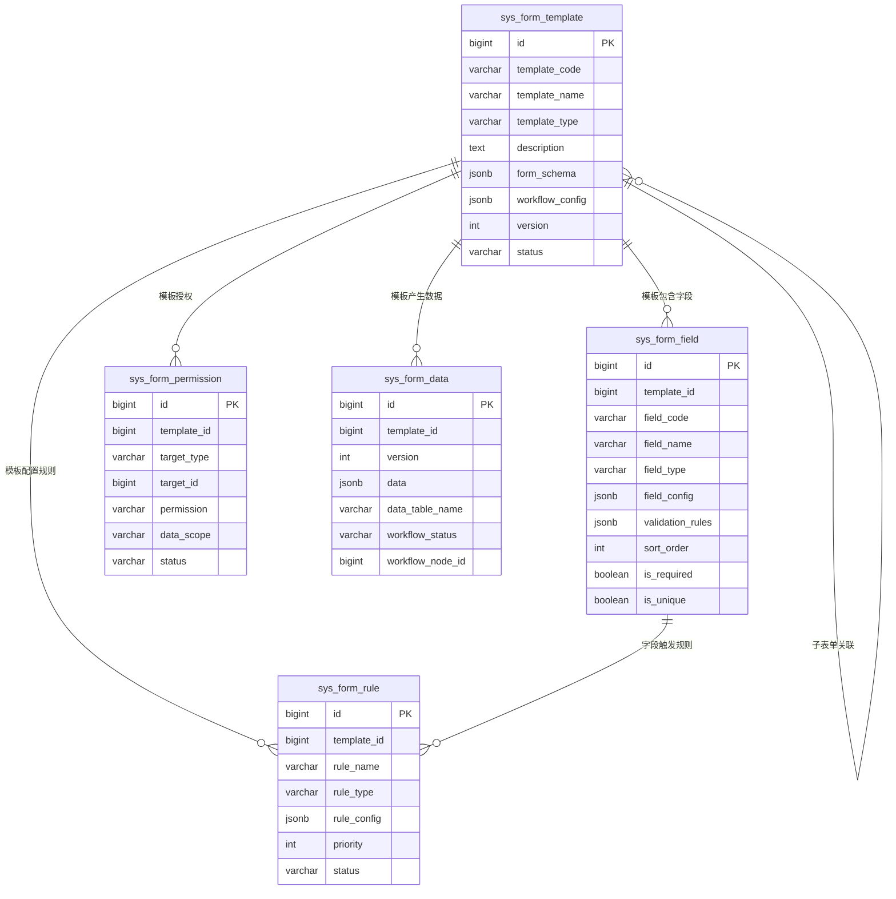

# NexusIX-Platform 动态表单模块详细设计

**文档版本**: v1.0
**创建日期**: 2026-07-04
**模块名称**: nexusix-dynamic
**模块定位**: 多租户SaaS平台可视化表单设计与数据管理
**参考产品**: 钉钉智能表格、飞书多维表格、简道云

---

## 📋 文档目录

- [1. 业务需求说明](#1-业务需求说明)
  - [1.1 项目背景](#11-项目背景)
  - [1.2 目标用户](#12-目标用户)
  - [1.3 业务价值](#13-业务价值)
  - [1.4 核心目标](#14-核心目标)
- [2. 功能详细描述](#2-功能详细描述)
  - [2.1 表单设计器](#21-表单设计器)
  - [2.2 表单模板管理](#22-表单模板管理)
  - [2.3 表单数据管理](#23-表单数据管理)
  - [2.4 表单规则配置](#24-表单规则配置)
  - [2.5 表单权限](#25-表单权限)
  - [2.6 工作流集成](#26-工作流集成)
- [3. 数据库设计方案](#3-数据库设计方案)
  - [3.1 ER关系图](#31-er关系图)
  - [3.2 表结构定义DDL](#32-表结构定义ddl)
- [4. 接口定义](#4-接口定义)
  - [4.1 模板管理接口](#41-模板管理接口)
  - [4.2 字段管理接口](#42-字段管理接口)
  - [4.3 规则管理接口](#43-规则管理接口)
  - [4.4 数据管理接口](#44-数据管理接口)
  - [4.5 权限管理接口](#45-权限管理接口)
- [5. 核心实现方案](#5-核心实现方案)
- [6. 测试策略](#6-测试策略)
- [7. 修订记录](#7-修订记录)

---

## 1. 业务需求说明

### 1.1 项目背景

NexusIX-Platform 作为多租户SaaS平台，服务于多个不同行业的企业租户。在实际业务中，不同租户、不同业务场景对表单的需求差异巨大：

- **业务多样化**：HR需要员工入职表单、财务需要报销单、销售需要客户跟进表单、运维需要工单。这些表单字段、校验规则、审批流程各不相同。
- **需求快速变化**：业务部门频繁提出新表单或修改现有表单，传统开发模式下每次变更都需要研发介入，交付周期长（通常2-4周）。
- **租户个性化**：不同租户对相同业务（如报销单）的字段需求不同，硬编码表单无法满足个性化需求。
- **数据存储灵活性**：传统表单需要预先创建数据库表，动态表单需要支持运行时动态生成数据表或使用JSONB存储。

参考主流SaaS产品（钉钉智能表格、飞书多维表格、简道云）的成熟方案，平台需要提供动态表单能力，让业务人员、实施人员通过可视化拖拽方式自助创建表单，无需研发介入，实现"所见即所得"的表单设计体验。

### 1.2 目标用户

| 用户角色 | 使用场景 | 关键诉求 |
|---------|---------|---------|
| **业务人员** | 设计业务表单（报销单、请假单、客户表） | 拖拽式设计、无需编码、实时预览 |
| **实施人员** | 为客户配置个性化表单 | 模板复用、快速交付、字段联动 |
| **平台管理员** | 管理所有租户的表单模板 | 模板审核、跨租户管理、资源监控 |
| **租户管理员** | 管理本租户表单与数据 | 权限分配、数据导出、流程配置 |
| **普通用户** | 填报和查询表单数据 | 移动端适配、字段校验、提交流畅 |

### 1.3 业务价值

1. **快速响应业务需求**：业务人员自助创建表单，从需求到上线从2周缩短至2小时。
2. **降低开发成本**：研发无需为每个表单编写代码，节省80%的表单开发工作量。
3. **提升交付效率**：实施人员基于模板快速配置，标准表单交付周期从1周缩短至1天。
4. **租户个性化**：每个租户可自定义表单字段，满足行业差异化需求。
5. **数据统一管理**：所有表单数据统一存储与管理，支持查询、导出、统计分析。
6. **流程无缝集成**：表单与审批流程打通，提交后自动流转，无需人工传递。

### 1.4 核心目标

| 目标维度 | 指标要求 |
|---------|---------|
| 表单设计效率 | 业务人员10分钟内完成一个中等复杂度表单（20字段） |
| 表单渲染性能 | 50字段表单首屏渲染 ≤ 1秒 |
| 数据写入性能 | 表单提交QPS ≥ 200 |
| 数据查询性能 | 分页查询10万条数据 P95 ≤ 800ms |
| 模板复用率 | 标准模板库覆盖常见业务场景 ≥ 80% |
| 字段类型支持 | 支持基础字段、布局字段、高级字段共15+类型 |

---

## 2. 功能详细描述

### 2.1 表单设计器

#### 2.1.1 功能说明

提供可视化拖拽式表单设计器，支持以下三类组件：

**基础组件**：
| 组件类型 | 字段类型代码 | 说明 |
|---------|------------|------|
| 单行文本 | TEXT | 单行文本输入框 |
| 多行文本 | TEXTAREA | 多行文本输入框 |
| 数字 | NUMBER | 数字输入，支持小数、千分位 |
| 金额 | MONEY | 金额输入，自动格式化 |
| 日期 | DATE | 日期选择，支持格式配置 |
| 日期时间 | DATETIME | 日期时间选择 |
| 单选框 | RADIO | 单选按钮组 |
| 复选框 | CHECKBOX | 多选按钮组 |
| 下拉框 | SELECT | 下拉单选 |
| 多选下拉 | MULTI_SELECT | 下拉多选 |
| 开关 | SWITCH | 开关组件 |
| 评分 | RATE | 星级评分 |
| 颜色 | COLOR | 颜色选择器 |

**布局组件**：
| 组件类型 | 字段类型代码 | 说明 |
|---------|------------|------|
| 分组 | GROUP | 字段分组容器 |
| 分隔线 | DIVIDER | 分隔线 |
| 标签 | LABEL | 静态文字说明 |
| 栅格布局 | GRID | 多列栅格布局 |

**高级组件**：
| 组件类型 | 字段类型代码 | 说明 |
|---------|------------|------|
| 文件上传 | UPLOAD | 文件/图片上传 |
| 图片 | IMAGE | 图片展示 |
| 富文本 | RICH_TEXT | 富文本编辑器 |
| 子表单 | SUBFORM | 子表单（一对多） |
| 关联表单 | RELATION | 关联其他表单数据 |
| 用户选择 | USER_SELECT | 选择系统用户 |
| 部门选择 | DEPT_SELECT | 选择部门 |
| 地址 | ADDRESS | 省市区地址选择 |
| 级联选择 | CASCADER | 多级联动选择 |
| 计算字段 | CALCULATE | 公式计算字段 |

#### 2.1.2 设计器交互

1. **三栏布局**：
   - 左侧：组件库（按基础/布局/高级分类）
   - 中间：画布（拖拽放置组件，所见即所得预览）
   - 右侧：属性配置面板（选中组件后配置属性）

2. **拖拽操作**：
   - 从左侧组件库拖拽组件到画布
   - 画布内组件可拖拽调整顺序
   - 支持组件复制、删除、撤销、重做

3. **属性配置**：每个组件可配置：
   - 字段标识（fieldCode，唯一）
   - 字段名称（fieldName，显示标签）
   - 占位提示（placeholder）
   - 默认值（defaultValue）
   - 是否必填（isRequired）
   - 是否只读（isReadonly）
   - 是否隐藏（isHidden）
   - 是否唯一（isUnique）
   - 字段宽度（width：25%/50%/75%/100%）
   - 校验规则（validationRules）
   - 联动规则（linkageRules）

4. **实时预览**：设计过程中可切换"编辑/预览"模式，预览效果即为最终渲染效果。

5. **PC/移动端适配**：支持切换PC端和移动端预览，组件在移动端自动垂直排列。

### 2.2 表单模板管理

#### 2.2.1 功能说明

1. **模板CRUD**：创建、查询、修改、删除表单模板
2. **模板版本管理**：每次修改生成新版本，支持版本对比与回滚
3. **模板复制**：复制现有模板快速创建新模板
4. **模板发布/下线**：草稿→发布→下线状态流转
5. **标准模板库**：平台预置常见业务模板（请假单、报销单、客户表等）

#### 2.2.2 业务规则

1. **模板状态枚举**：
   - `DRAFT`：草稿（可编辑，不可填报）
   - `PUBLISHED`：已发布（不可编辑字段，可填报数据）
   - `OFFLINE`：已下线（不可填报，数据只读）
   - `ARCHIVED`：已归档（不可操作）

2. **模板类型枚举**：
   - `FORM`：普通表单
   - `SUBFORM`：子表单（被其他表单引用）

3. **版本管理规则**：
   - 已发布模板修改字段配置时，生成新版本（version+1）
   - 历史版本数据保留，支持回滚到任意版本
   - 已有数据不受新版本影响（按提交时的版本解析）

4. **模板编码规则**：
   - 全局唯一，格式建议：`业务域_表单名`（如`hr_leave_form`）
   - 创建后不可修改

5. **form_schema存储**：表单完整配置以JSONB存储，结构示例：
   ```json
   {
     "fields": [
       {
         "fieldCode": "userName",
         "fieldName": "姓名",
         "fieldType": "TEXT",
         "isRequired": true,
         "width": "50%",
         "placeholder": "请输入姓名",
         "validationRules": {"max": 20}
       },
       {
         "fieldCode": "leaveDays",
         "fieldName": "请假天数",
         "fieldType": "NUMBER",
         "isRequired": true,
         "width": "50%",
         "validationRules": {"min": 0.5, "max": 30}
       }
     ],
     "layout": {
       "pc": {"columns": 2},
       "mobile": {"columns": 1}
     }
   }
   ```

### 2.3 表单数据管理

#### 2.3.1 功能说明

1. **动态数据表生成**：模板发布时自动创建物理数据表（表名：`dyn_{template_code}`）
2. **数据CRUD**：基于模板动态生成数据的新增、修改、删除、查询
3. **数据导入导出**：支持Excel批量导入导出
4. **数据校验**：提交时按字段配置执行必填、格式、唯一性校验
5. **数据统计**：支持按字段分组统计、汇总

#### 2.3.2 业务规则

1. **动态表结构**：
   - 物理表名：`dyn_{template_code}`（如`dyn_hr_leave_form`）
   - 固定字段：id、template_id、version、data(JSONB)、审计字段
   - data字段存储完整表单数据（JSONB，支持JSONB查询）
   - 同时为常用字段类型创建物理列（优化查询性能，可选）

2. **数据存储方案**：
   - 主方案：JSONB存储（灵活，无需DDL变更）
   - 优化方案：高频查询字段额外创建物理列+索引（由配置控制）

3. **数据版本关联**：每条数据记录提交时的模板版本号，避免模板变更导致历史数据解析异常。

4. **唯一性校验**：配置了isUnique的字段，提交时校验同模板下数据唯一性。

5. **数据量限制**：
   - 单租户单模板数据量上限：100万条（可配置）
   - 单次查询返回上限：1万条
   - 单次导入上限：1万条

6. **导入校验**：
   - 必填字段不能为空
   - 字段类型校验（数字、日期格式）
   - 唯一性校验
   - 错误数据行号与原因反馈

### 2.4 表单规则配置

#### 2.4.1 功能说明

支持三类表单规则，提升表单智能化能力：

1. **字段联动规则（LINKAGE）**：基于字段值变化联动控制其他字段
   - 显隐联动：字段A=值X时，显示/隐藏字段B
   - 必填联动：字段A=值X时，字段B变为必填
   - 只读联动：字段A=值X时，字段B变为只读
   - 值联动：字段A=值X时，字段B自动填充值Y
   - 选项联动：字段A=值X时，字段B的选项动态变化

2. **计算规则（CALCULATE）**：基于公式自动计算字段值
   - 算术运算：加减乘除（如金额=单价×数量）
   - 日期计算：天数=结束日期-开始日期
   - 字符串拼接：全名=姓+名
   - 条件计算：IF(条件, 值1, 值2)
   - 聚合计算：子表单字段求和、平均、计数

3. **校验规则（VALIDATE）**：自定义校验逻辑
   - 范围校验：min/max
   - 格式校验：正则表达式
   - 关联校验：字段A<字段B
   - 自定义JS校验：支持简单表达式

#### 2.4.2 业务规则

1. **规则优先级**：每个规则配置priority（数字越小优先级越高），同类型规则按优先级执行。

2. **规则执行顺序**：LINKAGE → CALCULATE → VALIDATE

3. **规则配置格式（JSONB）**：
   ```json
   {
     "ruleType": "LINKAGE",
     "triggerField": "leaveType",
     "triggerValue": "病假",
     "actions": [
       {
         "targetField": "medicalCertificate",
         "action": "SHOW",
         "makeRequired": true
       }
     ]
   }
   ```

4. **计算公式示例**：
   ```
   金额 = 单价 * 数量
   总价 = 金额 * (1 - 折扣率)
   请假天数 = 结束日期 - 开始日期 + 1
   IF(金额 > 1000, "需审批", "免审批")
   ```

5. **规则测试**：提供规则测试接口，输入测试数据验证规则执行结果。

### 2.5 表单权限

#### 2.5.1 功能说明

基于平台现有4级权限体系（SYSTEM > TENANT > DEPT > ROLE > USER），控制表单的操作权限：

1. **权限类型**：
   - `QUERY`：查询表单数据
   - `CREATE`：新增表单数据
   - `UPDATE`：修改表单数据
   - `DELETE`：删除表单数据
   - `EXPORT`：导出表单数据
   - `ADMIN`：管理表单配置（含字段、规则、权限）

2. **授权对象**：
   - `TENANT`：租户级授权（所有用户）
   - `DEPT`：部门级授权（部门内用户）
   - `ROLE`：角色级授权（指定角色）
   - `USER`：用户级授权（指定用户）

3. **数据范围**：基于物化路径的部门数据隔离
   - `ALL`：本租户全部数据
   - `DEPT_AND_SUB`：本部门及子部门数据
   - `DEPT_ONLY`：仅本部门数据
   - `SELF`：仅本人创建的数据

#### 2.5.2 业务规则

1. **权限合并规则**：用户对某表单的最终权限 = 租户授权 ∪ 部门授权 ∪ 角色授权 ∪ 用户授权

2. **禁用优先**：基于4级禁用体系，任意一级禁用则该权限不可用。

3. **字段级权限**：可配置用户可见的字段（参考IAM模块的字段级权限机制）。

4. **默认权限**：模板创建者自动获得ADMIN权限；租户管理员默认拥有QUERY权限。

5. **权限检查时机**：
   - 查询时：过滤可见数据范围
   - 新增时：检查CREATE权限
   - 修改/删除时：检查UPDATE/DELETE权限 + 数据范围
   - 导出时：检查EXPORT权限 + 数据范围

### 2.6 工作流集成

#### 2.6.1 功能说明

表单提交流程审批，与notify模块集成：

1. **审批流程配置**：模板可配置审批流程（单级/多级/条件审批）
2. **提交流程**：用户提交表单 → 触发审批流程 → 审批人收到通知 → 审批通过/驳回
3. **状态管理**：草稿、待审批、审批中、已通过、已驳回
4. **通知集成**：审批节点通过notify模块发送站内消息/邮件/短信
5. **审批记录**：完整记录审批链路，支持回溯

#### 2.6.2 业务规则

1. **审批节点类型**：
   - `APPROVER`：指定审批人
   - `ROLE`：指定角色（角色中任意一人审批）
   - `DEPT_LEADER`：部门负责人审批
   - `CONDITION`：条件分支（如金额>1000走A流程，否则走B流程）

2. **流程配置格式（JSONB）**：
   ```json
   {
     "nodes": [
       {
         "nodeId": "start",
         "nodeType": "START",
         "next": "approve1"
       },
       {
         "nodeId": "approve1",
         "nodeType": "APPROVER",
         "approverIds": [1001, 1002],
         "next": "end"
       },
       {
         "nodeId": "end",
         "nodeType": "END"
       }
     ]
   }
   ```

3. **通知触发点**：提交时、审批通过时、审批驳回时、流转到下一节点时

---

## 3. 数据库设计方案

### 3.1 ER关系图



### 3.2 表结构定义DDL

```sql
-- =============================================================================
-- 1. 表单模板表 sys_form_template
-- =============================================================================
CREATE TABLE sys_form_template (
    id BIGINT PRIMARY KEY,
    template_code VARCHAR(100) NOT NULL,                -- 模板编码（全局唯一）
    template_name VARCHAR(100) NOT NULL,                -- 模板名称
    template_type VARCHAR(20) NOT NULL DEFAULT 'FORM',  -- 模板类型：FORM/SUBFORM
    description TEXT,                                   -- 模板描述
    form_schema JSONB NOT NULL,                         -- 表单组件配置（JSONB）
    workflow_config JSONB,                              -- 审批流程配置（JSONB）
    version INT NOT NULL DEFAULT 1,                     -- 版本号
    status VARCHAR(20) NOT NULL DEFAULT 'DRAFT',        -- 状态：DRAFT/PUBLISHED/OFFLINE/ARCHIVED
    icon VARCHAR(100),                                  -- 模板图标
    category VARCHAR(50),                               -- 模板分类：HR/FINANCE/SALE/OPERATION
    is_system BOOLEAN DEFAULT FALSE,                    -- 是否系统预置模板
    data_table_name VARCHAR(100),                       -- 动态生成的物理表名（dyn_xxx）
    data_count BIGINT DEFAULT 0,                        -- 数据条数（冗余字段，便于统计）
    publish_time TIMESTAMP,                             -- 发布时间
    publish_by BIGINT,                                  -- 发布人
    -- 审计字段
    create_tenant BIGINT NOT NULL,
    create_dept BIGINT NOT NULL,
    create_role BIGINT NOT NULL,
    create_by BIGINT NOT NULL,
    create_at TIMESTAMP NOT NULL,
    update_by BIGINT,
    update_at TIMESTAMP,
    is_deleted VARCHAR(20) DEFAULT 'NOT_DELETED',
    deleted_at TIMESTAMP
);

-- 索引
CREATE UNIQUE INDEX uk_form_template_code ON sys_form_template(template_code, is_deleted);
CREATE INDEX idx_form_template_tenant ON sys_form_template(create_tenant, is_deleted);
CREATE INDEX idx_form_template_status ON sys_form_template(status, create_tenant);
CREATE INDEX idx_form_template_category ON sys_form_template(category, create_tenant);
CREATE INDEX idx_form_template_name ON sys_form_template(template_name);
-- JSONB GIN索引，支持表单配置查询
CREATE INDEX idx_form_template_schema ON sys_form_template USING GIN (form_schema);

-- =============================================================================
-- 2. 表单数据表 sys_form_data
-- =============================================================================
CREATE TABLE sys_form_data (
    id BIGINT PRIMARY KEY,
    template_id BIGINT NOT NULL,                        -- 模板ID
    template_code VARCHAR(100) NOT NULL,                -- 模板编码（冗余，便于查询）
    version INT NOT NULL,                               -- 提交时的模板版本
    data JSONB NOT NULL,                                -- 表单数据（JSONB）
    data_table_name VARCHAR(100),                       -- 物理表名（冗余）
    workflow_status VARCHAR(20) DEFAULT 'SUBMITTED',    -- 流程状态：DRAFT/SUBMITTED/APPROVING/APPROVED/REJECTED
    workflow_node_id VARCHAR(50),                       -- 当前流程节点ID
    workflow_approver_id BIGINT,                        -- 当前审批人ID
    submit_time TIMESTAMP,                              -- 提交时间
    approved_time TIMESTAMP,                            -- 审批完成时间
    -- 审计字段
    create_tenant BIGINT NOT NULL,
    create_dept BIGINT NOT NULL,
    create_role BIGINT NOT NULL,
    create_by BIGINT NOT NULL,
    create_at TIMESTAMP NOT NULL,
    update_by BIGINT,
    update_at TIMESTAMP,
    is_deleted VARCHAR(20) DEFAULT 'NOT_DELETED',
    deleted_at TIMESTAMP
);

-- 索引
CREATE INDEX idx_form_data_template ON sys_form_data(template_id, create_at);
CREATE INDEX idx_form_data_tenant ON sys_form_data(create_tenant, template_id);
CREATE INDEX idx_form_data_create_by ON sys_form_data(create_by, template_id);
CREATE INDEX idx_form_data_workflow_status ON sys_form_data(template_id, workflow_status);
CREATE INDEX idx_form_data_time ON sys_form_data(create_at);
-- JSONB GIN索引，支持表单数据查询
CREATE INDEX idx_form_data_data ON sys_form_data USING GIN (data);

-- =============================================================================
-- 3. 表单字段表 sys_form_field
-- =============================================================================
CREATE TABLE sys_form_field (
    id BIGINT PRIMARY KEY,
    template_id BIGINT NOT NULL,                        -- 模板ID
    field_code VARCHAR(100) NOT NULL,                   -- 字段标识（模板内唯一）
    field_name VARCHAR(100) NOT NULL,                   -- 字段名称
    field_type VARCHAR(30) NOT NULL,                    -- 字段类型：TEXT/NUMBER/DATE/SELECT等
    field_config JSONB,                                 -- 字段配置（默认值/选项/placeholder等）
    validation_rules JSONB,                             -- 校验规则（min/max/pattern等）
    linkage_rules JSONB,                                -- 联动规则（简化存储，主要规则在sys_form_rule）
    sort_order INT NOT NULL DEFAULT 0,                  -- 排序顺序
    width VARCHAR(10) DEFAULT '100%',                   -- 字段宽度：25%/50%/75%/100%
    is_required BOOLEAN DEFAULT FALSE,                  -- 是否必填
    is_unique BOOLEAN DEFAULT FALSE,                    -- 是否唯一
    is_readonly BOOLEAN DEFAULT FALSE,                  -- 是否只读
    is_hidden BOOLEAN DEFAULT FALSE,                    -- 是否隐藏
    is_searchable BOOLEAN DEFAULT FALSE,                -- 是否可查询（用于查询条件）
    default_value TEXT,                                 -- 默认值
    description VARCHAR(200),                           -- 字段说明
    -- 审计字段
    create_tenant BIGINT NOT NULL,
    create_dept BIGINT NOT NULL,
    create_role BIGINT NOT NULL,
    create_by BIGINT NOT NULL,
    create_at TIMESTAMP NOT NULL,
    update_by BIGINT,
    update_at TIMESTAMP,
    is_deleted VARCHAR(20) DEFAULT 'NOT_DELETED',
    deleted_at TIMESTAMP
);

-- 索引
CREATE INDEX idx_form_field_template ON sys_form_field(template_id, sort_order);
CREATE UNIQUE INDEX uk_form_field_code ON sys_form_field(template_id, field_code, is_deleted);
CREATE INDEX idx_form_field_type ON sys_form_field(field_type);

-- =============================================================================
-- 4. 表单规则表 sys_form_rule
-- =============================================================================
CREATE TABLE sys_form_rule (
    id BIGINT PRIMARY KEY,
    template_id BIGINT NOT NULL,                        -- 模板ID
    rule_name VARCHAR(100) NOT NULL,                    -- 规则名称
    rule_type VARCHAR(20) NOT NULL,                     -- 规则类型：LINKAGE/CALCULATE/VALIDATE
    rule_config JSONB NOT NULL,                         -- 规则配置（JSONB）
    priority INT NOT NULL DEFAULT 100,                  -- 优先级（数字越小越高）
    status VARCHAR(20) DEFAULT 'ENABLED',               -- 状态：ENABLED/DISABLED
    description VARCHAR(200),                           -- 规则说明
    -- 审计字段
    create_tenant BIGINT NOT NULL,
    create_dept BIGINT NOT NULL,
    create_role BIGINT NOT NULL,
    create_by BIGINT NOT NULL,
    create_at TIMESTAMP NOT NULL,
    update_by BIGINT,
    update_at TIMESTAMP,
    is_deleted VARCHAR(20) DEFAULT 'NOT_DELETED',
    deleted_at TIMESTAMP
);

-- 索引
CREATE INDEX idx_form_rule_template ON sys_form_rule(template_id, priority);
CREATE INDEX idx_form_rule_type ON sys_form_rule(rule_type, status);

-- =============================================================================
-- 5. 表单权限表 sys_form_permission
-- =============================================================================
CREATE TABLE sys_form_permission (
    id BIGINT PRIMARY KEY,
    template_id BIGINT NOT NULL,                        -- 模板ID
    target_type VARCHAR(20) NOT NULL,                   -- 授权对象类型：TENANT/DEPT/ROLE/USER
    target_id BIGINT NOT NULL,                          -- 授权对象ID
    permission VARCHAR(20) NOT NULL,                    -- 权限：QUERY/CREATE/UPDATE/DELETE/EXPORT/ADMIN
    data_scope VARCHAR(20) DEFAULT 'SELF',              -- 数据范围：ALL/DEPT_AND_SUB/DEPT_ONLY/SELF
    field_permissions JSONB,                            -- 字段级权限（参考IAM模块）
    status VARCHAR(20) DEFAULT 'ENABLED',               -- 状态：ENABLED/DISABLED
    -- 审计字段
    create_tenant BIGINT NOT NULL,
    create_dept BIGINT NOT NULL,
    create_role BIGINT NOT NULL,
    create_by BIGINT NOT NULL,
    create_at TIMESTAMP NOT NULL,
    update_by BIGINT,
    update_at TIMESTAMP,
    is_deleted VARCHAR(20) DEFAULT 'NOT_DELETED',
    deleted_at TIMESTAMP
);

-- 索引
CREATE INDEX idx_form_permission_template ON sys_form_permission(template_id, status);
CREATE INDEX idx_form_permission_target ON sys_form_permission(target_type, target_id, permission);
CREATE UNIQUE INDEX uk_form_permission ON sys_form_permission(template_id, target_type, target_id, permission, is_deleted);

-- =============================================================================
-- 系统配置（写入sys_config表）
-- =============================================================================
-- INSERT INTO sys_config(config_key, config_value, config_type, config_desc, is_system)
-- VALUES
--   ('dynamic.form.data_limit_per_template', '1000000', 'NUMBER', '单模板数据量上限', true),
--   ('dynamic.form.query_limit', '10000', 'NUMBER', '单次查询返回上限', true),
--   ('dynamic.form.import_limit', '10000', 'NUMBER', '单次导入上限', true),
--   ('dynamic.form.create_physical_columns', 'false', 'BOOLEAN', '是否为高频字段创建物理列', true);
```

---

## 4. 接口定义

所有接口遵循以下规范：
- 统一前缀：`/dynamic`
- 统一响应格式：`ApiResponse<T>`（code/msg/data）
- 统一分页参数：`pageNum`（页码，从1开始）、`pageSize`（每页条数，默认20）
- 权限编码格式：`FORM:操作:资源`（如`FORM:VIEW:TEMPLATE`）

### 4.1 模板管理接口

#### 4.1.1 queryFormTemplateList - 查询表单模板列表

| 项目 | 内容 |
|------|------|
| **路径** | `GET /dynamic/template/list` |
| **方法** | GET |
| **权限** | `FORM:VIEW:TEMPLATE` |
| **功能** | 不分页查询表单模板列表 |

**请求参数**：

| 参数名 | 类型 | 必填 | 校验规则 | 说明 |
|--------|------|------|---------|------|
| templateName | String | 否 | 最大100字符 | 模板名称（模糊查询） |
| templateType | String | 否 | 枚举校验 | 模板类型：FORM/SUBFORM |
| status | String | 否 | 枚举校验 | 状态：DRAFT/PUBLISHED/OFFLINE/ARCHIVED |
| category | String | 否 | 最大50字符 | 模板分类 |
| tenantId | Long | 否 | 正整数 | 租户ID（仅平台管理员） |

**响应格式**：

```json
{
  "code": 200,
  "msg": "操作成功",
  "data": [
    {
      "id": "1234567890",
      "templateCode": "hr_leave_form",
      "templateName": "请假申请单",
      "templateType": "FORM",
      "description": "员工请假申请表单",
      "version": 3,
      "status": "PUBLISHED",
      "icon": "leave",
      "category": "HR",
      "dataTableName": "dyn_hr_leave_form",
      "dataCount": 1560,
      "publishTime": "2026-06-15 10:00:00",
      "publishByName": "张三",
      "createByName": "张三",
      "createAt": "2026-06-10 14:30:00"
    }
  ]
}
```

**调用示例**：

```bash
curl -X GET "http://localhost:8080/dynamic/template/list?status=PUBLISHED&category=HR" \
  -H "Authorization: Bearer {token}"
```

**业务逻辑**：
1. 从UserContext获取当前用户，判断是否为平台管理员
2. 非平台管理员强制添加 `create_tenant = 当前租户ID` 过滤条件
3. 根据查询条件构建LambdaQueryWrapper
4. 按create_at倒序返回
5. 关联查询创建人、发布人姓名

---

#### 4.1.2 queryFormTemplatePage - 分页查询表单模板

| 项目 | 内容 |
|------|------|
| **路径** | `GET /dynamic/template/page` |
| **方法** | GET |
| **权限** | `FORM:VIEW:TEMPLATE` |
| **功能** | 分页查询表单模板 |

**请求参数**：同4.1.1 + 分页参数（pageNum/pageSize）

**响应格式**：

```json
{
  "code": 200,
  "msg": "操作成功",
  "data": {
    "records": [...],
    "total": 56,
    "size": 20,
    "current": 1,
    "pages": 3
  }
}
```

---

#### 4.1.3 queryFormTemplateDetail - 查询表单模板详情

| 项目 | 内容 |
|------|------|
| **路径** | `GET /dynamic/template/detail/{code}` |
| **方法** | GET |
| **权限** | `FORM:VIEW:TEMPLATE` |
| **功能** | 根据编码查询表单模板完整详情（含字段、规则、权限） |

**路径参数**：

| 参数名 | 类型 | 必填 | 校验规则 | 说明 |
|--------|------|------|---------|------|
| code | String | 是 | 最大100字符 | 模板编码 |

**响应格式**：

```json
{
  "code": 200,
  "msg": "操作成功",
  "data": {
    "id": "1234567890",
    "templateCode": "hr_leave_form",
    "templateName": "请假申请单",
    "templateType": "FORM",
    "description": "员工请假申请表单",
    "formSchema": {
      "fields": [...],
      "layout": {"pc": {"columns": 2}}
    },
    "workflowConfig": {...},
    "version": 3,
    "status": "PUBLISHED",
    "icon": "leave",
    "category": "HR",
    "dataTableName": "dyn_hr_leave_form",
    "dataCount": 1560,
    "fields": [
      {
        "id": "1234567891",
        "fieldCode": "userName",
        "fieldName": "姓名",
        "fieldType": "TEXT",
        "isRequired": true,
        "isUnique": false,
        "sortOrder": 1,
        "width": "50%",
        "defaultValue": null,
        "placeholder": "请输入姓名"
      }
    ],
    "rules": [
      {
        "id": "1234567892",
        "ruleName": "病假显示医疗证明",
        "ruleType": "LINKAGE",
        "ruleConfig": {...},
        "priority": 10,
        "status": "ENABLED"
      }
    ],
    "permissions": [
      {
        "id": "1234567893",
        "targetType": "ROLE",
        "targetId": 1001,
        "targetName": "HR专员",
        "permission": "QUERY",
        "dataScope": "ALL"
      }
    ]
  }
}
```

**业务逻辑**：
1. 根据编码查询模板主表
2. 校验数据权限：非本租户模板不可访问
3. 关联查询字段列表（按sort_order排序）
4. 关联查询规则列表（按priority排序）
5. 关联查询权限列表（含授权对象名称）

---

#### 4.1.4 addFormTemplate - 新增表单模板

| 项目 | 内容 |
|------|------|
| **路径** | `POST /dynamic/template/add` |
| **方法** | POST |
| **权限** | `FORM:ADD:TEMPLATE` |
| **功能** | 新增表单模板（草稿状态） |

**请求参数**：

| 参数名 | 类型 | 必填 | 校验规则 | 说明 |
|--------|------|------|---------|------|
| templateCode | String | 是 | 字母数字下划线，3-100字符 | 模板编码（全局唯一） |
| templateName | String | 是 | 最大100字符 | 模板名称 |
| templateType | String | 是 | 枚举校验 | 模板类型：FORM/SUBFORM |
| description | String | 否 | 最大500字符 | 模板描述 |
| formSchema | Object | 是 | 非空JSON | 表单组件配置 |
| workflowConfig | Object | 否 | - | 审批流程配置 |
| icon | String | 否 | 最大100字符 | 模板图标 |
| category | String | 否 | 最大50字符 | 模板分类 |

**请求示例**：

```json
{
  "templateCode": "hr_leave_form",
  "templateName": "请假申请单",
  "templateType": "FORM",
  "description": "员工请假申请表单",
  "category": "HR",
  "icon": "leave",
  "formSchema": {
    "fields": [
      {
        "fieldCode": "userName",
        "fieldName": "姓名",
        "fieldType": "TEXT",
        "isRequired": true,
        "width": "50%",
        "placeholder": "请输入姓名"
      },
      {
        "fieldCode": "leaveType",
        "fieldName": "请假类型",
        "fieldType": "SELECT",
        "isRequired": true,
        "width": "50%",
        "fieldConfig": {
          "options": [
            {"label": "事假", "value": "personal"},
            {"label": "病假", "value": "sick"},
            {"label": "年假", "value": "annual"}
          ]
        }
      }
    ],
    "layout": {"pc": {"columns": 2}, "mobile": {"columns": 1}}
  }
}
```

**响应格式**：

```json
{
  "code": 200,
  "msg": "新增成功",
  "data": "1234567890"
}
```

**业务逻辑**：
1. 校验template_code全局唯一
2. 校验form_schema格式合法性（字段编码唯一、字段类型合法）
3. 保存模板主表（status=DRAFT, version=1）
4. 解析form_schema，将字段配置同步到sys_form_field表
5. 创建者自动获得ADMIN权限（写入sys_form_permission表）
6. 记录操作日志

---

#### 4.1.5 updateFormTemplate - 更新表单模板

| 项目 | 内容 |
|------|------|
| **路径** | `PUT /dynamic/template/update` |
| **方法** | PUT |
| **权限** | `FORM:EDIT:TEMPLATE` |
| **功能** | 更新表单模板配置 |

**请求参数**：同4.1.4，增加id字段，templateCode不可修改

**响应格式**：

```json
{
  "code": 200,
  "msg": "更新成功",
  "data": 1
}
```

**业务逻辑**：
1. 校验模板存在且属于当前租户
2. 已发布模板修改时生成新版本（version+1）
3. 更新form_schema时同步更新sys_form_field表
4. 历史版本数据保留，不受新版本影响
5. 仅DRAFT状态或具有ADMIN权限可修改

---

#### 4.1.6 deleteFormTemplate - 删除表单模板

| 项目 | 内容 |
|------|------|
| **路径** | `DELETE /dynamic/template/delete/{code}` |
| **方法** | DELETE |
| **权限** | `FORM:DELETE:TEMPLATE` |
| **功能** | 删除表单模板（软删除） |

**路径参数**：code (String)

**响应格式**：

```json
{
  "code": 200,
  "msg": "删除成功",
  "data": 1
}
```

**业务逻辑**：
1. 校验模板存在且属于当前租户
2. 校验模板下无数据（有数据时需先清空或归档）
3. 软删除模板主表
4. 级联软删除字段、规则、权限表
5. 删除动态生成的物理表（dyn_xxx）
6. 必须二次确认

---

#### 4.1.7 batchDeleteFormTemplate - 批量删除表单模板

| 项目 | 内容 |
|------|------|
| **路径** | `DELETE /dynamic/template/batch-delete` |
| **方法** | DELETE |
| **权限** | `FORM:DELETE:TEMPLATE` |
| **功能** | 批量删除表单模板 |

**请求参数**：

```json
{
  "codes": ["hr_leave_form", "finance_expense_form"]
}
```

**响应格式**：

```json
{
  "code": 200,
  "msg": "批量删除成功",
  "data": 2
}
```

---

#### 4.1.8 copyFormTemplate - 复制表单模板

| 项目 | 内容 |
|------|------|
| **路径** | `POST /dynamic/template/copy` |
| **方法** | POST |
| **权限** | `FORM:ADD:TEMPLATE` |
| **功能** | 复制现有模板创建新模板 |

**请求参数**：

| 参数名 | 类型 | 必填 | 校验规则 | 说明 |
|--------|------|------|---------|------|
| sourceCode | String | 是 | 最大100字符 | 源模板编码 |
| newCode | String | 是 | 字母数字下划线，3-100字符 | 新模板编码 |
| newName | String | 是 | 最大100字符 | 新模板名称 |

**请求示例**：

```json
{
  "sourceCode": "hr_leave_form",
  "newCode": "hr_leave_form_v2",
  "newName": "请假申请单V2"
}
```

**响应格式**：

```json
{
  "code": 200,
  "msg": "复制成功",
  "data": "1234567891"
}
```

**业务逻辑**：
1. 查询源模板完整配置（含字段、规则）
2. 创建新模板（状态为DRAFT，version=1）
3. 复制字段、规则配置（不复制权限和数据）
4. 新模板编码全局唯一

---

#### 4.1.9 publishFormTemplate - 发布表单模板

| 项目 | 内容 |
|------|------|
| **路径** | `POST /dynamic/template/publish/{code}` |
| **方法** | POST |
| **权限** | `FORM:PUBLISH:TEMPLATE` |
| **功能** | 发布表单模板（DRAFT→PUBLISHED） |

**路径参数**：code (String)

**响应格式**：

```json
{
  "code": 200,
  "msg": "发布成功",
  "data": 1
}
```

**业务逻辑**：
1. 校验模板状态为DRAFT或OFFLINE
2. 校验form_schema至少包含1个字段
3. 创建动态物理表（dyn_{template_code}），如已存在则跳过
4. 更新模板状态为PUBLISHED，记录publish_time和publish_by
5. 发布后字段配置不可修改（需创建新版本）
6. 通过notify模块通知相关人员

---

#### 4.1.10 offlineFormTemplate - 下线表单模板

| 项目 | 内容 |
|------|------|
| **路径** | `POST /dynamic/template/offline/{code}` |
| **方法** | POST |
| **权限** | `FORM:PUBLISH:TEMPLATE` |
| **功能** | 下线表单模板（PUBLISHED→OFFLINE） |

**路径参数**：code (String)

**请求参数**：

| 参数名 | 类型 | 必填 | 校验规则 | 说明 |
|--------|------|------|---------|------|
| reason | String | 否 | 最大200字符 | 下线原因 |

**响应格式**：

```json
{
  "code": 200,
  "msg": "下线成功",
  "data": 1
}
```

**业务逻辑**：
1. 校验模板状态为PUBLISHED
2. 更新状态为OFFLINE
3. 已有数据保持只读，不可新增数据
4. 通过notify模块通知相关人员

---

### 4.2 字段管理接口

#### 4.2.1 queryFormFieldList - 查询表单字段列表

| 项目 | 内容 |
|------|------|
| **路径** | `GET /dynamic/field/list` |
| **方法** | GET |
| **权限** | `FORM:VIEW:TEMPLATE` |
| **功能** | 查询指定模板的字段列表 |

**请求参数**：

| 参数名 | 类型 | 必填 | 校验规则 | 说明 |
|--------|------|------|---------|------|
| templateCode | String | 是 | 最大100字符 | 模板编码 |
| fieldType | String | 否 | 枚举校验 | 字段类型过滤 |

**响应格式**：

```json
{
  "code": 200,
  "msg": "操作成功",
  "data": [
    {
      "id": "1234567891",
      "templateId": "1234567890",
      "fieldCode": "userName",
      "fieldName": "姓名",
      "fieldType": "TEXT",
      "fieldTypeDesc": "单行文本",
      "isRequired": true,
      "isUnique": false,
      "isReadonly": false,
      "isHidden": false,
      "isSearchable": true,
      "sortOrder": 1,
      "width": "50%",
      "defaultValue": null,
      "placeholder": "请输入姓名",
      "description": "员工姓名"
    }
  ]
}
```

---

#### 4.2.2 addFormField - 新增表单字段

| 项目 | 内容 |
|------|------|
| **路径** | `POST /dynamic/field/add` |
| **方法** | POST |
| **权限** | `FORM:EDIT:TEMPLATE` |
| **功能** | 新增表单字段 |

**请求参数**：

| 参数名 | 类型 | 必填 | 校验规则 | 说明 |
|--------|------|------|---------|------|
| templateCode | String | 是 | 最大100字符 | 模板编码 |
| fieldCode | String | 是 | 字母数字下划线，2-50字符 | 字段标识（模板内唯一） |
| fieldName | String | 是 | 最大100字符 | 字段名称 |
| fieldType | String | 是 | 枚举校验 | 字段类型 |
| fieldConfig | Object | 否 | - | 字段配置 |
| validationRules | Object | 否 | - | 校验规则 |
| sortOrder | Integer | 否 | 最小0 | 排序顺序，默认0 |
| width | String | 否 | 枚举校验 | 宽度：25%/50%/75%/100% |
| isRequired | Boolean | 否 | - | 是否必填，默认false |
| isUnique | Boolean | 否 | - | 是否唯一，默认false |
| defaultValue | String | 否 | - | 默认值 |

**响应格式**：

```json
{
  "code": 200,
  "msg": "新增成功",
  "data": "1234567892"
}
```

**业务逻辑**：
1. 校验模板存在且为DRAFT状态（已发布模板需创建新版本）
2. 校验field_code在模板内唯一
3. 保存字段配置
4. 同步更新form_schema

---

#### 4.2.3 updateFormField - 更新表单字段

| 项目 | 内容 |
|------|------|
| **路径** | `PUT /dynamic/field/update` |
| **方法** | PUT |
| **权限** | `FORM:EDIT:TEMPLATE` |
| **功能** | 更新表单字段配置 |

**请求参数**：同4.2.2，增加id字段

**响应格式**：

```json
{
  "code": 200,
  "msg": "更新成功",
  "data": 1
}
```

---

#### 4.2.4 deleteFormField - 删除表单字段

| 项目 | 内容 |
|------|------|
| **路径** | `DELETE /dynamic/field/delete/{id}` |
| **方法** | DELETE |
| **权限** | `FORM:EDIT:TEMPLATE` |
| **功能** | 删除表单字段 |

**路径参数**：id (Long)

**响应格式**：

```json
{
  "code": 200,
  "msg": "删除成功",
  "data": 1
}
```

**业务逻辑**：
1. 校验字段存在且模板为DRAFT状态
2. 软删除字段
3. 同步更新form_schema
4. 检查是否被规则引用，被引用时需先删除规则

---

#### 4.2.5 batchSortFormField - 批量排序表单字段

| 项目 | 内容 |
|------|------|
| **路径** | `PUT /dynamic/field/batch-sort` |
| **方法** | PUT |
| **权限** | `FORM:EDIT:TEMPLATE` |
| **功能** | 批量调整字段排序 |

**请求参数**：

```json
{
  "templateCode": "hr_leave_form",
  "fieldSortList": [
    {"fieldId": "1234567891", "sortOrder": 1},
    {"fieldId": "1234567892", "sortOrder": 2},
    {"fieldId": "1234567893", "sortOrder": 3}
  ]
}
```

**响应格式**：

```json
{
  "code": 200,
  "msg": "排序成功",
  "data": 3
}
```

---

### 4.3 规则管理接口

#### 4.3.1 queryFormRuleList - 查询表单规则列表

| 项目 | 内容 |
|------|------|
| **路径** | `GET /dynamic/rule/list` |
| **方法** | GET |
| **权限** | `FORM:VIEW:TEMPLATE` |
| **功能** | 查询指定模板的规则列表 |

**请求参数**：

| 参数名 | 类型 | 必填 | 校验规则 | 说明 |
|--------|------|------|---------|------|
| templateCode | String | 是 | 最大100字符 | 模板编码 |
| ruleType | String | 否 | 枚举校验 | 规则类型：LINKAGE/CALCULATE/VALIDATE |
| status | String | 否 | 枚举校验 | 状态：ENABLED/DISABLED |

**响应格式**：

```json
{
  "code": 200,
  "msg": "操作成功",
  "data": [
    {
      "id": "1234567892",
      "templateId": "1234567890",
      "ruleName": "病假显示医疗证明",
      "ruleType": "LINKAGE",
      "ruleTypeDesc": "字段联动",
      "ruleConfig": {
        "triggerField": "leaveType",
        "triggerValue": "sick",
        "actions": [
          {
            "targetField": "medicalCertificate",
            "action": "SHOW",
            "makeRequired": true
          }
        ]
      },
      "priority": 10,
      "status": "ENABLED",
      "description": "选择病假时显示医疗证明上传字段"
    }
  ]
}
```

---

#### 4.3.2 addFormRule - 新增表单规则

| 项目 | 内容 |
|------|------|
| **路径** | `POST /dynamic/rule/add` |
| **方法** | POST |
| **权限** | `FORM:EDIT:TEMPLATE` |
| **功能** | 新增表单规则 |

**请求参数**：

| 参数名 | 类型 | 必填 | 校验规则 | 说明 |
|--------|------|------|---------|------|
| templateCode | String | 是 | 最大100字符 | 模板编码 |
| ruleName | String | 是 | 最大100字符 | 规则名称 |
| ruleType | String | 是 | 枚举校验 | 规则类型：LINKAGE/CALCULATE/VALIDATE |
| ruleConfig | Object | 是 | 非空JSON | 规则配置 |
| priority | Integer | 否 | 最小0 | 优先级，默认100 |
| description | String | 否 | 最大200字符 | 规则说明 |

**请求示例**：

```json
{
  "templateCode": "finance_expense_form",
  "ruleName": "金额自动计算",
  "ruleType": "CALCULATE",
  "ruleConfig": {
    "targetField": "totalAmount",
    "formula": "unitPrice * quantity"
  },
  "priority": 10,
  "description": "总金额=单价×数量"
}
```

**响应格式**：

```json
{
  "code": 200,
  "msg": "新增成功",
  "data": "1234567893"
}
```

**业务逻辑**：
1. 校验模板存在且为DRAFT状态
2. 校验规则配置中引用的字段存在
3. 保存规则，默认状态为ENABLED

---

#### 4.3.3 updateFormRule - 更新表单规则

| 项目 | 内容 |
|------|------|
| **路径** | `PUT /dynamic/rule/update` |
| **方法** | PUT |
| **权限** | `FORM:EDIT:TEMPLATE` |
| **功能** | 更新表单规则 |

**请求参数**：同4.3.2，增加id字段

**响应格式**：

```json
{
  "code": 200,
  "msg": "更新成功",
  "data": 1
}
```

---

#### 4.3.4 deleteFormRule - 删除表单规则

| 项目 | 内容 |
|------|------|
| **路径** | `DELETE /dynamic/rule/delete/{id}` |
| **方法** | DELETE |
| **权限** | `FORM:EDIT:TEMPLATE` |
| **功能** | 删除表单规则 |

**路径参数**：id (Long)

**响应格式**：

```json
{
  "code": 200,
  "msg": "删除成功",
  "data": 1
}
```

---

#### 4.3.5 testFormRule - 测试表单规则

| 项目 | 内容 |
|------|------|
| **路径** | `POST /dynamic/rule/test` |
| **方法** | POST |
| **权限** | `FORM:VIEW:TEMPLATE` |
| **功能** | 输入测试数据验证规则执行结果 |

**请求参数**：

| 参数名 | 类型 | 必填 | 校验规则 | 说明 |
|--------|------|------|---------|------|
| templateCode | String | 是 | 最大100字符 | 模板编码 |
| ruleId | Long | 否 | 正整数 | 指定规则ID（不传则测试所有规则） |
| testData | Object | 是 | 非空JSON | 测试数据 |

**请求示例**：

```json
{
  "templateCode": "hr_leave_form",
  "testData": {
    "leaveType": "sick",
    "leaveDays": 3,
    "startDate": "2026-07-05",
    "endDate": "2026-07-07"
  }
}
```

**响应格式**：

```json
{
  "code": 200,
  "msg": "测试完成",
  "data": {
    "executedRules": [
      {
        "ruleId": "1234567892",
        "ruleName": "病假显示医疗证明",
        "ruleType": "LINKAGE",
        "executed": true,
        "actions": [
          {
            "targetField": "medicalCertificate",
            "action": "SHOW",
            "makeRequired": true
          }
        ]
      }
    ],
    "resultData": {
      "leaveType": "sick",
      "leaveDays": 3,
      "medicalCertificate": {
        "visible": true,
        "required": true
      }
    }
  }
}
```

**业务逻辑**：
1. 加载模板字段配置
2. 加载规则配置（按priority排序）
3. 按顺序执行规则：LINKAGE → CALCULATE → VALIDATE
4. 返回每条规则的执行结果和最终数据状态
5. 不修改数据库数据

---

### 4.4 数据管理接口

#### 4.4.1 queryFormDataList - 查询表单数据列表

| 项目 | 内容 |
|------|------|
| **路径** | `GET /dynamic/data/list` |
| **方法** | GET |
| **权限** | `FORM:QUERY:DATA` |
| **功能** | 不分页查询表单数据列表 |

**请求参数**：

| 参数名 | 类型 | 必填 | 校验规则 | 说明 |
|--------|------|------|---------|------|
| templateCode | String | 是 | 最大100字符 | 模板编码 |
| workflowStatus | String | 否 | 枚举校验 | 流程状态过滤 |
| createBy | Long | 否 | 正整数 | 创建人过滤 |
| createAtStart | String | 否 | yyyy-MM-dd HH:mm:ss | 创建时间-起 |
| createAtEnd | String | 否 | yyyy-MM-dd HH:mm:ss | 创建时间-止 |
| searchData | Object | 否 | - | 字段值查询条件（JSON） |

**响应格式**：

```json
{
  "code": 200,
  "msg": "操作成功",
  "data": [
    {
      "id": "1234567890",
      "templateId": "1234567890",
      "templateCode": "hr_leave_form",
      "version": 3,
      "data": {
        "userName": "张三",
        "leaveType": "sick",
        "leaveDays": 3,
        "startDate": "2026-07-05",
        "endDate": "2026-07-07",
        "reason": "感冒发烧"
      },
      "workflowStatus": "APPROVED",
      "submitTime": "2026-07-04 10:00:00",
      "createByName": "张三",
      "createAt": "2026-07-04 10:00:00"
    }
  ]
}
```

**业务逻辑**：
1. 校验当前用户对模板的QUERY权限
2. 根据data_scope过滤数据范围（ALL/DEPT_AND_SUB/DEPT_ONLY/SELF）
3. 根据searchData构建JSONB查询条件
4. 限制最多返回1万条
5. 应用字段级权限过滤敏感字段

---

#### 4.4.2 queryFormDataPage - 分页查询表单数据

| 项目 | 内容 |
|------|------|
| **路径** | `GET /dynamic/data/page` |
| **方法** | GET |
| **权限** | `FORM:QUERY:DATA` |
| **功能** | 分页查询表单数据 |

**请求参数**：同4.4.1 + 分页参数（pageNum/pageSize）

**响应格式**：

```json
{
  "code": 200,
  "msg": "操作成功",
  "data": {
    "records": [...],
    "total": 1560,
    "size": 20,
    "current": 1,
    "pages": 78
  }
}
```

---

#### 4.4.3 queryFormDataDetail - 查询表单数据详情

| 项目 | 内容 |
|------|------|
| **路径** | `GET /dynamic/data/detail/{id}` |
| **方法** | GET |
| **权限** | `FORM:QUERY:DATA` |
| **功能** | 根据ID查询表单数据详情 |

**路径参数**：id (Long)

**响应格式**：

```json
{
  "code": 200,
  "msg": "操作成功",
  "data": {
    "id": "1234567890",
    "templateId": "1234567890",
    "templateCode": "hr_leave_form",
    "templateName": "请假申请单",
    "version": 3,
    "data": {
      "userName": "张三",
      "leaveType": "sick",
      "leaveDays": 3,
      "startDate": "2026-07-05",
      "endDate": "2026-07-07",
      "reason": "感冒发烧",
      "medicalCertificate": "https://oss.xxx.com/cert.jpg"
    },
    "workflowStatus": "APPROVED",
    "workflowNodeId": null,
    "workflowApproverId": null,
    "submitTime": "2026-07-04 10:00:00",
    "approvedTime": "2026-07-04 14:30:00",
    "fieldDefinitions": [...]
  }
}
```

**业务逻辑**：
1. 查询数据主表
2. 校验数据权限（QUERY权限 + 数据范围）
3. 加载提交时版本的字段定义（用于解析data）
4. 应用字段级权限过滤
5. 关联查询审批记录（如有）

---

#### 4.4.4 addFormData - 新增表单数据

| 项目 | 内容 |
|------|------|
| **路径** | `POST /dynamic/data/add` |
| **方法** | POST |
| **权限** | `FORM:CREATE:DATA` |
| **功能** | 新增表单数据 |

**请求参数**：

| 参数名 | 类型 | 必填 | 校验规则 | 说明 |
|--------|------|------|---------|------|
| templateCode | String | 是 | 最大100字符 | 模板编码 |
| data | Object | 是 | 非空JSON | 表单数据 |
| submitType | String | 否 | 枚举校验 | 提交类型：DRAFT/SUBMIT，默认SUBMIT |

**请求示例**：

```json
{
  "templateCode": "hr_leave_form",
  "data": {
    "userName": "张三",
    "leaveType": "sick",
    "leaveDays": 3,
    "startDate": "2026-07-05",
    "endDate": "2026-07-07",
    "reason": "感冒发烧",
    "medicalCertificate": "https://oss.xxx.com/cert.jpg"
  },
  "submitType": "SUBMIT"
}
```

**响应格式**：

```json
{
  "code": 200,
  "msg": "提交成功",
  "data": "1234567891"
}
```

**业务逻辑**：
1. 校验模板状态为PUBLISHED
2. 校验当前用户CREATE权限
3. 加载模板字段配置和规则
4. 执行校验规则：必填、格式、唯一性、自定义校验
5. 执行计算规则：填充计算字段
6. 校验失败时返回详细错误信息（字段级）
7. 保存数据（记录当前模板version）
8. submitType=SUBMIT时触发审批流程
9. 通过notify模块发送通知
10. 更新模板data_count

---

#### 4.4.5 updateFormData - 更新表单数据

| 项目 | 内容 |
|------|------|
| **路径** | `PUT /dynamic/data/update` |
| **方法** | PUT |
| **权限** | `FORM:UPDATE:DATA` |
| **功能** | 更新表单数据 |

**请求参数**：

| 参数名 | 类型 | 必填 | 校验规则 | 说明 |
|--------|------|------|---------|------|
| id | Long | 是 | 正整数 | 数据ID |
| data | Object | 是 | 非空JSON | 表单数据 |

**响应格式**：

```json
{
  "code": 200,
  "msg": "更新成功",
  "data": 1
}
```

**业务逻辑**：
1. 校验数据存在且属于当前租户
2. 校验UPDATE权限 + 数据范围
3. 已通过审批的数据修改需重新审批（可选配置）
4. 执行校验规则
5. 更新data字段

---

#### 4.4.6 deleteFormData - 删除表单数据

| 项目 | 内容 |
|------|------|
| **路径** | `DELETE /dynamic/data/delete/{id}` |
| **方法** | DELETE |
| **权限** | `FORM:DELETE:DATA` |
| **功能** | 删除表单数据（软删除） |

**路径参数**：id (Long)

**响应格式**：

```json
{
  "code": 200,
  "msg": "删除成功",
  "data": 1
}
```

**业务逻辑**：
1. 校验数据存在
2. 校验DELETE权限 + 数据范围
3. 软删除数据
4. 更新模板data_count

---

#### 4.4.7 batchDeleteFormData - 批量删除表单数据

| 项目 | 内容 |
|------|------|
| **路径** | `DELETE /dynamic/data/batch-delete` |
| **方法** | DELETE |
| **权限** | `FORM:DELETE:DATA` |
| **功能** | 批量删除表单数据 |

**请求参数**：

```json
{
  "ids": [1234567890, 1234567891],
  "templateCode": "hr_leave_form"
}
```

**响应格式**：

```json
{
  "code": 200,
  "msg": "批量删除成功",
  "data": 2
}
```

---

#### 4.4.8 exportFormData - 导出表单数据

| 项目 | 内容 |
|------|------|
| **路径** | `POST /dynamic/data/export` |
| **方法** | POST |
| **权限** | `FORM:EXPORT:DATA` |
| **功能** | 按查询条件导出表单数据为Excel |

**请求参数**：同4.4.1查询条件 + exportFields + async

| 参数名 | 类型 | 必填 | 校验规则 | 说明 |
|--------|------|------|---------|------|
| exportFields | List<String> | 否 | - | 导出字段编码列表，默认全部 |
| async | Boolean | 否 | - | 是否异步导出，默认false |

**响应格式（同步）**：直接返回Excel文件流

**响应格式（异步）**：

```json
{
  "code": 200,
  "msg": "导出任务已提交",
  "data": {
    "taskId": "form_export_20260704_001",
    "status": "PROCESSING"
  }
}
```

**业务逻辑**：
1. 校验EXPORT权限 + 数据范围
2. 同步导出：≤1万条直接生成Excel
3. 异步导出：>1万时提交线程池，完成后通知
4. 单次最多10万条
5. 字段级权限过滤
6. Excel列名使用fieldName，列顺序按sort_order

---

#### 4.4.9 importFormData - 导入表单数据

| 项目 | 内容 |
|------|------|
| **路径** | `POST /dynamic/data/import` |
| **方法** | POST |
| **权限** | `FORM:CREATE:DATA` |
| **功能** | 批量导入表单数据（Excel） |

**请求参数**：

| 参数名 | 类型 | 必填 | 校验规则 | 说明 |
|--------|------|------|---------|------|
| templateCode | String | 是 | 最大100字符 | 模板编码 |
| file | MultipartFile | 是 | Excel文件 | 导入文件 |
| updateExisting | Boolean | 否 | - | 是否更新已存在数据（按唯一字段匹配），默认false |

**响应格式**：

```json
{
  "code": 200,
  "msg": "导入完成",
  "data": {
    "totalCount": 100,
    "successCount": 95,
    "failedCount": 5,
    "errors": [
      {
        "rowNum": 5,
        "fieldCode": "leaveDays",
        "errorMsg": "请假天数必须大于0"
      },
      {
        "rowNum": 12,
        "fieldCode": "userName",
        "errorMsg": "姓名不能为空"
      }
    ]
  }
}
```

**业务逻辑**：
1. 校验模板状态为PUBLISHED
2. 解析Excel文件（按fieldName匹配列）
3. 逐行校验：必填、格式、唯一性
4. 校验失败的行记录错误信息
5. 校验通过的数据批量插入
6. 单次导入上限1万条
7. 返回详细的导入结果

---

### 4.5 权限管理接口

#### 4.5.1 queryFormPermissionList - 查询表单权限列表

| 项目 | 内容 |
|------|------|
| **路径** | `GET /dynamic/permission/list` |
| **方法** | GET |
| **权限** | `FORM:ADMIN:TEMPLATE` |
| **功能** | 查询指定模板的权限配置列表 |

**请求参数**：

| 参数名 | 类型 | 必填 | 校验规则 | 说明 |
|--------|------|------|---------|------|
| templateCode | String | 是 | 最大100字符 | 模板编码 |
| targetType | String | 否 | 枚举校验 | 授权对象类型：TENANT/DEPT/ROLE/USER |
| permission | String | 否 | 枚举校验 | 权限类型 |

**响应格式**：

```json
{
  "code": 200,
  "msg": "操作成功",
  "data": [
    {
      "id": "1234567893",
      "templateId": "1234567890",
      "templateCode": "hr_leave_form",
      "targetType": "ROLE",
      "targetTypeDesc": "角色",
      "targetId": 1001,
      "targetName": "HR专员",
      "permission": "QUERY",
      "permissionDesc": "查询",
      "dataScope": "ALL",
      "dataScopeDesc": "全部数据",
      "status": "ENABLED",
      "createByName": "张三",
      "createAt": "2026-06-15 10:00:00"
    }
  ]
}
```

---

#### 4.5.2 addFormPermission - 新增表单权限

| 项目 | 内容 |
|------|------|
| **路径** | `POST /dynamic/permission/add` |
| **方法** | POST |
| **权限** | `FORM:ADMIN:TEMPLATE` |
| **功能** | 为指定对象授权表单操作权限 |

**请求参数**：

| 参数名 | 类型 | 必填 | 校验规则 | 说明 |
|--------|------|------|---------|------|
| templateCode | String | 是 | 最大100字符 | 模板编码 |
| targetType | String | 是 | 枚举校验 | 授权对象类型：TENANT/DEPT/ROLE/USER |
| targetId | Long | 是 | 正整数 | 授权对象ID |
| permission | String | 是 | 枚举校验 | 权限：QUERY/CREATE/UPDATE/DELETE/EXPORT/ADMIN |
| dataScope | String | 否 | 枚举校验 | 数据范围，默认SELF |
| fieldPermissions | Object | 否 | - | 字段级权限 |

**请求示例**：

```json
{
  "templateCode": "hr_leave_form",
  "targetType": "ROLE",
  "targetId": 1001,
  "permission": "QUERY",
  "dataScope": "DEPT_AND_SUB"
}
```

**响应格式**：

```json
{
  "code": 200,
  "msg": "授权成功",
  "data": "1234567894"
}
```

**业务逻辑**：
1. 校验模板存在
2. 校验授权对象存在（角色/部门/用户）
3. 校验同对象同权限不重复授权
4. 保存权限配置

---

#### 4.5.3 updateFormPermission - 更新表单权限

| 项目 | 内容 |
|------|------|
| **路径** | `PUT /dynamic/permission/update` |
| **方法** | PUT |
| **权限** | `FORM:ADMIN:TEMPLATE` |
| **功能** | 更新表单权限配置 |

**请求参数**：同4.5.2，增加id字段

**响应格式**：

```json
{
  "code": 200,
  "msg": "更新成功",
  "data": 1
}
```

---

#### 4.5.4 deleteFormPermission - 删除表单权限

| 项目 | 内容 |
|------|------|
| **路径** | `DELETE /dynamic/permission/delete/{id}` |
| **方法** | DELETE |
| **权限** | `FORM:ADMIN:TEMPLATE` |
| **功能** | 删除表单权限配置 |

**路径参数**：id (Long)

**响应格式**：

```json
{
  "code": 200,
  "msg": "删除成功",
  "data": 1
}
```

**业务逻辑**：
1. 校验权限配置存在
2. 不允许删除模板创建者的ADMIN权限
3. 软删除权限配置

---

## 5. 核心实现方案

### 5.1 模块目录结构

```
nexusix-dynamic/src/main/java/com/shy/nexusix/dynamic/
├── controller/
│   ├── SysFormTemplateController.java        # 表单模板控制器
│   ├── SysFormFieldController.java           # 表单字段控制器
│   ├── SysFormRuleController.java            # 表单规则控制器
│   ├── SysFormDataController.java            # 表单数据控制器
│   └── SysFormPermissionController.java      # 表单权限控制器
├── converter/
│   ├── SysFormTemplateConverter.java
│   ├── SysFormFieldConverter.java
│   ├── SysFormRuleConverter.java
│   ├── SysFormDataConverter.java
│   └── SysFormPermissionConverter.java
├── entity/
│   ├── SysFormTemplate.java
│   ├── SysFormData.java
│   ├── SysFormField.java
│   ├── SysFormRule.java
│   └── SysFormPermission.java
├── mapper/
│   ├── SysFormTemplateMapper.java
│   ├── SysFormDataMapper.java
│   ├── SysFormFieldMapper.java
│   ├── SysFormRuleMapper.java
│   └── SysFormPermissionMapper.java
├── rto/
│   ├── SysFormTemplateAddRTO.java
│   ├── SysFormTemplateUpdateRTO.java
│   ├── SysFormTemplateQueryRTO.java
│   ├── SysFormFieldAddRTO.java
│   ├── SysFormFieldUpdateRTO.java
│   ├── SysFormFieldSortRTO.java
│   ├── SysFormRuleAddRTO.java
│   ├── SysFormRuleUpdateRTO.java
│   ├── SysFormRuleTestRTO.java
│   ├── SysFormDataAddRTO.java
│   ├── SysFormDataUpdateRTO.java
│   ├── SysFormDataQueryRTO.java
│   ├── SysFormDataBatchDeleteRTO.java
│   ├── SysFormDataExportRTO.java
│   ├── SysFormPermissionAddRTO.java
│   ├── SysFormPermissionUpdateRTO.java
│   └── SysFormPermissionQueryRTO.java
├── service/
│   ├── ISysFormTemplateService.java
│   ├── ISysFormFieldService.java
│   ├── ISysFormRuleService.java
│   ├── ISysFormDataService.java
│   ├── ISysFormPermissionService.java
│   ├── IFormValidateService.java             # 表单校验服务
│   ├── IFormRuleEngineService.java           # 规则引擎服务
│   ├── IFormDataTableService.java            # 动态数据表服务
│   ├── IWorkflowService.java                 # 工作流服务
│   └── impl/
│       ├── SysFormTemplateServiceImpl.java
│       ├── SysFormFieldServiceImpl.java
│       ├── SysFormRuleServiceImpl.java
│       ├── SysFormDataServiceImpl.java
│       ├── SysFormPermissionServiceImpl.java
│       ├── FormValidateServiceImpl.java
│       ├── FormRuleEngineServiceImpl.java
│       ├── FormDataTableServiceImpl.java
│       └── WorkflowServiceImpl.java
├── engine/
│   ├── RuleExecutor.java                     # 规则执行器
│   ├── LinkageRuleExecutor.java              # 联动规则执行器
│   ├── CalculateRuleExecutor.java            # 计算规则执行器
│   ├── ValidateRuleExecutor.java             # 校验规则执行器
│   └── FormulaParser.java                    # 公式解析器
├── validator/
│   ├── FieldValidator.java                   # 字段校验器接口
│   ├── TextFieldValidator.java
│   ├── NumberFieldValidator.java
│   ├── DateFieldValidator.java
│   ├── SelectFieldValidator.java
│   └── FieldValidatorFactory.java
├── config/
│   └── DynamicFormConfig.java                # 动态表单配置
└── util/
    ├── SchemaValidatorUtil.java              # Schema校验工具
    ├── DataTableGenerator.java               # 动态表DDL生成工具
    └── FormDataUtil.java                     # 表单数据处理工具
```

### 5.2 核心实现要点

#### 5.2.1 表单校验服务

```java
@Service
public class FormValidateServiceImpl implements IFormValidateService {

    @Autowired
    private FieldValidatorFactory validatorFactory;

    @Override
    public List<ValidateError> validate(SysFormTemplate template, Map<String, Object> data) {
        List<ValidateError> errors = new ArrayList<>();
        List<SysFormField> fields = parseFields(template.getFormSchema());

        for (SysFormField field : fields) {
            Object value = data.get(field.getFieldCode());
            FieldValidator validator = validatorFactory.getValidator(field.getFieldType());

            // 必填校验
            if (field.getIsRequired() && isEmpty(value)) {
                errors.add(new ValidateError(field.getFieldCode(), field.getFieldName() + "不能为空"));
                continue;
            }

            // 类型校验
            if (!isEmpty(value) && !validator.validate(value, field)) {
                errors.add(new ValidateError(field.getFieldCode(), field.getFieldName() + "格式错误"));
            }

            // 唯一性校验
            if (field.getIsUnique() && !isEmpty(value)) {
                if (!checkUnique(template.getId(), field.getFieldCode(), value)) {
                    errors.add(new ValidateError(field.getFieldCode(), field.getFieldName() + "已存在"));
                }
            }

            // 自定义校验规则
            errors.addAll(validator.validateCustom(value, field));
        }
        return errors;
    }
}
```

#### 5.2.2 规则引擎

```java
@Service
public class FormRuleEngineServiceImpl implements IFormRuleEngineService {

    @Override
    public Map<String, Object> executeRules(SysFormTemplate template, Map<String, Object> data) {
        List<SysFormRule> rules = loadRules(template.getId());

        // 按优先级和类型排序：LINKAGE → CALCULATE → VALIDATE
        rules.sort(Comparator
            .comparing(SysFormRule::getRuleType)
            .thenComparing(SysFormRule::getPriority));

        RuleExecutionContext context = new RuleExecutionContext(data);

        for (SysFormRule rule : rules) {
            if ("DISABLED".equals(rule.getStatus())) continue;

            RuleExecutor executor = getExecutor(rule.getRuleType());
            executor.execute(rule, context);
        }

        return context.getResultData();
    }
}
```

#### 5.2.3 动态数据表生成

```java
@Service
public class FormDataTableServiceImpl implements IFormDataTableService {

    @Override
    public void createDataTable(SysFormTemplate template) {
        String tableName = "dyn_" + template.getTemplateCode();

        // 检查表是否已存在
        if (tableExists(tableName)) {
            return;
        }

        // 构建DDL
        StringBuilder ddl = new StringBuilder();
        ddl.append("CREATE TABLE ").append(tableName).append(" (");
        ddl.append("id BIGINT PRIMARY KEY, ");
        ddl.append("template_id BIGINT NOT NULL, ");
        ddl.append("data JSONB NOT NULL, ");
        ddl.append("create_tenant BIGINT NOT NULL, ");
        ddl.append("create_dept BIGINT NOT NULL, ");
        ddl.append("create_by BIGINT NOT NULL, ");
        ddl.append("create_at TIMESTAMP NOT NULL, ");
        ddl.append("update_by BIGINT, ");
        ddl.append("update_at TIMESTAMP, ");
        ddl.append("is_deleted VARCHAR(20) DEFAULT 'NOT_DELETED'");
        ddl.append(")");

        jdbcTemplate.execute(ddl.toString());

        // 创建索引
        jdbcTemplate.execute("CREATE INDEX idx_" + tableName + "_tenant ON " + tableName + "(create_tenant)");
        jdbcTemplate.execute("CREATE INDEX idx_" + tableName + "_create_by ON " + tableName + "(create_by)");
        jdbcTemplate.execute("CREATE INDEX idx_" + tableName + "_data ON " + tableName + " USING GIN (data)");

        // 更新模板的data_table_name
        template.setDataTableName(tableName);
        templateMapper.updateById(template);
    }
}
```

---

## 6. 测试策略

### 6.1 功能测试

#### 6.1.1 模板管理测试用例

| 用例ID | 测试场景 | 预期结果 |
|--------|---------|---------|
| TM-001 | 新增模板（含合法form_schema） | 模板创建成功，状态为DRAFT |
| TM-002 | 新增模板，template_code已存在 | 返回错误：编码已存在 |
| TM-003 | 新增模板，form_schema字段编码重复 | 返回错误：字段编码必须唯一 |
| TM-004 | 发布DRAFT状态模板 | 状态变为PUBLISHED，创建动态数据表 |
| TM-005 | 发布空字段模板 | 返回错误：至少需要1个字段 |
| TM-006 | 修改已发布模板字段 | 生成新版本，历史数据不受影响 |
| TM-007 | 下线已发布模板 | 状态变为OFFLINE，不可新增数据 |
| TM-008 | 复制模板 | 新模板创建成功，配置一致 |
| TM-009 | 删除无数据模板 | 模板删除成功，动态表删除 |
| TM-010 | 删除有数据模板 | 返回错误：需先清空数据 |

#### 6.1.2 字段管理测试用例

| 用例ID | 测试场景 | 预期结果 |
|--------|---------|---------|
| FD-001 | 新增字段（DRAFT状态模板） | 字段添加成功，form_schema同步更新 |
| FD-002 | 新增字段，field_code已存在 | 返回错误：字段编码已存在 |
| FD-003 | 新增字段到已发布模板 | 返回错误：需先创建新版本 |
| FD-004 | 删除被规则引用的字段 | 返回错误：需先删除相关规则 |
| FD-005 | 批量排序字段 | 排序顺序正确更新 |

#### 6.1.3 规则管理测试用例

| 用例ID | 测试场景 | 预期结果 |
|--------|---------|---------|
| RL-001 | 新增联动规则（病假显示医疗证明） | 规则保存成功 |
| RL-002 | 测试联动规则，leaveType=sick | medicalCertificate字段visible=true |
| RL-003 | 测试联动规则，leaveType=personal | medicalCertificate字段visible=false |
| RL-004 | 新增计算规则（金额=单价×数量） | 规则保存成功 |
| RL-005 | 测试计算规则 | totalAmount=unitPrice×quantity正确计算 |
| RL-006 | 新增校验规则（结束日期≥开始日期） | 规则保存成功 |
| RL-007 | 测试校验规则，结束日期<开始日期 | 校验失败，返回错误信息 |

#### 6.1.4 数据管理测试用例

| 用例ID | 测试场景 | 预期结果 |
|--------|---------|---------|
| DT-001 | 提交表单数据（必填字段完整） | 数据保存成功 |
| DT-002 | 提交表单数据（必填字段为空） | 返回字段级错误信息 |
| DT-003 | 提交表单数据（唯一字段重复） | 返回错误：字段已存在 |
| DT-004 | 提交表单数据（触发计算规则） | 计算字段自动填充 |
| DT-005 | 提交表单数据（触发审批流程） | workflow_status=APPROVING，通知审批人 |
| DT-006 | 查询数据（按字段值过滤） | 返回符合条件的数据 |
| DT-007 | 修改数据（已通过审批） | 触发重新审批（如配置） |
| DT-008 | 导出数据（1万条） | Excel文件生成成功 |
| DT-009 | 导入数据（含错误行） | 成功导入有效行，返回错误行详情 |
| DT-010 | 跨租户查询数据 | 返回权限不足错误 |

#### 6.1.5 权限管理测试用例

| 用例ID | 测试场景 | 预期结果 |
|--------|---------|---------|
| PM-001 | 为角色授权QUERY权限 | 角色下用户可查询数据 |
| PM-002 | 用户无CREATE权限提交数据 | 返回权限不足 |
| PM-003 | 数据范围为SELF的用户查询 | 仅返回本人创建的数据 |
| PM-004 | 数据范围为DEPT_AND_SUB的用户查询 | 返回本部门及子部门数据 |
| PM-005 | 删除创建者的ADMIN权限 | 返回错误：不允许删除创建者管理员权限 |
| PM-006 | 字段级权限过滤 | 不可见字段不出现在返回数据中 |

### 6.2 性能测试

| 测试项 | 指标要求 | 测试方法 |
|--------|---------|---------|
| 表单渲染性能 | 50字段表单首屏 ≤ 1秒 | 浏览器Performance API测量 |
| 表单提交QPS | ≥ 200 TPS | JMeter模拟200并发提交 |
| 分页查询性能 | 10万条数据 P95 ≤ 800ms | 构造10万条数据，分页查询 |
| JSONB查询性能 | 单字段过滤 P95 ≤ 500ms | 10万条数据，JSONB条件查询 |
| 导出性能 | 1万条 ≤ 10秒 | 导出1万条表单数据 |
| 导入性能 | 1万条 ≤ 15秒 | 导入1万条表单数据 |
| 规则执行性能 | 50字段+10规则 ≤ 100ms | 测试规则执行耗时 |
| 动态建表性能 | 单次建表 ≤ 2秒 | 发布模板时建表耗时 |

### 6.3 安全测试

| 测试项 | 测试方法 | 预期结果 |
|--------|---------|---------|
| XSS防护 | 表单数据输入`<script>alert(1)</script>` | 富文本外字段转义存储，渲染时转义 |
| SQL注入 | 查询条件输入`' OR 1=1--` | 使用参数绑定，无注入风险 |
| JSONB注入 | 数据中注入JSONB操作符 | 参数化查询，无注入风险 |
| 越权访问 | 用户A访问用户B的数据 | 数据范围过滤，返回权限不足 |
| 跨租户访问 | 租户A用户查询租户B表单 | 强制租户过滤，无法访问 |
| 文件上传安全 | 上传可执行文件 | 文件类型校验，拒绝可执行文件 |
| 公式注入 | 计算规则输入恶意公式 | 公式白名单校验，仅允许安全函数 |
| 动态DDL安全 | 表名注入特殊字符 | 表名格式校验（仅字母数字下划线） |
| 导入文件安全 | 上传恶意Excel（宏病毒） | 文件类型校验，使用流式解析 |
| 字段编码安全 | field_code注入SQL关键字 | 字段编码格式校验（字母数字下划线） |

### 6.4 兼容性测试

| 测试项 | 预期结果 |
|--------|---------|
| PC端浏览器兼容 | Chrome/Firefox/Safari/Edge正常渲染 |
| 移动端适配 | iOS/Android主流机型表单正常显示 |
| 大数据量渲染 | 50字段表单渲染性能正常 |
| 复杂表单规则 | 10条规则联动正确执行 |
| 子表单嵌套 | 子表单数据正确保存与展示 |
| 历史版本数据 | 模板升级后历史数据按原版本解析 |

---

## 7. 修订记录

| 版本 | 日期 | 修订人 | 修订内容 |
|------|------|--------|---------|
| v1.0 | 2026-07-04 | 开发团队 | 初始版本，定义动态表单模块完整设计 |

---

**文档总结**

本文档详细定义了NexusIX-Platform动态表单模块（nexusix-dynamic）的完整实现方案：

- ✅ **表单设计器**: 15+组件类型，拖拽式设计，PC/移动端适配
- ✅ **模板管理**: 10个接口，版本管理、复制、发布/下线
- ✅ **字段管理**: 5个接口，字段CRUD、批量排序
- ✅ **规则配置**: 5个接口，联动/计算/校验三类规则，规则测试
- ✅ **数据管理**: 9个接口，动态建表、JSONB存储、导入导出
- ✅ **权限管理**: 4个接口，4级权限体系、数据范围控制、字段级权限

**核心特性**:
- 可视化拖拽设计，业务人员零代码创建表单
- JSONB存储表单数据，灵活支持字段动态变更
- 规则引擎支持字段联动、公式计算、自定义校验
- 基于物化路径的数据范围控制（ALL/DEPT_AND_SUB/DEPT_ONLY/SELF）
- 与notify模块集成，表单提交触发审批流程与通知
- 多租户隔离，租户间表单与数据完全隔离
- 动态物理表生成，支持JSONB查询优化
- 字段级权限控制，与IAM模块权限体系一致
