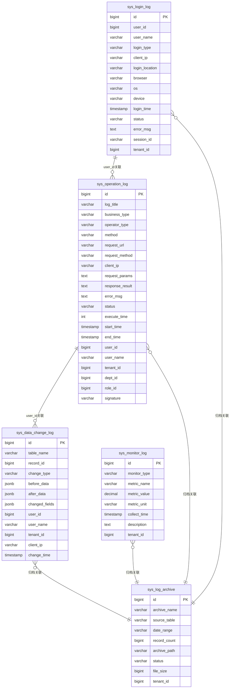

# NexusIX-Platform 审计日志模块详细设计

**文档版本**: v1.0
**创建日期**: 2026-07-04
**模块名称**: nexusix-audit
**模块定位**: 多租户SaaS平台审计追踪与日志管理
**基于**: nexusix-common 的 @OperationLog 注解与 OperationLogAspect 切面

---

## 📋 文档目录

- [1. 业务需求说明](#1-业务需求说明)
  - [1.1 项目背景](#11-项目背景)
  - [1.2 目标用户](#12-目标用户)
  - [1.3 业务价值](#13-业务价值)
  - [1.4 核心目标](#14-核心目标)
- [2. 功能详细描述](#2-功能详细描述)
  - [2.1 操作日志管理](#21-操作日志管理)
  - [2.2 登录日志管理](#22-登录日志管理)
  - [2.3 数据变更日志](#23-数据变更日志)
  - [2.4 系统监控日志](#24-系统监控日志)
  - [2.5 日志查询与导出](#25-日志查询与导出)
  - [2.6 日志归档与清理](#26-日志归档与清理)
- [3. 数据库设计方案](#3-数据库设计方案)
  - [3.1 ER关系图](#31-er关系图)
  - [3.2 表结构定义DDL](#32-表结构定义ddl)
- [4. 接口定义](#4-接口定义)
  - [4.1 操作日志接口](#41-操作日志接口)
  - [4.2 登录日志接口](#42-登录日志接口)
  - [4.3 数据变更日志接口](#43-数据变更日志接口)
  - [4.4 系统监控日志接口](#44-系统监控日志接口)
  - [4.5 日志归档接口](#45-日志归档接口)
- [5. 核心实现方案](#5-核心实现方案)
- [6. 测试策略](#6-测试策略)
- [7. 修订记录](#7-修订记录)

---

## 1. 业务需求说明

### 1.1 项目背景

NexusIX-Platform 是一个多租户SaaS平台，服务于多个企业租户。在多租户环境下，平台必须满足以下合规与安全需求：

- **合规审计要求**：根据《网络安全法》《数据安全法》《个人信息保护法》以及等保2.0要求，平台需要对所有用户操作行为进行完整记录，保留期不少于6个月。
- **安全事件追溯**：当系统发生安全事件（如数据泄露、越权访问、异常登录）时，需要通过日志快速定位事件源头、影响范围和责任主体。
- **多租户隔离审计**：不同租户的操作日志需要严格隔离，租户管理员只能查看本租户的日志，平台管理员可查看全部日志。
- **数据变更追踪**：核心业务数据（用户、租户、权限、订单等）的变更需要记录变更前后的数据快照，支持回溯和审计。
- **系统运行监控**：平台运行过程中的JVM、数据库、Redis、接口性能等指标需要持续采集记录，为性能优化和故障诊断提供依据。

现有 `nexusix-common` 模块已提供 `@OperationLog` 注解和 `OperationLogAspect` 切面（仅记录日志到日志文件），本模块需要扩展该能力，将日志持久化到数据库，并提供查询、导出、归档等管理功能。

### 1.2 目标用户

| 用户角色 | 使用场景 | 关键诉求 |
|---------|---------|---------|
| **平台管理员** | 全平台审计追踪、安全事件调查 | 查看所有租户日志、跨租户分析、批量导出 |
| **租户管理员** | 本租户内操作审计、用户行为分析 | 仅查看本租户日志、按用户/部门过滤 |
| **安全审计员** | 合规审计、异常检测、安全事件响应 | 多维度查询、数据变更追溯、日志完整性校验 |
| **合规人员** | 满足监管要求、生成审计报告 | 按时间段导出日志、归档日志下载 |
| **运维工程师** | 系统性能监控、故障诊断 | 监控指标查询、慢SQL分析、接口耗时分析 |

### 1.3 业务价值

1. **合规审计**：满足等保2.0、ISO27001、SOC2等合规标准对日志记录和保留的要求，避免监管处罚。
2. **安全追溯**：通过完整的操作链路记录，可在5分钟内定位安全事件源头，降低事件响应时间。
3. **异常检测**：基于登录日志和操作日志的异常行为识别（如异地登录、批量删除、深夜操作），提前预警风险。
4. **责任界定**：通过数据变更日志的before/after对比，明确数据变更责任主体，支持纠纷处理。
5. **性能优化**：通过系统监控日志识别慢SQL、高耗时接口，为性能优化提供数据支撑。
6. **运营洞察**：通过操作日志分析用户使用习惯、高频功能，为产品迭代提供依据。

### 1.4 核心目标

| 目标维度 | 指标要求 |
|---------|---------|
| 日志写入性能 | QPS ≥ 1000（异步写入） |
| 日志查询响应 | 分页查询 P95 ≤ 500ms |
| 日志完整性 | 防篡改，任何修改可检测 |
| 日志保留期 | 在线查询 ≥ 90天，归档保留 ≥ 180天 |
| 数据变更覆盖率 | 核心业务表 100% 覆盖 |
| 监控指标采集 | 每5分钟采集一次，24小时滚动 |

---

## 2. 功能详细描述

### 2.1 操作日志管理

#### 2.1.1 功能说明

基于现有 `@OperationLog` 注解和 `OperationLogAspect` 切面，记录用户在系统中的所有操作行为，包括但不限于：
- CRUD操作（新增、修改、删除、查询）
- 登录认证操作（登录、登出、密码修改）
- 授权操作（角色分配、权限授予）
- 数据导入导出操作
- 系统配置操作

#### 2.1.2 业务规则

1. **注解驱动记录**：所有需要记录日志的Controller方法必须标注 `@OperationLog` 注解，注解参数包括：
   - `title`：操作模块标题（如"用户管理"）
   - `businessType`：业务类型枚举（INSERT/UPDATE/DELETE/GRANT/EXPORT/IMPORT/FORCE/CLEAN/SEARCH/OTHER）
   - `operatorType`：操作人类型（MANAGE/MOBILE/PORTAL）
   - `isSaveRequestData`：是否保存请求参数（默认true）
   - `isSaveResponseData`：是否保存响应数据（默认true）
   - `excludeParams`：排除的参数名（如password等敏感参数）

2. **异步写入**：日志写入必须异步执行（通过RabbitMQ或线程池），不得阻塞业务主流程。业务接口响应时间增加不超过5ms。

3. **自动采集字段**：
   - 操作人信息：user_id、user_name、tenant_id、dept_id、role_id（从UserContext和TenantContext获取）
   - 请求信息：request_url、request_method、client_ip（从HttpServletRequest获取，支持多级代理）
   - 执行信息：method（类名.方法名）、execute_time（毫秒）、start_time、end_time
   - 状态信息：status（成功/失败）、error_msg（异常信息）

4. **敏感参数脱敏**：默认排除 password、oldPassword、newPassword、confirmPassword、token 等敏感参数，支持通过 `excludeParams` 自定义。

5. **多租户隔离**：
   - 租户管理员查询时自动添加 `tenant_id = 当前租户ID` 过滤
   - 平台管理员（超管）可查询所有租户日志
   - 跨租户查询需具备 `AUDIT:CROSS_TENANT` 权限

6. **日志完整性保护**：每条日志写入时计算HMAC-SHA256签名（基于操作时间+用户ID+方法+IP），防止日志被篡改。

#### 2.1.3 与现有切面的关系

现有 `OperationLogAspect` 仅将日志输出到日志文件。本模块需要扩展：
- 提供一个 `OperationLogStorageService` 接口，由 `nexusix-audit` 模块实现
- 通过Spring的事件机制（`ApplicationEvent`）解耦，切面发布事件，审计模块监听并持久化
- 切面保留原有日志输出能力（向后兼容）

### 2.2 登录日志管理

#### 2.2.1 功能说明

记录用户登录、登出、登录失败等认证行为，包括：
- 登录成功：记录用户ID、登录方式、IP、设备、位置、SessionID
- 登录失败：记录尝试的用户名、失败原因（密码错误/账号锁定/账号禁用）
- 登出：记录登出时间、登出方式（主动/超时/强制）
- 异常登录识别：异地登录、非工作时间登录、频繁失败

#### 2.2.2 业务规则

1. **登录类型枚举**：
   - `LOGIN`：登录成功
   - `LOGOUT`：登出
   - `LOGIN_FAILED`：登录失败
   - `FORCE_LOGOUT`：被管理员强制下线
   - `SESSION_TIMEOUT`：会话超时

2. **设备信息解析**：通过User-Agent解析浏览器（Chrome/Firefox/Safari/Edge）、操作系统（Windows/Mac/Linux/iOS/Android）、设备类型（PC/Mobile/Tablet）。

3. **IP归属地解析**：通过离线IP库（如ip2region）解析IP归属地，格式为"国家|省份|城市|ISP"。

4. **会话关联**：登录成功时记录Sa-Token的SessionID，支持通过SessionID查询完整登录链路。

5. **异常登录检测**：
   - 同一账号1小时内登录失败超过5次，标记为异常
   - 同一账号在30分钟内切换不同城市登录，标记为异地登录
   - 非工作时间（22:00-06:00）登录，标记为异常时间登录
   - 检测到异常时触发告警通知（集成notify模块）

6. **数据保留**：登录日志默认保留180天，超过保留期自动归档。

### 2.3 数据变更日志

#### 2.3.1 功能说明

通过AOP切面（`DataChangeAspect`）自动记录核心业务表的数据变更，存储变更前后的数据快照，支持：
- INSERT：记录新增的数据快照
- UPDATE：记录变更前后的数据对比，标注变更字段
- DELETE：记录被删除的数据快照

#### 2.3.2 业务规则

1. **注解驱动**：通过自定义 `@DataChange` 注解标记需要记录数据变更的方法，注解参数：
   - `tableName`：业务表名（如"sys_user"）
   - `changeType`：变更类型（INSERT/UPDATE/DELETE）
   - `recordBefore`：是否记录变更前数据（UPDATE/DELETE时为true）

2. **变更前数据获取**：
   - UPDATE/DELETE：在方法执行前根据主键查询原始数据
   - INSERT：无变更前数据
   - 通过 `@DataChangeId` 注解标记主键参数位置

3. **变更字段计算**：对于UPDATE操作，对比before和after的JSON，计算changed_fields列表（如["user_name","email"]）。

4. **数据脱敏**：
   - 密码字段（password）始终脱敏为"******"
   - 身份证号、手机号等敏感字段按字段级权限配置脱敏
   - 大文本字段（如content）超过1000字符截断并标注

5. **JSONB存储**：before_data和after_data使用JSONB类型存储，支持JSONB路径查询。

6. **核心业务表覆盖**：
   - sys_user（用户表）
   - sys_role（角色表）
   - sys_perm（权限表）
   - sys_tenant（租户表）
   - sys_dept（部门表）
   - sys_config（系统配置表）
   - sys_form_template（表单模板表）
   - sys_order（订单表）

### 2.4 系统监控日志

#### 2.4.1 功能说明

定时采集系统运行指标并持久化，提供历史数据查询和分析能力：

1. **JVM监控**：堆内存/非堆内存使用、GC次数与耗时、线程数、类加载数
2. **数据库监控**：连接数（活跃/空闲）、慢SQL（耗时>1s）、死锁检测
3. **Redis监控**：内存使用、连接数、QPS、命中率、慢查询
4. **接口耗时监控**：每个API的平均耗时、P95/P99耗时、调用次数、错误率
5. **RabbitMQ监控**：队列积压、消费速率、连接数

#### 2.4.2 业务规则

1. **采集方式**：
   - JVM/系统指标：通过定时任务（`@Scheduled`）每5分钟采集一次
   - 慢SQL：通过MyBatis拦截器实时捕获
   - 接口耗时：通过 `OperationLogAspect` 切面统计
   - Redis慢查询：通过Redis Slowlog命令采集

2. **监控类型枚举**：
   - `JVM`：JVM运行指标
   - `DB`：数据库指标
   - `REDIS`：Redis指标
   - `API`：接口耗时指标
   - `SLOW_SQL`：慢SQL
   - `MQ`：消息队列指标

3. **指标存储格式**：
   - metric_name：指标名称（如"jvm.heap.used"）
   - metric_value：指标值（数值类型）
   - metric_unit：指标单位（如"MB"、"ms"、"次"）
   - description：指标描述（如"JVM堆内存已用"）

4. **慢SQL识别**：执行时间超过1秒的SQL自动记录，包含SQL语句（参数已替换）、执行时间、调用方法。

5. **告警阈值**：
   - JVM堆内存使用率 > 85%
   - DB活跃连接 > 80%最大连接
   - Redis内存 > 80%最大内存
   - 接口P95耗时 > 2秒
   - 触发告警时通过notify模块发送通知

6. **数据保留**：监控日志默认保留30天（高频率采集数据），关键指标可聚合后长期保留。

### 2.5 日志查询与导出

#### 2.5.1 功能说明

为所有日志类型提供统一的查询和导出能力：

1. **多维度查询**：
   - 时间范围（start_time/end_time）
   - 操作人（user_id/user_name）
   - 租户（tenant_id，平台管理员可用）
   - 部门（dept_id）
   - 模块（log_title/business_type）
   - 操作类型（business_type）
   - 状态（status：成功/失败）
   - 客户端IP（client_ip）
   - 关键字模糊查询（request_params/response_result）

2. **分页查询**：统一分页参数（pageNum/pageSize），默认按时间倒序，支持多字段排序。

3. **导出能力**：
   - Excel导出（单次最多10万条）
   - 支持按当前查询条件导出
   - 异步导出大数据量，导出完成后通过notify模块通知
   - 导出文件支持7天下载

4. **查询性能优化**：
   - 核心查询字段建立索引
   - 大数据量分页使用游标分页（基于ID）
   - 历史数据归档后查询走归档表

### 2.6 日志归档与清理

#### 2.6.1 功能说明

针对日志数据量大、查询性能下降的问题，提供归档和清理机制：

1. **自动归档**：
   - 定时任务（每日凌晨2点）扫描超过保留期的日志
   - 将数据导出为JSON文件并压缩存储
   - 归档完成后从原表删除数据
   - 记录归档元数据到sys_log_archive表

2. **归档策略配置**：
   - 操作日志：在线保留90天
   - 登录日志：在线保留180天
   - 数据变更日志：在线保留180天
   - 监控日志：在线保留30天
   - 保留期可通过sys_config配置

3. **归档文件存储**：
   - 本地存储：默认存储到 `/data/archive/audit/`
   - 对象存储：支持S3协议的对象存储（如MinIO）
   - 路径格式：`{source_table}/{yyyy}/{MM}/{dd}/{archive_name}.tar.gz`

4. **归档查询**：归档后的日志支持下载归档文件离线查询，未来可扩展ES检索。

5. **清理策略**：
   - 归档文件保留180天，超期自动删除
   - 清理操作记录日志，防止误操作

---

## 3. 数据库设计方案

### 3.1 ER关系图



### 3.2 表结构定义DDL

```sql
-- =============================================================================
-- 1. 操作日志表 sys_operation_log
-- =============================================================================
CREATE TABLE sys_operation_log (
    id BIGINT PRIMARY KEY,
    log_title VARCHAR(100) NOT NULL,                  -- 操作模块标题（如"用户管理"）
    business_type VARCHAR(20) NOT NULL,               -- 业务类型：INSERT/UPDATE/DELETE/GRANT/EXPORT/IMPORT/FORCE/CLEAN/SEARCH/OTHER
    operator_type VARCHAR(20) NOT NULL DEFAULT 'MANAGE', -- 操作人类型：MANAGE/MOBILE/PORTAL
    method VARCHAR(300) NOT NULL,                     -- 执行方法（类名.方法名）
    request_url VARCHAR(500),                         -- 请求URL
    request_method VARCHAR(10),                       -- HTTP方法：GET/POST/PUT/DELETE
    client_ip VARCHAR(50),                            -- 客户端IP
    request_params TEXT,                              -- 请求参数（JSON，已脱敏）
    response_result TEXT,                             -- 响应结果（JSON，截断到1000字符）
    error_msg TEXT,                                   -- 错误信息
    status VARCHAR(20) NOT NULL,                      -- 状态：SUCCESS/FAILED
    execute_time INT NOT NULL,                        -- 执行耗时（毫秒）
    start_time TIMESTAMP NOT NULL,                    -- 开始时间
    end_time TIMESTAMP,                               -- 结束时间
    user_id BIGINT,                                   -- 操作人ID
    user_name VARCHAR(100),                           -- 操作人姓名
    tenant_id BIGINT,                                 -- 租户ID
    dept_id BIGINT,                                   -- 部门ID
    role_id BIGINT,                                   -- 角色ID
    signature VARCHAR(128),                           -- 日志签名（HMAC-SHA256）
    -- 审计字段
    create_tenant BIGINT NOT NULL,
    create_dept BIGINT NOT NULL,
    create_role BIGINT NOT NULL,
    create_by BIGINT NOT NULL,
    create_at TIMESTAMP NOT NULL,
    update_by BIGINT,
    update_at TIMESTAMP,
    is_deleted VARCHAR(20) DEFAULT 'NOT_DELETED',
    deleted_at TIMESTAMP
);

-- 索引
CREATE INDEX idx_operation_log_tenant_time ON sys_operation_log(tenant_id, start_time);
CREATE INDEX idx_operation_log_user ON sys_operation_log(user_id, start_time);
CREATE INDEX idx_operation_log_business_type ON sys_operation_log(business_type, start_time);
CREATE INDEX idx_operation_log_status ON sys_operation_log(status, start_time);
CREATE INDEX idx_operation_log_ip ON sys_operation_log(client_ip, start_time);
CREATE INDEX idx_operation_log_time ON sys_operation_log(start_time);

-- =============================================================================
-- 2. 登录日志表 sys_login_log
-- =============================================================================
CREATE TABLE sys_login_log (
    id BIGINT PRIMARY KEY,
    user_id BIGINT,                                   -- 用户ID（登录失败时可能为空）
    user_name VARCHAR(100) NOT NULL,                  -- 用户名（登录失败时为尝试的用户名）
    login_type VARCHAR(20) NOT NULL,                  -- 登录类型：LOGIN/LOGOUT/LOGIN_FAILED/FORCE_LOGOUT/SESSION_TIMEOUT
    client_ip VARCHAR(50),                            -- 客户端IP
    login_location VARCHAR(200),                      -- 登录位置（国家|省份|城市|ISP）
    browser VARCHAR(100),                             -- 浏览器
    os VARCHAR(100),                                  -- 操作系统
    device VARCHAR(50),                               -- 设备类型：PC/MOBILE/TABLET
    login_time TIMESTAMP NOT NULL,                    -- 登录时间
    status VARCHAR(20) NOT NULL,                      -- 状态：SUCCESS/FAILED
    error_msg TEXT,                                   -- 错误信息（登录失败原因）
    session_id VARCHAR(100),                          -- 会话ID（Sa-Token）
    tenant_id BIGINT,                                 -- 租户ID
    is_abnormal BOOLEAN DEFAULT FALSE,                -- 是否异常登录（异地/非工作时间/频繁失败）
    abnormal_reason VARCHAR(200),                     -- 异常原因
    -- 审计字段
    create_tenant BIGINT NOT NULL,
    create_dept BIGINT NOT NULL,
    create_role BIGINT NOT NULL,
    create_by BIGINT NOT NULL,
    create_at TIMESTAMP NOT NULL,
    update_by BIGINT,
    update_at TIMESTAMP,
    is_deleted VARCHAR(20) DEFAULT 'NOT_DELETED',
    deleted_at TIMESTAMP
);

-- 索引
CREATE INDEX idx_login_log_tenant_time ON sys_login_log(tenant_id, login_time);
CREATE INDEX idx_login_log_user ON sys_login_log(user_id, login_time);
CREATE INDEX idx_login_log_user_name ON sys_login_log(user_name, login_time);
CREATE INDEX idx_login_log_status ON sys_login_log(status, login_time);
CREATE INDEX idx_login_log_abnormal ON sys_login_log(is_abnormal, login_time);
CREATE INDEX idx_login_log_time ON sys_login_log(login_time);

-- =============================================================================
-- 3. 数据变更日志表 sys_data_change_log
-- =============================================================================
CREATE TABLE sys_data_change_log (
    id BIGINT PRIMARY KEY,
    table_name VARCHAR(100) NOT NULL,                 -- 业务表名（如sys_user）
    record_id BIGINT NOT NULL,                        -- 记录主键ID
    change_type VARCHAR(20) NOT NULL,                 -- 变更类型：INSERT/UPDATE/DELETE
    before_data JSONB,                                -- 变更前数据快照（JSON）
    after_data JSONB,                                 -- 变更后数据快照（JSON）
    changed_fields JSONB,                             -- 变更字段列表（如["user_name","email"]）
    user_id BIGINT,                                   -- 操作人ID
    user_name VARCHAR(100),                           -- 操作人姓名
    tenant_id BIGINT,                                 -- 租户ID
    dept_id BIGINT,                                   -- 部门ID
    client_ip VARCHAR(50),                            -- 客户端IP
    change_time TIMESTAMP NOT NULL,                   -- 变更时间
    business_type VARCHAR(20),                        -- 业务类型（关联操作日志）
    operation_log_id BIGINT,                          -- 关联操作日志ID
    -- 审计字段
    create_tenant BIGINT NOT NULL,
    create_dept BIGINT NOT NULL,
    create_role BIGINT NOT NULL,
    create_by BIGINT NOT NULL,
    create_at TIMESTAMP NOT NULL,
    update_by BIGINT,
    update_at TIMESTAMP,
    is_deleted VARCHAR(20) DEFAULT 'NOT_DELETED',
    deleted_at TIMESTAMP
);

-- 索引
CREATE INDEX idx_data_change_log_table ON sys_data_change_log(table_name, record_id);
CREATE INDEX idx_data_change_log_tenant_time ON sys_data_change_log(tenant_id, change_time);
CREATE INDEX idx_data_change_log_user ON sys_data_change_log(user_id, change_time);
CREATE INDEX idx_data_change_log_type ON sys_data_change_log(change_type, change_time);
CREATE INDEX idx_data_change_log_time ON sys_data_change_log(change_time);
-- JSONB GIN索引，支持JSONB查询
CREATE INDEX idx_data_change_log_before_data ON sys_data_change_log USING GIN (before_data);
CREATE INDEX idx_data_change_log_after_data ON sys_data_change_log USING GIN (after_data);

-- =============================================================================
-- 4. 系统监控日志表 sys_monitor_log
-- =============================================================================
CREATE TABLE sys_monitor_log (
    id BIGINT PRIMARY KEY,
    monitor_type VARCHAR(20) NOT NULL,                -- 监控类型：JVM/DB/REDIS/API/SLOW_SQL/MQ
    metric_name VARCHAR(100) NOT NULL,                -- 指标名称（如jvm.heap.used）
    metric_value DECIMAL(20,4) NOT NULL,              -- 指标值
    metric_unit VARCHAR(20),                          -- 指标单位（如MB/ms/次/%）
    collect_time TIMESTAMP NOT NULL,                  -- 采集时间
    description TEXT,                                 -- 指标描述
    tenant_id BIGINT,                                 -- 租户ID（监控数据通常为0表示平台级）
    -- 扩展信息（针对慢SQL等）
    extra_info JSONB,                                 -- 扩展信息（如慢SQL的SQL语句、调用方法）
    -- 审计字段
    create_tenant BIGINT NOT NULL,
    create_dept BIGINT NOT NULL,
    create_role BIGINT NOT NULL,
    create_by BIGINT NOT NULL,
    create_at TIMESTAMP NOT NULL,
    update_by BIGINT,
    update_at TIMESTAMP,
    is_deleted VARCHAR(20) DEFAULT 'NOT_DELETED',
    deleted_at TIMESTAMP
);

-- 索引
CREATE INDEX idx_monitor_log_type_time ON sys_monitor_log(monitor_type, collect_time);
CREATE INDEX idx_monitor_log_metric_time ON sys_monitor_log(metric_name, collect_time);
CREATE INDEX idx_monitor_log_tenant_time ON sys_monitor_log(tenant_id, collect_time);
CREATE INDEX idx_monitor_log_time ON sys_monitor_log(collect_time);

-- =============================================================================
-- 5. 日志归档表 sys_log_archive
-- =============================================================================
CREATE TABLE sys_log_archive (
    id BIGINT PRIMARY KEY,
    archive_name VARCHAR(200) NOT NULL,               -- 归档名称（如operation_log_20260601_20260630）
    source_table VARCHAR(100) NOT NULL,               -- 源表名（sys_operation_log等）
    date_range VARCHAR(50) NOT NULL,                  -- 日期范围（如2026-06-01 ~ 2026-06-30）
    start_date DATE NOT NULL,                         -- 开始日期
    end_date DATE NOT NULL,                           -- 结束日期
    record_count BIGINT NOT NULL DEFAULT 0,           -- 归档记录数
    archive_path VARCHAR(500),                        -- 归档文件路径
    file_size BIGINT,                                 -- 文件大小（字节）
    status VARCHAR(20) NOT NULL DEFAULT 'PROCESSING', -- 状态：PROCESSING/SUCCESS/FAILED
    error_msg TEXT,                                   -- 失败原因
    tenant_id BIGINT,                                 -- 租户ID（0表示全平台归档）
    -- 审计字段
    create_tenant BIGINT NOT NULL,
    create_dept BIGINT NOT NULL,
    create_role BIGINT NOT NULL,
    create_by BIGINT NOT NULL,
    create_at TIMESTAMP NOT NULL,
    update_by BIGINT,
    update_at TIMESTAMP,
    is_deleted VARCHAR(20) DEFAULT 'NOT_DELETED',
    deleted_at TIMESTAMP
);

-- 索引
CREATE INDEX idx_log_archive_source ON sys_log_archive(source_table, start_date);
CREATE INDEX idx_log_archive_status ON sys_log_archive(status);
CREATE INDEX idx_log_archive_tenant ON sys_log_archive(tenant_id);

-- =============================================================================
-- 归档保留策略配置（写入sys_config表）
-- =============================================================================
-- INSERT INTO sys_config(config_key, config_value, config_type, config_desc, is_system)
-- VALUES
--   ('audit.operation_log.retention_days', '90', 'NUMBER', '操作日志在线保留天数', true),
--   ('audit.login_log.retention_days', '180', 'NUMBER', '登录日志在线保留天数', true),
--   ('audit.data_change_log.retention_days', '180', 'NUMBER', '数据变更日志在线保留天数', true),
--   ('audit.monitor_log.retention_days', '30', 'NUMBER', '监控日志在线保留天数', true),
--   ('audit.archive.file_retention_days', '180', 'NUMBER', '归档文件保留天数', true),
--   ('audit.slow_sql.threshold_ms', '1000', 'NUMBER', '慢SQL阈值（毫秒）', true);
```

---

## 4. 接口定义

所有接口遵循以下规范：
- 统一前缀：`/audit`
- 统一响应格式：`ApiResponse<T>`（code/msg/data）
- 统一分页参数：`pageNum`（页码，从1开始）、`pageSize`（每页条数，默认20）
- 权限编码格式：`AUDIT:操作:资源`（如`AUDIT:VIEW:OPERATION_LOG`）

### 4.1 操作日志接口

#### 4.1.1 queryOperationLogList - 查询操作日志列表

| 项目 | 内容 |
|------|------|
| **路径** | `GET /audit/operation-log/list` |
| **方法** | GET |
| **权限** | `AUDIT:VIEW:OPERATION_LOG` |
| **功能** | 不分页查询操作日志列表（建议限制最多返回1000条） |

**请求参数**：

| 参数名 | 类型 | 必填 | 校验规则 | 说明 |
|--------|------|------|---------|------|
| logTitle | String | 否 | 最大100字符 | 操作模块标题（精确匹配） |
| businessType | String | 否 | 枚举校验 | 业务类型：INSERT/UPDATE/DELETE/GRANT/EXPORT/IMPORT/FORCE/CLEAN/SEARCH/OTHER |
| status | String | 否 | 枚举校验 | 状态：SUCCESS/FAILED |
| userId | Long | 否 | 正整数 | 操作人ID |
| userName | String | 否 | 最大100字符 | 操作人姓名（模糊查询） |
| tenantId | Long | 否 | 正整数 | 租户ID（仅平台管理员可用） |
| clientIp | String | 否 | IP格式 | 客户端IP |
| startTimeStart | String | 否 | yyyy-MM-dd HH:mm:ss | 开始时间范围-起 |
| startTimeEnd | String | 否 | yyyy-MM-dd HH:mm:ss | 开始时间范围-止 |

**响应格式**：

```json
{
  "code": 200,
  "msg": "操作成功",
  "data": [
    {
      "id": "1234567890",
      "logTitle": "用户管理",
      "businessType": "INSERT",
      "businessTypeDesc": "新增",
      "operatorType": "MANAGE",
      "method": "com.shy.nexusix.iam.controller.SysUserController.addUser",
      "requestUrl": "/iam/user/add",
      "requestMethod": "POST",
      "clientIp": "192.168.1.100",
      "status": "SUCCESS",
      "executeTime": 156,
      "startTime": "2026-07-04 10:30:00",
      "userId": 1001,
      "userName": "张三",
      "tenantId": 1,
      "tenantName": "默认租户",
      "deptId": 101,
      "deptName": "研发部",
      "requestParams": "{\"param\":{\"userName\":\"lisi\",\"email\":\"lisi@test.com\"}}"
    }
  ]
}
```

**调用示例**：

```bash
curl -X GET "http://localhost:8080/audit/operation-log/list?businessType=INSERT&startTimeStart=2026-07-01%2000:00:00&startTimeEnd=2026-07-31%2023:59:59" \
  -H "Authorization: Bearer {token}"
```

**业务逻辑**：
1. 从UserContext获取当前用户，判断是否为平台管理员
2. 非平台管理员强制添加 `tenant_id = 当前租户ID` 过滤条件
3. 根据查询条件构建LambdaQueryWrapper
4. 限制最多返回1000条，按start_time倒序
5. 关联查询租户名称、部门名称等展示字段
6. 应用字段级权限过滤敏感字段（如request_params对低权限用户不可见）

---

#### 4.1.2 queryOperationLogPage - 分页查询操作日志

| 项目 | 内容 |
|------|------|
| **路径** | `GET /audit/operation-log/page` |
| **方法** | GET |
| **权限** | `AUDIT:VIEW:OPERATION_LOG` |
| **功能** | 分页查询操作日志，支持多维度过滤 |

**请求参数**：同4.1.1，增加分页参数：

| 参数名 | 类型 | 必填 | 校验规则 | 说明 |
|--------|------|------|---------|------|
| pageNum | Integer | 是 | 最小1 | 页码 |
| pageSize | Integer | 是 | 1-100 | 每页条数 |
| orderBy | String | 否 | 枚举校验 | 排序字段，默认start_time |
| orderDir | String | 否 | ASC/DESC | 排序方向，默认DESC |

**响应格式**：

```json
{
  "code": 200,
  "msg": "操作成功",
  "data": {
    "records": [...],
    "total": 15680,
    "size": 20,
    "current": 1,
    "pages": 784
  }
}
```

**调用示例**：

```bash
curl -X GET "http://localhost:8080/audit/operation-log/page?pageNum=1&pageSize=20&businessType=INSERT" \
  -H "Authorization: Bearer {token}"
```

**业务逻辑**：
1. 同4.1.1的权限校验和租户过滤
2. 使用MyBatis-Plus的Page进行分页
3. 深分页（pageNum>1000）时自动切换为游标分页（基于ID > lastId）
4. 返回分页元信息（total/size/current/pages）

---

#### 4.1.3 queryOperationLogDetail - 查询操作日志详情

| 项目 | 内容 |
|------|------|
| **路径** | `GET /audit/operation-log/detail/{id}` |
| **方法** | GET |
| **权限** | `AUDIT:VIEW:OPERATION_LOG` |
| **功能** | 根据ID查询操作日志完整详情 |

**路径参数**：

| 参数名 | 类型 | 必填 | 校验规则 | 说明 |
|--------|------|------|---------|------|
| id | Long | 是 | 正整数 | 操作日志ID |

**响应格式**：

```json
{
  "code": 200,
  "msg": "操作成功",
  "data": {
    "id": "1234567890",
    "logTitle": "用户管理",
    "businessType": "INSERT",
    "businessTypeDesc": "新增",
    "operatorType": "MANAGE",
    "operatorTypeDesc": "后台用户",
    "method": "com.shy.nexusix.iam.controller.SysUserController.addUser",
    "requestUrl": "/iam/user/add",
    "requestMethod": "POST",
    "clientIp": "192.168.1.100",
    "requestParams": "{\"param\":{\"userName\":\"lisi\",\"email\":\"lisi@test.com\",\"phone\":\"13800138000\"}}",
    "responseResult": "{\"code\":200,\"msg\":\"操作成功\",\"data\":\"1001\"}",
    "errorMsg": null,
    "status": "SUCCESS",
    "executeTime": 156,
    "startTime": "2026-07-04 10:30:00.123",
    "endTime": "2026-07-04 10:30:00.279",
    "userId": 1001,
    "userName": "张三",
    "tenantId": 1,
    "tenantName": "默认租户",
    "deptId": 101,
    "deptName": "研发部",
    "roleId": 1001,
    "roleName": "系统管理员",
    "signature": "a1b2c3d4e5f6...",
    "relatedDataChangeLogs": [
      {
        "id": "1234567891",
        "tableName": "sys_user",
        "recordId": 1002,
        "changeType": "INSERT",
        "afterData": "{\"id\":1002,\"userName\":\"lisi\",\"email\":\"lisi@test.com\"}"
      }
    ]
  }
}
```

**业务逻辑**：
1. 根据ID查询操作日志主表
2. 校验数据权限：非平台管理员只能查看本租户日志
3. 关联查询数据变更日志（通过operation_log_id关联）
4. 返回完整字段，包括请求参数和响应结果
5. 校验日志签名是否一致（防篡改检测）

---

#### 4.1.4 deleteOperationLog - 删除操作日志

| 项目 | 内容 |
|------|------|
| **路径** | `DELETE /audit/operation-log/delete/{id}` |
| **方法** | DELETE |
| **权限** | `AUDIT:DELETE:OPERATION_LOG` |
| **功能** | 删除单条操作日志（软删除） |

**路径参数**：

| 参数名 | 类型 | 必填 | 校验规则 | 说明 |
|--------|------|------|---------|------|
| id | Long | 是 | 正整数 | 操作日志ID |

**响应格式**：

```json
{
  "code": 200,
  "msg": "删除成功",
  "data": 1
}
```

**业务逻辑**：
1. 校验日志是否存在且属于当前租户
2. 执行软删除（设置is_deleted=DELETED, deleted_at=now()）
3. 记录本次删除操作到操作日志（防止删除日志的行为不被记录）
4. 仅平台管理员或具有`AUDIT:DELETE:OPERATION_LOG`权限的角色可操作

---

#### 4.1.5 batchDeleteOperationLog - 批量删除操作日志

| 项目 | 内容 |
|------|------|
| **路径** | `DELETE /audit/operation-log/batch-delete` |
| **方法** | DELETE |
| **权限** | `AUDIT:DELETE:OPERATION_LOG` |
| **功能** | 批量删除操作日志（软删除） |

**请求参数**：

| 参数名 | 类型 | 必填 | 校验规则 | 说明 |
|--------|------|------|---------|------|
| ids | List<Long> | 是 | 非空，最多500条 | 操作日志ID列表 |

**请求示例**：

```json
{
  "ids": [1234567890, 1234567891, 1234567892]
}
```

**响应格式**：

```json
{
  "code": 200,
  "msg": "批量删除成功",
  "data": 3
}
```

**业务逻辑**：
1. 校验ID列表大小（最多500条）
2. 批量软删除，使用IN条件
3. 自动过滤非本租户的日志ID（防止越权删除）

---

#### 4.1.6 exportOperationLog - 导出操作日志

| 项目 | 内容 |
|------|------|
| **路径** | `POST /audit/operation-log/export` |
| **方法** | POST |
| **权限** | `AUDIT:EXPORT:OPERATION_LOG` |
| **功能** | 按查询条件导出操作日志为Excel |

**请求参数**：同4.1.1的查询条件，导出字段可选：

| 参数名 | 类型 | 必填 | 校验规则 | 说明 |
|--------|------|------|---------|------|
| exportFields | List<String> | 否 | - | 导出字段，默认全部字段 |
| async | Boolean | 否 | - | 是否异步导出（数据量>1万时强制异步），默认false |

**响应格式（同步导出）**：

直接返回Excel文件流，Content-Type: application/vnd.openxmlformats-officedocument.spreadsheetml.sheet

**响应格式（异步导出）**：

```json
{
  "code": 200,
  "msg": "导出任务已提交",
  "data": {
    "taskId": "export_20260704_001",
    "status": "PROCESSING",
    "estimatedTime": 60
  }
}
```

**业务逻辑**：
1. 同步导出：数据量≤1万时直接生成Excel返回
2. 异步导出：数据量>1万时提交到线程池，生成完成后通过notify模块通知
3. 单次导出最多10万条
4. 异步导出文件保留7天，存储路径：`/data/export/audit/{taskId}.xlsx`
5. 敏感字段（如request_params）根据导出人权限决定是否包含

---

#### 4.1.7 clearOperationLog - 清空操作日志

| 项目 | 内容 |
|------|------|
| **路径** | `DELETE /audit/operation-log/clear` |
| **方法** | DELETE |
| **权限** | `AUDIT:CLEAR:OPERATION_LOG`（仅平台超管） |
| **功能** | 清空指定时间范围的操作日志 |

**请求参数**：

| 参数名 | 类型 | 必填 | 校验规则 | 说明 |
|--------|------|------|---------|------|
| beforeDate | String | 是 | yyyy-MM-dd | 清空此日期之前的日志 |
| tenantId | Long | 否 | 正整数 | 指定租户（不传则所有租户） |

**响应格式**：

```json
{
  "code": 200,
  "msg": "清空成功",
  "data": {
    "deletedCount": 15680
  }
}
```

**业务逻辑**：
1. 仅平台超管（具有`AUDIT:CLEAR:OPERATION_LOG`权限）可操作
2. 执行批量软删除，按 `start_time < beforeDate` 条件
3. 必须二次确认（前端弹出确认框）
4. 清空操作本身记录到操作日志，包含清空的时间范围和数量
5. 建议清空前先执行归档操作

---

### 4.2 登录日志接口

#### 4.2.1 queryLoginLogList - 查询登录日志列表

| 项目 | 内容 |
|------|------|
| **路径** | `GET /audit/login-log/list` |
| **方法** | GET |
| **权限** | `AUDIT:VIEW:LOGIN_LOG` |
| **功能** | 不分页查询登录日志列表 |

**请求参数**：

| 参数名 | 类型 | 必填 | 校验规则 | 说明 |
|--------|------|------|---------|------|
| userId | Long | 否 | 正整数 | 用户ID |
| userName | String | 否 | 最大100字符 | 用户名（模糊查询） |
| loginType | String | 否 | 枚举校验 | 登录类型：LOGIN/LOGOUT/LOGIN_FAILED/FORCE_LOGOUT/SESSION_TIMEOUT |
| status | String | 否 | 枚举校验 | 状态：SUCCESS/FAILED |
| clientIp | String | 否 | IP格式 | 客户端IP |
| isAbnormal | Boolean | 否 | - | 是否异常登录 |
| tenantId | Long | 否 | 正整数 | 租户ID（仅平台管理员） |
| loginTimeStart | String | 否 | yyyy-MM-dd HH:mm:ss | 登录时间范围-起 |
| loginTimeEnd | String | 否 | yyyy-MM-dd HH:mm:ss | 登录时间范围-止 |

**响应格式**：

```json
{
  "code": 200,
  "msg": "操作成功",
  "data": [
    {
      "id": "1234567890",
      "userId": 1001,
      "userName": "张三",
      "loginType": "LOGIN",
      "loginTypeDesc": "登录",
      "clientIp": "192.168.1.100",
      "loginLocation": "中国|北京|北京|电信",
      "browser": "Chrome 120",
      "os": "Windows 10",
      "device": "PC",
      "loginTime": "2026-07-04 09:00:00",
      "status": "SUCCESS",
      "sessionId": "satoken-xxx-xxx",
      "isAbnormal": false,
      "tenantId": 1,
      "tenantName": "默认租户"
    }
  ]
}
```

**业务逻辑**：同操作日志的权限校验和租户隔离逻辑。

---

#### 4.2.2 queryLoginLogPage - 分页查询登录日志

| 项目 | 内容 |
|------|------|
| **路径** | `GET /audit/login-log/page` |
| **方法** | GET |
| **权限** | `AUDIT:VIEW:LOGIN_LOG` |
| **功能** | 分页查询登录日志 |

**请求参数**：同4.2.1，增加分页参数（pageNum/pageSize/orderBy/orderDir）

**响应格式**：同4.1.2的分页结构，records为登录日志列表

---

#### 4.2.3 queryLoginLogDetail - 查询登录日志详情

| 项目 | 内容 |
|------|------|
| **路径** | `GET /audit/login-log/detail/{id}` |
| **方法** | GET |
| **权限** | `AUDIT:VIEW:LOGIN_LOG` |
| **功能** | 根据ID查询登录日志详情 |

**路径参数**：id (Long)

**响应格式**：

```json
{
  "code": 200,
  "msg": "操作成功",
  "data": {
    "id": "1234567890",
    "userId": 1001,
    "userName": "张三",
    "loginType": "LOGIN",
    "clientIp": "192.168.1.100",
    "loginLocation": "中国|北京|北京|电信",
    "browser": "Chrome 120",
    "os": "Windows 10",
    "device": "PC",
    "loginTime": "2026-07-04 09:00:00",
    "status": "SUCCESS",
    "errorMsg": null,
    "sessionId": "satoken-xxx-xxx",
    "isAbnormal": false,
    "abnormalReason": null,
    "tenantId": 1,
    "tenantName": "默认租户"
  }
}
```

---

#### 4.2.4 deleteLoginLog - 删除登录日志

| 项目 | 内容 |
|------|------|
| **路径** | `DELETE /audit/login-log/delete/{id}` |
| **方法** | DELETE |
| **权限** | `AUDIT:DELETE:LOGIN_LOG` |
| **功能** | 删除单条登录日志（软删除） |

**路径参数**：id (Long)

**响应格式**：

```json
{
  "code": 200,
  "msg": "删除成功",
  "data": 1
}
```

---

#### 4.2.5 batchDeleteLoginLog - 批量删除登录日志

| 项目 | 内容 |
|------|------|
| **路径** | `DELETE /audit/login-log/batch-delete` |
| **方法** | DELETE |
| **权限** | `AUDIT:DELETE:LOGIN_LOG` |
| **功能** | 批量删除登录日志 |

**请求参数**：

```json
{
  "ids": [1234567890, 1234567891]
}
```

**响应格式**：

```json
{
  "code": 200,
  "msg": "批量删除成功",
  "data": 2
}
```

---

#### 4.2.6 exportLoginLog - 导出登录日志

| 项目 | 内容 |
|------|------|
| **路径** | `POST /audit/login-log/export` |
| **方法** | POST |
| **权限** | `AUDIT:EXPORT:LOGIN_LOG` |
| **功能** | 按查询条件导出登录日志为Excel |

**请求参数**：同4.2.1查询条件 + exportFields + async

**响应格式**：同4.1.6导出接口

---

#### 4.2.7 clearLoginLog - 清空登录日志

| 项目 | 内容 |
|------|------|
| **路径** | `DELETE /audit/login-log/clear` |
| **方法** | DELETE |
| **权限** | `AUDIT:CLEAR:LOGIN_LOG`（仅平台超管） |
| **功能** | 清空指定时间范围的登录日志 |

**请求参数**：同4.1.7（beforeDate/tenantId）

**响应格式**：

```json
{
  "code": 200,
  "msg": "清空成功",
  "data": {
    "deletedCount": 25680
  }
}
```

---

### 4.3 数据变更日志接口

#### 4.3.1 queryDataChangeLogList - 查询数据变更日志列表

| 项目 | 内容 |
|------|------|
| **路径** | `GET /audit/data-change-log/list` |
| **方法** | GET |
| **权限** | `AUDIT:VIEW:DATA_CHANGE` |
| **功能** | 不分页查询数据变更日志列表 |

**请求参数**：

| 参数名 | 类型 | 必填 | 校验规则 | 说明 |
|--------|------|------|---------|------|
| tableName | String | 否 | 最大100字符 | 业务表名 |
| recordId | Long | 否 | 正整数 | 记录ID |
| changeType | String | 否 | 枚举校验 | 变更类型：INSERT/UPDATE/DELETE |
| userId | Long | 否 | 正整数 | 操作人ID |
| tenantId | Long | 否 | 正整数 | 租户ID（仅平台管理员） |
| changeTimeStart | String | 否 | yyyy-MM-dd HH:mm:ss | 变更时间范围-起 |
| changeTimeEnd | String | 否 | yyyy-MM-dd HH:mm:ss | 变更时间范围-止 |

**响应格式**：

```json
{
  "code": 200,
  "msg": "操作成功",
  "data": [
    {
      "id": "1234567890",
      "tableName": "sys_user",
      "recordId": 1002,
      "changeType": "UPDATE",
      "changeTypeDesc": "修改",
      "changedFields": ["userName", "email"],
      "userId": 1001,
      "userName": "张三",
      "tenantId": 1,
      "clientIp": "192.168.1.100",
      "changeTime": "2026-07-04 10:30:00"
    }
  ]
}
```

---

#### 4.3.2 queryDataChangeLogPage - 分页查询数据变更日志

| 项目 | 内容 |
|------|------|
| **路径** | `GET /audit/data-change-log/page` |
| **方法** | GET |
| **权限** | `AUDIT:VIEW:DATA_CHANGE` |
| **功能** | 分页查询数据变更日志 |

**请求参数**：同4.3.1 + 分页参数

**响应格式**：同4.1.2分页结构，records为数据变更日志列表

---

#### 4.3.3 queryDataChangeLogDetail - 查询数据变更日志详情

| 项目 | 内容 |
|------|------|
| **路径** | `GET /audit/data-change-log/detail/{id}` |
| **方法** | GET |
| **权限** | `AUDIT:VIEW:DATA_CHANGE` |
| **功能** | 根据ID查询数据变更日志详情（包含before/after数据） |

**路径参数**：id (Long)

**响应格式**：

```json
{
  "code": 200,
  "msg": "操作成功",
  "data": {
    "id": "1234567890",
    "tableName": "sys_user",
    "recordId": 1002,
    "changeType": "UPDATE",
    "changeTypeDesc": "修改",
    "beforeData": {
      "id": 1002,
      "userName": "lisi_old",
      "email": "lisi_old@test.com",
      "phone": "13800138000"
    },
    "afterData": {
      "id": 1002,
      "userName": "lisi",
      "email": "lisi@test.com",
      "phone": "13800138000"
    },
    "changedFields": ["userName", "email"],
    "userId": 1001,
    "userName": "张三",
    "tenantId": 1,
    "clientIp": "192.168.1.100",
    "changeTime": "2026-07-04 10:30:00",
    "businessType": "UPDATE",
    "operationLogId": "1234567889",
    "diff": [
      {
        "field": "userName",
        "beforeValue": "lisi_old",
        "afterValue": "lisi"
      },
      {
        "field": "email",
        "beforeValue": "lisi_old@test.com",
        "afterValue": "lisi@test.com"
      }
    ]
  }
}
```

**业务逻辑**：
1. 查询主表数据
2. 解析before_data和after_data为JSON对象
3. 计算字段级别的diff（before/after对比）
4. 敏感字段（password等）脱敏显示

---

#### 4.3.4 deleteDataChangeLog - 删除数据变更日志

| 项目 | 内容 |
|------|------|
| **路径** | `DELETE /audit/data-change-log/delete/{id}` |
| **方法** | DELETE |
| **权限** | `AUDIT:DELETE:DATA_CHANGE` |
| **功能** | 删除单条数据变更日志 |

**路径参数**：id (Long)

**响应格式**：

```json
{
  "code": 200,
  "msg": "删除成功",
  "data": 1
}
```

---

#### 4.3.5 batchDeleteDataChangeLog - 批量删除数据变更日志

| 项目 | 内容 |
|------|------|
| **路径** | `DELETE /audit/data-change-log/batch-delete` |
| **方法** | DELETE |
| **权限** | `AUDIT:DELETE:DATA_CHANGE` |
| **功能** | 批量删除数据变更日志 |

**请求参数**：

```json
{
  "ids": [1234567890, 1234567891]
}
```

**响应格式**：

```json
{
  "code": 200,
  "msg": "批量删除成功",
  "data": 2
}
```

---

#### 4.3.6 exportDataChangeLog - 导出数据变更日志

| 项目 | 内容 |
|------|------|
| **路径** | `POST /audit/data-change-log/export` |
| **方法** | POST |
| **权限** | `AUDIT:EXPORT:DATA_CHANGE` |
| **功能** | 按查询条件导出数据变更日志为Excel |

**请求参数**：同4.3.1查询条件 + exportFields + async

**响应格式**：同4.1.6导出接口

---

### 4.4 系统监控日志接口

#### 4.4.1 queryMonitorLogList - 查询监控日志列表

| 项目 | 内容 |
|------|------|
| **路径** | `GET /audit/monitor-log/list` |
| **方法** | GET |
| **权限** | `AUDIT:VIEW:MONITOR` |
| **功能** | 不分页查询监控日志列表 |

**请求参数**：

| 参数名 | 类型 | 必填 | 校验规则 | 说明 |
|--------|------|------|---------|------|
| monitorType | String | 否 | 枚举校验 | 监控类型：JVM/DB/REDIS/API/SLOW_SQL/MQ |
| metricName | String | 否 | 最大100字符 | 指标名称 |
| collectTimeStart | String | 否 | yyyy-MM-dd HH:mm:ss | 采集时间范围-起 |
| collectTimeEnd | String | 否 | yyyy-MM-dd HH:mm:ss | 采集时间范围-止 |

**响应格式**：

```json
{
  "code": 200,
  "msg": "操作成功",
  "data": [
    {
      "id": "1234567890",
      "monitorType": "JVM",
      "metricName": "jvm.heap.used",
      "metricValue": 512.5,
      "metricUnit": "MB",
      "collectTime": "2026-07-04 10:00:00",
      "description": "JVM堆内存已用"
    }
  ]
}
```

---

#### 4.4.2 queryMonitorLogPage - 分页查询监控日志

| 项目 | 内容 |
|------|------|
| **路径** | `GET /audit/monitor-log/page` |
| **方法** | GET |
| **权限** | `AUDIT:VIEW:MONITOR` |
| **功能** | 分页查询监控日志 |

**请求参数**：同4.4.1 + 分页参数

**响应格式**：同4.1.2分页结构

---

#### 4.4.3 queryMonitorLogDetail - 查询监控日志详情

| 项目 | 内容 |
|------|------|
| **路径** | `GET /audit/monitor-log/detail/{id}` |
| **方法** | GET |
| **权限** | `AUDIT:VIEW:MONITOR` |
| **功能** | 根据ID查询监控日志详情 |

**路径参数**：id (Long)

**响应格式**：

```json
{
  "code": 200,
  "msg": "操作成功",
  "data": {
    "id": "1234567890",
    "monitorType": "SLOW_SQL",
    "metricName": "sys_user.selectPage",
    "metricValue": 2350,
    "metricUnit": "ms",
    "collectTime": "2026-07-04 10:00:00",
    "description": "慢SQL：用户分页查询",
    "extraInfo": {
      "sql": "SELECT * FROM sys_user WHERE tenant_id = ? ORDER BY create_at DESC LIMIT 20",
      "methodName": "com.shy.nexusix.iam.mapper.SysUserMapper.selectPage",
      "param": "[1]"
    }
  }
}
```

---

#### 4.4.4 deleteMonitorLog - 删除监控日志

| 项目 | 内容 |
|------|------|
| **路径** | `DELETE /audit/monitor-log/delete/{id}` |
| **方法** | DELETE |
| **权限** | `AUDIT:DELETE:MONITOR` |
| **功能** | 删除单条监控日志 |

**路径参数**：id (Long)

**响应格式**：

```json
{
  "code": 200,
  "msg": "删除成功",
  "data": 1
}
```

---

#### 4.4.5 batchDeleteMonitorLog - 批量删除监控日志

| 项目 | 内容 |
|------|------|
| **路径** | `DELETE /audit/monitor-log/batch-delete` |
| **方法** | DELETE |
| **权限** | `AUDIT:DELETE:MONITOR` |
| **功能** | 批量删除监控日志 |

**请求参数**：

```json
{
  "ids": [1234567890, 1234567891]
}
```

**响应格式**：

```json
{
  "code": 200,
  "msg": "批量删除成功",
  "data": 2
}
```

---

#### 4.4.6 exportMonitorLog - 导出监控日志

| 项目 | 内容 |
|------|------|
| **路径** | `POST /audit/monitor-log/export` |
| **方法** | POST |
| **权限** | `AUDIT:EXPORT:MONITOR` |
| **功能** | 按查询条件导出监控日志为Excel |

**请求参数**：同4.4.1查询条件 + exportFields + async

**响应格式**：同4.1.6导出接口

---

### 4.5 日志归档接口

#### 4.5.1 queryArchiveList - 查询归档列表

| 项目 | 内容 |
|------|------|
| **路径** | `GET /audit/archive/list` |
| **方法** | GET |
| **权限** | `AUDIT:VIEW:ARCHIVE` |
| **功能** | 查询日志归档记录列表 |

**请求参数**：

| 参数名 | 类型 | 必填 | 校验规则 | 说明 |
|--------|------|------|---------|------|
| sourceTable | String | 否 | 最大100字符 | 源表名 |
| status | String | 否 | 枚举校验 | 状态：PROCESSING/SUCCESS/FAILED |
| startDate | String | 否 | yyyy-MM-dd | 归档开始日期范围-起 |
| endDate | String | 否 | yyyy-MM-dd | 归档开始日期范围-止 |

**响应格式**：

```json
{
  "code": 200,
  "msg": "操作成功",
  "data": [
    {
      "id": "1234567890",
      "archiveName": "operation_log_20260601_20260630",
      "sourceTable": "sys_operation_log",
      "dateRange": "2026-06-01 ~ 2026-06-30",
      "startDate": "2026-06-01",
      "endDate": "2026-06-30",
      "recordCount": 156800,
      "archivePath": "/data/archive/audit/sys_operation_log/2026/06/operation_log_20260601_20260630.tar.gz",
      "fileSize": 52428800,
      "fileSizeDesc": "50.00 MB",
      "status": "SUCCESS",
      "tenantId": 0,
      "createAt": "2026-07-01 02:00:00"
    }
  ]
}
```

---

#### 4.5.2 archiveLogs - 执行日志归档

| 项目 | 内容 |
|------|------|
| **路径** | `POST /audit/archive` |
| **方法** | POST |
| **权限** | `AUDIT:MANAGE:ARCHIVE` |
| **功能** | 手动触发日志归档 |

**请求参数**：

| 参数名 | 类型 | 必填 | 校验规则 | 说明 |
|--------|------|------|---------|------|
| sourceTable | String | 是 | 枚举校验 | 源表名：sys_operation_log/sys_login_log/sys_data_change_log/sys_monitor_log |
| beforeDate | String | 是 | yyyy-MM-dd | 归档此日期之前的日志 |
| tenantId | Long | 否 | 正整数 | 指定租户（不传则所有租户，仅平台管理员） |

**请求示例**：

```json
{
  "sourceTable": "sys_operation_log",
  "beforeDate": "2026-06-01"
}
```

**响应格式**：

```json
{
  "code": 200,
  "msg": "归档任务已提交",
  "data": {
    "archiveId": "1234567890",
    "status": "PROCESSING",
    "estimatedTime": 120
  }
}
```

**业务逻辑**：
1. 创建归档记录（status=PROCESSING）
2. 异步执行归档任务：
   - 查询符合条件的日志数据
   - 导出为JSON文件并压缩为tar.gz
   - 存储到指定路径（本地或对象存储）
   - 更新归档记录（status=SUCCESS, archive_path, file_size, record_count）
   - 从原表删除已归档的数据（软删除）
3. 归档完成后通过notify模块通知操作人
4. 归档失败时记录error_msg，status=FAILED，可重试

---

#### 4.5.3 queryArchiveDetail - 查询归档详情

| 项目 | 内容 |
|------|------|
| **路径** | `GET /audit/archive/detail/{id}` |
| **方法** | GET |
| **权限** | `AUDIT:VIEW:ARCHIVE` |
| **功能** | 根据ID查询归档详情 |

**路径参数**：id (Long)

**响应格式**：

```json
{
  "code": 200,
  "msg": "操作成功",
  "data": {
    "id": "1234567890",
    "archiveName": "operation_log_20260601_20260630",
    "sourceTable": "sys_operation_log",
    "dateRange": "2026-06-01 ~ 2026-06-30",
    "startDate": "2026-06-01",
    "endDate": "2026-06-30",
    "recordCount": 156800,
    "archivePath": "/data/archive/audit/sys_operation_log/2026/06/operation_log_20260601_20260630.tar.gz",
    "fileSize": 52428800,
    "fileSizeDesc": "50.00 MB",
    "status": "SUCCESS",
    "errorMsg": null,
    "tenantId": 0,
    "createBy": 1001,
    "createByName": "张三",
    "createAt": "2026-07-01 02:00:00",
    "updateAt": "2026-07-01 02:05:30"
  }
}
```

---

#### 4.5.4 downloadArchive - 下载归档文件

| 项目 | 内容 |
|------|------|
| **路径** | `GET /audit/archive/download/{id}` |
| **方法** | GET |
| **权限** | `AUDIT:DOWNLOAD:ARCHIVE` |
| **功能** | 下载归档文件 |

**路径参数**：id (Long)

**响应格式**：

直接返回文件流，Content-Type: application/gzip，Content-Disposition: attachment; filename="archive_name.tar.gz"

**业务逻辑**：
1. 查询归档记录，校验status=SUCCESS
2. 校验文件是否存在
3. 返回文件流（支持断点续传）
4. 记录下载行为到操作日志

---

#### 4.5.5 deleteArchive - 删除归档

| 项目 | 内容 |
|------|------|
| **路径** | `DELETE /audit/archive/delete/{id}` |
| **方法** | DELETE |
| **权限** | `AUDIT:DELETE:ARCHIVE` |
| **功能** | 删除归档记录及归档文件 |

**路径参数**：id (Long)

**响应格式**：

```json
{
  "code": 200,
  "msg": "删除成功",
  "data": 1
}
```

**业务逻辑**：
1. 查询归档记录
2. 删除归档文件（如存在）
3. 软删除归档记录
4. 必须二次确认（前端弹出确认框）
5. 删除操作记录到操作日志

---

## 5. 核心实现方案

### 5.1 模块目录结构

```
nexusix-audit/src/main/java/com/shy/nexusix/audit/
├── controller/
│   ├── SysOperationLogController.java       # 操作日志控制器
│   ├── SysLoginLogController.java           # 登录日志控制器
│   ├── SysDataChangeLogController.java      # 数据变更日志控制器
│   ├── SysMonitorLogController.java         # 系统监控日志控制器
│   └── SysLogArchiveController.java         # 日志归档控制器
├── converter/
│   ├── SysOperationLogConverter.java
│   ├── SysLoginLogConverter.java
│   ├── SysDataChangeLogConverter.java
│   ├── SysMonitorLogConverter.java
│   └── SysLogArchiveConverter.java
├── entity/
│   ├── SysOperationLog.java
│   ├── SysLoginLog.java
│   ├── SysDataChangeLog.java
│   ├── SysMonitorLog.java
│   └── SysLogArchive.java
├── mapper/
│   ├── SysOperationLogMapper.java
│   ├── SysLoginLogMapper.java
│   ├── SysDataChangeLogMapper.java
│   ├── SysMonitorLogMapper.java
│   └── SysLogArchiveMapper.java
├── rto/
│   ├── SysOperationLogQueryRTO.java
│   ├── SysLoginLogQueryRTO.java
│   ├── SysDataChangeLogQueryRTO.java
│   ├── SysMonitorLogQueryRTO.java
│   ├── SysLogArchiveQueryRTO.java
│   ├── SysLogArchiveRTO.java
│   ├── SysLogBatchDeleteRTO.java
│   ├── SysLogClearRTO.java
│   └── SysLogExportRTO.java
├── service/
│   ├── ISysOperationLogService.java
│   ├── ISysLoginLogService.java
│   ├── ISysDataChangeLogService.java
│   ├── ISysMonitorLogService.java
│   ├── ISysLogArchiveService.java
│   ├── ILogStorageService.java              # 日志存储服务接口（供common调用）
│   └── impl/
│       ├── SysOperationLogServiceImpl.java
│       ├── SysLoginLogServiceImpl.java
│       ├── SysDataChangeLogServiceImpl.java
│       ├── SysMonitorLogServiceImpl.java
│       ├── SysLogArchiveServiceImpl.java
│       └── LogStorageServiceImpl.java
├── aspect/
│   └── DataChangeAspect.java                # 数据变更切面
├── annotation/
│   └── DataChange.java                      # 数据变更注解
├── listener/
│   ├── OperationLogEventListener.java       # 操作日志事件监听器
│   └── LoginLogEventListener.java           # 登录日志事件监听器
├── task/
│   ├── MonitorCollectTask.java              # 监控指标采集定时任务
│   ├── LogArchiveTask.java                  # 日志归档定时任务
│   └── AbnormalLoginDetectTask.java         # 异常登录检测定时任务
├── config/
│   └── AuditThreadPoolConfig.java           # 审计模块线程池配置
└── util/
    ├── LogSignatureUtil.java                # 日志签名工具
    ├── IpLocationUtil.java                  # IP归属地解析工具
    └── UserAgentUtil.java                   # User-Agent解析工具
```

### 5.2 核心实现要点

#### 5.2.1 操作日志存储（解耦设计）

```java
/**
 * 日志存储服务接口（定义在common模块，由audit模块实现）
 */
public interface ILogStorageService {
    void saveOperationLog(SysOperationLog operationLog);
    void saveLoginLog(SysLoginLog loginLog);
    void saveDataChangeLog(SysDataChangeLog dataChangeLog);
    void saveMonitorLog(SysMonitorLog monitorLog);
}

/**
 * 操作日志事件（通过Spring事件机制解耦）
 */
public class OperationLogEvent extends ApplicationEvent {
    private final SysOperationLog operationLog;
    public OperationLogEvent(SysOperationLog operationLog) {
        super(operationLog);
        this.operationLog = operationLog;
    }
}

/**
 * 事件监听器（异步处理）
 */
@Component
public class OperationLogEventListener {
    @Autowired
    private ILogStorageService logStorageService;

    @Async("auditThreadPool")
    @EventListener
    public void handleOperationLogEvent(OperationLogEvent event) {
        logStorageService.saveOperationLog(event.getOperationLog());
    }
}
```

#### 5.2.2 数据变更切面

```java
@Aspect
@Component
public class DataChangeAspect {
    @Autowired
    private ApplicationContext applicationContext;

    @Around("@annotation(dataChange)")
    public Object around(ProceedingJoinPoint joinPoint, DataChange dataChange) throws Throwable {
        Object beforeData = null;
        if (dataChange.recordBefore() && !"INSERT".equals(dataChange.changeType())) {
            // 执行前查询原始数据
            beforeData = queryOriginalData(joinPoint, dataChange);
        }

        Object result = joinPoint.proceed();

        // 异步记录数据变更日志
        CompletableFuture.runAsync(() -> {
            SysDataChangeLog changeLog = buildChangeLog(joinPoint, dataChange, beforeData, result);
            applicationContext.publishEvent(new DataChangeEvent(changeLog));
        });

        return result;
    }
}
```

#### 5.2.3 日志签名（防篡改）

```java
public class LogSignatureUtil {
    private static final String SECRET_KEY = "从配置读取";

    public static String sign(SysOperationLog log) {
        String data = log.getStartTime() + "|" + log.getUserId() + "|"
                    + log.getMethod() + "|" + log.getClientIp();
        return HmacUtils.hmacSha256Hex(SECRET_KEY, data);
    }

    public static boolean verify(SysOperationLog log) {
        String expected = sign(log);
        return expected.equals(log.getSignature());
    }
}
```

---

## 6. 测试策略

### 6.1 功能测试

#### 6.1.1 操作日志测试用例

| 用例ID | 测试场景 | 预期结果 |
|--------|---------|---------|
| OP-001 | 标注@OperationLog注解的方法执行成功 | 操作日志表新增一条status=SUCCESS的记录 |
| OP-002 | 标注@OperationLog注解的方法抛出异常 | 操作日志表新增一条status=FAILED的记录，记录error_msg |
| OP-003 | 请求参数包含password字段 | request_params中password被脱敏为"******" |
| OP-004 | 配置excludeParams自定义排除参数 | 自定义参数被排除，不记录到request_params |
| OP-005 | 日志写入过程异常 | 业务接口正常返回，不影响主流程 |
| OP-006 | 租户管理员查询日志 | 仅返回本租户日志 |
| OP-007 | 平台管理员查询日志 | 返回所有租户日志 |
| OP-008 | 分页查询第1001页 | 自动切换为游标分页，性能正常 |
| OP-009 | 导出1万条日志（同步） | 直接返回Excel文件 |
| OP-010 | 导出5万条日志（异步） | 返回taskId，完成后通知 |

#### 6.1.2 登录日志测试用例

| 用例ID | 测试场景 | 预期结果 |
|--------|---------|---------|
| LG-001 | 用户登录成功 | 登录日志status=SUCCESS，记录sessionId |
| LG-002 | 用户密码错误登录失败 | 登录日志status=FAILED，user_id为空 |
| LG-003 | 同一账号1小时内失败5次 | is_abnormal=true，abnormal_reason="频繁登录失败" |
| LG-004 | 同一账号30分钟内异地登录 | is_abnormal=true，abnormal_reason="异地登录" |
| LG-005 | 非工作时间（22:00-06:00）登录 | is_abnormal=true，abnormal_reason="非工作时间登录" |
| LG-006 | 异常登录触发告警 | notify模块收到告警通知 |

#### 6.1.3 数据变更日志测试用例

| 用例ID | 测试场景 | 预期结果 |
|--------|---------|---------|
| DC-001 | 标注@DataChange(changeType=INSERT)方法执行 | before_data为空，after_data为新增数据 |
| DC-002 | 标注@DataChange(changeType=UPDATE)方法执行 | before_data和after_data完整，changed_fields正确 |
| DC-003 | 标注@DataChange(changeType=DELETE)方法执行 | before_data为删除前数据，after_data为空 |
| DC-004 | 变更包含password字段 | before_data和after_data中password脱敏 |
| DC-005 | 查询详情接口返回diff | diff数组正确展示字段级变化 |

#### 6.1.4 系统监控日志测试用例

| 用例ID | 测试场景 | 预期结果 |
|--------|---------|---------|
| MN-001 | 定时任务触发JVM采集 | 每5分钟新增JVM监控记录 |
| MN-002 | 执行耗时1.5秒的SQL | SLOW_SQL监控记录，包含SQL语句 |
| MN-003 | JVM堆内存使用率超85% | 触发告警通知 |
| MN-004 | 接口P95耗时超2秒 | 触发告警通知 |

#### 6.1.5 日志归档测试用例

| 用例ID | 测试场景 | 预期结果 |
|--------|---------|---------|
| AR-001 | 手动触发归档操作日志 | 创建归档任务，异步执行，完成后status=SUCCESS |
| AR-002 | 归档任务执行 | 生成tar.gz文件，原表数据被软删除 |
| AR-003 | 下载归档文件 | 返回文件流，文件名正确 |
| AR-004 | 归档文件不存在时下载 | 返回错误提示 |
| AR-005 | 删除归档 | 归档文件和记录均被删除 |

### 6.2 性能测试

| 测试项 | 指标要求 | 测试方法 |
|--------|---------|---------|
| 日志写入QPS | ≥ 1000 TPS | JMeter模拟1000并发调用带@OperationLog的接口 |
| 日志写入对业务影响 | 业务接口耗时增加 ≤ 5ms | 对比开启/关闭日志记录的接口耗时 |
| 分页查询响应 | P95 ≤ 500ms（100万数据量） | 构造100万条日志，分页查询 |
| 导出性能 | 1万条 ≤ 5秒 | 导出1万条操作日志 |
| 归档性能 | 10万条 ≤ 60秒 | 归档10万条日志 |
| 监控采集影响 | 业务接口耗时增加 ≤ 2ms | 开启监控采集后压测业务接口 |

### 6.3 安全测试

| 测试项 | 测试方法 | 预期结果 |
|--------|---------|---------|
| 日志防篡改 | 直接修改数据库日志记录的request_params | 校验签名失败，检测到篡改 |
| 敏感参数脱敏 | 检查包含password的请求日志 | password字段显示为"******" |
| 多租户隔离 | 租户A用户查询日志，传入tenant_id=租户B | 强制过滤为当前租户，无法查看租户B日志 |
| 越权删除 | 非平台管理员调用clear接口 | 返回403权限不足 |
| SQL注入 | 查询参数注入SQL（如userName=' or 1=1--） | 使用参数绑定，无注入风险 |
| XSS防护 | 日志内容包含\<script\>标签 | 导出Excel时标签被转义 |
| 归档文件完整性 | 下载归档文件并校验 | 文件可正常解压，数据完整 |

### 6.4 兼容性测试

| 测试项 | 预期结果 |
|--------|---------|
| 现有@OperationLog注解兼容 | 现有代码无需修改，日志同时输出到文件和数据库 |
| 现有OperationLogAspect兼容 | 切面保留原有日志输出能力 |
| 多种浏览器User-Agent解析 | 正确解析Chrome/Firefox/Safari/Edge |
| 多级代理IP获取 | 正确获取真实客户端IP |

---

## 7. 修订记录

| 版本 | 日期 | 修订人 | 修订内容 |
|------|------|--------|---------|
| v1.0 | 2026-07-04 | 开发团队 | 初始版本，定义审计日志模块完整设计 |

---

**文档总结**

本文档详细定义了NexusIX-Platform审计日志模块（nexusix-audit）的完整实现方案：

- ✅ **操作日志管理**: 7个接口，基于现有@OperationLog注解扩展，异步持久化
- ✅ **登录日志管理**: 7个接口，自动采集登录行为，异常登录检测
- ✅ **数据变更日志**: 6个接口，AOP自动记录before/after数据快照
- ✅ **系统监控日志**: 6个接口，定时采集JVM/DB/Redis/API/慢SQL指标
- ✅ **日志归档管理**: 5个接口，自动归档与清理，支持文件下载

**核心特性**:
- 基于注解声明式配置，对业务代码零侵入
- 异步写入（事件机制+线程池），不影响业务性能
- 日志签名防篡改，满足合规审计要求
- 多租户隔离，支持租户内和跨租户查询
- 自动归档与清理，平衡查询性能与存储成本
- 异常登录检测，主动预警安全风险
