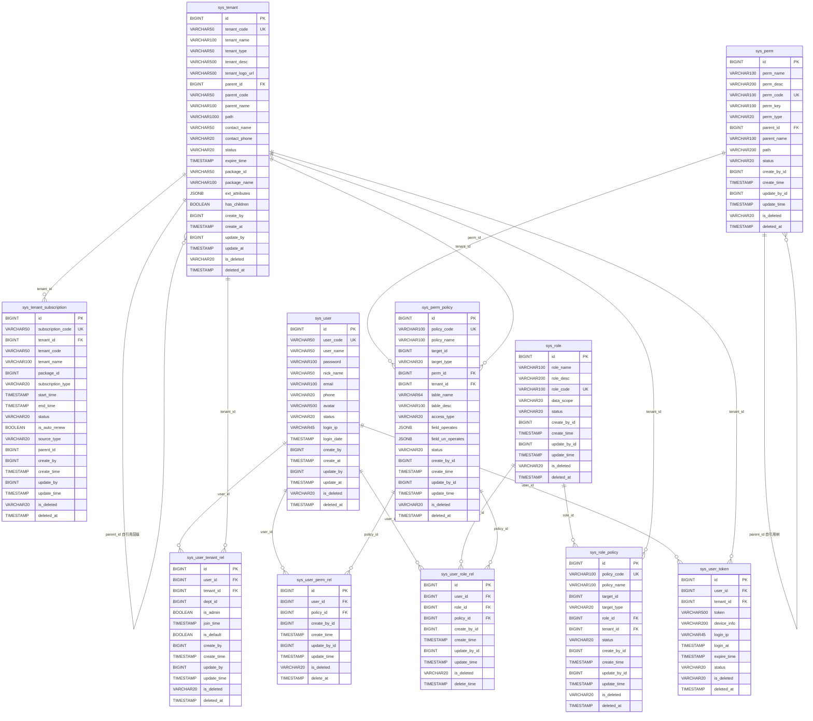

# NexusIX-Platform 数据库设计文档

## 1 文档信息

| 项目 | 内容 |
|------|------|
| 项目名称 | NexusIX-Platform 多租户 SaaS 平台底座 |
| 文档版本 | v1.0.0 |
| 数据库 | PostgreSQL 17+ |
| 创建日期 | 2026-05-23 |
| 最后更新 | 2026-05-23 |
| 作者 | shy |

---

## 2 数据库概述

### 2.1 技术选型

| 项目 | 说明 |
|------|------|
| 数据库 | PostgreSQL 17+ |
| 主键策略 | 雪花算法（Snowflake）生成 BIGINT 分布式唯一 ID |
| 外键约束 | 无物理外键，所有关联关系通过应用层保证数据一致性 |
| 软删除 | `is_deleted` 字段类型为 `VARCHAR(20)`，枚举值 `NOT_DELETED` / `DELETED` |
| 状态字段 | `status` 字段类型为 `VARCHAR(20)`，使用字符串枚举值而非数字编码 |
| 扩展字段 | 使用 PostgreSQL 原生 JSONB 类型存储灵活结构化数据 |

### 2.2 设计原则

1. **雪花 ID 主键**：所有表主键均为 `BIGINT`，由应用层雪花算法生成，保证分布式环境下的 ID 唯一性和趋势递增
2. **无物理外键**：不创建数据库层面的 FOREIGN KEY 约束，关联关系通过应用层 Service 逻辑保证，降低锁争用和级联风险
3. **字符串枚举**：`is_deleted`、`status` 等状态字段采用 `VARCHAR(20)` 存储可读性强的字符串枚举值，配合 MyBatis-Plus `@EnumValue` 注解实现自动映射
4. **JSONB 扩展**：利用 PostgreSQL 原生 JSONB 类型存储动态属性，支持 GIN 索引高效查询
5. **冗余字段**：关联表中适当冗余名称字段（如 `tenant_code`、`tenant_name`），减少高频查询的 JOIN 操作
6. **审计字段**：所有表均包含创建人、创建时间、更新人、更新时间、逻辑删除标记、删除时间等审计字段

### 2.3 表清单

| 序号 | 表名 | 说明 | 所属模块 |
|------|------|------|----------|
| 1 | sys_tenant | 租户信息表 | nexusix-tenant |
| 2 | sys_tenant_subscription | 租户套餐订阅表 | nexusix-tenant |
| 3 | sys_user | 用户基础表 | nexusix-iam |
| 4 | sys_user_tenant_rel | 用户-租户关联表 | nexusix-iam |
| 5 | sys_perm | 权限/资源表 | nexusix-iam |
| 6 | sys_perm_policy | 权限策略控制表 | nexusix-iam |
| 7 | sys_user_perm_rel | 用户权限表 | nexusix-iam |
| 8 | sys_role | 角色表 | nexusix-org |
| 9 | sys_role_policy | 角色策略控制表 | nexusix-org |
| 10 | sys_user_role_rel | 用户角色关联表 | nexusix-org |
| 11 | sys_user_token | 用户 Token 记录表 | nexusix-iam |

---

## 3 ER 关系图



---

## 4 表详细设计

### 4.1 sys_tenant — 租户信息表

存储租户基础信息，支持无限层级树形结构。

| 字段名 | 类型 | 约束 | 默认值 | 说明 |
|--------|------|------|--------|------|
| id | BIGINT | NOT NULL, PK | — | 雪花算法主键 |
| tenant_code | VARCHAR(50) | NOT NULL | — | 租户唯一编码 |
| tenant_name | VARCHAR(100) | NOT NULL | — | 租户名称 |
| tenant_type | VARCHAR(50) | NOT NULL | — | 租户类型（行业分类） |
| tenant_desc | VARCHAR(500) | NOT NULL | — | 租户描述 |
| tenant_logo_url | VARCHAR(500) | NOT NULL | — | 租户 Logo 路径 |
| parent_id | BIGINT | NOT NULL | — | 父租户 ID，顶级为 0 |
| parent_code | VARCHAR(50) | NOT NULL | — | 父租户编码（冗余） |
| parent_name | VARCHAR(100) | NOT NULL | — | 父租户名称（冗余） |
| path | VARCHAR(1000) | NOT NULL | — | 祖级路径，如 `rootTenant/GROUP001/EAST001` |
| contact_name | VARCHAR(50) | NOT NULL | — | 联系人姓名 |
| contact_phone | VARCHAR(20) | NOT NULL | — | 联系人电话 |
| status | VARCHAR(20) | NOT NULL | — | 状态：ENABLED / DISABLED / EXPIRED |
| expire_time | TIMESTAMP | NOT NULL | — | 服务过期时间 |
| package_id | VARCHAR(50) | NOT NULL | — | 当前主套餐 ID |
| package_name | VARCHAR(100) | NOT NULL | — | 当前主套餐名称（冗余） |
| ext_attributes | JSONB | — | `'{}'::jsonb` | 扩展属性（行业特定配置） |
| has_children | BOOLEAN | NOT NULL | — | 是否有子租户 |
| create_by | BIGINT | NOT NULL | — | 创建人 ID |
| create_at | TIMESTAMP | — | CURRENT_TIMESTAMP | 创建时间 |
| update_by | BIGINT | NOT NULL | — | 更新人 ID |
| update_at | TIMESTAMP | — | CURRENT_TIMESTAMP | 更新时间 |
| is_deleted | VARCHAR(20) | NOT NULL | — | 逻辑删除：NOT_DELETED / DELETED |
| deleted_at | TIMESTAMP | — | NULL | 删除时间 |

### 4.2 sys_tenant_subscription — 租户套餐订阅表

记录租户购买的套餐及订阅状态，支持续费、升级、降级等操作。

| 字段名 | 类型 | 约束 | 默认值 | 说明 |
|--------|------|------|--------|------|
| id | BIGINT | NOT NULL, PK | — | 雪花算法主键 |
| subscription_code | VARCHAR(50) | NOT NULL | — | 订阅编码 |
| tenant_id | BIGINT | NOT NULL | — | 租户 ID |
| tenant_code | VARCHAR(50) | NOT NULL | — | 租户编码（冗余） |
| tenant_name | VARCHAR(100) | NOT NULL | — | 租户名称（冗余） |
| package_id | BIGINT | NOT NULL | — | 套餐产品 ID |
| subscription_type | VARCHAR(20) | NOT NULL | — | 订阅类型：NEW / RENEWAL / UPGRADE / DOWNGRADE |
| start_time | TIMESTAMP | NOT NULL | — | 订阅开始时间 |
| end_time | TIMESTAMP | NOT NULL | — | 订阅结束时间 |
| status | VARCHAR(20) | NOT NULL | — | 状态：ACTIVE / EXPIRED / CANCELLED / PENDING |
| is_auto_renew | BOOLEAN | NOT NULL | — | 是否自动续费 |
| source_type | VARCHAR(20) | NOT NULL | — | 来源类型 |
| parent_id | BIGINT | NOT NULL | — | 父订阅 ID（续费/升级时关联原订阅） |
| create_by | BIGINT | NOT NULL | — | 创建人 ID |
| create_time | TIMESTAMP | — | CURRENT_TIMESTAMP | 创建时间 |
| update_by | BIGINT | NOT NULL | — | 更新人 ID |
| update_time | TIMESTAMP | — | CURRENT_TIMESTAMP | 更新时间 |
| is_deleted | VARCHAR(20) | NOT NULL | — | 逻辑删除：NOT_DELETED / DELETED |
| deleted_at | TIMESTAMP | — | NULL | 删除时间 |

### 4.3 sys_user — 用户基础表

存储系统用户的基础认证信息，用户跨租户共享。

| 字段名 | 类型 | 约束 | 默认值 | 说明 |
|--------|------|------|--------|------|
| id | BIGINT | NOT NULL, PK | — | 雪花算法主键 |
| user_code | VARCHAR(50) | NOT NULL | — | 用户编码 |
| user_name | VARCHAR(50) | NOT NULL | — | 登录用户名 |
| password | VARCHAR(100) | NOT NULL | — | 加密密码（BCrypt） |
| nick_name | VARCHAR(50) | NOT NULL | — | 用户昵称 |
| email | VARCHAR(100) | NOT NULL | — | 邮箱 |
| phone | VARCHAR(20) | NOT NULL | — | 手机号码 |
| avatar | VARCHAR(500) | NOT NULL | — | 头像地址 |
| status | VARCHAR(20) | NOT NULL | — | 状态：ENABLED / DISABLED |
| login_ip | VARCHAR(45) | NOT NULL | — | 最后登录 IP |
| login_date | TIMESTAMP | NOT NULL | — | 最后登录时间 |
| create_by | BIGINT | NOT NULL | — | 创建人 ID |
| create_at | TIMESTAMP | — | CURRENT_TIMESTAMP | 创建时间 |
| update_by | BIGINT | NOT NULL | — | 更新人 ID |
| update_at | TIMESTAMP | — | CURRENT_TIMESTAMP | 更新时间 |
| is_deleted | VARCHAR(20) | NOT NULL | — | 逻辑删除：NOT_DELETED / DELETED |
| deleted_at | TIMESTAMP | — | NULL | 删除时间 |

### 4.4 sys_user_tenant_rel — 用户-租户关联表

用户与租户的多对多关联，记录用户在各租户下的身份信息。

| 字段名 | 类型 | 约束 | 默认值 | 说明 |
|--------|------|------|--------|------|
| id | BIGINT | NOT NULL, PK | — | 雪花算法主键 |
| user_id | BIGINT | NOT NULL | — | 用户 ID |
| tenant_id | BIGINT | NOT NULL | — | 租户 ID |
| dept_id | BIGINT | NOT NULL | — | 部门 ID |
| is_admin | BOOLEAN | NOT NULL | — | 是否为该租户管理员 |
| join_time | TIMESTAMP | — | CURRENT_TIMESTAMP | 加入租户时间 |
| is_default | BOOLEAN | NOT NULL | — | 是否默认租户 |
| create_by | BIGINT | NOT NULL | — | 创建人 ID |
| create_time | TIMESTAMP | — | CURRENT_TIMESTAMP | 创建时间 |
| update_by | BIGINT | NOT NULL | — | 更新人 ID |
| update_time | TIMESTAMP | — | CURRENT_TIMESTAMP | 更新时间 |
| is_deleted | VARCHAR(20) | NOT NULL | — | 逻辑删除：NOT_DELETED / DELETED |
| deleted_at | TIMESTAMP | — | NULL | 删除时间 |

### 4.5 sys_perm — 权限/资源表

权限资源树形结构，支持菜单、按钮、API 等多种权限类型。

| 字段名 | 类型 | 约束 | 默认值 | 说明 |
|--------|------|------|--------|------|
| id | BIGINT | NOT NULL, PK | — | 雪花算法主键 |
| perm_name | VARCHAR(100) | NOT NULL | — | 权限名称 |
| perm_desc | VARCHAR(200) | NOT NULL | — | 权限描述 |
| perm_code | VARCHAR(100) | NOT NULL | — | 权限编码（如 `SYS_USER`） |
| perm_key | VARCHAR(100) | NOT NULL | — | 权限标识（如 `user:list`） |
| perm_type | VARCHAR(20) | NOT NULL | — | 权限类型：MENU / BUTTON / API |
| parent_id | BIGINT | NOT NULL | — | 父权限 ID，顶级为 0 |
| parent_name | VARCHAR(100) | NOT NULL | — | 父权限名称（冗余） |
| path | VARCHAR(200) | NOT NULL | — | 权限路径 |
| status | VARCHAR(20) | NOT NULL | — | 状态：ENABLED / DISABLED |
| create_by_id | BIGINT | NOT NULL | — | 创建人 ID |
| create_time | TIMESTAMP | — | CURRENT_TIMESTAMP | 创建时间 |
| update_by_id | BIGINT | NOT NULL | — | 更新人 ID |
| update_time | TIMESTAMP | — | CURRENT_TIMESTAMP | 更新时间 |
| is_deleted | VARCHAR(20) | NOT NULL | — | 逻辑删除：NOT_DELETED / DELETED |
| deleted_at | TIMESTAMP | — | NULL | 删除时间 |

### 4.6 sys_perm_policy — 权限策略控制表

层级划分与多租户多实例权限配置，实现字段级权限控制。

| 字段名 | 类型 | 约束 | 默认值 | 说明 |
|--------|------|------|--------|------|
| id | BIGINT | NOT NULL, PK | — | 雪花算法主键 |
| policy_code | VARCHAR(100) | NOT NULL | — | 策略编码 |
| policy_name | VARCHAR(100) | NOT NULL | — | 策略名称 |
| target_id | BIGINT | NOT NULL | — | 授权目标 ID |
| target_type | VARCHAR(20) | NOT NULL | — | 授权目标类型：TENANT / ROLE / USER |
| perm_id | BIGINT | NOT NULL | — | 关联权限 ID |
| tenant_id | BIGINT | NOT NULL | — | 租户 ID |
| table_name | VARCHAR(64) | NOT NULL | — | 控制的数据表名 |
| table_desc | VARCHAR(100) | NOT NULL | — | 数据表描述 |
| access_type | VARCHAR(20) | NOT NULL | — | 访问类型：QUERY / CREATE / UPDATE |
| field_operates | JSONB | — | `'{}'::jsonb` | 允许操作的字段 |
| field_un_operates | JSONB | — | `'{}'::jsonb` | 禁止操作的字段 |
| status | VARCHAR(20) | NOT NULL | — | 状态：ACTIVE / INACTIVE |
| create_by_id | BIGINT | NOT NULL | — | 创建人 ID |
| create_time | TIMESTAMP | — | CURRENT_TIMESTAMP | 创建时间 |
| update_by_id | BIGINT | NOT NULL | — | 更新人 ID |
| update_time | TIMESTAMP | — | CURRENT_TIMESTAMP | 更新时间 |
| is_deleted | VARCHAR(20) | NOT NULL | — | 逻辑删除：NOT_DELETED / DELETED |
| deleted_at | TIMESTAMP | — | NULL | 删除时间 |

### 4.7 sys_user_perm_rel — 用户权限表

用户与权限策略的直接关联，支持绕过角色直接授权。

| 字段名 | 类型 | 约束 | 默认值 | 说明 |
|--------|------|------|--------|------|
| id | BIGINT | NOT NULL, PK | — | 雪花算法主键 |
| user_id | BIGINT | NOT NULL | — | 用户 ID |
| policy_id | BIGINT | NOT NULL | — | 权限策略 ID |
| create_by_id | BIGINT | NOT NULL | — | 创建人 ID |
| create_time | TIMESTAMP | — | CURRENT_TIMESTAMP | 创建时间 |
| update_by_id | BIGINT | NOT NULL | — | 更新人 ID |
| update_time | TIMESTAMP | — | CURRENT_TIMESTAMP | 更新时间 |
| is_deleted | VARCHAR(20) | NOT NULL | — | 逻辑删除：NOT_DELETED / DELETED |
| delete_at | TIMESTAMP | — | CURRENT_TIMESTAMP | 删除时间 |

> **注意**：该表删除时间字段名为 `delete_at`，与其他表的 `deleted_at` 命名不一致。

### 4.8 sys_role — 角色表

定义系统角色，角色在租户范围内生效。

| 字段名 | 类型 | 约束 | 默认值 | 说明 |
|--------|------|------|--------|------|
| id | BIGINT | NOT NULL, PK | — | 雪花算法主键 |
| role_name | VARCHAR(100) | NOT NULL | — | 角色名称 |
| role_desc | VARCHAR(200) | NOT NULL | — | 角色描述 |
| role_code | VARCHAR(100) | NOT NULL | — | 角色编码 |
| data_scope | VARCHAR(20) | NOT NULL | — | 数据权限范围 |
| status | VARCHAR(20) | NOT NULL | — | 状态：ENABLED / DISABLED |
| create_by_id | BIGINT | NOT NULL | — | 创建人 ID |
| create_time | TIMESTAMP | — | CURRENT_TIMESTAMP | 创建时间 |
| update_by_id | BIGINT | NOT NULL | — | 更新人 ID |
| update_time | TIMESTAMP | — | CURRENT_TIMESTAMP | 更新时间 |
| is_deleted | VARCHAR(20) | NOT NULL | — | 逻辑删除：NOT_DELETED / DELETED |
| deleted_at | TIMESTAMP | — | NULL | 删除时间 |

### 4.9 sys_role_policy — 角色策略控制表

角色与权限策略的关联，定义角色在各租户下的策略配置。

| 字段名 | 类型 | 约束 | 默认值 | 说明 |
|--------|------|------|--------|------|
| id | BIGINT | NOT NULL, PK | — | 雪花算法主键 |
| policy_code | VARCHAR(100) | NOT NULL | — | 策略编码 |
| policy_name | VARCHAR(100) | NOT NULL | — | 策略名称 |
| target_id | BIGINT | NOT NULL | — | 授权目标 ID |
| target_type | VARCHAR(20) | NOT NULL | — | 授权目标类型：TENANT / ROLE / USER |
| role_id | BIGINT | NOT NULL | — | 角色 ID |
| tenant_id | BIGINT | NOT NULL | — | 租户 ID |
| status | VARCHAR(20) | NOT NULL | — | 状态：ACTIVE / INACTIVE |
| create_by_id | BIGINT | NOT NULL | — | 创建人 ID |
| create_time | TIMESTAMP | — | CURRENT_TIMESTAMP | 创建时间 |
| update_by_id | BIGINT | NOT NULL | — | 更新人 ID |
| update_time | TIMESTAMP | — | CURRENT_TIMESTAMP | 更新时间 |
| is_deleted | VARCHAR(20) | NOT NULL | — | 逻辑删除：NOT_DELETED / DELETED |
| deleted_at | TIMESTAMP | — | NULL | 删除时间 |

### 4.10 sys_user_role_rel — 用户角色关联表

用户与角色的多对多关联，同时绑定策略上下文。

| 字段名 | 类型 | 约束 | 默认值 | 说明 |
|--------|------|------|--------|------|
| id | BIGINT | NOT NULL, PK | — | 雪花算法主键 |
| user_id | BIGINT | NOT NULL | — | 用户 ID |
| role_id | BIGINT | NOT NULL | — | 角色 ID |
| policy_id | BIGINT | NOT NULL | — | 权限策略 ID |
| create_by_id | BIGINT | NOT NULL | — | 创建人 ID |
| create_time | TIMESTAMP | — | CURRENT_TIMESTAMP | 创建时间 |
| update_by_id | BIGINT | NOT NULL | — | 更新人 ID |
| update_time | TIMESTAMP | — | CURRENT_TIMESTAMP | 更新时间 |
| is_deleted | VARCHAR(20) | NOT NULL | — | 逻辑删除：NOT_DELETED / DELETED |
| delete_time | TIMESTAMP | — | CURRENT_TIMESTAMP | 删除时间 |

> **注意**：该表删除时间字段名为 `delete_time`，与其他表的 `deleted_at` / `delete_at` 命名不一致。

### 4.11 sys_user_token — 用户 Token 记录表

记录用户登录 Token 及会话信息，支持多设备登录管理。

| 字段名 | 类型 | 约束 | 默认值 | 说明 |
|--------|------|------|--------|------|
| id | BIGINT | NOT NULL, PK | — | 雪花算法主键 |
| user_id | BIGINT | NOT NULL | — | 用户 ID |
| tenant_id | BIGINT | NOT NULL | — | 租户 ID |
| token | VARCHAR(500) | NOT NULL | — | Token 值 |
| device_info | VARCHAR(200) | — | `''` | 设备信息 |
| login_ip | VARCHAR(45) | — | `''` | 登录 IP |
| login_at | TIMESTAMP | — | CURRENT_TIMESTAMP | 登录时间 |
| expire_time | TIMESTAMP | NOT NULL | — | 过期时间 |
| status | VARCHAR(20) | NOT NULL | — | 状态：ACTIVE / EXPIRED / REVOKED |
| is_deleted | VARCHAR(20) | NOT NULL | — | 逻辑删除：NOT_DELETED / DELETED |
| deleted_at | TIMESTAMP | — | NULL | 删除时间 |

---

## 5 索引设计

### 5.1 唯一索引

| 表名 | 索引名 | 索引列 | 说明 |
|------|--------|--------|------|
| sys_tenant | uk_tenant_code | tenant_code | 租户编码全局唯一 |
| sys_tenant_subscription | uk_subscription_code | subscription_code | 订阅编码全局唯一 |
| sys_user | uk_user_code | user_code | 用户编码全局唯一 |
| sys_user | uk_user_name | user_name | 登录用户名全局唯一 |
| sys_perm | uk_perm_code | perm_code | 权限编码全局唯一 |
| sys_perm_policy | uk_policy_code | policy_code | 策略编码全局唯一 |
| sys_role | uk_role_code | role_code | 角色编码全局唯一 |
| sys_role_policy | uk_role_policy_code | policy_code | 角色策略编码全局唯一 |

### 5.2 普通索引

| 表名 | 索引名 | 索引列 | 说明 |
|------|--------|--------|------|
| sys_tenant | idx_tenant_parent_id | parent_id | 加速树形层级查询 |
| sys_tenant | idx_tenant_status | status | 按状态筛选租户 |
| sys_tenant_subscription | idx_sub_tenant_id | tenant_id | 按租户查订阅 |
| sys_tenant_subscription | idx_sub_status | status | 按状态筛选订阅 |
| sys_tenant_subscription | idx_sub_end_time | end_time | 过期扫描 |
| sys_user | idx_user_status | status | 按状态筛选用户 |
| sys_user | idx_user_email | email | 按邮箱查询用户 |
| sys_user | idx_user_phone | phone | 按手机号查询用户 |
| sys_user_tenant_rel | idx_utr_user_id | user_id | 按用户查租户列表 |
| sys_user_tenant_rel | idx_utr_tenant_id | tenant_id | 按租户查用户列表 |
| sys_user_tenant_rel | idx_utr_user_tenant | user_id, tenant_id | 用户-租户联合查询 |
| sys_perm | idx_perm_parent_id | parent_id | 加速权限树查询 |
| sys_perm | idx_perm_type | perm_type | 按权限类型筛选 |
| sys_perm_policy | idx_pp_perm_id | perm_id | 按权限查策略 |
| sys_perm_policy | idx_pp_tenant_id | tenant_id | 按租户查策略 |
| sys_perm_policy | idx_pp_target | target_type, target_id | 按目标查策略 |
| sys_user_perm_rel | idx_upr_user_id | user_id | 按用户查权限策略 |
| sys_user_perm_rel | idx_upr_policy_id | policy_id | 按策略查用户 |
| sys_role | idx_role_status | status | 按状态筛选角色 |
| sys_role_policy | idx_rp_role_id | role_id | 按角色查策略 |
| sys_role_policy | idx_rp_tenant_id | tenant_id | 按租户查角色策略 |
| sys_user_role_rel | idx_urr_user_id | user_id | 按用户查角色 |
| sys_user_role_rel | idx_urr_role_id | role_id | 按角色查用户 |
| sys_user_role_rel | idx_urr_policy_id | policy_id | 按策略查关联 |
| sys_user_token | idx_token_user_id | user_id | 按用户查 Token |
| sys_user_token | idx_token_tenant_id | tenant_id | 按租户查 Token |
| sys_user_token | idx_token_expire_time | expire_time | 过期清理扫描 |

### 5.3 GIN 索引（JSONB 字段）

| 表名 | 索引名 | 索引列 | 说明 |
|------|--------|--------|------|
| sys_tenant | idx_tenant_ext_attributes_gin | ext_attributes | 加速扩展属性 JSONB 查询 |
| sys_perm_policy | idx_pp_field_operates_gin | field_operates | 加速允许字段 JSONB 查询 |
| sys_perm_policy | idx_pp_field_un_operates_gin | field_un_operates | 加速禁止字段 JSONB 查询 |

### 5.4 部分索引（WHERE is_deleted）

利用 PostgreSQL 部分索引特性，仅对未删除数据建立索引，减小索引体积并提升查询性能。

| 表名 | 索引名 | 索引列 | WHERE 条件 | 说明 |
|------|--------|--------|------------|------|
| sys_tenant | idx_tenant_code_active | tenant_code | is_deleted = 'NOT_DELETED' | 未删除租户编码唯一 |
| sys_tenant | idx_tenant_status_active | status | is_deleted = 'NOT_DELETED' | 未删除租户状态筛选 |
| sys_user | idx_user_name_active | user_name | is_deleted = 'NOT_DELETED' | 未删除用户名唯一 |
| sys_user | idx_user_status_active | status | is_deleted = 'NOT_DELETED' | 未删除用户状态筛选 |
| sys_user_tenant_rel | idx_utr_user_tenant_active | user_id, tenant_id | is_deleted = 'NOT_DELETED' | 未删除关联查询 |
| sys_perm | idx_perm_code_active | perm_code | is_deleted = 'NOT_DELETED' | 未删除权限编码唯一 |
| sys_perm_policy | idx_pp_policy_code_active | policy_code | is_deleted = 'NOT_DELETED' | 未删除策略编码唯一 |
| sys_role | idx_role_code_active | role_code | is_deleted = 'NOT_DELETED' | 未删除角色编码唯一 |
| sys_user_token | idx_token_user_tenant_active | user_id, tenant_id | is_deleted = 'NOT_DELETED' | 未删除 Token 查询 |

---

## 6 表关系说明

### 6.1 关系总览

| 关系 | 类型 | 关联表 | 关联字段 | 说明 |
|------|------|--------|----------|------|
| 租户 → 子租户 | 一对多（自引用） | sys_tenant | parent_id → id | 支持无限层级树形结构 |
| 租户 → 订阅 | 一对多 | sys_tenant → sys_tenant_subscription | tenant_id → id | 一个租户可拥有多条订阅记录 |
| 用户 ↔ 租户 | 多对多 | sys_user_tenant_rel | user_id, tenant_id | 一个用户可属于多个租户 |
| 权限 → 子权限 | 一对多（自引用） | sys_perm | parent_id → id | 权限树形结构 |
| 权限 → 策略 | 一对多 | sys_perm → sys_perm_policy | perm_id → id | 一个权限可有多条策略 |
| 用户 ↔ 策略 | 多对多 | sys_user_perm_rel | user_id, policy_id | 用户直接绑定策略 |
| 角色 ↔ 策略 | 多对多 | sys_role_policy | role_id, tenant_id | 角色绑定策略（含租户上下文） |
| 用户 ↔ 角色 | 多对多 | sys_user_role_rel | user_id, role_id, policy_id | 用户绑定角色（含策略上下文） |
| 用户 → Token | 一对多 | sys_user_token | user_id, tenant_id | 用户在租户下的会话记录 |

### 6.2 用户-租户 多对多

```
sys_user  1 ──── *  sys_user_tenant_rel  * ──── 1  sys_tenant
```

- 通过 `sys_user_tenant_rel` 中间表关联
- 中间表携带 `is_admin`（是否管理员）、`is_default`（是否默认租户）、`dept_id`（所属部门）等上下文信息
- 用户登录后需选择租户上下文，`is_default = true` 的租户为默认进入租户

### 6.3 用户-角色 多对多

```
sys_user  1 ──── *  sys_user_role_rel  * ──── 1  sys_role
```

- 通过 `sys_user_role_rel` 中间表关联
- 中间表携带 `policy_id`，表示该用户-角色绑定关联的策略上下文
- 角色在租户范围内生效，租户隔离通过 `sys_role_policy.tenant_id` 实现

### 6.4 用户-策略 多对多

```
sys_user  1 ──── *  sys_user_perm_rel  * ──── 1  sys_perm_policy
```

- 通过 `sys_user_perm_rel` 中间表关联
- 支持绕过角色直接为用户授权策略，适用于特殊权限场景
- 策略最终生效需同时满足 `sys_perm_policy.status = 'ACTIVE'`

### 6.5 角色-策略 多对多

```
sys_role  1 ──── *  sys_role_policy  * ──── 1  sys_perm_policy
```

- 通过 `sys_role_policy` 中间表关联
- 每条关联记录携带 `tenant_id`，实现同一角色在不同租户下拥有不同策略
- `target_type` + `target_id` 定义策略的授权目标层级

### 6.6 权限解析链路

```
用户登录 → 查询 sys_user_role_rel（获取角色列表）
        → 查询 sys_role_policy（获取角色关联策略）
        → 查询 sys_user_perm_rel（获取用户直接策略）
        → 合并策略 → 查询 sys_perm_policy（获取策略详情）
        → 查询 sys_perm（获取权限资源信息）
        → 构建用户权限集
```

---

## 7 数据字典

### 7.1 通用枚举

#### is_deleted — 逻辑删除标记

| 枚举值 | 说明 | 适用表 |
|--------|------|--------|
| NOT_DELETED | 未删除 | 所有表 |
| DELETED | 已删除 | 所有表 |

> 对应 Java 枚举：`GlobalEnum.Deleted`

#### status — 通用状态（用户/权限/角色）

| 枚举值 | 说明 | 适用表 |
|--------|------|--------|
| ENABLED | 启用 | sys_user, sys_perm, sys_role |
| DISABLED | 禁用 | sys_user, sys_perm, sys_role |

> 对应 Java 枚举：`GlobalEnum.PermStatus`

### 7.2 租户相关枚举

#### TenantStatus — 租户状态

| 枚举值 | 说明 |
|--------|------|
| ENABLED | 启用 |
| DISABLED | 停用 |
| EXPIRED | 过期 |

> 对应 Java 枚举：`GlobalEnum.TenantStatus`

#### SubscriptionStatus — 订阅状态

| 枚举值 | 说明 |
|--------|------|
| ACTIVE | 生效中 |
| EXPIRED | 已过期 |
| CANCELLED | 已取消 |
| PENDING | 待生效 |

> 对应 Java 枚举：`GlobalEnum.SubscriptionStatus`

#### SubscriptionType — 订阅类型

| 枚举值 | 说明 |
|--------|------|
| NEW | 新订阅 |
| RENEWAL | 续费 |
| UPGRADE | 升级 |
| DOWNGRADE | 降级 |

> 对应 Java 枚举：`GlobalEnum.SubscriptionType`

### 7.3 权限策略相关枚举

#### PermPolicyStatus — 策略状态

| 枚举值 | 说明 |
|--------|------|
| ACTIVE | 生效 |
| INACTIVE | 失效 |

> 对应 Java 枚举：`GlobalEnum.PermPolicyStatus`

#### PermPolicyTargetType — 策略目标类型

| 枚举值 | 说明 |
|--------|------|
| TENANT | 租户级策略 |
| ROLE | 角色级策略 |
| USER | 用户级策略 |

> 对应 Java 枚举：`GlobalEnum.PermPolicyTargetType`

#### PermPolicyAccessType — 访问类型

| 枚举值 | 说明 |
|--------|------|
| QUERY | 查询 |
| CREATE | 新增 |
| UPDATE | 更新 |

> 对应 Java 枚举：`GlobalEnum.PermPolicyAccessType`

### 7.4 其他枚举

#### perm_type — 权限类型

| 枚举值 | 说明 |
|--------|------|
| MENU | 菜单权限 |
| BUTTON | 按钮权限 |
| API | 接口权限 |

#### data_scope — 数据权限范围

| 枚举值 | 说明 |
|--------|------|
| ALL | 全部数据 |
| DEPT | 本部门数据 |
| DEPT_AND_SUB | 本部门及下级数据 |
| SELF | 仅本人数据 |
| CUSTOM | 自定义数据 |

#### source_type — 订阅来源类型

| 枚举值 | 说明 |
|--------|------|
| DIRECT | 直接购买 |
| ADMIN_ASSIGN | 管理员分配 |
| PARENT_GRANT | 上级租户授予 |

#### TokenStatus — Token 状态

| 枚举值 | 说明 |
|--------|------|
| ACTIVE | 有效 |
| EXPIRED | 已过期 |
| REVOKED | 已撤销 |

---

## 8 JSONB 字段使用规范

### 8.1 sys_tenant.ext_attributes

租户扩展属性，存储行业特定配置和自定义元数据。

**Schema 定义：**

```json
{
  "type": "object",
  "properties": {
    "industry": {
      "type": "string",
      "description": "行业分类标识"
    },
    "quota": {
      "type": "integer",
      "description": "配额限制"
    },
    "custom_fields": {
      "type": "object",
      "description": "自定义扩展字段",
      "additionalProperties": true
    },
    "features": {
      "type": "array",
      "description": "启用的特性列表",
      "items": {
        "type": "string"
      }
    }
  },
  "additionalProperties": true
}
```

**示例数据：**

```json
{
  "industry": "tech",
  "quota": 100,
  "custom_fields": {
    "region": "east",
    "level": "premium"
  },
  "features": ["sso", "audit_log", "data_export"]
}
```

**查询示例：**

```sql
SELECT * FROM sys_tenant WHERE ext_attributes @> '{"industry": "tech"}' AND is_deleted = 'NOT_DELETED';
SELECT * FROM sys_tenant WHERE ext_attributes->>'quota' > '50' AND is_deleted = 'NOT_DELETED';
```

### 8.2 sys_perm_policy.field_operates

权限策略允许操作的字段列表，按访问类型分组。

**Schema 定义：**

```json
{
  "type": "object",
  "properties": {
    "QUERY": {
      "type": "array",
      "description": "查询时允许访问的字段",
      "items": { "type": "string" }
    },
    "CREATE": {
      "type": "array",
      "description": "新增时允许操作的字段",
      "items": { "type": "string" }
    },
    "UPDATE": {
      "type": "array",
      "description": "更新时允许操作的字段",
      "items": { "type": "string" }
    }
  },
  "additionalProperties": {
    "type": "array",
    "items": { "type": "string" }
  }
}
```

**示例数据：**

```json
{
  "QUERY": ["id", "user_name", "nick_name", "email", "phone", "status"],
  "CREATE": ["user_name", "nick_name", "email", "phone"],
  "UPDATE": ["nick_name", "email", "phone"]
}
```

**查询示例：**

```sql
SELECT * FROM sys_perm_policy
WHERE field_operates @> '{"QUERY": ["email"]}'
  AND is_deleted = 'NOT_DELETED';
```

### 8.3 sys_perm_policy.field_un_operates

权限策略禁止操作的字段列表，结构与 `field_operates` 相同。禁止字段优先级高于允许字段，即同一字段同时出现在 `field_operates` 和 `field_un_operates` 时，以禁止为准。

**Schema 定义：**

与 `field_operates` 结构一致。

**示例数据：**

```json
{
  "QUERY": ["password", "is_deleted"],
  "CREATE": ["id", "create_at", "update_at"],
  "UPDATE": ["id", "user_code", "create_at", "create_by"]
}
```

### 8.4 JSONB 使用规范

| 规范项 | 说明 |
|--------|------|
| 默认值 | 所有 JSONB 字段默认值为 `'{}'::jsonb`，不允许 NULL |
| 空值处理 | 无数据时写入 `{}`，不使用 NULL |
| 键名规范 | 使用大写蛇形命名（与枚举值风格一致），如 `QUERY`、`CREATE` |
| 查询方式 | 使用 PostgreSQL JSONB 操作符 `@>`（包含）、`->>`（文本提取）、`?`（键存在） |
| 索引策略 | 所有 JSONB 字段均创建 GIN 索引，支持 `@>` 和 `?` 操作符的高效查询 |
| 数据校验 | 应用层负责 JSONB 数据的 Schema 校验，数据库层不做 CHECK 约束 |
| 大小限制 | 单个 JSONB 字段数据建议不超过 10KB，超大数据应拆分为独立表 |

---

## 9 多租户数据隔离策略

### 9.1 隔离模型

NexusIX-Platform 采用 **共享数据库 + 共享 Schema** 的多租户隔离模型，通过 `tenant_id` 列实现行级数据隔离。

### 9.2 隔离机制

#### 租户隔离表

以下表包含 `tenant_id` 列，查询时必须携带租户条件：

| 表名 | tenant_id 列 | 隔离方式 | 说明 |
|------|-------------|----------|------|
| sys_tenant | — | 自身即租户 | 通过 `id` 字段标识租户，`parent_id` 构建层级 |
| sys_tenant_subscription | tenant_id | 行级隔离 | 按租户隔离订阅数据 |
| sys_user_tenant_rel | tenant_id | 行级隔离 | 按租户隔离用户-租户关联 |
| sys_perm_policy | tenant_id | 行级隔离 | 按租户隔离权限策略 |
| sys_role_policy | tenant_id | 行级隔离 | 按租户隔离角色策略 |
| sys_user_token | tenant_id | 行级隔离 | 按租户隔离会话记录 |

#### 忽略表清单（无需租户隔离）

以下表不含 `tenant_id` 列，为全局共享数据：

| 表名 | 原因 |
|------|------|
| sys_user | 用户跨租户共享，同一用户可属于多个租户 |
| sys_perm | 权限资源为系统级定义，所有租户共享同一套权限树 |
| sys_role | 角色定义全局共享，通过 `sys_role_policy.tenant_id` 实现租户级策略差异 |
| sys_user_perm_rel | 用户直接策略关联，租户隔离通过 `sys_perm_policy.tenant_id` 间接实现 |
| sys_user_role_rel | 用户角色关联，租户隔离通过 `sys_role_policy.tenant_id` 间接实现 |

### 9.3 系统级数据

`tenant_id = 0` 表示系统级数据，具有特殊含义：

| 场景 | 说明 |
|------|------|
| 系统预置权限 | `sys_perm_policy` 中 `tenant_id = 0` 的策略为系统预置策略，所有租户可见 |
| 系统预置角色 | `sys_role_policy` 中 `tenant_id = 0` 的策略为系统级角色策略 |
| 平台管理员 | `sys_user_token` 中 `tenant_id = 0` 表示平台级管理会话 |
| 超级管理 | `sys_user_tenant_rel` 中 `is_admin = true` 且对应租户的顶级租户表示超级管理员 |

### 9.4 隔离实现方式

#### MyBatis-Plus 租户插件

通过 MyBatis-Plus `TenantLineInnerInterceptor` 实现自动拼接 `tenant_id` 条件：

- **SELECT**：自动追加 `WHERE tenant_id = ?`
- **INSERT**：自动填充 `tenant_id` 字段
- **UPDATE**：自动追加 `WHERE tenant_id = ?`
- **DELETE**：自动追加 `WHERE tenant_id = ?`（逻辑删除场景）

#### 忽略表配置

```java
TenantLineInnerInterceptor interceptor = new TenantLineInnerInterceptor();
interceptor.setIgnoreTables(
    "sys_user",
    "sys_perm",
    "sys_role",
    "sys_user_perm_rel",
    "sys_user_role_rel"
);
```

#### 租户上下文传递

1. 用户登录时，从 Token 中解析 `tenant_id`
2. 通过 `TenantContext`（ThreadLocal）在请求线程中传递当前租户 ID
3. MyBatis-Plus 租户插件从 `TenantContext` 获取当前租户 ID 并自动拼接 SQL
4. 切换租户时更新 `TenantContext` 并刷新 Token

### 9.5 跨租户查询规范

| 场景 | 处理方式 |
|------|----------|
| 用户查询所属租户列表 | 查询 `sys_user_tenant_rel`（忽略租户插件），按 `user_id` 过滤 |
| 平台管理员查看所有租户 | 使用 `@DataScope` 注解跳过租户隔离 |
| 租户层级继承 | 子租户可继承父租户的权限策略，通过 `sys_perm_policy.target_type = 'TENANT'` + `target_id` 链路实现 |
| 系统预置数据 | `tenant_id = 0` 的数据对所有租户可见，租户插件需特殊处理 |
