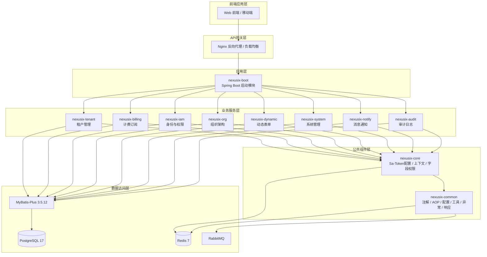
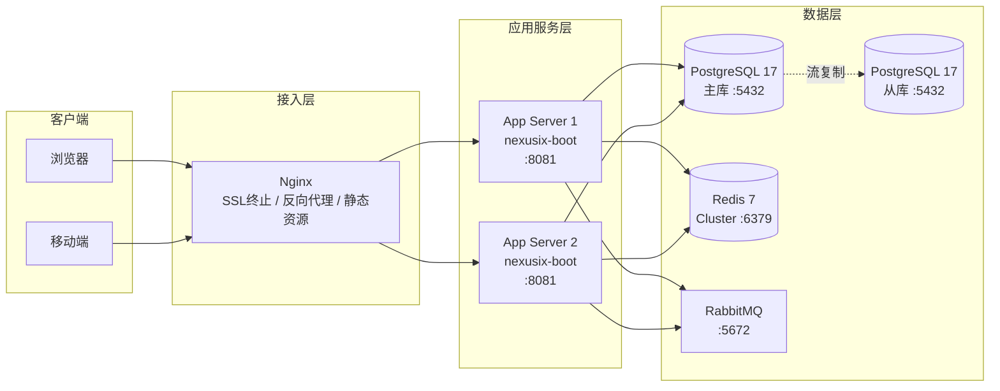
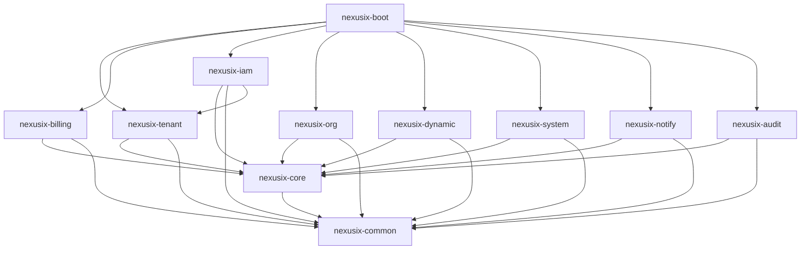
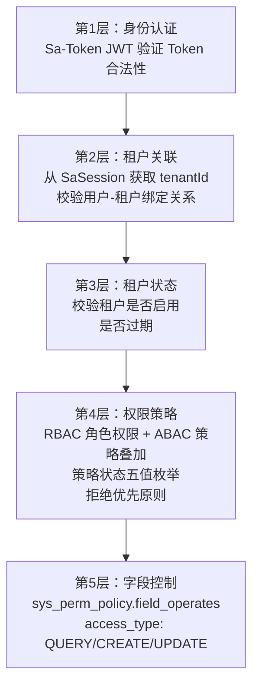

# NexusIX-Platform 概要设计说明书

---

## 1 文档信息

| 项目 | 内容 |
|------|------|
| 项目名称 | NexusIX-Platform 多租户 SaaS 平台底座 |
| 文档版本 | V2.0 |
| 编写日期 | 2026-06-09 |
| 文档状态 | 初稿 |
| 技术栈 | Spring Boot 3.3.4 + MyBatis-Plus 3.5.12 + PostgreSQL 17 + Sa-Token 1.42.0 + Redis 7 |

---

## 2 系统概述

### 2.1 产品定位

NexusIX-Platform 是面向企业级应用的多租户 SaaS 平台底座，提供租户管理、身份认证与权限控制、组织架构、计费订阅、消息通知、审计日志等基础能力。平台以"开箱即用"为目标，使上层业务系统能够快速构建在统一的租户隔离与权限体系之上，降低重复开发成本。

### 2.2 技术目标

| 目标 | 说明 |
|------|------|
| 高内聚低耦合 | Maven 多模块分层，业务模块间无直接依赖，通过 common/core 公共层解耦 |
| 多租户隔离 | 共享数据库 + 行级隔离（TenantLineInnerInterceptor），租户数据逻辑隔离，公共表忽略租户过滤 |
| 可扩展性 | 模块化架构支持水平扩展业务模块，JSONB 扩展字段支持灵活业务建模 |
| 开发效率 | 统一响应封装、AOP 注解驱动（数据权限/操作日志/限流/防重）、MapStruct 编译期映射、Knife4j 文档自动生成 |
| 安全性 | 五层级认证链路、RBAC+ABAC 混合权限、字段级权限控制、BCrypt/Argon2 密码加密、全链路审计 |

---

## 3 系统架构设计

### 3.1 逻辑架构图



### 3.2 物理部署架构图



### 3.3 Maven 多模块结构

```
nexusix-platform (pom)
├── nexusix-common          # 公共基础层：注解、AOP、配置、工具、异常、响应
├── nexusix-core            # 核心层：Sa-Token 配置、上下文、字段权限实体
├── nexusix-tenant          # 租户管理：租户 CRUD、租户树、订阅管理
├── nexusix-billing         # 计费订阅：套餐、配额、账单
├── nexusix-iam             # 身份与权限：认证、用户、权限、策略
├── nexusix-org             # 组织架构：部门、岗位、角色、用户组
├── nexusix-dynamic         # 动态表单：自定义表单、字段配置
├── nexusix-system          # 系统管理：字典、配置、文件、菜单
├── nexusix-notify          # 消息通知：站内信、模板、定时消息
├── nexusix-audit           # 审计日志：操作日志、数据变更审计
└── nexusix-boot            # 启动模块：聚合所有模块、配置文件、启动入口
```

---

## 4 模块划分与职责

### 4.1 模块职责明细

#### nexusix-common — 公共基础层

| 项目 | 说明 |
|------|------|
| 包路径 | `com.shy.nexusix.common` |
| 负责数据表 | 无（纯工具/配置层） |
| 核心功能 | 统一响应 `ApiResponse`、全局异常处理、自定义注解（`@DataScope`/`@OperationLog`/`@RateLimit`/`@RepeatSubmit`/`@EnumField`）、AOP 切面（数据权限/操作日志/限流/防重）、MyBatis-Plus 全局配置（多租户插件/分页/乐观锁/防全表更新）、Redis 配置、Fastjson2 配置、Knife4j 文档配置、全局常量、枚举基类、工具类 |

#### nexusix-core — 核心层

| 项目 | 说明 |
|------|------|
| 包路径 | `com.shy.nexusix.core` |
| 负责数据表 | 无（上下文/配置层） |
| 核心功能 | Sa-Token JWT Simple 模式配置（`StpLogicJwtForSimple`）、`TenantContext` 租户上下文（从 SaSession 获取租户信息）、`UserContext` 用户上下文（用户ID/权限/角色/有效与禁用权限分层）、`ColumnPerm` 字段权限实体（query/create/update 三维度字段控制） |

#### nexusix-tenant — 租户管理

| 项目 | 说明 |
|------|------|
| 包路径 | `com.shy.nexusix.tenant` |
| 负责数据表 | `sys_tenant`、`sys_tenant_subscription`、`sys_tenant_security`、`sys_tenant_config`、`sys_industry_template`、`sys_form_template` |
| 核心功能 | 租户 CRUD、租户树形结构管理（parent_id/path，路径格式为ID路径如 `/1/2/3/`）、租户状态管理、套餐订阅管理（订阅类型/自动续费/来源类型）、租户安全策略配置（密码策略/登录锁定策略）、租户配置管理、行业模板管理、表单模板管理、租户扩展属性（JSONB `ext_attributes`）、MapStruct Converter |

#### nexusix-billing — 计费订阅

| 项目 | 说明 |
|------|------|
| 包路径 | `com.shy.nexusix.billing` |
| 负责数据表 | `prod_package`、`prod_package_quota`、`sys_tenant_quota_adjustment`、`sys_resource_usage`、`bill_order`、`bill_invoice` |
| 核心功能 | 套餐产品定义与上下架管理、配额模板管理、租户配额调整与用量统计、订单管理（创建/支付/取消）、发票管理（开具/作废/邮寄）、账单生成 |

#### nexusix-iam — 身份与权限

| 项目 | 说明 |
|------|------|
| 包路径 | `com.shy.nexusix.iam` |
| 负责数据表 | `sys_user`、`sys_user_tenant_rel`、`sys_perm`、`sys_perm_policy`、`sys_user_perm_rel`、`sys_user_token` |
| 核心功能 | 用户注册/登录认证、用户-租户关联管理、权限/资源树管理、权限策略控制（字段级 `field_operates` JSONB 数组）、用户权限关联、Token 记录管理 |

#### nexusix-org — 组织架构

| 项目 | 说明 |
|------|------|
| 包路径 | `com.shy.nexusix.org` |
| 负责数据表 | `sys_dept`、`sys_post`、`sys_role`、`sys_role_policy`、`sys_user_role_rel`、`sys_role_dept_rel`、`sys_user_group`、`sys_user_group_rel` |
| 核心功能 | 部门树管理（parent_id/path，ID路径格式如 `/1/2/3/`）、岗位管理（岗位CRUD/岗位与部门关联）、角色管理、角色策略控制、用户-角色关联、用户组管理（用户组CRUD/成员管理）、角色-部门数据权限关联、数据范围控制 |

#### nexusix-dynamic — 动态表单

| 项目 | 说明 |
|------|------|
| 包路径 | `com.shy.nexusix.dynamic` |
| 负责数据表 | `sys_form_config`、`sys_datasource_config`、`sys_print_template` |
| 核心功能 | 表单配置管理（自定义表单设计/字段配置/版本管理/JSONB form_schema）、数据源配置管理（业务表/API接口/字典/SQL查询多类型数据源）、打印模板管理（模板设计/模板内容/模板配置）、表单数据存储与查询 |

#### nexusix-system — 系统管理

| 项目 | 说明 |
|------|------|
| 包路径 | `com.shy.nexusix.system` |
| 负责数据表 | `sys_menu`、`sys_dict`、`sys_dict_item`、`sys_file`、`sys_notice`、`sys_notice_user_rel` |
| 核心功能 | 菜单管理（菜单树/权限标识/路由配置）、字典管理（字典类型/字典数据）、文件上传/存储（本地/OSS/MinIO）、系统公告管理（公告发布/已读未读状态追踪） |

#### nexusix-notify — 消息通知

| 项目 | 说明 |
|------|------|
| 包路径 | `com.shy.nexusix.notify` |
| 负责数据表 | `sys_message_template`、`sys_inbox_message`、`sys_message_schedule`（规划中） |
| 核心功能 | 消息模板管理、站内信收发、定时消息调度 |

#### nexusix-audit — 审计日志

| 项目 | 说明 |
|------|------|
| 包路径 | `com.shy.nexusix.audit` |
| 负责数据表 | `sys_oper_log`、`sys_login_log`、`sys_data_audit_log` |
| 核心功能 | 操作日志记录（`@OperationLog` 注解驱动，记录操作人/操作类型/请求参数/响应结果/耗时）、登录日志记录（登录IP/设备信息/登录时间/登录结果）、数据变更审计（对比更新前后数据差异，记录字段级变更） |

#### nexusix-boot — 启动模块

| 项目 | 说明 |
|------|------|
| 包路径 | `com.shy.nexusix.boot` |
| 负责数据表 | 无 |
| 核心功能 | Spring Boot 启动入口（`NexusixBootApplication`）、聚合所有业务模块依赖、多环境配置（dev/prod）、Jasypt 配置加密 |

### 4.2 模块依赖关系图



### 4.3 依赖原则

| 层级 | 模块 | 依赖规则 |
|------|------|----------|
| 公共基础层 | `nexusix-common` | 无项目内部依赖，被所有模块依赖；提供注解、AOP、配置、工具、异常、响应等基础能力 |
| 核心层 | `nexusix-core` | 仅依赖 `nexusix-common`；提供 Sa-Token 配置、上下文工具、字段权限实体等核心能力 |
| 业务模块层 | `nexusix-tenant/billing/iam/org/dynamic/system/notify/audit` | 依赖 `nexusix-core` + `nexusix-common`；业务模块间原则上不直接依赖（`nexusix-iam` 对 `nexusix-tenant` 的依赖为例外，用于认证时关联租户） |
| 启动层 | `nexusix-boot` | 聚合所有业务模块，作为唯一启动入口；不包含业务逻辑 |

---

## 5 技术选型与理由

### 5.1 技术选型总览

| 技术 | 版本 | 选型理由 |
|------|------|----------|
| Java | 17 LTS | 长期支持版本，提供 sealed classes、pattern matching、records 等现代语法特性，生态成熟 |
| Spring Boot | 3.3.4 | 基于 Spring Framework 6，支持 Jakarta EE 10、虚拟线程（Loom），社区活跃，安全补丁及时 |
| MyBatis-Plus | 3.5.12 | 原生支持多租户插件（`TenantLineInnerInterceptor`）、逻辑删除、分页插件、乐观锁；SQL 可控性强，适合复杂查询场景 |
| PostgreSQL | 17+ | 原生 JSONB 类型支持灵活扩展字段、GIN 索引加速 JSON 查询、行级安全策略（RLS）可作为租户隔离补充、强大的窗口函数与 CTE 支持 |
| Redis | 7+ | Sa-Token 会话持久化、业务缓存（权限/字典/配额）、分布式锁；Sa-Token 使用独立 Redis 数据库（database:1）与业务缓存（database:0）隔离 |
| Sa-Token | 1.42.0 | 轻量级权限认证框架，JWT 开箱即用（Simple 模式）、多租户会话天然支持、学习曲线低、API 简洁 |
| MapStruct | 1.5.2.Final | 编译期生成映射代码，零反射开销，类型安全，与 Lombok 通过 `lombok-mapstruct-binding` 兼容 |
| Lombok | 1.18.36 | 编译期生成 getter/setter/builder/构造函数，减少样板代码 |
| Fastjson2 | 2.0.54 | 替代 Jackson，性能优异，Spring 6 适配，Sa-Token 原生集成 |
| Knife4j | 4.5.0 | OpenAPI 3 + Swagger UI 增强，支持 Spring Boot 3，中文友好 |
| RabbitMQ | 3.x | 消息队列，支持异步通知、审计日志异步写入、定时消息调度 |
| Jasypt | 3.0.5 | 配置文件敏感信息加密（`ENC()` 包裹），支持 PBEWITHHMACSHA512ANDAES_256 算法 |

### 5.2 Sa-Token vs Spring Security 对比

| 对比维度 | Sa-Token | Spring Security |
|----------|----------|-----------------|
| 学习曲线 | 低，API 直观（`StpUtil.login()`/`StpUtil.checkPermission()`） | 高，需理解 FilterChain、AuthenticationProvider 等复杂概念 |
| 多租户支持 | 天然支持，Session 可按租户隔离，Token 可携带租户信息 | 需大量自定义，默认无租户概念 |
| JWT 集成 | 开箱即用（`sa-token-jwt`），Simple 模式兼顾无状态验证与会话管理 | 需手动集成 `spring-security-oauth2-resource-server` |
| 权限缓存 | 内置 Redis 集成（`sa-token-redis-template`），权限自动缓存 | 需自行实现 `UserDetailsService` + 缓存层 |
| 踢人下线 | 一行代码 `StpUtil.kickout(userId)` | 需自行实现 Token 存储与失效机制 |
| 代码侵入性 | 低，注解驱动（`@SaCheckLogin`/`@SaCheckPermission`） | 高，需大量配置类与 Filter |
| 文档质量 | 中文文档完善（sa-token.cc） | 英文为主，中文资料碎片化 |

---

## 6 关键技术方案

### 6.1 多租户隔离方案

#### 整体架构

采用**共享数据库 + 行级隔离**模式，通过 MyBatis-Plus `TenantLineInnerInterceptor` 在 SQL 层自动追加 `tenant_id` 条件。

#### 核心组件

| 组件 | 职责 |
|------|------|
| `TenantLineInnerInterceptor` | 拦截 SQL，自动在 WHERE 条件中追加 `tenant_id = ?` |
| `TenantContext` | 基于 SaSession 的租户上下文，提供 `getCurrentTenantId()`/`getCurrentTenantName()` |
| 忽略表配置 | 系统级公共表不追加租户条件，通过 `ignoreTable()` 方法配置 |

#### 忽略租户过滤的表（17 张）

```
sys_tenant, sys_tenant_subscription, sys_tenant_security, sys_tenant_config,
sys_industry_template, sys_form_template,
sys_user, sys_perm, sys_perm_policy, sys_user_perm_rel,
sys_user_tenant_rel, sys_user_token,
sys_role, sys_role_policy, sys_user_role_rel,
sys_login_log, sys_oper_log,
prod_package, prod_package_quota,
sys_dict_item, sys_menu, sys_user_group_rel
```

#### 租户隔离过滤的表（24 张）

```
sys_dept, sys_post, sys_user_group, sys_role_dept_rel,
sys_tenant_quota_adjustment, sys_resource_usage, bill_order, bill_invoice,
sys_form_config, sys_datasource_config, sys_print_template,
sys_dict, sys_file, sys_notice, sys_notice_user_rel,
sys_message_template, sys_inbox_message, sys_message_schedule,
sys_data_audit_log
```

#### 数据流

```
请求 → Sa-Token 获取 userId → SaSession 获取 tenantId
     → TenantContext.getCurrentTenantId()
     → TenantLineInnerInterceptor 自动追加 WHERE tenant_id = ?
     → SQL 执行（仅返回当前租户数据）
```

### 6.2 五层级认证方案



| 层级 | 校验内容 | 实现方式 |
|------|----------|----------|
| 第1层 | 身份认证 | Sa-Token JWT Simple 模式，Token 签名验证 + 过期检查 |
| 第2层 | 租户关联 | `sys_user_tenant_rel` 表校验用户与租户的绑定关系 |
| 第3层 | 租户状态 | `sys_tenant.status` + `sys_tenant.expire_time` 校验 |
| 第4层 | 权限策略 | 角色权限基底 + 策略叠加，拒绝优先；策略状态五值枚举（ACTIVE / DISABLED_SYSTEM_LEVEL / DISABLED_TENANT_LEVEL / DISABLED_ROLE_LEVEL / DISABLED_USER_LEVEL） |
| 第5层 | 字段控制 | `ColumnPerm` 实体控制 query/create/update 三维度可见字段 |

### 6.3 RBAC + ABAC 混合权限模型

#### 模型设计

```
RBAC 基底：用户 → 角色 → 权限（菜单/按钮/接口）
ABAC 叠加：策略（sys_perm_policy / sys_role_policy）→ 属性条件 → 允许/拒绝
```

#### 权限计算规则

| 规则 | 说明 |
|------|------|
| 角色权限基底 | 用户通过角色继承基础权限集合 |
| 策略叠加 | 在角色权限基础上，通过 `sys_perm_policy` 和 `sys_role_policy` 叠加额外权限或限制 |
| 拒绝优先 | 当权限同时出现在允许和拒绝列表时，拒绝生效 |
| 策略状态五值 | 策略状态枚举：`ACTIVE`（生效）、`DISABLED_SYSTEM_LEVEL`（系统级禁用）、`DISABLED_TENANT_LEVEL`（租户级禁用）、`DISABLED_ROLE_LEVEL`（角色级禁用）、`DISABLED_USER_LEVEL`（用户级禁用），禁用层级越高优先级越高 |
| 继承控制 | 租户级策略可覆盖系统级策略，用户级策略可覆盖租户级策略 |

#### 权限层级（UserContext 四级分离）

```
系统级有效权限（validPermSystem）    ← 平台内置，不可覆盖
租户级有效权限（validPermTenant）    ← 租户管理员分配
角色级有效权限（validPermRole）      ← 角色绑定
用户级有效权限（validPermUser）      ← 用户个人授权

租户级禁用权限（invalidPermTenant）  ← 租户级屏蔽
角色级禁用权限（invalidPermRole）    ← 角色级屏蔽
用户级禁用权限（invalidPermUser）    ← 用户级屏蔽
```

### 6.4 数据范围控制

#### DataScope 注解

通过 `@DataScope` 注解声明方法级数据范围控制，由 `DataScopeAspect` 切面拦截并动态拼接 SQL 条件。

#### 数据范围类型

| 类型 | 枚举值 | 说明 |
|------|--------|------|
| 全部数据 | `ALL` | 无数据范围限制 |
| 本部门及以下 | `DEPT_AND_CHILD` | 基于 `dept_id` 和部门树 `path`（ID路径格式如 `/1/2/3/`）过滤 |
| 本部门 | `DEPT_ONLY` | 仅 `dept_id` 匹配 |
| 仅本人 | `SELF_ONLY` | 仅 `user_id` 匹配 |
| 自定义 | `CUSTOM` | 自定义 SQL 片段 |
| 自动判断 | `AUTO` | 根据角色 `data_scope` 字段自动决定 |

#### 注解参数

| 参数 | 默认值 | 说明 |
|------|--------|------|
| `deptAlias` | `"d"` | 部门表别名 |
| `userAlias` | `"u"` | 用户表别名 |
| `deptIdField` | `"dept_id"` | 部门ID字段名 |
| `userIdField` | `"user_id"` | 用户ID字段名 |
| `enabled` | `true` | 是否启用 |
| `scopeType` | `AUTO` | 数据范围类型 |

### 6.5 字段级权限

#### 数据模型

`sys_perm_policy` 表通过 JSONB 字段实现字段级权限控制：

| 字段 | 类型 | 说明 |
|------|------|------|
| `table_name` | `VARCHAR(64)` | 目标数据表名 |
| `access_type` | `VARCHAR(20)` | 操作类型：`QUERY`/`CREATE`/`UPDATE` |
| `field_operates` | `JSONB` | 允许操作的字段集合，数组格式，如 `["id", "user_name", "status"]` |

#### ColumnPerm 实体

```java
// 存储结构：{操作类型: {表名: [字段集合]}}
public class ColumnPerm {
    private Map<String, Set<String>> query;   // 可查询字段
    private Map<String, Set<String>> create;  // 可创建字段
    private Map<String, Set<String>> update;  // 可更新字段
}
```

#### 控制流程

```
请求 → UserContext 获取 ColumnPerm
     → 根据 access_type 匹配操作类型
     → 根据 table_name 匹配目标表
     → field_operates 白名单过滤
     → 拦截/过滤请求字段 或 遮蔽响应字段
```

### 6.6 审计日志方案

#### 操作日志

| 组件 | 说明 |
|------|------|
| `@OperationLog` | 注解标记需记录日志的方法，支持自定义标题、业务类型、操作类型 |
| `OperationLogAspect` | AOP 切面，拦截注解方法，记录请求参数/响应结果/操作人/耗时 |
| `BusinessType` | 业务类型枚举：INSERT/UPDATE/DELETE/GRANT/EXPORT/IMPORT/FORCE/CLEAN/SEARCH |
| `OperatorType` | 操作类型枚举：MANAGE/MOBILE/PORTAL |

#### 数据变更审计

通过 MyBatis-Plus 拦截器或 AOP 对比更新前后数据差异，记录字段级变更。

### 6.7 缓存策略

#### 缓存分层

| 缓存类型 | Redis 数据库 | 用途 |
|----------|-------------|------|
| Sa-Token 会话 | database:1 | Token、Session、权限缓存（`sa-token-redis-template`） |
| 业务缓存 | database:0 | 权限集合、字典数据、配额信息、分布式锁 |

#### Key 设计规范

```
nexusix:perm:{userId}              # 用户权限集合
nexusix:dict:{dictCode}            # 字典数据
nexusix:quota:{tenantId}:{key}     # 租户配额
nexusix:lock:{businessKey}         # 分布式锁
```

#### 失效策略

| 场景 | 策略 |
|------|------|
| 权限变更 | 删除 `nexusix:perm:{userId}`，下次请求从 DB 重新加载 |
| 字典变更 | 删除 `nexusix:dict:{dictCode}`，TTL 兜底 24h |
| 配额变更 | 删除 `nexusix:quota:{tenantId}:{key}`，TTL 兜底 1h |
| 租户状态变更 | Sa-Token `StpUtil.kickout()` 踢出会话 |

---

## 7 接口设计原则

### 7.1 RESTful 规范

| 原则 | 说明 |
|------|------|
| 资源命名 | 使用名词复数，如 `/api/v1/tenants`、`/api/v1/users` |
| HTTP 方法 | `GET` 查询、`POST` 新增、`PUT` 修改、`DELETE` 删除 |
| 版本控制 | URL 路径版本 `/api/v1/`，重大变更升级版本号 |
| 上下文路径 | `server.servlet.context-path: /NexusIxService` |

### 7.2 统一响应格式

```json
{
  "code": 200,
  "msg": "操作成功",
  "data": {}
}
```

| 状态码 | 含义 |
|--------|------|
| 200 | 操作成功 |
| 401 | 未授权（Token 无效/过期） |
| 403 | 禁止访问（权限不足） |
| 404 | 资源不存在 |
| 500 | 服务器内部错误 |

### 7.3 请求/响应模型分层

| 层级 | 后缀 | 说明 |
|------|------|------|
| 请求传输对象 | `RTO` (Request Transfer Object) | 接收前端请求参数，含校验注解 |
| 视图对象 | `VO` (View Object) | 返回前端展示数据，脱敏/裁剪 |
| 数据对象 | `Entity` | 与数据库表一一映射 |
| 转换器 | `Converter` | MapStruct 编译期生成 RTO → Entity → VO 映射 |

---

## 8 数据库设计原则

### 8.1 数据表总览

系统共包含 **41** 张数据表，按模块分组如下：

#### nexusix-tenant — 租户管理（6 张）

| 表名 | 说明 |
|------|------|
| `sys_tenant` | 租户主表 |
| `sys_tenant_subscription` | 租户订阅表 |
| `sys_tenant_security` | 租户安全策略配置表 |
| `sys_tenant_config` | 租户配置表 |
| `sys_industry_template` | 行业模板表 |
| `sys_form_template` | 表单模板表 |

#### nexusix-billing — 计费订阅（6 张）

| 表名 | 说明 |
|------|------|
| `prod_package` | 产品套餐定义表 |
| `prod_package_quota` | 套餐配额模板表 |
| `sys_tenant_quota_adjustment` | 租户配额调整表 |
| `sys_resource_usage` | 资源使用量表 |
| `bill_order` | 订单表 |
| `bill_invoice` | 发票表 |

#### nexusix-iam — 身份与权限（6 张）

| 表名 | 说明 |
|------|------|
| `sys_user` | 用户基础表 |
| `sys_user_tenant_rel` | 用户-租户关联表 |
| `sys_perm` | 权限/资源表 |
| `sys_perm_policy` | 权限策略表 |
| `sys_user_perm_rel` | 用户权限关联表 |
| `sys_user_token` | 用户 Token 记录表 |

#### nexusix-org — 组织架构（8 张）

| 表名 | 说明 |
|------|------|
| `sys_dept` | 部门表 |
| `sys_post` | 岗位表 |
| `sys_role` | 角色表 |
| `sys_role_policy` | 角色策略表 |
| `sys_user_role_rel` | 用户-角色关联表 |
| `sys_role_dept_rel` | 角色-部门数据权限关联表 |
| `sys_user_group` | 用户组表 |
| `sys_user_group_rel` | 用户组成员关联表 |

#### nexusix-dynamic — 动态表单（3 张）

| 表名 | 说明 |
|------|------|
| `sys_form_config` | 动态表单配置表 |
| `sys_datasource_config` | 数据源配置表 |
| `sys_print_template` | 打印模板配置表 |

#### nexusix-system — 系统管理（6 张）

| 表名 | 说明 |
|------|------|
| `sys_menu` | 菜单表 |
| `sys_dict` | 字典类型表 |
| `sys_dict_item` | 字典数据表 |
| `sys_file` | 文件表 |
| `sys_notice` | 系统公告表 |
| `sys_notice_user_rel` | 用户公告阅读状态表 |

#### nexusix-notify — 消息通知（3 张）

| 表名 | 说明 |
|------|------|
| `sys_message_template` | 消息模板表 |
| `sys_inbox_message` | 站内信表 |
| `sys_message_schedule` | 定时消息表 |

#### nexusix-audit — 审计日志（3 张）

| 表名 | 说明 |
|------|------|
| `sys_oper_log` | 操作日志表 |
| `sys_login_log` | 登录日志表 |
| `sys_data_audit_log` | 数据变更审计日志表 |

### 8.2 主键策略

- 采用**雪花算法**生成分布式唯一 ID（`id-type: ASSIGN_ID`）
- 主键类型为 `BIGINT`，避免 UUID 字符串索引性能问题

### 8.2 外键策略

- **无物理外键**，通过应用层保证数据一致性
- 原因：物理外键影响批量操作性能、增加迁移复杂度、不利于分库分表

### 8.3 软删除

- 删除标记字段：`is_deleted VARCHAR(20)`
- 删除时间字段：`deleted_at TIMESTAMP`
- 不使用布尔值的原因：VARCHAR(20) 支持扩展（如标记删除来源、删除原因）

### 8.4 JSONB 扩展字段

| 表 | 字段 | 用途 |
|----|------|------|
| `sys_tenant` | `ext_attributes` | 租户扩展属性（联系方式、行业信息等） |
| `sys_perm_policy` | `field_operates` | 允许操作的字段集合（数组格式） |

- JSONB 查询配合 GIN 索引加速：`CREATE INDEX idx_xxx_gin ON table_name USING gin (jsonb_column)`

### 8.5 公共字段规范

所有业务表包含以下公共字段：

| 字段 | 类型 | 说明 |
|------|------|------|
| `id` | `BIGINT` | 雪花算法主键 |
| `create_by` | `BIGINT` | 创建人ID |
| `create_at` | `TIMESTAMP` | 创建时间 |
| `update_by` | `BIGINT` | 更新人ID |
| `update_at` | `TIMESTAMP` | 更新时间 |
| `is_deleted` | `VARCHAR(20)` | 删除标记 |
| `deleted_at` | `TIMESTAMP` | 删除时间 |

---

## 9 安全设计

### 9.1 密码加密

| 算法 | 场景 | 说明 |
|------|------|------|
| BCrypt | 默认密码加密 | Spring Security 兼容，自带盐值，计算成本可调 |
| Argon2 | 高安全场景 | 2015 年密码哈希竞赛冠军，抗 GPU/ASIC 破解 |

### 9.2 租户安全策略（sys_tenant_security）

通过 `sys_tenant_security` 表为每个租户配置独立的安全策略，支持密码策略和登录锁定策略的租户级差异化管控。

#### 密码策略配置

| 配置项 | 字段 | 默认值 | 说明 |
|--------|------|--------|------|
| 密码最小长度 | `pwd_min_length` | 6 | 密码最小字符数 |
| 密码复杂度 | `pwd_complexity` | `NONE` | 枚举值：`NONE`（无限制）、`LETTER_NUMBER`（字母+数字）、`LETTER_NUMBER_SPECIAL`（字母+数字+特殊字符） |
| 密码过期天数 | `pwd_expire_days` | 0 | 密码过期天数，0 表示永不过期 |

#### 登录锁定策略

| 配置项 | 字段 | 默认值 | 说明 |
|--------|------|--------|------|
| 登录失败锁定次数 | `login_fail_limit` | 5 | 连续登录失败达到该次数后锁定账户 |
| 锁定时长 | `lock_duration` | 30 | 账户锁定时长（分钟），锁定期间禁止登录 |

#### 策略优先级

```
系统默认值（代码硬编码） ← 租户安全策略（sys_tenant_security）覆盖
```

租户创建时自动初始化安全策略记录，租户管理员可按需调整。

### 9.3 数据隔离

| 隔离维度 | 实现方式 |
|----------|----------|
| 租户数据隔离 | `TenantLineInnerInterceptor` 行级隔离，SQL 自动追加 `tenant_id` 条件 |
| 数据范围隔离 | `@DataScope` 注解 + `DataScopeAspect` 切面，按部门/个人过滤 |
| 字段级隔离 | `sys_perm_policy` JSONB 字段控制（`field_operates` 数组格式），`ColumnPerm` 实体三维度过滤 |

### 9.3 Token 管理

| 配置项 | 值 | 说明 |
|--------|-----|------|
| Token 名称 | `NexusIX` | Header 传递 |
| Token 有效期 | 2592000s（30天） | 可按需调整 |
| 活跃超时 | -1（不限制） | 可配置为 7200s |
| 并发登录 | 禁止 | 新登录挤掉旧登录 |
| Token 共享 | 禁止 | 每次登录生成新 Token |
| JWT 模式 | Simple | Token 为 JWT 格式，会话数据存 Redis |
| JWT 密钥 | 环境变量 `JWT_SECRET_KEY` | 禁止硬编码 |

### 9.5 审计日志

- **登录日志**：记录登录 IP、设备信息、登录时间
- **操作日志**：`@OperationLog` 注解驱动，记录操作人、操作类型、请求参数、响应结果、耗时
- **数据变更审计**：对比更新前后数据差异，记录字段级变更

### 9.5 XSS / SQL 注入防护

| 防护类型 | 实现方式 |
|----------|----------|
| SQL 注入 | MyBatis-Plus 参数化查询 + `BlockAttackInnerInterceptor` 拦截无 WHERE 的全表操作 |
| XSS | 输入过滤 + 输出编码，敏感 HTML 标签转义 |
| 防重提交 | `@RepeatSubmit` 注解 + Redis 分布式锁 |
| 接口限流 | `@RateLimit` 注解 + Redis 滑动窗口 |
| 配置加密 | Jasypt `ENC()` 加密敏感配置（数据库密码、Redis 密码等） |

---

## 10 部署架构

### 10.1 Docker 化

每个组件均提供 Dockerfile，支持容器化部署：

```dockerfile
# 应用服务 Dockerfile 示例
FROM eclipse-temurin:17-jre-alpine
WORKDIR /app
COPY nexusix-boot/target/nexusix-boot-1.0-SNAPSHOT.jar app.jar
EXPOSE 8081
ENTRYPOINT ["java", "-jar", "app.jar"]
```

### 10.2 docker-compose 编排

```yaml
version: '3.8'
services:
  nexusix-app:
    build:
      context: .
      dockerfile: Dockerfile
    ports:
      - "8081:8081"
    environment:
      - SPRING_PROFILES_ACTIVE=prod
      - JWT_SECRET_KEY=${JWT_SECRET_KEY}
      - JASYPT_ENCRYPTOR_PASSWORD=${JASYPT_ENCRYPTOR_PASSWORD}
      - SPRING_DATASOURCE_URL=jdbc:postgresql://postgres:5432/NexusIX
      - SPRING_DATASOURCE_USERNAME=${DB_USERNAME}
      - SPRING_DATASOURCE_PASSWORD=${DB_PASSWORD}
      - SPRING_DATA_REDIS_HOST=redis
      - SPRING_DATA_REDIS_PASSWORD=${REDIS_PASSWORD}
    depends_on:
      - postgres
      - redis
      - rabbitmq
    restart: unless-stopped

  postgres:
    image: postgres:17-alpine
    environment:
      - POSTGRES_DB=NexusIX
      - POSTGRES_USER=${DB_USERNAME}
      - POSTGRES_PASSWORD=${DB_PASSWORD}
    volumes:
      - pg_data:/var/lib/postgresql/data
    ports:
      - "5432:5432"
    restart: unless-stopped

  redis:
    image: redis:7-alpine
    command: redis-server --requirepass ${REDIS_PASSWORD}
    volumes:
      - redis_data:/data
    ports:
      - "6379:6379"
    restart: unless-stopped

  rabbitmq:
    image: rabbitmq:3-management-alpine
    environment:
      - RABBITMQ_DEFAULT_USER=${MQ_USERNAME}
      - RABBITMQ_DEFAULT_PASS=${MQ_PASSWORD}
    volumes:
      - mq_data:/var/lib/rabbitmq
    ports:
      - "5672:5672"
      - "15672:15672"
    restart: unless-stopped

  nginx:
    image: nginx:alpine
    volumes:
      - ./nginx/conf.d:/etc/nginx/conf.d
      - ./nginx/ssl:/etc/nginx/ssl
    ports:
      - "80:80"
      - "443:443"
    depends_on:
      - nexusix-app
    restart: unless-stopped

volumes:
  pg_data:
  redis_data:
  mq_data:
```

### 10.3 环境变量

| 变量名 | 说明 | 示例 |
|--------|------|------|
| `JWT_SECRET_KEY` | Sa-Token JWT 签名密钥 | `nexusix-platform-secret-key-2026` |
| `JASYPT_ENCRYPTOR_PASSWORD` | Jasypt 配置解密主密钥 | `0f7b0a5d-46bc-40fd-b8ed-3181d21d644f` |
| `DB_USERNAME` | 数据库用户名 | `postgres` |
| `DB_PASSWORD` | 数据库密码（建议 ENC 加密） | `ENC(xxxxx)` |
| `REDIS_PASSWORD` | Redis 密码 | - |
| `MQ_USERNAME` | RabbitMQ 用户名 | `guest` |
| `MQ_PASSWORD` | RabbitMQ 密码 | `guest` |
| `SPRING_PROFILES_ACTIVE` | 激活的配置文件 | `prod` |
