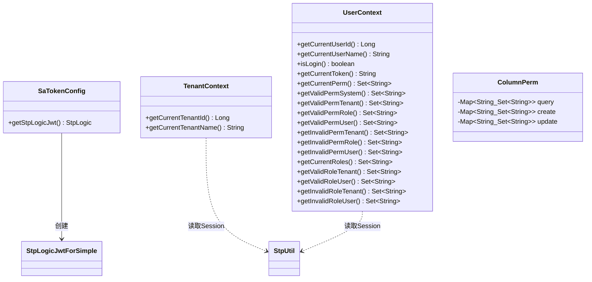
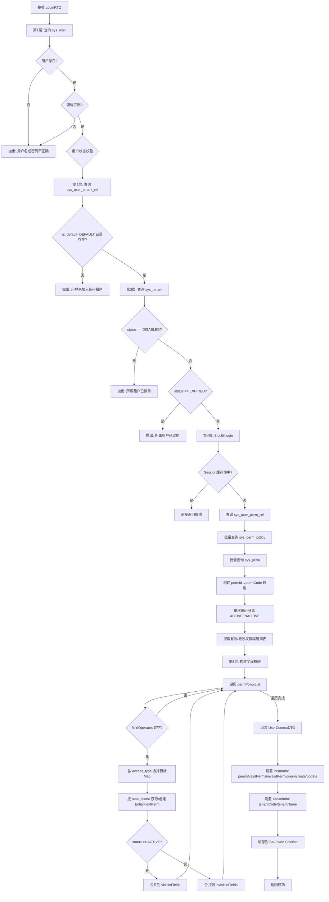
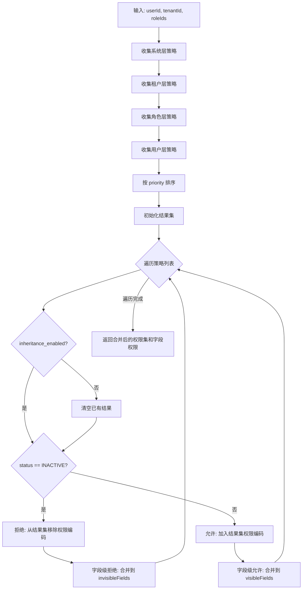
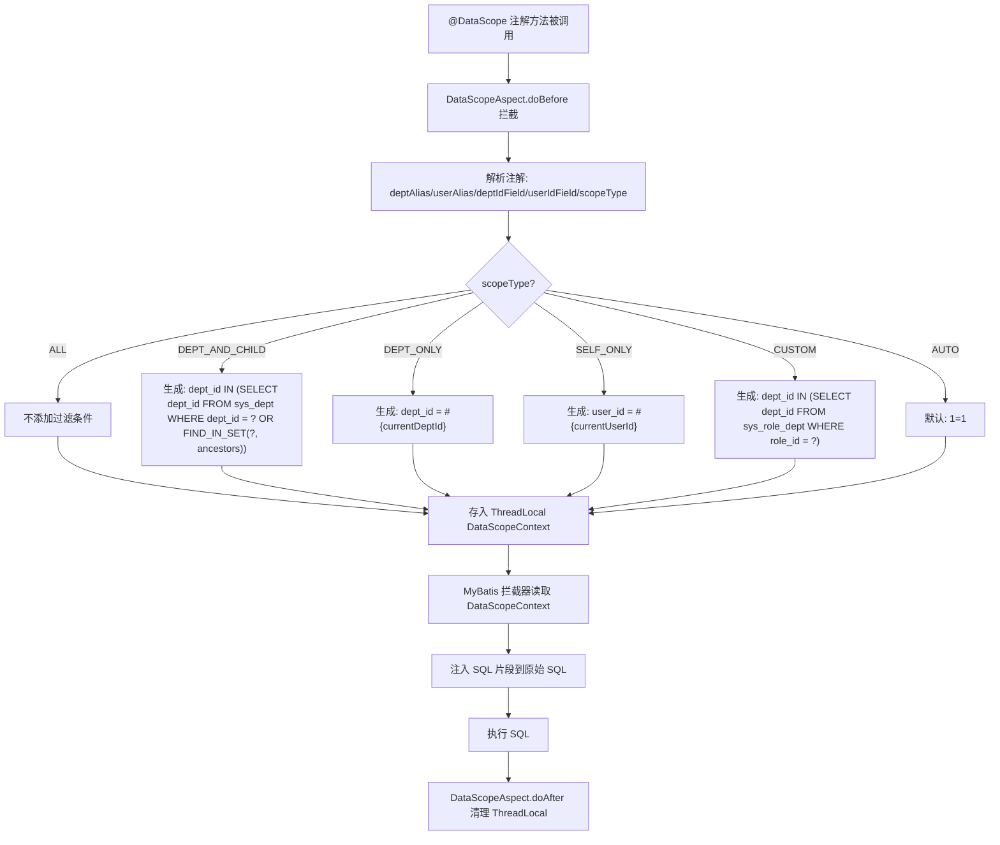
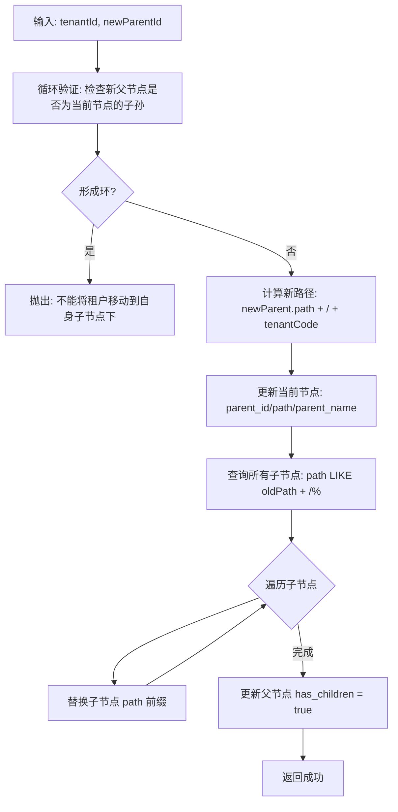

# NexusIX-Platform 详细设计说明书（LLD）

---

## 1 文档信息

| 项目 | 内容 |
|------|------|
| 项目名称 | NexusIX-Platform 多租户 SaaS 平台底座 |
| 文档版本 | V1.0 |
| 编写日期 | 2026-05-23 |
| 技术栈 | Spring Boot 3 + MyBatis-Plus + PostgreSQL 17 + Sa-Token + Redis |
| 包根路径 | `com.shy.nexusix` |
| 构建工具 | Maven 多模块 |

### 1.1 模块总览

| 模块 | 包路径 | 职责 |
|------|--------|------|
| nexusix-boot | `com.shy.nexusix.boot` | 启动模块，Spring Boot Application 入口 |
| nexusix-common | `com.shy.nexusix.common` | 公共基础设施：常量、枚举、异常、工具类、切面、配置 |
| nexusix-core | `com.shy.nexusix.core` | 核心上下文：Sa-Token 配置、租户/用户上下文、字段权限模型 |
| nexusix-iam | `com.shy.nexusix.iam` | 身份与访问管理：认证、用户、权限、策略、关联关系 |
| nexusix-tenant | `com.shy.nexusix.tenant` | 租户管理：租户信息、套餐订阅、树形层级 |
| nexusix-org | `com.shy.nexusix.org` | 组织架构：角色、部门、岗位、用户组 |
| nexusix-notify | `com.shy.nexusix.notify` | 消息通知：站内信、消息模板、定时消息 |
| nexusix-audit | `com.shy.nexusix.audit` | 审计日志 |
| nexusix-billing | `com.shy.nexusix.billing` | 计费模块 |
| nexusix-system | `com.shy.nexusix.system` | 系统管理 |
| nexusix-dynamic | `com.shy.nexusix.dynamic` | 动态数据源 |

---

## 2 模块内部设计

### 2.1 nexusix-common 模块

- **模块名称**：nexusix-common
- **包路径**：`com.shy.nexusix.common`
- **负责数据表**：无（纯基础设施，不直接操作业务表）

#### 2.1.1 类图

```mermaid
classDiagram
    direction LR

    class GlobalConstant {
        +Page
        +HttpStatus
        +Session
        +RedisKey
        +Table
    }
    class GlobalConstant_Page {
        +int DEFAULT_PAGE_NUM = 1
        +int DEFAULT_PAGE_SIZE = 10
        +int MIN_PAGE_SIZE = 1
        +int MAX_PAGE_SIZE = 100
    }
    class GlobalConstant_HttpStatus {
        +int SUCCESS = 200
        +int UNAUTHORIZED = 401
        +int FORBIDDEN = 403
        +int NOT_FOUND = 404
        +int INTERNAL_SERVER_ERROR = 500
    }
    class GlobalConstant_Session {
        +String USER_CONTEXT = "userContext"
    }
    class GlobalConstant_Table {
        +String TENANT = "sys_tenant"
    }
    GlobalConstant *-- GlobalConstant_Page
    GlobalConstant *-- GlobalConstant_HttpStatus
    GlobalConstant *-- GlobalConstant_Session
    GlobalConstant *-- GlobalConstant_Table

    class GlobalEnum {
        +Deleted
        +PermStatus
        +PermPolicyStatus
        +PermPolicyTargetType
        +PermPolicyAccessType
        +TenantStatus
        +SubscriptionStatus
        +SubscriptionType
        +DefaultTenant
    }
    class BaseEnum {
        <<interface>>
        +getCode() String
        +getDesc() String
    }
    class Deleted {
        NOT_DELETED
        DELETED
    }
    class PermStatus {
        ENABLED
        DISABLED
    }
    class PermPolicyStatus {
        ACTIVE
        INACTIVE
    }
    class PermPolicyTargetType {
        TENANT
        ROLE
        USER
    }
    class PermPolicyAccessType {
        QUERY
        CREATE
        UPDATE
    }
    class TenantStatus {
        ENABLED
        DISABLED
        EXPIRED
    }
    class SubscriptionStatus {
        ACTIVE
        EXPIRED
        CANCELLED
        PENDING
    }
    class SubscriptionType {
        NEW
        RENEWAL
        UPGRADE
        DOWNGRADE
    }
    class DefaultTenant {
        DEFAULT true
        SECONDARY_DEFAULT false
    }
    BaseEnum <|.. Deleted
    BaseEnum <|.. PermStatus
    BaseEnum <|.. PermPolicyStatus
    BaseEnum <|.. PermPolicyTargetType
    BaseEnum <|.. PermPolicyAccessType
    BaseEnum <|.. TenantStatus
    BaseEnum <|.. SubscriptionStatus
    BaseEnum <|.. SubscriptionType
    BaseEnum <|.. DefaultTenant
    GlobalEnum *-- Deleted
    GlobalEnum *-- PermStatus
    GlobalEnum *-- PermPolicyStatus
    GlobalEnum *-- PermPolicyTargetType
    GlobalEnum *-- PermPolicyAccessType
    GlobalEnum *-- TenantStatus
    GlobalEnum *-- SubscriptionStatus
    GlobalEnum *-- SubscriptionType
    GlobalEnum *-- DefaultTenant

    class BusinessException {
        -int code
        -String message
        +BusinessException(int code, String message)
        +BusinessException(String message)
    }

    class ApiResponse {
        -int code
        -String msg
        -Object data
        -Map extra
        +success() ApiResponse
        +success(String msg) ApiResponse
        +success(Object data) ApiResponse
        +success(String msg, Object data) ApiResponse
        +error() ApiResponse
        +error(String msg) ApiResponse
        +error(int code, String msg) ApiResponse
        +error(int code, String msg, Object data) ApiResponse
        +unauth() ApiResponse
        +forbidden() ApiResponse
        +notFound() ApiResponse
        +serverError() ApiResponse
        +isSuccess() boolean
        +isError() boolean
        +set(String key, Object value) ApiResponse
    }

    class IdUtils {
        +uuid() String
        +uuidCompact() String
        +uuidShort() String
        +uuidNumeric() String
        +snowflakeId() long
        +snowflakeIdStr() String
        +orderNo() String
        +orderNo(String prefix) String
        +verificationCode(int length) String
        +randomString(int length) String
    }
    class DateUtils
    class StringUtils
    class RegexUtils
    class IpUtil

    class MyBatisPlusConfig {
        +mybatisPlusInterceptor() MybatisPlusInterceptor
    }
    class RedisConfig
    class WebConfig
    class Knife4jConfig
    class Fastjson2Config
    class RabbitConfig

    class LogAspect
    class OperationLogAspect
    class DataScopeAspect {
        -ThreadLocal~DataScopeContext~ DATA_SCOPE_CONTEXT
        +doBefore(JoinPoint)
        +doAfter()
        +doAfterThrowing()
        +getDataScopeContext() DataScopeContext
        +clearDataScopeContext()
        -buildDataScopeSql(DataScope) String
    }
    class RateLimitAspect
    class RepeatSubmitAspect

    class DataScope {
        +deptAlias() String
        +userAlias() String
        +deptIdField() String
        +userIdField() String
        +enabled() boolean
        +scopeType() DataScopeType
    }
    class OperationLog {
        +title() String
        +businessType() BusinessType
        +operatorType() OperatorType
        +isSaveRequestData() boolean
        +isSaveResponseData() boolean
        +excludeParams() String[]
    }
    class RateLimit {
        +key() String
        +limit() int
        +period() long
        +timeUnit() TimeUnit
        +limitType() LimitType
        +message() String
    }
    class RepeatSubmit {
        +interval() long
        +message() String
        +submitType() SubmitType
        +includeParams() boolean
    }
    class EnumField

    class PageCommonRTO {
        -Integer pageNum
        -Integer pageSize
    }
    class NumberRangeCommonRTO
    class TimeRangeCommonRTO

    class GlobalExceptionHandler {
        +handleBusinessException(BusinessException) ApiResponse
        +handleMethodArgumentNotValidException(MethodArgumentNotValidException) ApiResponse
        +handleNotLoginException(NotLoginException) ApiResponse
        +handleNotPermissionException(NotPermissionException) ApiResponse
        +handleNotRoleException(NotRoleException) ApiResponse
        +handleNotSafeException(NotSafeException) ApiResponse
        +handleDisableServiceException(DisableServiceException) ApiResponse
        +handleRuntimeException(RuntimeException) ApiResponse
        +handleIOException(IOException) ApiResponse
        +handleSQLException(SQLException) ApiResponse
        +handleException(Exception) ApiResponse
    }
```



#### 2.1.2 核心类说明

| 类名 | 包路径 | 职责 |
|------|--------|------|
| `GlobalConstant` | `constant` | 全局常量定义，内部类分域管理：Page（分页）、HttpStatus（状态码）、Session（Sa-Token Session键）、RedisKey（Redis键前缀）、Table（表名） |
| `GlobalEnum` | `enums` | 全局枚举容器，所有内部枚举实现 `BaseEnum` 接口，统一 `code/desc` 模式，支持 `@EnumValue` 数据库存储和 `@JSONField` JSON序列化 |
| `BusinessException` | `exception` | 业务异常，携带 `code` + `message`，默认 code=500 |
| `ApiResponse` | `result` | 统一响应包装器，链式调用风格，支持 `extra` 附加数据（`@JSONField(serialize=false)` 不序列化到前端） |
| `IdUtils` | `utils` | ID生成工具，雪花算法委托 MyBatis-Plus `DefaultIdentifierGenerator`，同时提供 UUID、订单号、验证码等生成方法 |
| `MyBatisPlusConfig` | `config` | MyBatis-Plus 拦截器链配置：TenantLineInnerInterceptor（租户隔离，当前注释状态）→ PaginationInnerInterceptor（PostgreSQL分页）→ OptimisticLockerInnerInterceptor（乐观锁）→ BlockAttackInnerInterceptor（防全表更新删除） |
| `DataScopeAspect` | `aspect` | 数据权限切面，拦截 `@DataScope` 注解方法，根据 `scopeType` 生成 SQL 片段存入 ThreadLocal，供 MyBatis 拦截器注入 |
| `GlobalExceptionHandler` | `exception` | 全局异常处理器，`@RestControllerAdvice` 统一拦截并转换为 `ApiResponse` |

---

### 2.2 nexusix-core 模块

- **模块名称**：nexusix-core
- **包路径**：`com.shy.nexusix.core`
- **负责数据表**：无（核心上下文与配置）

#### 2.2.1 类图



#### 2.2.2 核心类说明

| 类名 | 包路径 | 职责 |
|------|--------|------|
| `SaTokenConfig` | `config` | 注入 `StpLogicJwtForSimple`，使 Sa-Token 使用 JWT Simple 模式：Token 为 JWT 格式可无状态验证签名，会话数据存储在 Redis 支持主动踢下线 |
| `TenantContext` | `context` | 租户上下文工具类，从 Sa-Token Session 读取当前租户 ID/名称，数据流：`StpUtil.getSession()` → Redis → 返回 |
| `UserContext` | `context` | 用户上下文工具类，从 Sa-Token Session 读取用户信息、权限列表（系统级/租户级/角色级/用户级 有效+无效）、角色列表（租户级/用户级 有效+无效） |
| `ColumnPerm` | `entity` | 字段权限实体，按操作类型（query/create/update）组织，每个类型为 `Map<tableName, Set<fieldName>>` 结构 |

---

### 2.3 nexusix-iam 模块（重点详细设计）

- **模块名称**：nexusix-iam
- **包路径**：`com.shy.nexusix.iam`
- **负责数据表**：`sys_user`、`sys_user_tenant_rel`、`sys_perm`、`sys_perm_policy`、`sys_user_perm_rel`

#### 2.3.1 类图

```mermaid
classDiagram
    direction TB

    class AuthController {
        -IAuthService iAuthService
        +login(LoginRTO) ApiResponse
    }
    class SysUserController {
        -ISysUserService iSysUserService
    }
    class SysPermController {
        -ISysPermService iSysPermService
    }
    class SysPermPolicyController {
        -ISysPermPolicyService iSysPermPolicyService
    }
    class SysUserPermRelController {
        -ISysUserPermRelService iSysUserPermRelService
    }
    class SysUserTenantRelController {
        -ISysUserTenantRelService iSysUserTenantRelService
    }

    class IAuthService {
        <<interface>>
        +login(LoginRTO) ApiResponse
    }
    class AuthServiceImpl {
        -ISysUserService iSysUserService
        -ISysUserTenantRelService iSysUserTenantRelService
        -ISysTenantService iSysTenantService
        -ISysUserPermRelService iSysUserPermRelService
        -ISysPermPolicyService iSysPermPolicyService
        -ISysPermService iSysPermService
        +login(LoginRTO) ApiResponse
    }
    class ISysUserService {
        <<interface>>
    }
    class SysUserServiceImpl
    class ISysPermService {
        <<interface>>
    }
    class SysPermServiceImpl
    class ISysPermPolicyService {
        <<interface>>
    }
    class SysPermPolicyServiceImpl
    class ISysUserPermRelService {
        <<interface>>
    }
    class SysUserPermRelServiceImpl
    class ISysUserTenantRelService {
        <<interface>>
    }
    class SysUserTenantRelServiceImpl

    class SysUserMapper
    class SysPermMapper
    class SysPermPolicyMapper
    class SysUserPermRelMapper
    class SysUserTenantRelMapper

    class SysUser {
        -Long id
        -String userCode
        -String userName
        -String password
        -String nickName
        -String email
        -String phone
        -String avatar
        -String status
        -String loginIp
        -LocalDateTime loginDate
        -String createBy
        -LocalDateTime createAt
        -String updateBy
        -LocalDateTime updateAt
        -String isDeleted
        -LocalDateTime deletedAt
    }
    class SysUserTenantRel {
        -Long id
        -Long userId
        -Long tenantId
        -Long deptId
        -Boolean isAdmin
        -LocalDateTime joinTime
        -Boolean isDefault
        -String createBy
        -LocalDateTime createAt
        -String updateBy
        -LocalDateTime updateAt
        -String isDeleted
        -LocalDateTime deletedAt
    }
    class SysPerm {
        -Long id
        -String permName
        -String permDesc
        -String permCode
        -String permKey
        -String permType
        -Long parentId
        -String parentName
        -String path
        -String status
        -String createBy
        -LocalDateTime createAt
        -String updateBy
        -LocalDateTime updateAt
        -String isDeleted
        -LocalDateTime deletedAt
    }
    class SysPermPolicy {
        -Long id
        -String policyCode
        -String policyName
        -Long targetId
        -String targetType
        -Long permId
        -Long tenantId
        -String tableName
        -String tableDesc
        -String accessType
        -String fieldOperates
        -String status
        -String createBy
        -LocalDateTime createAt
        -String updateBy
        -LocalDateTime updateAt
        -String isDeleted
        -LocalDateTime deletedAt
    }
    class SysUserPermRel {
        -Long id
        -Long userId
        -Long policyId
        -String createBy
        -LocalDateTime createAt
        -String updateBy
        -LocalDateTime updateAt
        -String isDeleted
        -LocalDateTime deletedAt
    }

    class LoginRTO {
        -String username
        -String password
    }
    class RegisterRTO {
        -String username
        -String password
        -String nickname
        -String email
        -String phone
    }
    class LoginVO {
        -String token
        -String username
        -String nickname
        -String tenantName
    }
    class UserContextDTO {
        -TenantInfo tenantInfo
        -PermInfo permInfo
    }
    class UserContextDTO_TenantInfo {
        -String tenantCode
        -String tenantName
    }
    class UserContextDTO_PermInfo {
        -List~String~ perms
        -List~String~ validPerms
        -List~String~ invalidPerm
        -Map~String_EntityFieldPerm~ query
        -Map~String_EntityFieldPerm~ create
        -Map~String_EntityFieldPerm~ update
    }
    class UserContextDTO_EntityFieldPerm {
        -List~String~ visibleFields
        -List~String~ invisibleFields
    }

    AuthController --> IAuthService
    SysUserController --> ISysUserService
    SysPermController --> ISysPermService
    SysPermPolicyController --> ISysPermPolicyService
    SysUserPermRelController --> ISysUserPermRelService
    SysUserTenantRelController --> ISysUserTenantRelService

    IAuthService <|.. AuthServiceImpl
    ISysUserService <|.. SysUserServiceImpl
    ISysPermService <|.. SysPermServiceImpl
    ISysPermPolicyService <|.. SysPermPolicyServiceImpl
    ISysUserPermRelService <|.. SysUserPermRelServiceImpl
    ISysUserTenantRelService <|.. SysUserTenantRelServiceImpl

    AuthServiceImpl ..> ISysUserService
    AuthServiceImpl ..> ISysUserTenantRelService
    AuthServiceImpl ..> ISysTenantService
    AuthServiceImpl ..> ISysUserPermRelService
    AuthServiceImpl ..> ISysPermPolicyService
    AuthServiceImpl ..> ISysPermService

    SysUserServiceImpl --> SysUserMapper
    SysPermServiceImpl --> SysPermMapper
    SysPermPolicyServiceImpl --> SysPermPolicyMapper
    SysUserPermRelServiceImpl --> SysUserPermRelMapper
    SysUserTenantRelServiceImpl --> SysUserTenantRelMapper

    SysUserMapper --> SysUser
    SysPermMapper --> SysPerm
    SysPermPolicyMapper --> SysPermPolicy
    SysUserPermRelMapper --> SysUserPermRel
    SysUserTenantRelMapper --> SysUserTenantRel

    AuthServiceImpl ..> LoginRTO
    AuthServiceImpl ..> UserContextDTO
    AuthServiceImpl ..> LoginVO
    UserContextDTO *-- UserContextDTO_TenantInfo : tenantInfo
    UserContextDTO *-- UserContextDTO_PermInfo : permInfo
    UserContextDTO_PermInfo *-- UserContextDTO_EntityFieldPerm : query/create/update
```



#### 2.3.2 AuthServiceImpl 认证核心设计

`AuthServiceImpl.login()` 是系统认证的核心入口，实现了五层级认证算法。方法依赖注入 6 个 Service：

| 依赖 | 用途 |
|------|------|
| `ISysUserService` | 第1层：查询 sys_user |
| `ISysUserTenantRelService` | 第2层：查询 sys_user_tenant_rel |
| `ISysTenantService` | 第3层：查询 sys_tenant 校验状态 |
| `ISysUserPermRelService` | 第4层：查询 sys_user_perm_rel |
| `ISysPermPolicyService` | 第4层：查询 sys_perm_policy |
| `ISysPermService` | 第4层：查询 sys_perm |

#### 2.3.3 Controller 路由表

| Controller | 路由前缀 | 核心接口 |
|-----------|---------|---------|
| `AuthController` | `/auth` | `POST /auth/login` |
| `SysUserController` | `/sys-user` | 待实现 |
| `SysPermController` | `/sys-perm` | 待实现 |
| `SysPermPolicyController` | `/sys-perm-policy` | 待实现 |
| `SysUserPermRelController` | `/sys-user-perm-rel` | 待实现 |
| `SysUserTenantRelController` | `/sys-user-tenant-rel` | 待实现 |

---

### 2.4 nexusix-tenant 模块

- **模块名称**：nexusix-tenant
- **包路径**：`com.shy.nexusix.tenant`
- **负责数据表**：`sys_tenant`、`sys_tenant_subscription`

#### 2.4.1 类图

```mermaid
classDiagram
    direction TB

    class SysTenantController {
        -ISysTenantService iSysTenantService
        +queryTenantList() ApiResponse
        +queryTenantPage(PageCommonRTO) ApiResponse
        +queryTenantTreeList() ApiResponse
        +queryTenantTreePage(PageCommonRTO) ApiResponse
        +queryTenantTree(String id) ApiResponse
        +queryTenant(SysTenantQueryRTO) ApiResponse
        +queryTenantDetail(String tenantCode) ApiResponse
        +addTenant(SysTenantAddRTO) ApiResponse
        +updateTenant(SysTenantUpdateRTO) ApiResponse
        +updateTenantStatus(String id, String status) ApiResponse
        +deleteTenant(String id) ApiResponse
        +batchAddTenant(List) ApiResponse
        +batchUpdateTenant(List) ApiResponse
        +batchUpdateTenantStatus(List, String) ApiResponse
        +batchDeleteTenant(List) ApiResponse
        +assignSubTenant(SysTenantAssignRTO) ApiResponse
        +assignParentTenant(SysTenantAssignRTO) ApiResponse
    }
    class SysTenantSubscriptionController {
        -ISysTenantSubscriptionService iSysTenantSubscriptionService
        +querySubscriptionList() ApiResponse
        +querySubscriptionPage(PageCommonRTO) ApiResponse
        +querySubscription(SysTenantSubscriptionQueryRTO) ApiResponse
        +querySubscriptionDetail(String id) ApiResponse
        +addSubscription(SysTenantSubscriptionAddRTO) ApiResponse
        +updateSubscription(SysTenantSubscriptionUpdateRTO) ApiResponse
        +updateSubscriptionStatus(String id, String status) ApiResponse
        +deleteSubscription(String id) ApiResponse
        +batchAddSubscription(List) ApiResponse
        +batchUpdateSubscription(List) ApiResponse
        +batchUpdateSubscriptionStatus(List, String) ApiResponse
        +batchDeleteSubscription(List) ApiResponse
    }

    class ISysTenantService {
        <<interface>>
        +queryTenantList() List
        +queryTenantPage(PageCommonRTO) IPage
        +queryTenantTreeList() List
        +queryTenantTreePage(PageCommonRTO) IPage
        +queryTenantTree(String id) SysTenantTreeVO
        +queryTenant(SysTenantQueryRTO) IPage
        +queryTenantDetail(String tenantCode) SysTenantDetailVO
        +addTenant(SysTenantAddRTO) Integer
        +updateTenant(SysTenantUpdateRTO) Integer
        +updateTenantStatus(String id, String status) Integer
        +deleteTenant(String id) Integer
        +batchAddTenant(List) Integer
        +batchUpdateTenant(List) Integer
        +batchUpdateTenantStatus(List, String) Integer
        +batchDeleteTenant(List) Integer
        +assignSubTenant(SysTenantAssignRTO) Integer
        +assignParentTenant(SysTenantAssignRTO) Integer
        +queryTenantById(Long tenantId) SysTenantCommonVO
    }
    class SysTenantServiceImpl {
        -SysTenantConverter sysTenantConverter
    }
    class ISysTenantSubscriptionService {
        <<interface>>
        +querySubscriptionList() List
        +querySubscriptionPage(PageCommonRTO) IPage
        +querySubscription(SysTenantSubscriptionQueryRTO) IPage
        +querySubscriptionDetail(String id) SysTenantSubscriptionDetailVO
        +addSubscription(SysTenantSubscriptionAddRTO) Integer
        +updateSubscription(SysTenantSubscriptionUpdateRTO) Integer
        +updateSubscriptionStatus(String id, String status) Integer
        +deleteSubscription(String id) Integer
        +batchAddSubscription(List) Integer
        +batchUpdateSubscription(List) Integer
        +batchUpdateSubscriptionStatus(List, String) Integer
        +batchDeleteSubscription(List) Integer
    }
    class SysTenantSubscriptionServiceImpl

    class SysTenantMapper
    class SysTenantSubscriptionMapper

    class SysTenant {
        -Long id
        -String tenantCode
        -String tenantName
        -String tenantType
        -String tenantDesc
        -String tenantLogoUrl
        -String parentId
        -String parentName
        -String path
        -String contactName
        -String contactPhone
        -String status
        -LocalDateTime expireTime
        -Long packageId
        -String packageName
        -String extAttributes
        -Boolean hasChildren
        -String createBy
        -LocalDateTime createAt
        -String updateBy
        -LocalDateTime updateAt
        -String isDeleted
        -LocalDateTime deletedAt
    }
    class SysTenantSubscription {
        -Long id
        -String subscriptionCode
        -Long tenantId
        -String tenantCode
        -String tenantName
        -String packageId
        -String subscriptionType
        -LocalDateTime startTime
        -LocalDateTime endTime
        -String status
        -Boolean isAutoRenew
        -String sourceType
        -String parentId
        -String createBy
        -LocalDateTime createAt
        -String updateBy
        -LocalDateTime updateAt
        -String isDeleted
        -LocalDateTime deletedAt
    }

    class SysTenantConverter {
        <<interface>>
        +toCommonVO(SysTenant) SysTenantCommonVO
    }

    class SysTenantAddRTO
    class SysTenantUpdateRTO
    class SysTenantQueryRTO
    class SysTenantAssignRTO
    class SysTenantSubscriptionAddRTO
    class SysTenantSubscriptionUpdateRTO
    class SysTenantSubscriptionQueryRTO

    class SysTenantCommonVO
    class SysTenantDetailVO
    class SysTenantTreeVO
    class SysTenantSubscriptionCommonVO
    class SysTenantSubscriptionDetailVO

    SysTenantController --> ISysTenantService
    SysTenantSubscriptionController --> ISysTenantSubscriptionService
    ISysTenantService <|.. SysTenantServiceImpl
    ISysTenantSubscriptionService <|.. SysTenantSubscriptionServiceImpl
    SysTenantServiceImpl --> SysTenantMapper
    SysTenantServiceImpl --> SysTenantConverter
    SysTenantSubscriptionServiceImpl --> SysTenantSubscriptionMapper
    SysTenantMapper --> SysTenant
    SysTenantSubscriptionMapper --> SysTenantSubscription
    SysTenantConverter ..> SysTenant : MapStruct转换
    SysTenantConverter ..> SysTenantCommonVO : MapStruct转换
```



#### 2.4.2 Controller 路由表

| Controller | 路由前缀 | 核心接口 |
|-----------|---------|---------|
| `SysTenantController` | `/tenant` | `GET /tenant/list`、`GET /tenant/page`、`GET /tenant/tree/list`、`GET /tenant/tree/page`、`GET /tenant/tree/{id}`、`POST /tenant/query`、`GET /tenant/detail/{tenantCode}`、`POST /tenant/add`、`PUT /tenant/update`、`PUT /tenant/status`、`DELETE /tenant/delete`、`POST /tenant/batch`、`PUT /tenant/batch`、`PUT /tenant/status/batch`、`DELETE /tenant/batch`、`POST /tenant/assign/sub`、`PUT /tenant/assign/parent` |
| `SysTenantSubscriptionController` | `/tenant-subscription` | CRUD + 批量操作 |

#### 2.4.3 SysTenantConverter（MapStruct）

```java
@Mapper(componentModel = "spring")
public interface SysTenantConverter {
    @Mapping(source = "createBy", target = "createByName")
    @Mapping(source = "createAt", target = "createTime")
    @Mapping(source = "updateBy", target = "updateByName")
    @Mapping(source = "updateAt", target = "updateTime")
    @Mapping(source = "deletedAt", target = "deleteTime")
    SysTenantCommonVO toCommonVO(SysTenant entity);
}
```

采用 MapStruct 编译期代码生成，零运行时反射开销。`componentModel = "spring"` 使生成的实现类自动注册为 Spring Bean。

---

## 3 核心算法设计

### 3.1 五层级认证算法

#### 3.1.1 算法概述

五层级认证算法是 `AuthServiceImpl.login()` 的核心逻辑，逐层验证用户身份、租户归属、租户状态、权限策略、字段权限，最终构建完整的 `UserContextDTO` 并缓存到 Sa-Token Session。

#### 3.1.2 伪代码

```
FUNCTION login(LoginRTO param):
    // ===== 第1层：用户身份验证 =====
    user = SELECT * FROM sys_user
           WHERE user_name = param.username
           AND is_deleted = 'NOT_DELETED'
    IF user IS NULL:
        THROW BusinessException("用户名或密码不正确")

    IF user.password != param.password:
        THROW BusinessException("用户名或密码不正确")

    // ===== 第2层：租户归属验证 =====
    userTenantRel = SELECT * FROM sys_user_tenant_rel
                    WHERE user_id = user.id
                    AND is_default = true    // DEFAULT租户
                    AND is_deleted = 'NOT_DELETED'
    IF userTenantRel IS NULL:
        THROW BusinessException("用户未加入任何租户")

    // ===== 第3层：租户状态校验 =====
    tenant = SELECT * FROM sys_tenant
             WHERE id = userTenantRel.tenant_id
             AND is_deleted = 'NOT_DELETED'
    IF tenant.status == 'DISABLED':
        THROW BusinessException("所属租户已停用")
    IF tenant.status == 'EXPIRED':
        THROW BusinessException("所属租户已过期")

    // ===== 第4层：权限编码构建 =====
    StpUtil.login(user.id)   // Sa-Token 登录

    cachedContext = StpUtil.getSession().get("userContext")
    IF cachedContext IS NOT NULL:
        RETURN success()     // 命中缓存直接返回

    userPermRelList = SELECT * FROM sys_user_perm_rel
                      WHERE user_id = userTenantRel.id
                      AND is_deleted = 'NOT_DELETED'

    policyIdList = userPermRelList.map(rel -> rel.policyId)
    permPolicyList = SELECT * FROM sys_perm_policy
                     WHERE id IN policyIdList
                     AND is_deleted = 'NOT_DELETED'

    permIdSet = permPolicyList.map(policy -> policy.permId)
    permList = SELECT * FROM sys_perm
               WHERE id IN permIdSet
               AND is_deleted = 'NOT_DELETED'

    // 构建 permId -> permCode 映射
    permIdToCodeMap = {}
    FOR perm IN permList:
        permIdToCodeMap[perm.id] = perm.permCode

    // 单次遍历分离 ACTIVE/INACTIVE 策略的 permId
    activePolicyPermIdSet = {}
    inactivePolicyPermIdSet = {}
    FOR policy IN permPolicyList:
        IF policy.status == 'ACTIVE':
            activePolicyPermIdSet.add(policy.permId)
        ELSE IF policy.status == 'INACTIVE':
            inactivePolicyPermIdSet.add(policy.permId)

    // 提取有效/无效权限编码
    allPermCodeList = []
    validPermCodeList = []
    invalidPermCodeList = []
    FOR perm IN permList:
        allPermCodeList.add(perm.permCode)
        IF perm.id IN activePolicyPermIdSet:
            validPermCodeList.add(perm.permCode)
        ELSE IF perm.id IN inactivePolicyPermIdSet:
            invalidPermCodeList.add(perm.permCode)

    // ===== 第5层：字段权限构建 =====
    queryPermMap = {}   // Map<tableName, EntityFieldPerm>
    createPermMap = {}
    updatePermMap = {}

    FOR policy IN permPolicyList:
        IF policy.fieldOperates IS NULL OR policy.fieldOperates.isEmpty():
            CONTINUE

        // 根据access_type选择目标Map
        IF policy.accessType == 'QUERY':
            targetMap = queryPermMap
        ELSE IF policy.accessType == 'CREATE':
            targetMap = createPermMap
        ELSE IF policy.accessType == 'UPDATE':
            targetMap = updatePermMap
        ELSE:
            CONTINUE

        // 获取或创建该表的字段权限对象
        fieldPerm = targetMap.computeIfAbsent(policy.tableName, k -> new EntityFieldPerm())
        fields = JSON.parseArray(policy.fieldOperates, String.class)

        // 根据策略状态合并到可见/不可见字段列表
        IF policy.status == 'ACTIVE':
            fieldPerm.visibleFields.addAll(fields)
        ELSE IF policy.status == 'INACTIVE':
            fieldPerm.invisibleFields.addAll(fields)

    // ===== 组装 UserContextDTO =====
    permInfo = new PermInfo()
    permInfo.perms = allPermCodeList
    permInfo.validPerms = validPermCodeList
    permInfo.invalidPerm = invalidPermCodeList
    permInfo.query = queryPermMap
    permInfo.create = createPermMap
    permInfo.update = updatePermMap

    tenantInfo = new TenantInfo()
    tenantInfo.tenantName = tenant.tenantName
    tenantInfo.tenantCode = tenant.tenantCode

    userContext = new UserContextDTO()
    userContext.tenantInfo = tenantInfo
    userContext.permInfo = permInfo

    // 缓存到 Sa-Token Session（Redis 持久化）
    StpUtil.getSession().set("userContext", userContext)

    RETURN success()
```

#### 3.1.3 流程图



---

### 3.2 权限策略合并算法

#### 3.2.1 算法概述

权限策略按四层优先级收集：系统层 → 租户层 → 角色层 → 用户层。每层策略包含 ACTIVE（允许）和 INACTIVE（拒绝）两种状态。合并规则：**拒绝优先于允许**，`inheritance_enabled` 控制是否继承上层策略。

#### 3.2.2 伪代码

```
FUNCTION mergePermPolicies(userId, tenantId, roleIds):
    // 收集四层策略
    systemPolicies = SELECT * FROM sys_perm_policy
                     WHERE target_type = 'SYSTEM'
                     AND status IN ('ACTIVE', 'INACTIVE')

    tenantPolicies = SELECT * FROM sys_perm_policy
                     WHERE target_type = 'TENANT' AND target_id = tenantId
                     AND status IN ('ACTIVE', 'INACTIVE')

    rolePolicies = SELECT * FROM sys_perm_policy
                   WHERE target_type = 'ROLE' AND target_id IN roleIds
                   AND status IN ('ACTIVE', 'INACTIVE')

    userPolicies = SELECT * FROM sys_perm_policy
                   WHERE target_type = 'USER' AND target_id = userId
                   AND status IN ('ACTIVE', 'INACTIVE')

    // 按 priority 排序（数值越小优先级越高）
    allPolicies = systemPolicies + tenantPolicies + rolePolicies + userPolicies
    SORT allPolicies BY priority ASC

    // 合并：拒绝优先于允许
    resultPermSet = {}       // 最终生效的权限编码集合
    resultFieldPerm = {}     // 最终生效的字段权限

    FOR policy IN allPolicies:
        IF policy.inheritance_enabled == false:
            // 不继承上层，清空之前的结果
            resultPermSet.clear()
            resultFieldPerm.clear()

        IF policy.status == 'INACTIVE':
            // 拒绝策略：从结果集中移除
            resultPermSet.remove(policy.permCode)
            // 字段级拒绝：加入 invisibleFields
            mergeFieldPerm(resultFieldPerm, policy, INVISIBLE)
        ELSE IF policy.status == 'ACTIVE':
            // 允许策略：加入结果集
            resultPermSet.add(policy.permCode)
            // 字段级允许：加入 visibleFields
            mergeFieldPerm(resultFieldPerm, policy, VISIBLE)

    RETURN resultPermSet, resultFieldPerm
```

#### 3.2.3 流程图



---

### 3.3 数据范围过滤算法

#### 3.3.1 算法概述

通过 `@DataScope` 注解 + `DataScopeAspect` 切面 + MyBatis 拦截器，在 SQL 执行前自动注入数据范围过滤条件。根据用户角色的 `data_scope` 字段决定过滤范围。

#### 3.3.2 伪代码

```
FUNCTION applyDataScope(userRoles, deptAlias, userAlias, deptIdField, userIdField):
    // 获取用户角色的最高数据范围
    dataScope = getMaxDataScope(userRoles)

    SWITCH dataScope:
        CASE 1:  // 全部数据
            sqlSegment = ""   // 不添加过滤条件
        CASE 2:  // 本部门及子部门
            sqlSegment = deptAlias + "." + deptIdField
                + " IN (SELECT dept_id FROM sys_dept"
                + " WHERE dept_id = #{currentDeptId}"
                + " OR FIND_IN_SET(#{currentDeptId}, ancestors))"
        CASE 3:  // 本部门
            sqlSegment = deptAlias + "." + deptIdField
                + " = #{currentDeptId}"
        CASE 4:  // 仅本人
            sqlSegment = userAlias + "." + userIdField
                + " = #{currentUserId}"
        CASE 5:  // 自定义
            sqlSegment = deptAlias + "." + deptIdField
                + " IN (SELECT dept_id FROM sys_role_dept"
                + " WHERE role_id = #{currentRoleId})"

    // 将 sqlSegment 存入 ThreadLocal
    DataScopeContext.setSqlSegment(sqlSegment)
    DataScopeContext.setParams({
        "currentDeptId": currentDeptId,
        "currentUserId": currentUserId,
        "currentRoleId": currentRoleId
    })
```

#### 3.3.3 流程图



---

### 3.4 租户树路径计算算法

#### 3.4.1 算法概述

租户表 `sys_tenant` 采用物化路径（Materialized Path）模式存储层级关系。`parent_id` 记录直接父节点，`path` 字段存储从根到当前节点的完整路径（如 `rootTenant/GROUP001/EAST001`）。移动节点时需递归更新所有子节点的 path。

#### 3.4.2 伪代码

```
FUNCTION assignParentTenant(assignParam):
    tenantId = assignParam.tenantId
    newParentId = assignParam.parentId

    // 1. 循环层级验证：避免形成环状结构
    currentId = newParentId
    WHILE currentId IS NOT NULL AND currentId != 0:
        IF currentId == tenantId:
            THROW BusinessException("不能将租户移动到自身子节点下")
        parent = SELECT parent_id FROM sys_tenant WHERE id = currentId
        currentId = parent.parent_id

    // 2. 计算新路径
    newParent = SELECT * FROM sys_tenant WHERE id = newParentId
    newPath = newParent.path + "/" + tenant.tenantCode

    // 3. 更新当前节点
    UPDATE sys_tenant SET
        parent_id = newParentId,
        parent_name = newParent.tenantName,
        path = newPath
    WHERE id = tenantId

    // 4. 递归更新所有子节点的 path
    oldPathPrefix = tenant.path
    children = SELECT * FROM sys_tenant WHERE path LIKE oldPathPrefix + "/%"
    FOR child IN children:
        child.path = newPath + child.path.substring(oldPathPrefix.length)
        UPDATE sys_tenant SET path = child.path WHERE id = child.id

    // 5. 更新父节点的 has_children 标记
    UPDATE sys_tenant SET has_children = true WHERE id = newParentId
```

#### 3.4.3 流程图



---

### 3.5 雪花ID生成算法

#### 3.5.1 算法概述

采用 MyBatis-Plus 内置的 `DefaultIdentifierGenerator` 实现雪花算法，生成 64 位 Long 型唯一 ID。

#### 3.5.2 ID 结构

```
| 1 bit | 41 bits          | 10 bits     | 12 bits     |
| 符号位 | 时间戳（毫秒级）   | 机器ID      | 序列号       |
| 0     | 约69年           | 0-1023      | 0-4095      |
```

| 组成部分 | 位数 | 说明 |
|---------|------|------|
| 符号位 | 1 bit | 始终为 0，保证正数 |
| 时间戳 | 41 bits | 相对于自定义纪元的毫秒数，可用约 69 年 |
| 机器 ID | 10 bits | 由 `DefaultIdentifierGenerator` 自动分配，支持 1024 个节点 |
| 序列号 | 12 bits | 同一毫秒内的递增序列，每毫秒可生成 4096 个 ID |

#### 3.5.3 关键特性

- **时间戳回拨处理**：`DefaultIdentifierGenerator` 内部检测时钟回拨，回拨幅度小时自旋等待，回拨幅度大时抛出异常
- **序列号溢出**：同一毫秒内序列号达到 4095 时，自旋到下一毫秒
- **机器 ID 分配**：基于网卡 MAC 地址 + 进程 ID 自动计算，无需手动配置
- **线程安全**：内部使用 `synchronized` 保证并发安全

---

## 4 数据结构设计

### 4.1 UserContextDTO 完整结构

```
UserContextDTO
├── tenantInfo: TenantInfo
│   ├── tenantCode: String          // 租户编码，如 "TENANT_001"
│   └── tenantName: String          // 租户名称，如 "某某科技有限公司"
│
└── permInfo: PermInfo
    ├── perms: List<String>          // 全部权限编码列表 [有效+无效]
    │   例: ["user:view", "user:edit", "order:view", "system:admin"]
    │
    ├── validPerms: List<String>     // 有效权限编码列表
    │   例: ["user:view", "user:edit", "order:view"]
    │
    ├── invalidPerm: List<String>    // 无效权限编码列表
    │   例: ["system:admin"]
    │
    ├── query: Map<String, EntityFieldPerm>    // 查询操作字段权限
    │   │
    │   ├── "sys_user" → EntityFieldPerm
    │   │   ├── visibleFields: ["id", "username", "realName", "phone", "email", "status", "createTime"]
    │   │   └── invisibleFields: ["password", "idCard", "salary", "address"]
    │   │
    │   ├── "sys_order" → EntityFieldPerm
    │   │   ├── visibleFields: ["id", "orderNo", "amount", "status", "createTime"]
    │   │   └── invisibleFields: ["userId", "payToken", "clientIp"]
    │   │
    │   └── "sys_product" → EntityFieldPerm
    │       ├── visibleFields: ["id", "productName", "price"]
    │       └── invisibleFields: ["costPrice", "supplierInfo"]
    │
    ├── create: Map<String, EntityFieldPerm>   // 新增操作字段权限
    │   │
    │   ├── "sys_user" → EntityFieldPerm
    │   │   ├── visibleFields: ["username", "realName", "phone", "email", "status"]
    │   │   └── invisibleFields: ["id", "password", "createTime", "updateTime"]
    │   │
    │   └── "sys_order" → EntityFieldPerm
    │       ├── visibleFields: ["orderNo", "amount", "status"]
    │       └── invisibleFields: ["id", "payTime", "finishTime"]
    │
    └── update: Map<String, EntityFieldPerm>   // 更新操作字段权限
        │
        ├── "sys_user" → EntityFieldPerm
        │   ├── visibleFields: ["realName", "phone", "email", "status"]
        │   └── invisibleFields: ["id", "username", "password", "createTime"]
        │
        └── "sys_order" → EntityFieldPerm
            ├── visibleFields: ["status"]
            └── invisibleFields: ["id", "orderNo", "amount", "payToken"]
```

**EntityFieldPerm 结构说明**：

| 字段 | 类型 | 说明 |
|------|------|------|
| `visibleFields` | `List<String>` | 允许访问的字段列表（策略状态为 ACTIVE 时合并） |
| `invisibleFields` | `List<String>` | 禁止访问的字段列表（策略状态为 INACTIVE 时合并） |

**设计要点**：
- Map 的 key 为 `table_name`，支持动态扩展任意表，无需修改 DTO 代码
- 同一张表可能被多个策略覆盖，字段通过 `addAll` 合并
- `visibleFields` 与 `invisibleFields` 可同时存在，运行时取差集得到最终可见字段

---

### 4.2 ApiResponse 统一响应结构

```
ApiResponse
├── code: int           // 状态码（200成功, 400参数错误, 401未授权, 403禁止, 500服务器错误）
├── msg: String         // 消息描述
├── data: Object        // 返回数据（泛型）
└── extra: Map<String, Object>   // 附加数据（@JSONField(serialize=false) 不序列化到前端）
```

**静态工厂方法**：

| 方法 | code | msg | data |
|------|------|-----|------|
| `success()` | 200 | "操作成功" | null |
| `success(String msg)` | 200 | 自定义 | null |
| `success(Object data)` | 200 | "操作成功" | 自定义 |
| `success(String msg, Object data)` | 200 | 自定义 | 自定义 |
| `error()` | 500 | "操作失败" | null |
| `error(String msg)` | 500 | 自定义 | null |
| `error(int code, String msg)` | 自定义 | 自定义 | null |
| `error(int code, String msg, Object data)` | 自定义 | 自定义 | 自定义 |
| `unauth()` | 401 | "未授权" | null |
| `forbidden()` | 403 | "禁止访问" | null |
| `notFound()` | 404 | "资源不存在" | null |
| `serverError()` | 500 | "服务器内部错误" | null |

---

### 4.3 PageCommonRTO 分页请求结构

```
PageCommonRTO
├── pageNum: Integer    // 当前页码，默认1，最小1
└── pageSize: Integer   // 每页数量，默认10，最小1，最大100
```

**校验规则**：
- `@Min(1)` 约束 pageNum 和 pageSize 的最小值
- `@Max(100)` 约束 pageSize 的最大值
- MyBatis-Plus 分页拦截器配置 `overflow=true`（页码溢出自动返回最后一页）和 `maxLimit=500`（单页最大 500 条）

---

### 4.4 TenantContext 线程上下文

```
TenantContext（静态工具类，数据源为 Sa-Token Session → Redis）
├── getCurrentTenantId() : Long       // 从 Session 读取当前租户ID
└── getCurrentTenantName() : String    // 从 Session 读取当前租户名称
```

**数据流**：`StpUtil.getSession()` → Redis → 返回 tenantId/tenantName

**UserContext 扩展上下文**：

```
UserContext（静态工具类，数据源为 Sa-Token Session → Redis）
├── getCurrentUserId() : Long          // StpUtil.getLoginIdAsLong()
├── getCurrentUserName() : String      // 从 Session 读取
├── isLogin() : boolean                // StpUtil.isLogin()
├── getCurrentToken() : String         // StpUtil.getTokenValue()
│
├── getCurrentPerm() : Set<String>     // 全部权限 [有效+无效]
│
├── getValidPermSystem() : Set<String> // 系统级有效权限
├── getValidPermTenant() : Set<String> // 租户级有效权限
├── getValidPermRole() : Set<String>   // 角色级有效权限
├── getValidPermUser() : Set<String>   // 用户级有效权限
│
├── getInvalidPermTenant() : Set<String> // 租户级禁用权限
├── getInvalidPermRole() : Set<String>   // 角色级禁用权限
├── getInvalidPermUser() : Set<String>   // 用户级禁用权限
│
├── getCurrentRoles() : Set<String>      // 全部角色 [有效+无效]
│
├── getValidRoleTenant() : Set<String>   // 租户级有效角色
├── getValidRoleUser() : Set<String>     // 用户级有效角色
│
├── getInvalidRoleTenant() : Set<String> // 租户级禁用角色
└── getInvalidRoleUser() : Set<String>   // 用户级禁用角色
```

---

## 5 异常处理设计

### 5.1 BusinessException 体系

```
BusinessException extends RuntimeException
├── code: int          // 错误码，默认500
└── message: String    // 错误描述
```

**构造方式**：

| 构造函数 | code | 说明 |
|---------|------|------|
| `BusinessException(String message)` | 500 | 通用业务异常 |
| `BusinessException(int code, String message)` | 自定义 | 指定错误码的业务异常 |

**使用场景**：所有业务逻辑校验失败时抛出，由 `GlobalExceptionHandler` 统一捕获并转换为 `ApiResponse`。

---

### 5.2 GlobalExceptionHandler 处理链

```mermaid
flowchart TD
    A[Controller 抛出异常] --> B{异常类型判断}

    B -->|BusinessException| C[返回 ApiResponse.error(code, message)]
    B -->|MethodArgumentNotValidException| D["拼接字段错误: field1: msg1; field2: msg2 → ApiResponse.error(400, 参数验证失败: ...)"]
    B -->|NotLoginException| E[返回 ApiResponse.error(401, message)]

    E --> E1{NotLoginException 子类型}
    E1 --> E2["-message: 未提供Token"]
    E1 --> E3["-message: Token无效"]
    E1 --> E4["-message: Token已过期"]
    E1 --> E5["-message: Token已被顶下线"]
    E1 --> E6["-message: Token已被踢下线"]

    B -->|NotPermissionException| F["返回 ApiResponse.error(403, 缺少权限：{permission})"]
    B -->|NotRoleException| G["返回 ApiResponse.error(403, 缺少角色：{role})"]
    B -->|NotSafeException| H["返回 ApiResponse.error(403, 二级认证校验失败：{service})"]
    B -->|DisableServiceException| I["返回 ApiResponse.error(403, 账号{service}服务被封禁 level={level} {disableTime}秒后解封)"]
    B -->|RuntimeException| J[返回 ApiResponse.error(500, 系统运行时异常: message)]
    B -->|IOException| K[返回 ApiResponse.error(500, IO异常: message)]
    B -->|SQLException| L[返回 ApiResponse.error(500, 数据库操作异常: message)]
    B -->|Exception| M[返回 ApiResponse.error(500, 系统内部错误: message)]
```

### 5.3 异常处理优先级表

| 优先级 | 异常类型 | HTTP 状态码 | 处理策略 |
|-------|---------|-----------|---------|
| 1 | `BusinessException` | 自定义（默认500） | 直接映射 code + message |
| 2 | `MethodArgumentNotValidException` | 400 | 提取所有字段错误拼接 |
| 3 | `NotLoginException` | 401 | 5 种子类型统一 401 |
| 4 | `NotPermissionException` | 403 | 附加缺失权限编码 |
| 5 | `NotRoleException` | 403 | 附加缺失角色编码 |
| 6 | `NotSafeException` | 403 | 附加二级认证服务名 |
| 7 | `DisableServiceException` | 403 | 附加封禁级别和解封时间 |
| 8 | `RuntimeException` | 500 | 通用运行时异常兜底 |
| 9 | `IOException` | 500 | IO 异常 |
| 10 | `SQLException` | 500 | 数据库异常 |
| 11 | `Exception` | 500 | 最终兜底 |

### 5.4 NotLoginException 五种子类型

| 子类型 | 触发场景 | message 内容 |
|-------|---------|-------------|
| `-` | 请求未携带 Token | 未提供Token |
| `-` | Token 格式不合法或签名校验失败 | Token无效 |
| `-` | Token 超过有效期 | Token已过期 |
| `-` | 同一账号在另一设备登录，当前 Token 被顶替 | Token已被顶下线 |
| `-` | 管理员手动将当前 Token 踢下线 | Token已被踢下线 |

> Sa-Token 的 `NotLoginException` 通过内部 `type` 字段区分子类型，在 `getMessage()` 中已包含具体描述信息，`GlobalExceptionHandler` 直接透传 message。
