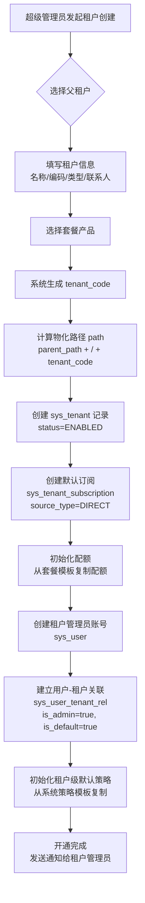
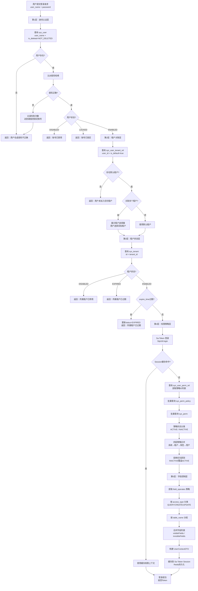
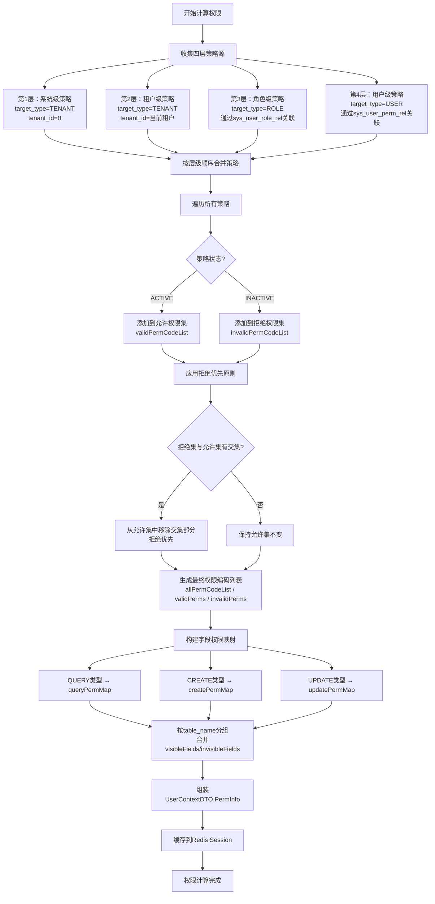
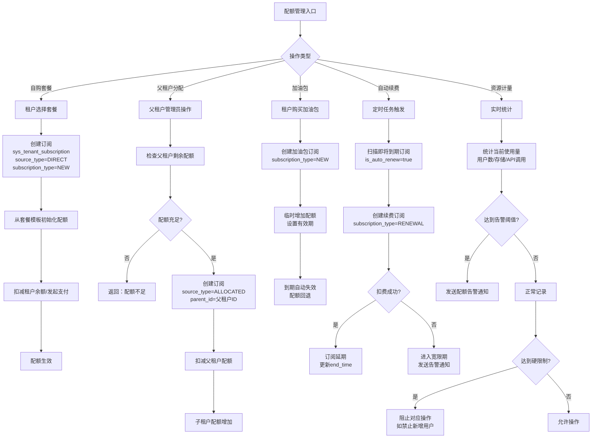

# NexusIX-Platform 产品需求文档（PRD）

---

## 1. 文档信息

| 项目 | 内容 |
|------|------|
| 产品名称 | NexusIX-Platform |
| 文档版本 | v1.0.0 |
| 文档作者 | shy |
| 创建日期 | 2026-05-23 |
| 最后更新 | 2026-05-23 |
| 文档状态 | 评审中 |
| 技术栈 | Spring Boot 3 + MyBatis-Plus + PostgreSQL 17 + Sa-Token + Redis |
| 适用范围 | 多租户 SaaS 平台底座 |

### 版本历史

| 版本 | 日期 | 修改人 | 修改内容 |
|------|------|--------|----------|
| v1.0.0 | 2026-05-23 | shy | 初始版本，定义10大功能模块及五层级认证体系 |

---

## 2. 产品概述

### 2.1 产品定位

NexusIX-Platform 是一个面向企业级用户的多租户 SaaS 平台底座，提供从租户管理、身份认证、权限控制到计费配额的全链路基础设施。平台采用无限层级租户树形架构，支持集团-子公司-部门等多级组织形态，通过独创的**五层级认证体系**实现从身份验证到字段级权限控制的纵深安全防御。

### 2.2 目标用户

| 用户类型 | 描述 |
|----------|------|
| 集团型企业 | 需要多级子公司管理、统一权限策略下发的大型集团 |
| SaaS 服务商 | 需要快速构建多租户 SaaS 产品的技术团队 |
| 中型企业 | 需要灵活组织架构和精细化权限控制的成长型企业 |
| 系统集成商 | 需要可扩展底座进行二次开发的 ISV |

### 2.3 核心价值

1. **无限层级租户架构**：基于 `parent_id` + `path` 物化路径设计，支持租户树的无限层级扩展，满足集团-区域-分公司-部门等复杂组织结构
2. **五层级认证体系**：从身份认证到字段控制的全链路安全模型，实现纵深防御
3. **四层权限策略合并**：系统→租户→角色→用户的策略叠加机制，拒绝优先原则确保安全
4. **字段级权限控制**：基于 JSONB 的 `field_operates`/`field_un_operates` 设计，支持 QUERY/CREATE/UPDATE 三种访问类型的细粒度字段控制
5. **弹性配额管理**：支持自购、父租户分配、自动续费等多种订阅模式，配合加油包/补偿/惩罚机制实现资源弹性管控

---

## 3. 用户角色定义

### 3.1 角色矩阵

| 角色 | 标识 | tenant_id | is_admin | 描述 |
|------|------|-----------|----------|------|
| 超级管理员 | SUPER_ADMIN | 0 | true | 平台最高权限者，管理所有租户，不受租户边界限制 |
| 租户管理员 | TENANT_ADMIN | 所属租户ID | true | 租户内最高权限者，管理本租户及子租户的用户、权限、配额 |
| 普通员工 | EMPLOYEE | 所属租户ID | false | 租户内普通用户，根据角色和策略获得相应权限 |
| 财务人员 | FINANCE | 所属租户ID | false | 负责套餐订阅、配额调整、账单管理等财务相关操作 |
| 审计员 | AUDITOR | 所属租户ID | false | 只读权限，负责操作日志审查、数据变更审计、合规检查 |

### 3.2 角色详细说明

#### 超级管理员（tenant_id=0）

- 系统唯一的全局管理者，`tenant_id=0` 为平台级虚拟租户
- 拥有所有模块的完整操作权限，不受数据范围限制
- 职责：租户开通/冻结/解冻、套餐定义、系统级字典维护、全局安全策略配置
- 可查看所有租户的操作日志和审计数据

#### 租户管理员（is_admin=true）

- 在 `sys_user_tenant_rel` 表中 `is_admin=true` 标识
- 职责：本租户用户管理、角色分配、权限策略配置、子租户配额分配
- 可管理本租户及下级子租户的资源，但不可跨租户操作
- 可配置租户级安全策略（密码策略、登录锁定等）

#### 普通员工

- 在 `sys_user_tenant_rel` 表中 `is_admin=false`
- 根据角色和权限策略获得功能访问权限
- 受字段级权限控制约束，仅可见/可操作授权范围内的数据字段
- 可属于多个用户组（静态/动态）

#### 财务人员

- 特殊业务角色，拥有计费与配额相关模块的操作权限
- 职责：套餐订阅管理、加油包购买、配额调整申请、账单查看
- 受数据范围控制，仅可查看本租户及子租户的财务数据

#### 审计员

- 只读角色，不可修改任何业务数据
- 职责：操作日志查询、登录日志审查、数据变更审计追踪
- 可导出审计报告，但不可删除或修改日志记录

---

## 4. 功能需求清单

### M01 租户管理中心

#### 模块概述

租户管理中心是整个平台的基础模块，负责租户的全生命周期管理。采用 `parent_id` + `path` 物化路径设计实现无限层级树形结构，支持集团-区域-分公司等多级组织形态。

#### 核心数据模型

- **主表**：`sys_tenant`
- **关键字段**：
  - `parent_id`：父租户ID，顶级租户 parent_id=0
  - `path`：物化路径，格式如 `rootTenant/GROUP001/EAST001`，支持 LIKE 查询子树
  - `has_children`：是否有子租户标识
  - `status`：VARCHAR(20)，枚举值 ENABLED/DISABLED/EXPIRED
  - `expire_time`：服务过期时间
  - `ext_attributes`：JSONB 扩展属性，存储行业特定配置
  - `is_deleted`：VARCHAR(20)，枚举值 NOT_DELETED/DELETED

#### 功能列表

| 编号 | 功能 | 描述 | 优先级 |
|------|------|------|--------|
| M01-F01 | 租户创建 | 创建新租户，指定父租户、套餐、联系人信息，自动生成 tenant_code 和 path | P0 |
| M01-F02 | 租户查询 | 支持树形结构展示、列表查询、详情查看，支持按状态/类型/层级筛选 | P0 |
| M01-F03 | 租户更新 | 修改租户基础信息（名称、描述、联系人等），不可修改 tenant_code | P0 |
| M01-F04 | 租户删除 | 逻辑删除（is_deleted=DELETED），级联检查子租户和关联用户 | P0 |
| M01-F05 | 树形结构管理 | 基于 parent_id + path 的无限层级树，支持拖拽排序、层级调整 | P1 |
| M01-F06 | 状态冻结/解冻 | 将租户状态设为 DISABLED/ENABLED，冻结时级联影响子租户 | P0 |
| M01-F07 | 过期处理 | 定时任务检查 expire_time，自动将过期租户状态设为 EXPIRED | P0 |
| M01-F08 | 租户切换 | 多租户用户可切换当前活跃租户，重新加载权限上下文 | P1 |

#### 业务规则

1. 租户编码（tenant_code）全局唯一，创建后不可修改
2. 物化路径（path）在创建时自动生成，格式为 `{parent_path}/{tenant_code}`
3. 冻结父租户时，所有子租户（通过 path LIKE 前缀匹配）同步冻结
4. 解冻父租户时，子租户不自动解冻，需逐个操作
5. 过期租户的用户无法登录系统，需续费后方可恢复
6. 删除租户前必须确保无子租户且无活跃用户

---

### M02 计费与套餐中心

#### 模块概述

计费与套餐中心定义平台提供的套餐产品，包括计费周期、价格、配额模板等，支持套餐的上架/下架管理。

#### 功能列表

| 编号 | 功能 | 描述 | 优先级 |
|------|------|------|--------|
| M02-F01 | 套餐定义 | 定义套餐名称、编码、描述、计费周期（月/季/年）、价格 | P0 |
| M02-F02 | 配额模板 | 为套餐绑定配额模板（用户数、存储空间、API调用量等） | P0 |
| M02-F03 | 套餐上架 | 将套餐设为可购买状态，租户可自助订阅 | P0 |
| M02-F04 | 套餐下架 | 将套餐设为不可购买状态，已订阅租户不受影响 | P0 |
| M02-F05 | 套餐定价 | 支持阶梯定价、按量计费、固定价格等多种计费模式 | P1 |
| M02-F06 | 套餐对比 | 提供不同套餐的功能和配额对比视图 | P2 |

#### 业务规则

1. 套餐编码全局唯一，上架后不可修改核心配额
2. 下架套餐不影响已有订阅，仅阻止新订阅
3. 配额模板变更仅影响新订阅，已有订阅需通过升级/降级变更

---

### M03 配额管理

#### 模块概述

配额管理模块负责租户的资源配额全生命周期管理，包括订阅管理、配额动态调整、资源使用计量和超额控制。

#### 核心数据模型

- **主表**：`sys_tenant_subscription`
- **关键字段**：
  - `subscription_type`：订阅类型（NEW/RENEWAL/UPGRADE/DOWNGRADE）
  - `source_type`：来源类型（DIRECT 自购 / ALLOCATED 父租户分配）
  - `is_auto_renew`：是否自动续费
  - `status`：VARCHAR(20)，枚举值 ACTIVE/EXPIRED/CANCELLED/PENDING
  - `parent_id`：分配来源的父租户ID

#### 功能列表

| 编号 | 功能 | 描述 | 优先级 |
|------|------|------|--------|
| M03-F01 | 订阅管理 | 租户自助购买套餐、父租户为子租户分配套餐、自动续费设置 | P0 |
| M03-F02 | 配额查看 | 查看当前租户各项资源的使用量和剩余配额 | P0 |
| M03-F03 | 加油包 | 临时增加配额（如额外用户数、存储空间），有独立有效期 | P1 |
| M03-F04 | 补偿调整 | 因系统故障等原因补偿配额，需审批流程 | P1 |
| M03-F05 | 惩罚扣减 | 因违规等原因扣减配额，需记录原因和操作人 | P1 |
| M03-F06 | 资源计量 | 实时统计各项资源使用量（用户数、存储、API调用等） | P0 |
| M03-F07 | 超额控制 | 配额用尽时限制对应操作（如禁止新增用户），支持超额阈值告警 | P0 |
| M03-F08 | 自动续费 | 到期前自动创建续费订阅，扣费失败时进入宽限期 | P1 |

#### 业务规则

1. 自购订阅（source_type=DIRECT）由租户自行购买，分配订阅（source_type=ALLOCATED）由父租户分配
2. 父租户分配配额时，从自身配额中扣除相应额度
3. 加油包到期后自动失效，不续期
4. 超额时系统发送告警通知，达到硬限制时阻止对应操作
5. 自动续费在到期前7天触发，扣费失败进入3天宽限期

---

### M04 IAM身份认证

#### 模块概述

IAM 模块是平台安全的核心入口，实现用户注册/登录、多租户绑定、Token 管理等功能，并承载**五层级认证体系**的完整流程。

#### 核心数据模型

- **用户表**：`sys_user`（全局唯一，跨租户共享）
- **用户-租户关联表**：`sys_user_tenant_rel`（支持一个用户绑定多个租户）
- **Token 记录表**：`sys_user_token`

#### 功能列表

| 编号 | 功能 | 描述 | 优先级 |
|------|------|------|--------|
| M04-F01 | 用户注册 | 创建全局用户账号，校验用户名/邮箱/手机号唯一性 | P0 |
| M04-F02 | 用户登录 | 执行五层级认证流程，返回 Token 和权限上下文 | P0 |
| M04-F03 | 多租户绑定 | 用户可加入多个租户，通过 sys_user_tenant_rel 维护关联 | P0 |
| M04-F04 | 默认租户 | 每个用户有且仅有一个默认租户（is_default=true），登录时自动选择 | P0 |
| M04-F05 | 租户切换 | 已登录用户切换活跃租户，重新加载权限上下文 | P1 |
| M04-F06 | Token管理 | 基于 Sa-Token 的会话管理，支持多设备登录 | P0 |
| M04-F07 | 强制下线 | 管理员可强制指定用户下线，清除其 Token 和 Session | P0 |
| M04-F08 | 五层级认证 | 完整执行身份认证→租户关联→租户状态→权限策略→字段控制五层校验 | P0 |

#### 业务规则

1. 用户名全局唯一，一个用户可属于多个租户
2. 每个用户-租户关联中，`is_default` 最多一条为 true
3. `is_admin=true` 的用户在对应租户内拥有管理员权限
4. Token 过期时间可由租户安全策略配置
5. 强制下线需同步清除 Redis 中的 Session 数据

---

### M05 权限控制中心

#### 模块概述

权限控制中心实现基于策略的细粒度权限管理，支持允许/拒绝策略、优先级排序、继承机制、数据范围控制和字段级权限。

#### 核心数据模型

- **权限资源表**：`sys_perm`（树形结构，支持菜单/按钮/API等类型）
- **权限策略表**：`sys_perm_policy`（核心策略控制，支持字段级权限）
- **用户权限关联表**：`sys_user_perm_rel`
- **角色表**：`sys_role`
- **角色策略表**：`sys_role_policy`
- **用户角色关联表**：`sys_user_role_rel`

#### 功能列表

| 编号 | 功能 | 描述 | 优先级 |
|------|------|------|--------|
| M05-F01 | 角色管理 | 角色的 CRUD，定义角色编码、描述、数据范围 | P0 |
| M05-F02 | 权限资源管理 | 权限树的管理，支持菜单/按钮/API/数据四种权限类型 | P0 |
| M05-F03 | 策略配置 | 创建权限策略，指定目标类型（TENANT/ROLE/USER）、允许/拒绝、优先级 | P0 |
| M05-F04 | 策略继承 | 系统级策略→租户级策略→角色级策略→用户级策略，四层合并 | P0 |
| M05-F05 | 拒绝优先 | 当允许和拒绝策略冲突时，拒绝策略优先生效 | P0 |
| M05-F06 | 数据范围控制 | 基于角色的 data_scope 控制数据可见范围（全部/本部门/本部门及下级/仅本人/自定义） | P0 |
| M05-F07 | 字段级权限 | 基于 field_operates/field_un_operates 的 JSONB 字段控制 | P0 |
| M05-F08 | 策略状态管理 | 策略的 ACTIVE/INACTIVE 状态控制，INACTIVE 策略作为拒绝规则 | P0 |

#### 策略模型详解

**sys_perm_policy 关键字段**：

| 字段 | 类型 | 说明 |
|------|------|------|
| target_type | VARCHAR(20) | 策略目标类型：TENANT（租户级）/ ROLE（角色级）/ USER（用户级） |
| target_id | BIGINT | 策略目标ID，配合 target_type 定位策略归属 |
| perm_id | BIGINT | 关联的权限资源ID |
| access_type | VARCHAR(20) | 访问类型：QUERY（查询）/ CREATE（新增）/ UPDATE（更新） |
| field_operates | JSONB | 允许操作的字段列表，如 `["id", "name", "email"]` |
| field_un_operates | JSONB | 禁止操作的字段列表，如 `["password", "salary"]` |
| status | VARCHAR(20) | 策略状态：ACTIVE（生效）/ INACTIVE（失效/拒绝） |

**四层策略合并顺序**（优先级从低到高）：

1. **系统级策略**（target_type=TENANT, tenant_id=0）：平台全局默认策略
2. **租户级策略**（target_type=TENANT, tenant_id=具体租户）：租户自定义策略
3. **角色级策略**（target_type=ROLE）：通过 sys_role_policy 和 sys_user_role_rel 关联
4. **用户级策略**（target_type=USER）：通过 sys_user_perm_rel 直接关联

**拒绝优先原则**：高层级的 INACTIVE 策略可覆盖低层级的 ACTIVE 策略，确保安全底线。

---

### M06 组织架构管理

#### 模块概述

组织架构管理模块提供部门树、岗位和用户组管理，支持静态用户组和基于条件的动态用户组。

#### 功能列表

| 编号 | 功能 | 描述 | 优先级 |
|------|------|------|--------|
| M06-F01 | 部门管理 | 部门树的 CRUD，支持拖拽排序、层级调整 | P0 |
| M06-F02 | 岗位管理 | 岗位的定义和管理，关联到部门和用户 | P0 |
| M06-F03 | 静态用户组 | 手动添加/移除成员的用户组，适用于固定团队 | P1 |
| M06-F04 | 动态用户组 | 基于条件规则（部门、岗位、标签等）自动匹配成员的用户组 | P1 |
| M06-F05 | 用户组权限 | 用户组可作为权限策略的分配单位 | P1 |
| M06-F06 | 组织架构图 | 可视化展示组织架构树形图 | P2 |

#### 业务规则

1. 部门树采用与租户树相同的 parent_id + path 物化路径设计
2. 动态用户组的成员在每次查询时实时计算
3. 用户可同时属于多个用户组
4. 岗位变更需同步更新用户-租户关联中的 dept_id

---

### M07 动态配置中心

#### 模块概述

动态配置中心提供运行时可配置的表单、数据源和打印模板能力，降低硬编码依赖，提升系统灵活性。

#### 功能列表

| 编号 | 功能 | 描述 | 优先级 |
|------|------|------|--------|
| M07-F01 | 动态表单 | 基于 JSON Schema 定义表单结构，运行时渲染和校验 | P1 |
| M07-F02 | 动态数据源-业务表 | 配置业务表作为数据源，支持字段映射和条件过滤 | P1 |
| M07-F03 | 动态数据源-API | 配置外部 API 作为数据源，支持请求参数映射和响应转换 | P1 |
| M07-F04 | 动态数据源-字典 | 配置字典项作为数据源，用于下拉选择等场景 | P1 |
| M07-F05 | 动态数据源-SQL | 配置自定义 SQL 查询作为数据源，需安全审查 | P2 |
| M07-F06 | 打印模板 | 基于 HTML/CSS 的打印模板设计，支持变量绑定和条件渲染 | P2 |

#### 业务规则

1. JSON Schema 遵循 JSON Schema Draft-07 规范
2. SQL 数据源必须为 SELECT 语句，禁止 DML/DDL
3. API 数据源需配置超时时间和重试策略
4. 打印模板支持浏览器端和服务器端两种渲染模式

---

### M08 消息通知中心

#### 模块概述

消息通知中心提供消息模板管理、站内信和定时消息功能，支持单次、周期和事件触发三种消息调度模式。

#### 功能列表

| 编号 | 功能 | 描述 | 优先级 |
|------|------|------|--------|
| M08-F01 | 消息模板 | 定义消息模板，支持变量占位符（如 `${userName}`） | P1 |
| M08-F02 | 站内信 | 系统内消息的发送、接收、已读/未读管理 | P0 |
| M08-F03 | 定时消息-单次 | 指定时间点发送一次的消息 | P1 |
| M08-F04 | 定时消息-周期 | 按 Cron 表达式周期性发送的消息 | P1 |
| M08-F05 | 定时消息-事件 | 由业务事件（如租户过期、配额告警）触发的消息 | P1 |
| M08-F06 | 消息免打扰 | 用户可设置免打扰时段，期间不推送通知 | P2 |

#### 业务规则

1. 消息模板变量在发送时动态替换
2. 站内信支持按租户隔离，跨租户消息不可见
3. 事件触发消息需配置事件源和触发条件
4. 周期消息需设置起止时间，避免无限发送

---

### M09 系统支撑服务

#### 模块概述

系统支撑服务提供菜单、字典、文件上传和公告等基础功能，是其他模块的公共依赖。

#### 功能列表

| 编号 | 功能 | 描述 | 优先级 |
|------|------|------|--------|
| M09-F01 | 菜单管理 | 系统菜单的树形管理，关联权限资源（sys_perm） | P0 |
| M09-F02 | 系统级字典 | 平台全局字典管理，所有租户共享 | P0 |
| M09-F03 | 租户级字典 | 租户自定义字典，仅本租户可见 | P0 |
| M09-F04 | 文件上传 | 文件上传和存储管理，支持本地/对象存储 | P0 |
| M09-F05 | 公告管理 | 系统公告的发布、撤回、置顶管理 | P1 |
| M09-F06 | 字典缓存 | 字典数据 Redis 缓存，变更时自动刷新 | P1 |

#### 业务规则

1. 菜单与权限资源（sys_perm）通过 perm_key 关联
2. 字典查询优先取租户级字典，不存在时回退到系统级字典
3. 文件上传受租户存储配额限制
4. 公告支持按租户范围发布（全局/指定租户）

---

### M10 安全与审计

#### 模块概述

安全与审计模块提供租户安全策略配置、操作日志、登录日志和数据变更审计功能，确保系统安全可追溯。

#### 功能列表

| 编号 | 功能 | 描述 | 优先级 |
|------|------|------|--------|
| M10-F01 | 密码策略 | 配置密码复杂度、有效期、历史密码检查等策略 | P0 |
| M10-F02 | 登录锁定 | 连续登录失败N次后锁定账号，支持自动解锁时间配置 | P0 |
| M10-F03 | 操作日志 | 记录用户的关键操作，基于 @OperationLog 注解自动采集 | P0 |
| M10-F04 | 登录日志 | 记录所有登录/登出事件，包含 IP、设备、时间等信息 | P0 |
| M10-F05 | 数据变更审计 | 记录业务数据的变更前后快照，支持字段级差异对比 | P1 |
| M10-F06 | 安全策略模板 | 提供预定义安全策略模板，租户可基于模板自定义 | P2 |

#### 业务规则

1. 密码策略由租户管理员配置，超级管理员定义全局最低标准
2. 登录锁定计数存储在 Redis 中，设置 TTL 为自动解锁时间
3. 操作日志不可修改和删除，保留期限不少于180天
4. 数据变更审计通过 MyBatis-Plus 拦截器自动采集

---

## 5. 五层级认证体系

### 5.1 体系概述

五层级认证体系是 NexusIX-Platform 的核心安全架构，在用户登录时依次执行五个层级的校验，每一层都是前一层的进阶，形成纵深防御模型。该体系确保从身份验证到字段级控制的完整安全链路。

### 5.2 第1层：身份认证层

**目标**：验证用户身份的真实性

**流程**：

1. 接收用户提交的用户名（user_name）和密码（password）
2. 查询 `sys_user` 表，条件：`user_name = 输入值 AND is_deleted = 'NOT_DELETED'`
3. 若用户不存在，抛出异常"用户名或密码不正确"（不透露具体原因，防信息泄露）
4. 比对密码哈希值，不匹配则抛出同样异常
5. 校验用户全局状态（status 字段）：
   - `ENABLED`：通过，继续下一层
   - `DISABLED`：拒绝登录，提示"账号已禁用"
   - `LOCKED`：拒绝登录，提示"账号已锁定"

**登录失败锁定机制**：

- 连续失败次数记录在 Redis 中，Key 格式：`login_fail:{userId}`
- 达到阈值（默认5次）后，将 `sys_user.status` 设为 `LOCKED`
- 锁定后可由管理员手动解锁，或等待自动解锁时间（默认30分钟）到期

**涉及表**：`sys_user`

### 5.3 第2层：租户关联层

**目标**：确定用户与租户的绑定关系

**流程**：

1. 查询 `sys_user_tenant_rel` 表，条件：`user_id = 当前用户ID AND is_default = true AND is_deleted = 'NOT_DELETED'`
2. 若无关联记录，抛出异常"用户未加入任何租户"
3. 获取关联信息：
   - `tenant_id`：默认租户ID
   - `is_admin`：是否为该租户管理员
   - `is_default`：是否为默认租户
   - `dept_id`：所属部门ID
4. 若用户关联多个租户，前端展示租户选择器，用户选择后进入第3层

**多租户场景**：

- 一个用户可属于多个租户（如兼职、跨组织协作）
- 每个用户有且仅有一个默认租户（is_default=true）
- 登录时优先使用默认租户，用户可随时切换

**涉及表**：`sys_user_tenant_rel`

### 5.4 第3层：租户状态层

**目标**：校验租户的服务状态是否正常

**流程**：

1. 查询 `sys_tenant` 表，条件：`id = 租户ID AND is_deleted = 'NOT_DELETED'`
2. 校验租户状态（status 字段）：
   - `ENABLED`：租户正常，继续下一层
   - `DISABLED`：拒绝登录，提示"所属租户已停用"
   - `EXPIRED`：拒绝登录，提示"所属租户已过期"
3. 校验过期时间（expire_time）：
   - 若 `expire_time < CURRENT_TIMESTAMP`，将状态更新为 `EXPIRED`，拒绝登录
   - 即便 status 为 ENABLED 但 expire_time 已过，也视为过期

**定时任务**：

- 系统定时扫描即将过期的租户（expire_time 在7天内），发送续费提醒
- 过期租户自动状态变更由定时任务执行，登录时也做实时校验作为兜底

**涉及表**：`sys_tenant`

### 5.5 第4层：权限策略层

**目标**：计算用户的最终权限集合

**流程**：

1. **Sa-Token 登录**：调用 `StpUtil.login(userId)` 建立会话
2. **缓存检查**：优先从 Sa-Token Session（Redis）获取已缓存的 `UserContextDTO`，命中则跳过后续计算
3. **查询用户权限关联**：
   - 查询 `sys_user_perm_rel`，条件：`user_id = 当前用户ID AND is_deleted = 'NOT_DELETED'`
   - 获取用户关联的所有策略ID列表（policy_id）
4. **批量查询权限策略**：
   - 查询 `sys_perm_policy`，条件：`id IN (策略ID列表) AND is_deleted = 'NOT_DELETED'`
5. **批量查询权限资源**：
   - 从策略列表提取 perm_id 集合
   - 查询 `sys_perm`，条件：`id IN (perm_id集合) AND is_deleted = 'NOT_DELETED'`
6. **构建权限编码映射**：permId → permCode
7. **策略状态分类**：
   - 遍历策略列表，按 `status` 字段分为：
     - `ACTIVE` 策略的 perm_id → activePolicyPermIdSet
     - `INACTIVE` 策略的 perm_id → inactivePolicyPermIdSet
8. **提取权限编码**：
   - allPermCodeList：所有关联的权限编码
   - validPermCodeList：ACTIVE 策略对应的权限编码（允许）
   - invalidPermCodeList：INACTIVE 策略对应的权限编码（拒绝）
9. **四层策略合并**（按优先级从低到高）：
   - 系统级策略（target_type=TENANT, tenant_id=0）
   - 租户级策略（target_type=TENANT, tenant_id=具体租户）
   - 角色级策略（target_type=ROLE，通过 sys_role_policy + sys_user_role_rel 关联）
   - 用户级策略（target_type=USER，通过 sys_user_perm_rel 直接关联）
10. **拒绝优先原则**：高层级的 INACTIVE 策略覆盖低层级的 ACTIVE 策略

**涉及表**：`sys_user_perm_rel`、`sys_perm_policy`、`sys_perm`、`sys_role_policy`、`sys_user_role_rel`

### 5.6 第5层：字段控制层

**目标**：构建字段级权限映射，控制用户对数据字段的访问

**流程**：

1. 从 `sys_perm_policy` 中提取含 `field_operates` 的策略
2. 按 `access_type` 分类到三个映射：
   - `QUERY` → queryPermMap
   - `CREATE` → createPermMap
   - `UPDATE` → updatePermMap
3. 按 `table_name` 分组，每个表构建 `EntityFieldPerm` 对象：
   - `visibleFields`：ACTIVE 策略的 field_operates 字段合并
   - `invisibleFields`：INACTIVE 策略的 field_operates 字段合并
4. 支持同表多策略字段合并：同一 table_name 的多个策略字段列表取并集
5. 最终构建 `UserContextDTO.PermInfo`：
   - `query`：`Map<String, EntityFieldPerm>`，Key 为 table_name
   - `create`：`Map<String, EntityFieldPerm>`，Key 为 table_name
   - `update`：`Map<String, EntityFieldPerm>`，Key 为 table_name
6. 缓存到 Sa-Token Session（Redis 持久化），后续请求直接从缓存读取

**字段权限应用**：

- 查询时：invisibleFields 中的字段从 SELECT 结果中剔除
- 新增时：仅允许 visibleFields 中的字段写入
- 更新时：invisibleFields 中的字段禁止修改

**JSONB 数据示例**：

```json
// field_operates（允许操作的字段）
["id", "user_name", "nick_name", "email", "phone"]

// field_un_operates（禁止操作的字段）
["password", "salary", "id_card"]
```

**涉及表**：`sys_perm_policy`（field_operates/field_un_operates JSONB 字段）

### 5.7 五层级认证数据流图

```
用户请求登录
    │
    ▼
┌─────────────────────────────────┐
│ 第1层：身份认证层                │
│ sys_user → 验证用户名密码        │
│ 校验用户全局状态                  │
│ 登录失败锁定                     │
└─────────────┬───────────────────┘
              │ 通过
              ▼
┌─────────────────────────────────┐
│ 第2层：租户关联层                │
│ sys_user_tenant_rel → 查询绑定   │
│ 多租户选择                       │
│ 获取 is_admin / is_default       │
└─────────────┬───────────────────┘
              │ 通过
              ▼
┌─────────────────────────────────┐
│ 第3层：租户状态层                │
│ sys_tenant → 校验 status         │
│ ENABLED / DISABLED / EXPIRED     │
│ 校验 expire_time                 │
└─────────────┬───────────────────┘
              │ 通过
              ▼
┌─────────────────────────────────┐
│ 第4层：权限策略层                │
│ Sa-Token 登录                    │
│ sys_user_perm_rel → 策略关联     │
│ sys_perm_policy → 策略详情       │
│ sys_perm → 权限资源              │
│ 四层策略合并 + 拒绝优先          │
└─────────────┬───────────────────┘
              │ 通过
              ▼
┌─────────────────────────────────┐
│ 第5层：字段控制层                │
│ field_operates / field_un_operates│
│ 按 access_type 分类              │
│ 按 table_name 分组               │
│ 构建字段权限映射                  │
│ 缓存到 Redis Session            │
└─────────────┬───────────────────┘
              │
              ▼
        登录成功，返回 Token
```

---

## 6. 用户故事

### M01 租户管理中心

| 编号 | 用户故事 |
|------|----------|
| M01-US01 | 作为超级管理员，我希望能够创建多级租户结构，以便适应集团-区域-分公司的组织形态 |
| M01-US02 | 作为超级管理员，我希望能够冻结违规租户，以便阻止该租户下所有用户访问系统 |
| M01-US03 | 作为租户管理员，我希望能够查看本租户及子租户的树形结构，以便了解组织全貌 |
| M01-US04 | 作为超级管理员，我希望系统能自动检测过期租户并更新状态，以便及时通知续费 |

### M02 计费与套餐中心

| 编号 | 用户故事 |
|------|----------|
| M02-US01 | 作为超级管理员，我希望能够定义不同规格的套餐产品，以便满足不同规模租户的需求 |
| M02-US02 | 作为超级管理员，我希望能够上下架套餐，以便控制哪些套餐可以被新租户购买 |
| M02-US03 | 作为财务人员，我希望能够查看套餐的订阅统计，以便分析收入趋势和产品偏好 |

### M03 配额管理

| 编号 | 用户故事 |
|------|----------|
| M03-US01 | 作为租户管理员，我希望能够为子租户分配配额，以便控制子租户的资源使用上限 |
| M03-US02 | 作为租户管理员，我希望能够购买加油包临时增加配额，以便应对业务高峰期的资源需求 |
| M03-US03 | 作为普通员工，我希望在配额即将用尽时收到告警通知，以便及时申请扩容 |
| M03-US04 | 作为财务人员，我希望能够设置自动续费，以便避免因忘记续费导致服务中断 |

### M04 IAM身份认证

| 编号 | 用户故事 |
|------|----------|
| M04-US01 | 作为普通员工，我希望登录时系统自动选择我的默认租户，以便快速进入工作环境 |
| M04-US02 | 作为多租户用户，我希望能够在不同租户之间切换，以便在不同组织上下文中工作 |
| M04-US03 | 作为租户管理员，我希望能够强制违规用户下线，以便及时阻止不当操作 |
| M04-US04 | 作为普通员工，我希望系统在五层级认证的任一层失败时给出明确提示，以便我知道问题所在 |

### M05 权限控制中心

| 编号 | 用户故事 |
|------|----------|
| M05-US01 | 作为租户管理员，我希望能够创建角色并分配权限策略，以便批量管理用户权限 |
| M05-US02 | 作为租户管理员，我希望拒绝策略优先于允许策略，以便确保敏感数据的安全底线 |
| M05-US03 | 作为超级管理员，我希望系统级策略能被租户级策略覆盖，以便满足不同租户的个性化需求 |
| M05-US04 | 作为租户管理员，我希望能够控制用户对特定表字段的访问权限，以便保护敏感字段（如薪资、身份证号） |

### M06 组织架构管理

| 编号 | 用户故事 |
|------|----------|
| M06-US01 | 作为租户管理员，我希望能够通过拖拽调整部门层级，以便快速适应组织架构调整 |
| M06-US02 | 作为租户管理员，我希望能够创建动态用户组，以便自动将符合条件的用户纳入管理 |
| M06-US03 | 作为普通员工，我希望能够查看组织架构图，以便了解公司结构和汇报关系 |

### M07 动态配置中心

| 编号 | 用户故事 |
|------|----------|
| M07-US01 | 作为租户管理员，我希望能够通过 JSON Schema 配置业务表单，以便无需开发即可新增业务表单 |
| M07-US02 | 作为租户管理员，我希望能够配置外部 API 作为数据源，以便在表单中引用外部系统数据 |
| M07-US03 | 作为超级管理员，我希望能够设计打印模板，以便不同租户可以使用自定义的打印格式 |

### M08 消息通知中心

| 编号 | 用户故事 |
|------|----------|
| M08-US01 | 作为普通员工，我希望能够收到站内信通知，以便及时了解系统动态和待办事项 |
| M08-US02 | 作为租户管理员，我希望能够配置事件触发消息，以便在租户过期或配额告警时自动通知相关人员 |
| M08-US03 | 作为普通员工，我希望能够设置免打扰时段，以便在非工作时间不被打扰 |

### M09 系统支撑服务

| 编号 | 用户故事 |
|------|----------|
| M09-US01 | 作为超级管理员，我希望能够管理系统菜单并关联权限资源，以便控制用户可见的功能入口 |
| M09-US02 | 作为租户管理员，我希望能够维护租户级字典，以便满足本租户特有的数据分类需求 |
| M09-US03 | 作为普通员工，我希望能够上传文件并受配额控制，以便在允许范围内管理工作文件 |

### M10 安全与审计

| 编号 | 用户故事 |
|------|----------|
| M10-US01 | 作为租户管理员，我希望能够配置密码复杂度策略，以便提高本租户的账号安全等级 |
| M10-US02 | 作为审计员，我希望能够查看操作日志并按时间/用户/操作类型筛选，以便追踪可疑行为 |
| M10-US03 | 作为审计员，我希望能够查看数据变更前后的差异对比，以便确认数据是否被篡改 |
| M10-US04 | 作为租户管理员，我希望连续登录失败后账号自动锁定，以便防止暴力破解攻击 |

---

## 7. 业务流程图

### 7.1 租户开通流程



### 7.2 用户登录认证流程（五层级）



### 7.3 权限策略计算流程



### 7.4 配额管理流程



---

## 8. 非功能需求

### 8.1 性能需求

| 指标 | 目标值 | 说明 |
|------|--------|------|
| 权限校验 P99 延迟 | < 10ms | 含 Redis 缓存命中场景，基于 Sa-Token Session 读取 |
| 登录认证 P99 延迟 | < 500ms | 含五层级完整认证流程（缓存未命中场景） |
| 登录认证 P99 延迟（缓存命中） | < 100ms | Session 缓存命中场景 |
| 租户树查询 | < 200ms | 支持千级节点树形结构渲染 |
| 列表分页查询 | < 300ms | 万级数据量分页查询 |
| 并发用户数 | ≥ 5000 | 单节点支撑并发在线用户 |
| API 吞吐量 | ≥ 10000 QPS | 集群部署场景 |

**性能优化策略**：

1. 权限上下文缓存到 Sa-Token Session（Redis），避免每次请求重复计算
2. 字典数据 Redis 缓存，变更时主动刷新
3. 租户树 path 字段建立 GIN 索引，加速 LIKE 前缀查询
4. sys_perm_policy 的 JSONB 字段建立 GIN 索引，加速字段权限查询
5. 热点数据多级缓存（本地 Caffeine + Redis）

### 8.2 安全需求

| 类别 | 需求 | 实现方式 |
|------|------|----------|
| 密码安全 | 密码不可明文存储 | BCrypt 哈希加密，加盐存储 |
| 传输安全 | 数据传输加密 | HTTPS/TLS 1.3 |
| 数据隔离 | 租户间数据严格隔离 | MyBatis-Plus 租户拦截器，自动注入 tenant_id 条件 |
| SQL 注入防护 | 防止 SQL 注入攻击 | MyBatis-Plus 参数化查询 + SQL 数据源白名单审查 |
| XSS 防护 | 防止跨站脚本攻击 | 输入过滤 + 输出编码 |
| CSRF 防护 | 防止跨站请求伪造 | Sa-Token CSRF Token 机制 |
| 接口限流 | 防止接口被恶意调用 | @RateLimit 注解 + Redis 令牌桶 |
| 防重复提交 | 防止表单重复提交 | @RepeatSubmit 注解 + Redis 分布式锁 |
| 审计追溯 | 所有敏感操作可追溯 | @OperationLog 注解 + @DataScope 注解 |

### 8.3 可扩展性需求

| 类别 | 需求 | 实现方式 |
|------|------|----------|
| 字段扩展 | 业务字段灵活扩展 | JSONB 类型（ext_attributes、field_operates 等） |
| 枚举扩展 | 状态枚举可扩展 | VARCHAR(20) 存储枚举编码，GlobalEnum 统一管理 |
| 索引扩展 | JSONB 字段高效查询 | PostgreSQL GIN 索引支持 JSONB 查询 |
| 模块扩展 | 新模块可插拔接入 | Maven 多模块架构，模块间松耦合 |
| 策略扩展 | 权限策略可灵活配置 | 四层策略合并机制，支持任意层级扩展 |
| 数据源扩展 | 动态数据源接入 | 动态配置中心支持业务表/API/字典/SQL 四种数据源 |

### 8.4 可用性需求

| 指标 | 目标值 | 说明 |
|------|--------|------|
| 系统可用性 | ≥ 99.9% | 年度不可用时间 < 8.76 小时 |
| 故障恢复时间 | RTO < 30 分钟 | 从故障到恢复服务的时间 |
| 数据恢复点 | RPO < 5 分钟 | 最大可接受数据丢失时间 |
| 部署模式 | 多活部署 | 支持多节点集群部署，无单点故障 |
| 数据库高可用 | 主从复制 + 自动故障转移 | PostgreSQL 流复制 + Patroni |
| 缓存高可用 | Redis Sentinel / Cluster | 自动故障检测和转移 |
| 优雅停机 | 支持无损发布 | Spring Boot Graceful Shutdown |

---

## 9. 界面原型描述

### 9.1 租户管理页面

**布局**：左右分栏布局

- **左侧面板（30%宽度）**：
  - 租户树形结构，支持展开/折叠
  - 每个节点显示租户名称和状态标签（ENABLED 绿色/DISABLED 红色/EXPIRED 灰色）
  - 顶部搜索框，支持按名称/编码快速定位
  - 右键菜单：新增子租户、冻结、解冻、删除

- **右侧面板（70%宽度）**：
  - 选中租户的详情卡片：基本信息（名称、编码、类型、联系人）、套餐信息、过期时间
  - Tab 页签：子租户列表 | 订阅记录 | 操作日志
  - 子租户列表支持表格展示和分页

**交互**：
- 点击左侧树节点，右侧刷新详情
- 新增租户弹出抽屉式表单，含父租户自动填充
- 冻结/解冻操作需二次确认弹窗

### 9.2 用户登录页面

**布局**：居中卡片式布局

- **登录卡片**：
  - 平台 Logo 和名称
  - 用户名输入框
  - 密码输入框（含显示/隐藏切换）
  - 验证码输入框 + 验证码图片
  - 登录按钮
  - 忘记密码 / 注册账号链接

- **租户选择弹窗**（多租户用户）：
  - 租户列表卡片，每个卡片显示租户名称、编码、状态
  - 默认租户标记星标
  - 点击卡片进入对应租户

**交互**：
- 登录失败时在对应输入框下方显示红色错误提示
- 五层级认证各层失败提示不同错误信息
- 登录成功后跳转到工作台首页

### 9.3 权限策略配置页面

**布局**：三栏布局

- **左栏（25%宽度）**：
  - 策略目标类型选择：TENANT / ROLE / USER
  - 根据类型展示对应的树形选择器（租户树/角色列表/用户列表）

- **中栏（40%宽度）**：
  - 选中目标的策略列表
  - 每条策略显示：策略名称、关联权限、状态标签（ACTIVE 绿色/INACTIVE 红色）
  - 新增策略按钮

- **右栏（35%宽度）**：
  - 策略详情编辑表单：
    - 基本信息：策略编码、名称、关联权限资源（下拉选择）
    - 访问类型：QUERY / CREATE / UPDATE 单选
    - 目标表名：下拉选择系统表
    - 字段权限配置：
      - 左侧：表所有字段列表（可勾选）
      - 右侧：已选字段列表（允许/禁止切换）
    - 策略状态：ACTIVE / INACTIVE 切换

**交互**：
- 勾选字段自动添加到右侧已选列表
- 拖拽调整策略优先级顺序
- 保存时实时预览权限计算结果

### 9.4 配额管理页面

**布局**：顶部统计卡片 + 下方表格

- **顶部统计区域**：
  - 4个统计卡片：总配额 / 已使用 / 剩余 / 加油包
  - 每个卡片显示数值和进度条
  - 颜色标识：正常绿色、告警黄色、超额红色

- **下方内容区域**：
  - Tab 页签：订阅列表 | 加油包 | 使用明细 | 调整记录
  - 订阅列表：表格展示，列包含订阅编码、套餐名称、类型、来源、时间范围、状态、自动续费
  - 加油包：卡片式展示，显示剩余量和过期时间

**交互**：
- 点击"购买套餐"弹出套餐选择弹窗
- 点击"购买加油包"弹出加油包配置弹窗
- 配额告警时对应卡片闪烁提示

### 9.5 系统工作台首页

**布局**：仪表盘式布局

- **顶部**：欢迎语 + 当前租户信息 + 租户切换下拉
- **左侧快捷入口**：常用功能图标网格
- **中部**：
  - 待办事项列表
  - 未读站内信（最新5条）
  - 系统公告轮播
- **右侧**：
  - 配额使用概览（环形图）
  - 最近登录记录
  - 快捷操作按钮

**交互**：
- 点击租户切换下拉，选择后刷新整个页面权限上下文
- 点击站内信跳转到消息中心
- 公告点击展开详情

### 9.6 审计日志页面

**布局**：筛选栏 + 数据表格

- **筛选栏**：
  - 时间范围选择器
  - 操作类型下拉（登录/数据变更/权限变更/系统配置）
  - 操作人搜索框
  - 租户筛选（超级管理员可见）
  - 搜索/重置按钮

- **数据表格**：
  - 列：操作时间、操作人、操作类型、操作描述、IP地址、操作结果（成功/失败）
  - 支持点击展开查看详情（请求参数、响应结果）
  - 数据变更类型可查看变更前后差异对比（左右对照视图，差异字段高亮）

**交互**：
- 筛选条件变更后自动刷新表格
- 导出按钮支持导出 CSV/Excel
- 差异对比视图支持按字段筛选

---

## 附录

### A. 数据类型约定

| 约定项 | 规范 | 示例 |
|--------|------|------|
| 逻辑删除 | VARCHAR(20)，枚举值 NOT_DELETED / DELETED | is_deleted = 'NOT_DELETED' |
| 状态字段 | VARCHAR(20)，使用 GlobalEnum 枚举编码 | status = 'ENABLED' |
| 扩展属性 | JSONB 类型 | ext_attributes = '{"industry": "tech"}' |
| 字段权限 | JSONB 类型，存储字段名数组 | field_operates = '["id", "name"]' |
| 主键策略 | BIGINT，雪花算法 ASSIGN_ID | id = 1987654321098765432 |
| 时间字段 | TIMESTAMP / LocalDateTime | create_at = '2026-05-23 15:45:30' |

### B. 枚举值速查

| 枚举类 | 编码 | 描述 |
|--------|------|------|
| Deleted | NOT_DELETED | 未删除 |
| Deleted | DELETED | 已删除 |
| TenantStatus | ENABLED | 启用 |
| TenantStatus | DISABLED | 停用 |
| TenantStatus | EXPIRED | 过期 |
| PermStatus | ENABLED | 启用 |
| PermStatus | DISABLED | 禁用 |
| PermPolicyStatus | ACTIVE | 生效 |
| PermPolicyStatus | INACTIVE | 失效 |
| PermPolicyTargetType | TENANT | 租户 |
| PermPolicyTargetType | ROLE | 角色 |
| PermPolicyTargetType | USER | 用户 |
| PermPolicyAccessType | QUERY | 查询 |
| PermPolicyAccessType | CREATE | 新增 |
| PermPolicyAccessType | UPDATE | 更新 |
| SubscriptionStatus | ACTIVE | 生效中 |
| SubscriptionStatus | EXPIRED | 已过期 |
| SubscriptionStatus | CANCELLED | 已取消 |
| SubscriptionStatus | PENDING | 待生效 |
| SubscriptionType | NEW | 新订阅 |
| SubscriptionType | RENEWAL | 续费 |
| SubscriptionType | UPGRADE | 升级 |
| SubscriptionType | DOWNGRADE | 降级 |

### C. 核心表关系图

```
sys_user ──1:N── sys_user_tenant_rel ──N:1── sys_tenant
                                              │
                                              ├──1:N── sys_tenant_subscription
                                              │
                                              └── parent_id + path (自引用树形)

sys_user ──1:N── sys_user_perm_rel ──N:1── sys_perm_policy ──N:1── sys_perm
                                                  │
                                                  ├── target_type=TENANT → sys_tenant
                                                  ├── target_type=ROLE → sys_role_policy → sys_role
                                                  └── target_type=USER → sys_user

sys_user ──1:N── sys_user_role_rel ──N:1── sys_role ──1:N── sys_role_policy

sys_user ──1:N── sys_user_token
```
