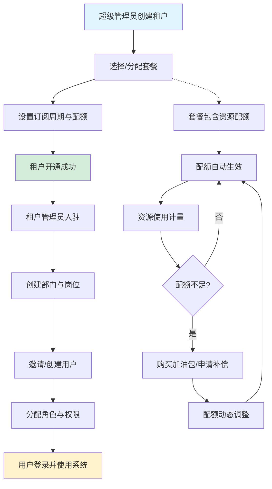

# NexusIX-Platform 功能需求规格说明书 (PRD)

## 文档信息

| 项目 | 内容 |
|------|------|
| 产品名称 | NexusIX-Platform |
| 版本号 | V1.0 |
| 文档状态 | 初稿 |
| 最后更新 | 2026-04-06 |

---

## 1. 系统概述

### 1.1 产品定位

NexusIX-Platform 是一个面向企业级用户的**多租户 SaaS 平台底座**，核心价值在于：

- **多租户隔离架构**：支持无限层级的租户树形结构，实现数据、权限、配置的完全隔离与灵活继承。
- **灵活的计费与配额管理**：提供套餐订阅、资源配额分配、动态调整（加油包/补偿）的完整商业闭环。
- **细粒度权限控制**：基于 RBAC + ABAC 混合模型，支持系统/租户/角色/用户四层权限策略及继承机制。
- **低代码扩展能力**：通过动态表单、动态数据源、打印模板配置，实现"配置即功能"的行业适配能力。
- **完善的审计与安全**：内置操作日志、登录日志、数据变更审计，支持租户级安全策略自定义。

### 1.2 目标用户

基于数据库结构推断，系统涉及以下核心角色：

| 角色 | 描述 | 典型场景 |
|------|------|----------|
| **超级管理员** | 平台运营方，tenant_id=0 | 创建根租户、上架套餐、发布系统公告、监控系统健康 |
| **租户管理员** | 租户内最高权限者（sys_user_tenant_rel.is_admin=true） | 管理本部门架构、分配角色、购买套餐、配置安全策略 |
| **普通员工** | 租户内的业务用户 | 使用业务功能、查看消息、提交审批 |
| **财务人员** | 负责账单与发票管理 | 查看订单、申请发票、对账 |
| **系统审计员** | 负责合规审计 | 查看操作日志、数据变更记录 |

### 1.3 核心业务流程图

---

## 2. 功能模块清单

| 模块编号 | 模块名称 | 核心功能点摘要 | 优先级 |
|---------|---------|--------------|--------|
| M01 | **租户管理中心** | 租户 CRUD、层级管理、状态冻结/解冻、过期提醒 | P0 |
| M02 | **计费与套餐中心** | 套餐定义、配额模板、订阅管理、订单处理、发票管理 | P0 |
| M03 | **配额管理** | 配额分配、使用计量、动态调整（加油包/补偿/惩罚）、超额控制 | P0 |
| M04 | **IAM 身份认证** | 用户注册/登录、多租户绑定、Token 管理、强制下线 | P0 |
| M05 | **权限控制中心** | 角色管理、权限策略配置、数据范围控制、权限继承计算 | P0 |
| M06 | **组织架构管理** | 部门树维护、岗位管理、用户组（静态/动态）、成员关联 | P0 |
| M07 | **动态配置中心** | 动态表单配置、动态数据源配置、打印模板管理 | P1 |
| M08 | **消息通知中心** | 消息模板管理、站内信收件箱、定时消息任务、阅读状态追踪 | P1 |
| M09 | **系统支撑服务** | 菜单管理、字典管理、文件上传、通知公告 | P1 |
| M10 | **安全与审计** | 租户安全策略、操作日志、登录日志、数据变更审计 | P0 |

---

## 3. 详细功能需求

### 3.1 租户管理中心 (M01)

#### 3.1.1 创建租户

- **功能描述**：超级管理员或父租户管理员创建新租户，支持无限层级嵌套。
- **前置条件**：操作用户具有租户创建权限，且父租户状态正常、未过期。
- **输入要素**：
  - 租户名称（必填，最长 100 字符）
  - 租户编码（必填，唯一，最长 50 字符）
  - 父租户 ID（可选，默认 0 表示根租户）
  - 联系人姓名、电话（可选）
  - 初始套餐 ID（可选，默认 0 表示无套餐）
  - 服务过期时间（可选，NULL 表示永久）
  - 扩展属性（JSONB，可选）
- **处理逻辑**：
  1. 校验租户编码全局唯一性。
  2. 若指定父租户，校验父租户存在且状态为正常（status=1）。
  3. 自动生成祖级列表 `ancestors`：父租户 ancestors + 父租户 ID。
  4. 若指定套餐 ID，校验套餐存在且已上架（status=1），并自动创建订阅记录（sys_tenant_subscription）。
  5. 插入 sys_tenant 记录，is_deleted=0，status=1（默认正常）。
  6. 若为新租户初始化默认角色（如租户管理员角色、普通员工角色）。
- **输出结果**：返回租户 ID，创建成功；失败则返回具体错误原因（如编码重复、父租户不存在等）。
- **关联数据表**：`sys_tenant`, `sys_tenant_subscription`, `prod_package`, `sys_role`
- **优先级**：P0
- **预估工时**：3 人天

#### 3.1.2 租户层级查询

- **功能描述**：以树形结构展示租户层级关系，支持展开/折叠。
- **前置条件**：操作用户具有租户查看权限。
- **输入要素**：
  - 父租户 ID（可选，默认 0 查询根租户）
  - 搜索关键词（可选，模糊匹配租户名称或编码）
- **处理逻辑**：
  1. 根据 parent_id 或 ancestors 字段查询子租户列表。
  2. 递归构建租户树，每层包含租户基础信息及子节点数量。
  3. 支持按状态过滤（正常/冻结/过期）。
- **输出结果**：返回租户树形结构 JSON。
- **关联数据表**：`sys_tenant`
- **优先级**：P0
- **预估工时**：2 人天

#### 3.1.3 租户状态管理

- **功能描述**：冻结/解冻租户，冻结后该租户下所有用户无法登录。
- **前置条件**：操作用户为超级管理员或父租户管理员。
- **输入要素**：
  - 租户 ID
  - 目标状态（1-正常 0-冻结）
- **处理逻辑**：
  1. 校验租户存在且未被逻辑删除。
  2. 更新 sys_tenant.status 字段。
  3. 若冻结租户，失效该租户下所有有效 Token（sys_user_token.status=0）。
  4. 记录操作日志。
- **输出结果**：状态更新成功/失败反馈。
- **关联数据表**：`sys_tenant`, `sys_user_token`, `sys_oper_log`
- **优先级**：P0
- **预估工时**：1 人天

#### 3.1.4 租户过期处理

- **功能描述**：系统每日定时扫描过期租户，执行服务降级或冻结。
- **前置条件**：定时任务触发。
- **处理逻辑**：
  1. 查询 expire_time < 当前时间 且 status=1 的租户。
  2. 将租户状态更新为冻结（status=0）。
  3. 失效该租户下所有 Token。
  4. 向租户管理员发送过期提醒消息（sys_inbox_message）。
  5. 若租户有自动续费订阅（is_auto_renew=true），尝试生成续费订单。
- **输出结果**：过期租户列表及处理结果日志。
- **关联数据表**：`sys_tenant`, `sys_tenant_subscription`, `sys_user_token`, `sys_inbox_message`, `bill_order`
- **优先级**：P0
- **预估工时**：2 人天

---

### 3.2 计费与套餐中心 (M02)

#### 3.2.1 套餐定义管理

- **功能描述**：超级管理员创建、编辑、上架/下架可售卖的套餐产品。
- **前置条件**：操作用户为超级管理员。
- **输入要素**：
  - 套餐名称（必填，最长 100 字符）
  - 套餐编码（必填，唯一，最长 50 字符）
  - 描述（可选）
  - 价格（Decimal，默认 0.00）
  - 周期类型（1-天 2-月 3-年）
  - 周期数值（Int，默认 1）
  - 排序（Int，默认 0）
  - 扩展配置（JSONB，存储功能开关，如 {"max_users": 100, "enable_api": true}）
  - 状态（1-上架 0-下架）
- **处理逻辑**：
  1. 校验套餐编码全局唯一。
  2. 插入或更新 prod_package 记录。
  3. 若为新建套餐，可同时配置配额模板（prod_package_quota）。
  4. 下架套餐时，校验是否有生效中的订阅，若有则禁止下架或提示风险。
- **输出结果**：套餐 ID 及操作结果。
- **关联数据表**：`prod_package`, `prod_package_quota`, `sys_tenant_subscription`
- **优先级**：P0
- **预估工时**：2 人天

#### 3.2.2 套餐配额模板管理

- **功能描述**：为套餐定义资源配额，如 Token 数量、存储空间、API 调用次数等。
- **前置条件**：套餐已创建。
- **输入要素**：
  - 套餐 ID
  - 资源代码（必填，如 TOKENS, STORAGE, API_CALLS）
  - 资源名称（必填）
  - 配额数值（BigInt，必填）
  - 单位（可选，如 GB, 次）
  - 是否允许超额（Boolean，默认 false）
- **处理逻辑**：
  1. 校验资源代码在套餐下唯一。
  2. 插入 prod_package_quota 记录。
  3. 当租户订阅该套餐时，自动将配额复制到租户可用配额池。
- **输出结果**：配额模板 ID。
- **关联数据表**：`prod_package_quota`, `prod_package`
- **优先级**：P0
- **预估工时**：1.5 人天

#### 3.2.3 租户订阅管理

- **功能描述**：记录租户购买的套餐及订阅状态，支持自购和父租户分配两种模式。
- **前置条件**：租户和套餐均存在。
- **输入要素**：
  - 租户 ID
  - 套餐 ID
  - 订阅类型（1-自购 2-父租户分配）
  - 开始时间、结束时间
  - 是否自动续费（Boolean）
  - 父租户分配记录 ID（仅订阅类型=2 时填写）
- **处理逻辑**：
  1. 校验套餐存在且已上架。
  2. 若为自购，校验租户已支付对应订单（bill_order.status=1）。
  3. 若为父租户分配，校验父租户有足够的可分配配额。
  4. 插入 sys_tenant_subscription 记录，status=1（生效）。
  5. 更新 sys_tenant.package_id 为当前套餐 ID。
  6. 根据套餐配额模板，初始化或累加租户可用配额。
- **输出结果**：订阅记录 ID。
- **关联数据表**：`sys_tenant_subscription`, `sys_tenant`, `prod_package`, `bill_order`, `sys_tenant_quota_adjustment`
- **优先级**：P0
- **预估工时**：3 人天

#### 3.2.4 订单管理

- **功能描述**：记录租户购买套餐或配额包的订单，支持多种支付渠道。
- **前置条件**：租户已登录。
- **输入要素**：
  - 租户 ID
  - 产品类型（1-套餐 2-配额包）
  - 产品 ID
  - 订单总金额、实际支付金额
  - 支付渠道（如 alipay, wechat, stripe）
  - 订单明细（JSONB，如 [{"product_name": "专业版", "quantity": 1, "price": 999}]）
  - 扩展属性（JSONB，行业特有字段）
- **处理逻辑**：
  1. 生成唯一订单号（order_no）。
  2. 插入 bill_order 记录，status=0（未付）。
  3. 对接支付网关，等待回调。
  4. 支付成功后，更新 status=1，记录 pay_time。
  5. 触发订阅创建流程（3.2.3）。
  6. 若支付失败或超时，更新 status=2（取消）。
- **输出结果**：订单号及支付链接。
- **关联数据表**：`bill_order`, `sys_tenant_subscription`, `prod_package`
- **优先级**：P0
- **预估工时**：4 人天（含支付对接）

#### 3.2.5 发票管理

- **功能描述**：租户申请开具发票，管理员审核后生成发票文件。
- **前置条件**：订单已支付（bill_order.status=1）。
- **输入要素**：
  - 订单 ID
  - 发票类型（1-普票 2-专票 3-电子发票）
  - 发票抬头、税号
  - 发票金额
- **处理逻辑**：
  1. 校验订单存在且未关联其他发票。
  2. 插入 bill_invoice 记录，status=0（待开具）。
  3. 管理员审核后，上传发票文件，更新 invoice_url 和 status=1（已开具）。
  4. 租户可下载发票 PDF。
- **输出结果**：发票记录 ID 及下载链接。
- **关联数据表**：`bill_invoice`, `bill_order`
- **优先级**：P1
- **预估工时**：2 人天

---

### 3.3 配额管理 (M03)

#### 3.3.1 配额查询

- **功能描述**：查询租户当前可用配额、已使用量、剩余量。
- **前置条件**：租户已登录。
- **输入要素**：
  - 租户 ID
  - 资源代码（可选，筛选特定资源）
- **处理逻辑**：
  1. 汇总租户所有生效订阅的配额（sys_tenant_subscription + prod_package_quota）。
  2. 汇总配额调整记录（sys_tenant_quota_adjustment），区分永久调整和临时调整（expire_time 不为 NULL）。
  3. 汇总资源使用记录（sys_resource_usage），计算已使用量。
  4. 可用配额 = 基础配额 + 永久调整 + 未过期的临时调整 - 已使用量。
- **输出结果**：各资源的配额详情列表（资源名称、总额度、已使用、剩余、单位、是否允许超额）。
- **关联数据表**：`sys_tenant_subscription`, `prod_package_quota`, `sys_tenant_quota_adjustment`, `sys_resource_usage`
- **优先级**：P0
- **预估工时**：2 人天

#### 3.3.2 配额动态调整

- **功能描述**：为租户增加或减少配额，支持购买加油包、补偿、惩罚三种场景。
- **前置条件**：操作用户为超级管理员或租户管理员。
- **输入要素**：
  - 租户 ID
  - 资源代码
  - 调整数值（正数为增加，负数为减少）
  - 调整类型（1-购买加油包 2-补偿 3-惩罚）
  - 原因（必填，最长 500 字符）
  - 生效时间（默认当前时间）
  - 过期时间（可选，NULL 表示永久）
- **处理逻辑**：
  1. 校验租户存在。
  2. 若为购买加油包，需关联支付订单（bill_order）。
  3. 插入 sys_tenant_quota_adjustment 记录。
  4. 重新计算租户可用配额。
  5. 记录操作日志。
- **输出结果**：调整记录 ID。
- **关联数据表**：`sys_tenant_quota_adjustment`, `bill_order`, `sys_oper_log`
- **优先级**：P0
- **预估工时**：2 人天

#### 3.3.3 资源使用计量

- **功能描述**：记录租户资源消耗流水，用于配额扣减和账单生成。
- **前置条件**：业务系统调用计量接口。
- **输入要素**：
  - 租户 ID
  - 资源代码
  - 消耗数值
  - 业务类型（如 order_create, api_call）
  - 关联业务 ID
  - 备注
- **处理逻辑**：
  1. 插入 sys_resource_usage 记录。
  2. 异步更新租户已使用配额缓存。
  3. 若已使用量超过可用配额且不允许超额（is_allow_overage=false），触发告警或服务限制。
- **输出结果**：计量记录 ID。
- **关联数据表**：`sys_resource_usage`, `sys_tenant_quota_adjustment`, `prod_package_quota`
- **优先级**：P0
- **预估工时**：1.5 人天

#### 3.3.4 超额控制

- **功能描述**：当租户资源使用超过配额时，根据配置执行告警、限制或拒绝服务。
- **前置条件**：配额监控任务触发。
- **处理逻辑**：
  1. 定期扫描各租户资源使用率。
  2. 若使用率 > 80%，发送预警消息给租户管理员。
  3. 若使用率 >= 100% 且 is_allow_overage=false，限制相关功能（如禁止创建新订单、禁止 API 调用）。
  4. 若 is_allow_overage=true，允许超额但记录超额用量，后续可生成超额费用账单。
- **输出结果**：告警消息或服务限制状态。
- **关联数据表**：`sys_resource_usage`, `sys_inbox_message`, `prod_package_quota`
- **优先级**：P1
- **预估工时**：2 人天

---

### 3.4 IAM 身份认证 (M04)

#### 3.4.1 用户注册与登录

- **功能描述**：用户通过用户名/密码登录，支持多租户切换。
- **前置条件**：用户已在系统中创建。
- **输入要素**：
  - 用户名、密码
  - 租户编码（可选，若用户绑定多个租户）
- **处理逻辑**：
  1. 校验用户名和密码（密码需符合租户安全策略，见 3.10.1）。
  2. 校验用户全局状态（sys_user.status=1）且未删除。
  3. 若指定租户编码，校验用户与该租户的关联关系（sys_user_tenant_rel）存在且未删除。
  4. 若未指定租户且用户只绑定一个租户，自动选择该租户；若绑定多个，返回租户列表供用户选择。
  5. 校验租户状态正常（sys_tenant.status=1）且未过期。
  6. 生成 Token，插入 sys_user_token 记录，设置过期时间。
  7. 更新用户最后登录 IP 和时间。
  8. 记录登录日志（sys_login_log）。
- **输出结果**：Token 及用户信息（含租户列表、角色、权限）。
- **关联数据表**：`sys_user`, `sys_user_tenant_rel`, `sys_tenant`, `sys_user_token`, `sys_login_log`, `sys_tenant_security`
- **优先级**：P0
- **预估工时**：3 人天

#### 3.4.2 多租户绑定管理

- **功能描述**：为用户绑定或解绑租户，支持一个人在多个租户中担任不同角色。
- **前置条件**：操作用户为超级管理员或租户管理员。
- **输入要素**：
  - 用户 ID
  - 租户 ID
  - 主部门 ID（可选，必须属于当前租户）
  - 是否租户管理员（Boolean）
- **处理逻辑**：
  1. 校验用户和租户存在。
  2. 插入 sys_user_tenant_rel 记录，is_deleted=0。
  3. 若设置 is_admin=true，自动为该用户分配租户管理员角色。
  4. 解绑时，逻辑删除关联记录（is_deleted=1），并失效该租户下的 Token。
- **输出结果**：绑定/解绑成功反馈。
- **关联数据表**：`sys_user_tenant_rel`, `sys_user`, `sys_tenant`, `sys_user_role_rel`, `sys_user_token`
- **优先级**：P0
- **预估工时**：2 人天

#### 3.4.3 Token 管理与强制下线

- **功能描述**：查看用户登录设备列表，支持强制下线指定设备。
- **前置条件**：操作用户为租户管理员或用户本人。
- **输入要素**：
  - 用户 ID
  - 租户 ID
- **处理逻辑**：
  1. 查询 sys_user_token 中该用户在该租户下的有效 Token 列表。
  2. 展示设备信息、登录时间、过期时间。
  3. 强制下线时，更新对应 Token 的 status=0。
- **输出结果**：Token 列表及操作结果。
- **关联数据表**：`sys_user_token`
- **优先级**：P1
- **预估工时**：1 人天

---

### 3.5 权限控制中心 (M05)

#### 3.5.1 角色管理

- **功能描述**：创建、编辑、删除角色，支持系统级、租户级、用户级三层角色。
- **前置条件**：操作用户具有角色管理权限。
- **输入要素**：
  - 角色名称、角色编码
  - 角色层级（1-系统 2-租户 3-用户）
  - 所属租户 ID（系统级为 0）
  - 数据范围（1-全部 2-本部门 3-本人 4-自定义）
  - 排序
- **处理逻辑**：
  1. 校验角色编码在相同 tenant_id 下唯一。
  2. 插入 sys_role 记录。
  3. 若数据范围为自定义（4），需关联部门（sys_role_dept_rel）。
  4. 删除角色时，校验是否有用户关联，若有则禁止删除或提示风险。
- **输出结果**：角色 ID。
- **关联数据表**：`sys_role`, `sys_role_dept_rel`, `sys_user_role_rel`
- **优先级**：P0
- **预估工时**：2 人天

#### 3.5.2 权限策略配置

- **功能描述**：为系统/租户/角色/用户配置允许或拒绝特定权限，支持优先级和继承。
- **前置条件**：操作用户为超级管理员或租户管理员。
- **输入要素**：
  - 目标类型（1-系统 2-租户 3-角色 4-用户）
  - 目标 ID
  - 权限 ID
  - 动作（1-允许 2-拒绝）
  - 优先级（Int，数字越大优先级越高）
  - 是否向下继承（Boolean，默认 true）
- **处理逻辑**：
  1. 插入 sys_permission_policy 记录。
  2. 权限计算逻辑：
     - 收集用户直接关联的角色。
     - 递归收集所有适用的权限策略（系统级 → 租户级 → 角色级 → 用户级）。
     - 按优先级排序，高优先级覆盖低优先级。
     - 若存在"拒绝"策略且优先级最高，则最终结果为拒绝。
     - 若 inheritance_enabled=false，则不继承上级策略。
  3. 缓存权限计算结果，提升校验性能。
- **输出结果**：策略记录 ID。
- **关联数据表**：`sys_permission_policy`, `sys_permission`, `sys_role`, `sys_user_role_rel`
- **优先级**：P0
- **预估工时**：4 人天（权限计算复杂度高）

#### 3.5.3 数据范围控制

- **功能描述**：根据角色的数据范围配置，限制用户可访问的数据。
- **前置条件**：用户已登录并选择租户。
- **处理逻辑**：
  1. 获取用户当前租户下的所有角色。
  2. 合并所有角色的数据范围：
     - 若任一角色为"全部"（1），则用户可查看全部数据。
     - 若为"本部门"（2），则用户只能查看本部门及子部门数据（通过 sys_dept.ancestors 判断）。
     - 若为"本人"（3），则用户只能查看自己创建的数据。
     - 若为"自定义"（4），则用户只能查看 sys_role_dept_rel 中关联的部门数据。
  3. 在 SQL 查询中动态注入数据范围过滤条件。
- **输出结果**：过滤后的数据列表。
- **关联数据表**：`sys_role`, `sys_role_dept_rel`, `sys_dept`, `sys_user_tenant_rel`
- **优先级**：P0
- **预估工时**：3 人天

#### 3.5.4 用户角色关联

- **功能描述**：为用户分配或移除角色。
- **前置条件**：操作用户为租户管理员。
- **输入要素**：
  - 用户 ID
  - 角色 ID 列表
  - 租户 ID
- **处理逻辑**：
  1. 校验角色属于指定租户。
  2. 批量插入 sys_user_role_rel 记录。
  3. 移除角色时，删除对应关联记录。
  4. 清除用户权限缓存。
- **输出结果**：关联成功/失败反馈。
- **关联数据表**：`sys_user_role_rel`, `sys_role`, `sys_user`
- **优先级**：P0
- **预估工时**：1 人天

---

### 3.6 组织架构管理 (M06)

#### 3.6.1 部门管理

- **功能描述**：维护租户内的部门树形结构，支持无限层级。
- **前置条件**：操作用户为租户管理员。
- **输入要素**：
  - 部门名称
  - 父部门 ID（默认 0 表示根部门）
  - 部门负责人 ID（可选）
  - 部门电话
  - 排序
- **处理逻辑**：
  1. 校验父部门存在且属于同一租户。
  2. 自动生成 ancestors：父部门 ancestors + 父部门 ID。
  3. 插入 sys_dept 记录。
  4. 移动部门时，递归更新所有子部门的 ancestors。
  5. 删除部门时，校验是否有子部门或关联用户，若有则禁止删除。
- **输出结果**：部门 ID。
- **关联数据表**：`sys_dept`, `sys_user_tenant_rel`
- **优先级**：P0
- **预估工时**：2 人天

#### 3.6.2 岗位管理

- **功能描述**：在部门下创建和管理岗位。
- **前置条件**：部门已存在。
- **输入要素**：
  - 岗位名称、岗位编码
  - 所属部门 ID
  - 租户 ID
  - 排序
- **处理逻辑**：
  1. 校验岗位编码在租户下唯一。
  2. 校验部门存在。
  3. 插入 sys_post 记录。
- **输出结果**：岗位 ID。
- **关联数据表**：`sys_post`, `sys_dept`
- **优先级**：P1
- **预估工时**：1 人天

#### 3.6.3 用户组管理

- **功能描述**：创建虚拟用户组，支持跨部门权限分配。
- **前置条件**：操作用户为租户管理员。
- **输入要素**：
  - 组名称
  - 组类型（1-静态 2-动态）
  - 描述
- **处理逻辑**：
  1. 插入 sys_user_group 记录。
  2. 静态组：手动添加/移除成员（sys_user_group_rel）。
  3. 动态组：根据规则自动匹配成员（规则存储在 ext_config，后续扩展）。
- **输出结果**：用户组 ID。
- **关联数据表**：`sys_user_group`, `sys_user_group_rel`
- **优先级**：P1
- **预估工时**：1.5 人天

---

### 3.7 动态配置中心 (M07)

#### 3.7.1 动态表单配置

- **功能描述**：租户可自定义业务表单字段，实现行业适配。
- **前置条件**：操作用户为租户管理员。
- **输入要素**：
  - 业务类型（如 education_order, restaurant_order）
  - 表单名称
  - 表单结构（JSONB，定义字段类型、标签、校验规则、选项等）
  - 版本号（默认 1）
- **处理逻辑**：
  1. 校验业务类型在租户下唯一。
  2. 插入 sys_form_config 记录。
  3. 前端根据 form_schema 动态渲染表单。
  4. 提交表单时，数据存储在业务表的 ext_attributes 字段（JSONB）。
  5. 支持版本管理，新版本不影响旧数据。
- **输出结果**：表单配置 ID。
- **关联数据表**：`sys_form_config`
- **优先级**：P1
- **预估工时**：3 人天（含前端动态渲染）

#### 3.7.2 动态数据源配置

- **功能描述**：配置下拉框等组件的数据来源，支持业务表、API、字典、SQL 四种类型。
- **前置条件**：操作用户为租户管理员。
- **输入要素**：
  - 数据源编码、名称
  - 数据源类型（1-业务表 2-API 接口 3-字典 4-SQL 查询）
  - 数据源配置（JSONB，如表名、字段、API URL、SQL 语句等）
  - 是否启用缓存、缓存过期时间（秒）
- **处理逻辑**：
  1. 校验数据源编码在租户下唯一。
  2. 插入 sys_datasource_config 记录。
  3. 前端组件根据 datasource_code 请求数据。
  4. 后端根据配置类型获取数据，若启用缓存则从 Redis 读取。
  5. SQL 类型需防止注入，仅允许白名单表。
- **输出结果**：数据源配置 ID。
- **关联数据表**：`sys_datasource_config`
- **优先级**：P1
- **预估工时**：3 人天

#### 3.7.3 打印模板管理

- **功能描述**：配置不同业务的打印/PDF 模板，支持 HTML、Markdown、JSON 三种类型。
- **前置条件**：操作用户为租户管理员。
- **输入要素**：
  - 模板编码、名称
  - 业务类型
  - 模板类型（1-HTML 2-Markdown 3-JSON 配置）
  - 模板内容
  - 模板配置（JSONB，定义变量映射、条件显示）
  - 纸张大小（A4/A5/80mm 等）
  - 纸张方向（portrait/landscape）
  - 是否默认模板
- **处理逻辑**：
  1. 校验模板编码在租户下唯一。
  2. 插入 sys_print_template 记录。
  3. 打印时，根据 biz_type 查找模板，替换变量生成最终内容。
  4. 调用打印服务生成 PDF 或直接打印。
- **输出结果**：模板配置 ID。
- **关联数据表**：`sys_print_template`
- **优先级**：P1
- **预估工时**：2.5 人天

---

### 3.8 消息通知中心 (M08)

#### 3.8.1 消息模板管理

- **功能描述**：定义各类消息的内容模板，支持变量占位符和多语言。
- **前置条件**：操作用户为超级管理员或租户管理员。
- **输入要素**：
  - 模板编码、名称
  - 业务类型（如 order, subscription, system）
  - 消息类型（1-通知 2-营销 3-验证 4-提醒）
  - 模板标题、内容（支持 ${variableName} 占位符）
  - 变量定义（JSONB，定义变量名、类型、是否必填）
  - 示例数据（JSONB，用于测试预览）
  - 语言（zh-CN/en-US 等）
- **处理逻辑**：
  1. 校验模板编码在全局或租户下唯一。
  2. 插入 sys_message_template 记录。
  3. 发送消息时，根据 template_code 查找模板，替换变量生成最终内容。
- **输出结果**：模板 ID。
- **关联数据表**：`sys_message_template`
- **优先级**：P1
- **预估工时**：2 人天

#### 3.8.2 站内信收件箱

- **功能描述**：用户查看个人消息，支持标记已读、归档、删除。
- **前置条件**：用户已登录。
- **输入要素**：
  - 分页参数
  - 消息类型过滤（可选）
  - 阅读状态过滤（可选）
- **处理逻辑**：
  1. 查询 sys_inbox_message 中当前用户的消息。
  2. 支持按优先级排序（紧急 > 重要 > 普通）。
  3. 标记已读时，更新 is_read=true 和 read_time。
  4. 归档时，更新 is_archived=true 和 archived_time。
  5. 过期消息（expire_time < 当前时间）自动隐藏。
- **输出结果**：消息列表。
- **关联数据表**：`sys_inbox_message`
- **优先级**：P1
- **预估工时**：2 人天

#### 3.8.3 定时消息任务

- **功能描述**：预约发送或周期性发送消息，如套餐过期提醒、每日报表推送。
- **前置条件**：操作用户为超级管理员或租户管理员。
- **输入要素**：
  - 任务名称
  - 消息模板 ID
  - 目标类型（1-指定用户 2-指定租户 3-符合条件的所有用户）
  - 目标 ID 集合（逗号分隔）
  - 触发类型（1-单次定时 2-周期循环 3-事件触发）
  - 触发条件（JSONB，如 {"time": "09:00", "repeat": "daily"}）
  - 计划执行时间
- **处理逻辑**：
  1. 插入 sys_message_schedule 记录，status=0（待执行）。
  2. 定时任务扫描 execute_time <= 当前时间 且 status=0 的任务。
  3. 根据 target_type 和目标 IDs，生成 sys_inbox_message 记录。
  4. 更新任务状态：单次任务 status=2（已完成），周期任务更新 last_execute_time 和 executed_count。
  5. 事件触发类型由业务代码手动触发。
- **输出结果**：任务 ID。
- **关联数据表**：`sys_message_schedule`, `sys_inbox_message`, `sys_message_template`
- **优先级**：P1
- **预估工时**：3 人天

---

### 3.9 系统支撑服务 (M09)

#### 3.9.1 菜单管理

- **功能描述**：配置前端导航菜单和按钮权限映射。
- **前置条件**：操作用户为超级管理员。
- **输入要素**：
  - 菜单名称
  - 菜单类型（1-目录 2-菜单 3-按钮）
  - 父菜单 ID
  - 路由地址、组件路径
  - 权限标识
  - 是否可见、状态
  - 排序
- **处理逻辑**：
  1. 插入 sys_menu 记录。
  2. 前端根据用户权限动态加载菜单树。
  3. 按钮权限通过 perm_code 控制显示/隐藏。
- **输出结果**：菜单 ID。
- **关联数据表**：`sys_menu`, `sys_permission`
- **优先级**：P1
- **预估工时**：1.5 人天

#### 3.9.2 字典管理

- **功能描述**：管理系统常量字典，支持系统级和租户级字典。
- **前置条件**：操作用户为超级管理员或租户管理员。
- **输入要素**：
  - 字典类型、名称
  - 字典项标签、值
  - 排序
- **处理逻辑**：
  1. 插入 sys_dict 和 sys_dict_item 记录。
  2. 前端加载字典时，优先加载租户级字典， fallback 到系统级字典。
  3. 字典数据缓存到 Redis，提升加载速度。
- **输出结果**：字典 ID。
- **关联数据表**：`sys_dict`, `sys_dict_item`
- **优先级**：P1
- **预估工时**：1 人天

#### 3.9.3 文件上传

- **功能描述**：上传文件并记录元数据，支持租户隔离。
- **前置条件**：用户已登录。
- **输入要素**：
  - 文件二进制流
  - 租户 ID
- **处理逻辑**：
  1. 校验文件大小和类型。
  2. 上传文件到对象存储（如 OSS、S3）。
  3. 插入 sys_file 记录，存储文件路径和 URL。
  4. 返回文件访问 URL。
- **输出结果**：文件 ID 和 URL。
- **关联数据表**：`sys_file`
- **优先级**：P1
- **预估工时**：1.5 人天

#### 3.9.4 通知公告

- **功能描述**：发布系统公告或站内通知，支持定向发送。
- **前置条件**：操作用户为超级管理员或租户管理员。
- **输入要素**：
  - 公告标题、内容
  - 公告类型（1-公告 2-通知）
  - 目标类型（1-全员 2-指定租户 3-指定用户）
  - 目标 ID 集合（逗号分隔）
- **处理逻辑**：
  1. 插入 sys_notice 记录。
  2. 根据 target_type 和目标 IDs，为每个目标用户生成 sys_notice_user_rel 记录（read_status=0）。
  3. 用户登录后查看未读公告。
  4. 用户点击公告后，更新 read_status=1 和 read_time。
- **输出结果**：公告 ID。
- **关联数据表**：`sys_notice`, `sys_notice_user_rel`
- **优先级**：P1
- **预估工时**：2 人天

---

### 3.10 安全与审计 (M10)

#### 3.10.1 租户安全策略配置

- **功能描述**：租户自定义密码策略和登录限制。
- **前置条件**：操作用户为租户管理员。
- **输入要素**：
  - 密码最小长度（默认 6）
  - 密码复杂度（0-无 1-字母+数字 2-字母+数字+特殊字符）
  - 密码过期天数（0-永不过期）
  - 登录失败锁定次数（默认 5）
  - 锁定时长（分钟，默认 30）
- **处理逻辑**：
  1. 插入或更新 sys_tenant_security 记录。
  2. 用户修改密码时，校验是否符合策略。
  3. 登录失败时，累计失败次数，达到阈值后锁定账户。
  4. 密码过期时，强制用户修改密码。
- **输出结果**：策略配置 ID。
- **关联数据表**：`sys_tenant_security`, `sys_user`, `sys_login_log`
- **优先级**：P0
- **预估工时**：2 人天

#### 3.10.2 操作日志

- **功能描述**：记录用户关键操作行为，用于审计和问题追溯。
- **前置条件**：业务系统调用日志记录接口。
- **输入要素**：
  - 操作模块、业务类型
  - 请求方法、URL
  - 操作人员姓名、ID
  - 部门名称
  - 操作 IP、地点
  - 请求参数、返回结果
  - 操作状态、错误消息
- **处理逻辑**：
  1. 通过 AOP 或中间件自动捕获请求。
  2. 插入 sys_oper_log 记录。
  3. 敏感数据（如密码）脱敏后存储。
  4. 日志保留策略：默认保留 180 天，超期自动清理。
- **输出结果**：日志记录 ID。
- **关联数据表**：`sys_oper_log`
- **优先级**：P0
- **预估工时**：1.5 人天

#### 3.10.3 登录日志

- **功能描述**：记录用户登录信息，包括成功和失败尝试。
- **前置条件**：用户尝试登录。
- **输入要素**：
  - 用户 ID、用户名
  - 租户 ID
  - 登录 IP、地点
  - 浏览器、操作系统
  - 登录状态、提示消息
- **处理逻辑**：
  1. 登录成功后，插入 sys_login_log 记录，status=1。
  2. 登录失败时，插入记录，status=0，记录失败原因。
  3. 结合登录失败次数，触发账户锁定。
- **输出结果**：日志记录 ID。
- **关联数据表**：`sys_login_log`, `sys_tenant_security`
- **优先级**：P0
- **预估工时**：1 人天

#### 3.10.4 数据变更审计

- **功能描述**：记录关键数据的字段级变更详情，支持前后对比。
- **前置条件**：业务系统调用审计接口。
- **输入要素**：
  - 租户 ID
  - 表名、记录 ID
  - 操作人 ID
  - 操作类型（1-更新 2-删除）
  - 修改前数据（JSONB）
  - 修改后数据（JSONB）
- **处理逻辑**：
  1. 在业务数据更新/删除前，捕获旧值和新值。
  2. 插入 sys_data_audit_log 记录。
  3. 提供审计查询界面，支持按表名、记录 ID、操作人、时间范围筛选。
  4. 展示字段级差异（高亮显示变更字段）。
- **输出结果**：审计记录 ID。
- **关联数据表**：`sys_data_audit_log`
- **优先级**：P0
- **预估工时**：2 人天

---

## 4. 非功能需求 (NFR)

### 4.1 性能要求

| 场景 | 性能指标 | 建议方案 |
|------|---------|---------|
| **权限校验** | P99 < 10ms | 权限计算结果缓存到 Redis，Key: `perm:{user_id}:{tenant_id}`，TTL 30 分钟 |
| **字典加载** | P99 < 50ms | 全量字典缓存到 Redis，Key: `dict:{tenant_id}:{dict_type}`，TTL 24 小时 |
| **租户树查询** | P99 < 200ms | 使用 `ancestors` 字段 LIKE 查询，避免递归；建立 `(parent_id, is_deleted)` 复合索引 |
| **配额查询** | P99 < 100ms | 配额总额和已使用量预计算并缓存，Key: `quota:{tenant_id}:{resource_code}` |
| **消息列表** | P99 < 150ms | 分页查询，建立 `(user_id, is_read, create_time)` 复合索引 |

### 4.2 安全性

#### 4.2.1 密码策略

- 密码必须经过 bcrypt 或 Argon2 加密后存储。
- 支持租户级自定义密码复杂度（sys_tenant_security.pwd_complexity）。
- 密码过期时，强制用户修改，且不能与前 3 次密码相同。

#### 4.2.2 数据隔离机制

- **租户隔离**：所有业务查询必须携带 `tenant_id` 过滤条件，建议在 ORM 层通过拦截器自动注入。
- **系统级数据**：tenant_id=0 的数据对所有租户可见（如系统字典、系统菜单），但不可修改。
- **物理隔离可选**：对于高安全要求租户，支持独立 schema 或独立数据库实例。

#### 4.2.3 审计日志

- **操作日志**（sys_oper_log）：记录所有写操作（POST/PUT/DELETE），保留至少 180 天。
- **登录日志**（sys_login_log）：记录所有登录尝试，保留至少 365 天。
- **数据审计**（sys_data_audit_log）：记录关键业务表（如订单、配额、权限）的字段级变更，保留至少 365 天。
- 日志表建议按月分表，提升查询性能。

### 4.3 可扩展性

#### 4.3.1 JSONB 字段使用规范

| 表 | 字段 | 用途 | 建议 |
|----|------|------|------|
| sys_tenant | ext_attributes | 行业特定配置 | 存储结构化 JSON，如 `{"industry": "education", "school_code": "xxx"}` |
| prod_package | ext_config | 套餐功能开关 | 存储布尔值或数值，如 `{"max_users": 100, "enable_api": true}` |
| sys_form_config | form_schema | 动态表单结构 | 遵循 JSON Schema 规范，便于前端解析 |
| sys_datasource_config | datasource_config | 数据源连接配置 | 加密敏感信息（如数据库密码）后再存储 |
| sys_print_template | template_config | 打印模板变量映射 | 定义变量名与数据字段的映射关系 |
| bill_order | order_items, ext_attributes | 订单明细和行业扩展 | order_items 存储商品列表，ext_attributes 存储行业特有字段 |
| sys_message_template | template_example, variables | 消息模板示例和变量定义 | 用于前端预览和变量校验 |
| sys_message_schedule | trigger_condition, repeat_rule | 定时任务触发条件 | 如 `{"type": "daily", "time": "09:00"}` |
| sys_data_audit_log | old_value, new_value | 数据变更前后快照 | 仅存储变更字段，减少存储空间 |

#### 4.3.2 索引建议

- **高频查询字段**：在所有表的 `tenant_id`, `is_deleted`, `status` 字段上建立复合索引。
- **唯一约束**：对业务唯一字段（如 tenant_code, package_code, username）建立唯一索引。
- **时间范围查询**：对日志表的 `create_time`, `oper_time` 建立索引，支持按时间范围筛选。

#### 4.3.3 软删除机制

- 所有核心业务表均包含 `is_deleted` 字段（SMALLINT，0-正常 1-删除）。
- 所有查询必须携带 `is_deleted=0` 条件，建议在 ORM 层通过全局过滤器自动注入。
- 删除操作改为更新 `is_deleted=1`，不物理删除数据。
- 定期归档已删除数据（如保留 1 年后物理删除），释放存储空间。

### 4.4 可用性

- **多活部署**：支持多区域部署，数据库采用主从复制，读写分离。
- **故障转移**：当主数据库不可用时，自动切换到从库。
- **备份策略**：每日全量备份，每小时增量备份，备份数据保留 30 天。

### 4.5 兼容性

- **数据库版本**：PostgreSQL 17+，利用 JSONB、GIN 索引等新特性。
- **主键策略**：雪花算法生成的 BIGINT，确保分布式环境下全局唯一。
- **无物理外键**：所有关联关系通过应用层逻辑保证，便于水平拆分和迁移。

---

## 附录

### A. 术语表

| 术语 | 定义 |
|------|------|
| 租户 (Tenant) | 使用平台的独立组织或企业，数据完全隔离 |
| 套餐 (Package) | 可售卖的产品组合，包含一组资源配额和功能开关 |
| 配额 (Quota) | 租户可使用的资源上限，如 Token 数量、存储空间 |
| 权限策略 (Permission Policy) | 定义谁（系统/租户/角色/用户）可以对什么权限执行什么动作（允许/拒绝） |
| 数据范围 (Data Scope) | 角色可访问的数据范围，如全部、本部门、本人、自定义部门 |
| 动态表单 (Dynamic Form) | 通过 JSON 配置而非硬代码定义的表单，支持运行时修改 |

### B. 参考文档

- PostgreSQL 17 官方文档：https://www.postgresql.org/docs/17/
- 雪花算法（Snowflake）原理：https://github.com/twitter-archive/snowflake
- RBAC 与 ABAC 权限模型对比：https://csrc.nist.gov/publications/detail/conference-paper/2018/03/12/abac-versus-rbac
