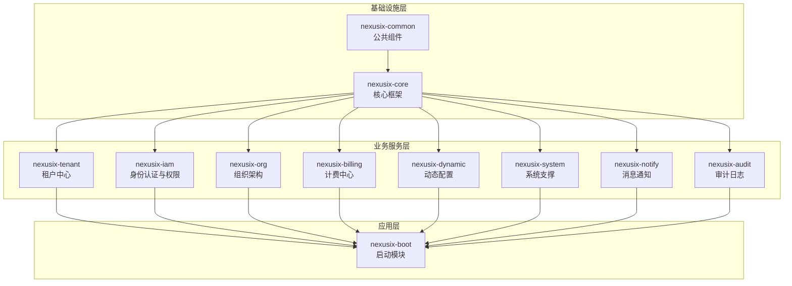

# NexusIX-Platform 开发手册

## 文档信息

| 项目 | 内容 |
|------|------|
| 产品名称 | NexusIX-Platform |
| 版本号 | V1.0 |
| 文档状态 | 初稿 |
| 最后更新 | 2026-04-18 |

---

## 目录

1. [概述](#1-概述)
2. [代码规范性要求](#2-代码规范性要求)
3. [完整开发流程](#3-完整开发流程)
4. [模块开发顺序及依赖关系](#4-模块开发顺序及依赖关系)
5. [功能开发清单](#5-功能开发清单)
6. [接口定义及实现方案](#6-接口定义及实现方案)
7. [附录](#7-附录)

---

## 1. 概述

### 1.1 项目简介

NexusIX-Platform 是一个面向企业级用户的**多租户 SaaS 平台底座**，核心特性包括：

- **多租户隔离架构**：支持无限层级的租户树形结构
- **灵活的计费与配额管理**：套餐订阅、资源配额分配、动态调整
- **细粒度权限控制**：基于 RBAC + ABAC 混合模型
- **低代码扩展能力**：动态表单、动态数据源、打印模板配置
- **完善的审计与安全**：操作日志、登录日志、数据变更审计

### 1.2 技术栈

| 技术 | 版本 | 说明 |
|------|------|------|
| Java | 17 | LTS 版本 |
| Spring Boot | 3.3.4 | 核心框架 |
| MyBatis-Plus | 3.5.12 | ORM 框架 |
| PostgreSQL | 17+ | 数据库 |
| Redis | 7+ | 缓存 |
| Sa-Token | 1.39.0 | 权限认证 |
| MapStruct | 1.5.2.Final | 对象映射 |
| Lombok | 1.18.36 | 代码简化 |
| Knife4j | 4.5.0 | API 文档 |

### 1.3 项目结构

```
nexusix-platform/
├── nexusix-common/          # 公共组件模块
├── nexusix-core/            # 核心框架模块
├── nexusix-tenant/          # 租户中心模块
├── nexusix-billing/         # 计费中心模块
├── nexusix-iam/             # 身份认证与权限模块
├── nexusix-org/             # 组织架构模块
├── nexusix-dynamic/         # 动态配置中心模块
├── nexusix-system/          # 系统支撑模块
├── nexusix-notify/          # 消息通知模块
├── nexusix-audit/           # 审计日志模块
└── nexusix-boot/            # 应用启动模块
```

---

## 2. 代码规范性要求

### 2.1 命名规范

#### 2.1.1 包命名规范

| 包类型 | 命名规则 | 示例 |
|--------|----------|------|
| 基础包 | `com.shy.nexusix.{module}` | `com.shy.nexusix.tenant` |
| 实体类 | `com.shy.nexusix.{module}.entity` | `com.shy.nexusix.tenant.entity` |
| 数据访问 | `com.shy.nexusix.{module}.mapper` | `com.shy.nexusix.tenant.mapper` |
| 服务接口 | `com.shy.nexusix.{module}.service` | `com.shy.nexusix.tenant.service` |
| 服务实现 | `com.shy.nexusix.{module}.service.impl` | `com.shy.nexusix.tenant.service.impl` |
| 控制器 | `com.shy.nexusix.{module}.controller` | `com.shy.nexusix.tenant.controller` |
| 数据传输对象 | `com.shy.nexusix.{module}.dto` | `com.shy.nexusix.tenant.dto` |
| 视图对象 | `com.shy.nexusix.{module}.vo` | `com.shy.nexusix.tenant.vo` |
| 对象转换器 | `com.shy.nexusix.{module}.converter` | `com.shy.nexusix.tenant.converter` |

#### 2.1.2 类命名规范

| 类类型 | 命名规则 | 示例 |
|--------|----------|------|
| 实体类 | `Sys{EntityName}` | `SysTenant`, `SysUser` |
| Mapper 接口 | `{EntityName}Mapper` | `SysTenantMapper` |
| Service 接口 | `I{EntityName}Service` | `ISysTenantService` |
| Service 实现 | `{EntityName}ServiceImpl` | `SysTenantServiceImpl` |
| Controller | `{EntityName}Controller` | `SysTenantController` |
| DTO | `{Action}{EntityName}DTO` | `CreateTenantDTO`, `UpdateTenantDTO` |
| VO | `{EntityName}VO` | `TenantVO`, `UserVO` |
| Converter | `{EntityName}Converter` | `TenantConverter` |
| 常量类 | `{Module}Constant` | `GlobalConstant` |
| 枚举类 | `{Type}Enum` 或内部枚举 | `GlobalEnum.Status` |
| 工具类 | `{Function}Utils` | `IdUtils`, `DateUtils` |
| 异常类 | `{Type}Exception` | `BusinessException` |

#### 2.1.3 方法命名规范

| 操作类型 | 命名规则 | 示例 |
|----------|----------|------|
| 单个查询 | `get{Entity}ByXxx` | `getTenantById`, `getUserByUsername` |
| 列表查询 | `list{Entity}ByXxx` | `listTenantsByParentId` |
| 分页查询 | `page{Entity}ByXxx` | `pageUsersByDeptId` |
| 新增 | `create{Entity}` 或 `add{Entity}` | `createTenant`, `addUser` |
| 更新 | `update{Entity}` | `updateTenant`, `updateUserStatus` |
| 删除 | `delete{Entity}ByXxx` | `deleteTenantById` |
| 批量删除 | `delete{Entity}ByIds` | `deleteTenantsByIds` |
| 存在判断 | `exists{Entity}ByXxx` | `existsTenantByCode` |
| 统计数量 | `count{Entity}ByXxx` | `countUsersByTenantId` |

#### 2.1.4 变量命名规范

| 变量类型 | 命名规则 | 示例 |
|----------|----------|------|
| 类成员变量 | lowerCamelCase | `tenantName`, `createTime` |
| 局部变量 | lowerCamelCase | `userId`, `tenantList` |
| 常量 | UPPER_SNAKE_CASE | `DEFAULT_PAGE_SIZE`, `SYSTEM_TENANT_ID` |
| 静态变量 | UPPER_SNAKE_CASE | `serialVersionUID` |
| 布尔变量 | is/has/can + 形容词 | `isDeleted`, `hasPermission`, `canEdit` |

#### 2.1.5 数据库命名规范

| 对象类型 | 命名规则 | 示例 |
|----------|----------|------|
| 表名 | `sys_{module}` 或 `{domain}_{entity}` | `sys_tenant`, `prod_package` |
| 字段名 | snake_case | `tenant_name`, `create_time` |
| 主键 | `id` | `id` |
| 外键 | `{ref_table}_id` | `tenant_id`, `parent_id` |
| 索引 | `idx_{table}_{columns}` | `idx_tenant_code`, `idx_user_username` |
| 唯一索引 | `uk_{table}_{columns}` | `uk_tenant_code` |

### 2.2 代码风格

#### 2.2.1 代码格式化规则

```java
// 缩进：4 个空格
// 行宽：120 字符
// 大括号：K&R 风格（左大括号不换行）

// 正确示例
public class SysTenantServiceImpl extends ServiceImpl<SysTenantMapper, SysTenant> 
        implements ISysTenantService {

    @Override
    @Transactional(rollbackFor = Exception.class)
    public Long createTenant(CreateTenantDTO dto) {
        // 业务逻辑
        SysTenant tenant = tenantConverter.toEntity(dto);
        this.save(tenant);
        return tenant.getId();
    }
}
```

#### 2.2.2 Import 顺序

```java
// 1. java.*
import java.time.LocalDateTime;
import java.util.List;

// 2. jakarta.*
import jakarta.validation.constraints.NotBlank;

// 3. 第三方框架
import com.baomidou.mybatisplus.core.conditions.query.LambdaQueryWrapper;
import org.springframework.stereotype.Service;

// 4. 项目内部包
import com.shy.nexusix.common.exception.BusinessException;
import com.shy.nexusix.tenant.entity.SysTenant;
```

#### 2.2.3 空行规范

```java
public class Example {
    
    // 1. 类成员变量之间：一个空行
    private String name;
    
    private Integer age;
    
    // 2. 方法之间：一个空行
    public void method1() {
        // 方法体
    }
    
    // 3. 方法内部逻辑块之间：一个空行
    public void method2() {
        // 数据校验
        validateParams();
        
        // 业务处理
        processBusiness();
        
        // 返回结果
        return result;
    }
}
```

### 2.3 注释标准

#### 2.3.1 类注释

```java
/**
 * <p>
 * 租户信息服务实现
 * </p>
 * <p>
 * 提供租户的创建、查询、更新、删除等核心业务功能，
 * 支持无限层级租户树形结构管理
 * </p>
 *
 * @author shy
 * @since 2026-04-07
 */
@Service
public class SysTenantServiceImpl extends ServiceImpl<SysTenantMapper, SysTenant> 
        implements ISysTenantService {
    // ...
}
```

#### 2.3.2 方法注释

```java
/**
 * 创建租户
 * <p>
 * 执行以下操作：
 * <ol>
 *   <li>校验租户编码唯一性</li>
 *   <li>校验父租户存在性</li>
 *   <li>计算祖级列表（ancestors）</li>
 *   <li>插入租户记录</li>
 * </ol>
 * </p>
 *
 * @param dto 创建租户请求参数
 * @return 新创建的租户 ID
 * @throws BusinessException 当租户编码已存在时抛出
 * @throws BusinessException 当父租户不存在时抛出
 */
@Transactional(rollbackFor = Exception.class)
public Long createTenant(CreateTenantDTO dto) {
    // ...
}
```

#### 2.3.3 字段注释

```java
/**
 * 租户名称
 * <p>最长 100 字符，不允许为空</p>
 */
@Schema(description = "租户名称", example = "某某科技有限公司")
@TableField(value = "tenant_name")
private String tenantName;

/**
 * 祖级列表（物化路径）
 * <p>格式：0,100,200，用于快速查询租户层级关系</p>
 */
@Schema(description = "祖级列表", example = "0,100,200")
@TableField(value = "ancestors")
private String ancestors;
```

#### 2.3.4 行内注释

```java
public void process() {
    // 单行注释：说明下一行代码的作用
    String ancestors = calculateAncestors(parentId);
    
    /*
     * 多行注释：
     * 用于解释复杂的代码逻辑
     * 可以跨越多行
     */
    if (tenant.getStatus() == 0) {
        // 冻结租户时，需要失效该租户下所有 Token
        tokenService.invalidateByTenantId(tenantId);
    }
}
```

### 2.4 代码分层规范

#### 2.4.1 Controller 层规范

```java
@Tag(name = "租户管理", description = "租户 CRUD 和层级管理")
@RestController
@RequestMapping("/api/v1/tenants")
@RequiredArgsConstructor
public class SysTenantController {

    private final ISysTenantService tenantService;

    /**
     * 创建租户
     */
    @Operation(summary = "创建租户")
    @PostMapping
    public ApiResponse createTenant(@Valid @RequestBody CreateTenantDTO dto) {
        Long tenantId = tenantService.createTenant(dto);
        return ApiResponse.success(tenantId);
    }

    /**
     * 分页查询租户
     */
    @Operation(summary = "分页查询租户")
    @GetMapping("/page")
    public ApiResponse<PageResult<TenantVO>> pageTenant(
            @RequestParam(defaultValue = "1") Integer pageNum,
            @RequestParam(defaultValue = "10") Integer pageSize,
            @RequestParam(required = false) String keyword) {
        PageResult<TenantVO> result = tenantService.pageTenant(pageNum, pageSize, keyword);
        return ApiResponse.success(result);
    }
}
```

**Controller 层职责**：
- 接收 HTTP 请求
- 参数校验（使用 `@Valid`）
- 调用 Service 层
- 返回统一响应格式
- **禁止**在 Controller 中编写业务逻辑

#### 2.4.2 Service 层规范

```java
public interface ISysTenantService extends IService<SysTenant> {

    /**
     * 创建租户
     */
    Long createTenant(CreateTenantDTO dto);

    /**
     * 分页查询租户
     */
    PageResult<TenantVO> pageTenant(Integer pageNum, Integer pageSize, String keyword);
}

@Slf4j
@Service
@RequiredArgsConstructor
public class SysTenantServiceImpl extends ServiceImpl<SysTenantMapper, SysTenant> 
        implements ISysTenantService {

    private final TenantConverter tenantConverter;

    @Override
    @Transactional(rollbackFor = Exception.class)
    public Long createTenant(CreateTenantDTO dto) {
        // 1. 校验租户编码唯一性
        if (this.existsByCode(dto.getTenantCode())) {
            throw new BusinessException(1001, "租户编码已存在");
        }
        
        // 2. 构建实体
        SysTenant tenant = tenantConverter.toEntity(dto);
        tenant.setStatus(GlobalConstant.Status.ENABLE);
        
        // 3. 计算祖级列表
        String ancestors = calculateAncestors(dto.getParentId());
        tenant.setAncestors(ancestors);
        
        // 4. 保存
        this.save(tenant);
        
        log.info("创建租户成功: id={}, code={}", tenant.getId(), tenant.getTenantCode());
        return tenant.getId();
    }
}
```

**Service 层职责**：
- 业务逻辑处理
- 事务控制
- 数据校验
- 调用 Mapper 或其他 Service

#### 2.4.3 Mapper 层规范

```java
@Mapper
public interface SysTenantMapper extends BaseMapper<SysTenant> {

    /**
     * 根据租户编码查询
     */
    @Select("SELECT * FROM sys_tenant WHERE tenant_code = #{tenantCode} AND is_deleted = 0")
    SysTenant selectByCode(@Param("tenantCode") String tenantCode);

    /**
     * 查询子租户数量
     */
    @Select("SELECT COUNT(*) FROM sys_tenant WHERE parent_id = #{parentId} AND is_deleted = 0")
    int countByParentId(@Param("parentId") Long parentId);
}
```

**Mapper 层职责**：
- 数据库操作
- 自定义 SQL 查询
- **禁止**在 Mapper 中编写业务逻辑

#### 2.4.4 Entity 层规范

```java
@Data
@EqualsAndHashCode(callSuper = false)
@Accessors(chain = true)
@TableName("sys_tenant")
@Schema(name = "SysTenant对象", description = "租户信息表")
public class SysTenant implements Serializable {

    private static final long serialVersionUID = 1L;

    @Schema(description = "主键 ID")
    @TableId(value = "id", type = IdType.ASSIGN_ID)
    private Long id;

    @Schema(description = "租户名称")
    @TableField(value = "tenant_name")
    private String tenantName;

    @Schema(description = "创建时间")
    @TableField(value = "create_time", fill = FieldFill.INSERT)
    @JsonFormat(pattern = "yyyy-MM-dd HH:mm:ss", timezone = "GMT+8")
    private LocalDateTime createTime;

    @Schema(description = "逻辑删除")
    @TableLogic
    @TableField(value = "is_deleted")
    private Integer isDeleted;
}
```

**Entity 层规范**：
- 使用 Lombok 注解简化代码
- 使用 MyBatis-Plus 注解配置映射
- 使用 Swagger 注解生成文档
- **禁止**在 Entity 中编写业务逻辑

### 2.5 异常处理规范

#### 2.5.1 业务异常

```java
// 抛出业务异常
if (tenant == null) {
    throw new BusinessException(1003, "租户不存在");
}

// 使用枚举
throw new BusinessException(ResultCode.TENANT_NOT_FOUND);
```

#### 2.5.2 全局异常处理

```java
@Slf4j
@RestControllerAdvice
public class GlobalExceptionHandler {

    @ExceptionHandler(BusinessException.class)
    public ApiResponse handleBusinessException(BusinessException ex) {
        log.warn("业务异常: {}", ex.getMessage());
        return ApiResponse.error(ex.getCode(), ex.getMessage());
    }

    @ExceptionHandler(MethodArgumentNotValidException.class)
    public ApiResponse handleValidationException(MethodArgumentNotValidException ex) {
        String errorMsg = ex.getBindingResult().getFieldErrors().stream()
                .map(fieldError -> fieldError.getField() + ": " + fieldError.getDefaultMessage())
                .collect(Collectors.joining("; "));
        return ApiResponse.error(400, "参数验证失败: " + errorMsg);
    }

    @ExceptionHandler(NotLoginException.class)
    public ApiResponse handleNotLoginException(NotLoginException ex) {
        return ApiResponse.unauth();
    }

    @ExceptionHandler(NotPermissionException.class)
    public ApiResponse handleNotPermissionException(NotPermissionException ex) {
        return ApiResponse.forbidden();
    }

    @ExceptionHandler(Exception.class)
    public ApiResponse handleException(Exception ex) {
        log.error("系统异常", ex);
        return ApiResponse.serverError();
    }
}
```

### 2.6 日志规范

#### 2.6.1 日志级别使用

| 级别 | 使用场景 |
|------|----------|
| ERROR | 系统异常、业务异常、需要立即处理的问题 |
| WARN | 潜在问题、业务警告、需要关注的问题 |
| INFO | 关键业务操作、系统启动/关闭、重要状态变更 |
| DEBUG | 调试信息、详细执行流程、开发环境使用 |

#### 2.6.2 日志格式

```java
// 正确示例
log.info("创建租户成功: tenantId={}, tenantCode={}", tenant.getId(), tenant.getTenantCode());
log.warn("租户配额不足: tenantId={}, resourceCode={}, usage={}", tenantId, resourceCode, usage);
log.error("创建订单失败: tenantId={}, error={}", tenantId, e.getMessage(), e);

// 错误示例（不要使用字符串拼接）
log.info("创建租户成功: tenantId=" + tenant.getId());
```

#### 2.6.3 操作日志注解

```java
@PostMapping
@OperationLog(module = "租户管理", businessType = "CREATE", recordParams = true)
public ApiResponse createTenant(@Valid @RequestBody CreateTenantDTO dto) {
    Long tenantId = tenantService.createTenant(dto);
    return ApiResponse.success(tenantId);
}
```

### 2.7 安全规范

#### 2.7.1 敏感数据处理

```java
// 密码加密存储
String encryptedPassword = PasswordUtils.encrypt(rawPassword);
user.setPassword(encryptedPassword);

// 日志脱敏
log.info("用户登录: username={}, phone={}", username, PhoneUtils.mask(phone));

// 响应脱敏
@JsonIgnore
private String password;

@JsonProperty(access = JsonProperty.Access.WRITE_ONLY)
private String idCard;
```

#### 2.7.2 SQL 注入防护

```java
// 正确：使用参数化查询
@Select("SELECT * FROM sys_tenant WHERE tenant_code = #{tenantCode}")
SysTenant selectByCode(@Param("tenantCode") String tenantCode);

// 错误：字符串拼接（存在 SQL 注入风险）
@Select("SELECT * FROM sys_tenant WHERE tenant_code = '" + tenantCode + "'")
SysTenant selectByCode(String tenantCode);
```

#### 2.7.3 XSS 防护

```java
// 对用户输入进行转义
String safeContent = HtmlUtils.htmlEscape(userInput);
```

---

## 3. 完整开发流程

### 3.1 需求分析阶段

#### 3.1.1 需求评审

| 步骤 | 内容 | 负责人 | 输出物 |
|------|------|--------|--------|
| 1 | 需求文档评审 | 产品经理、技术负责人 | 需求确认单 |
| 2 | 技术可行性分析 | 技术负责人 | 技术评估报告 |
| 3 | 工时评估 | 开发团队 | 工时估算表 |
| 4 | 排期确认 | 项目经理 | 项目计划表 |

#### 3.1.2 需求文档模板

```markdown
## 功能名称
[功能描述]

## 业务背景
[为什么需要这个功能]

## 用户角色
- 角色1：[描述]
- 角色2：[描述]

## 功能列表
| 功能点 | 优先级 | 描述 |
|--------|--------|------|
| 功能1 | P0 | [描述] |
| 功能2 | P1 | [描述] |

## 业务流程
[流程图或时序图]

## 接口清单
| 接口名称 | 请求方式 | 路径 | 描述 |
|----------|----------|------|------|
| 创建XX | POST | /api/v1/xx | [描述] |

## 非功能需求
- 性能要求：[描述]
- 安全要求：[描述]
```

### 3.2 技术设计阶段

#### 3.2.1 数据库设计

**设计原则**：
1. 所有表必须有主键 `id`（雪花算法）
2. 所有表必须有 `tenant_id` 字段（系统级表除外）
3. 所有表必须有 `is_deleted` 字段（逻辑删除）
4. 所有表必须有 `create_time` 和 `update_time` 字段
5. 禁止使用物理外键，通过应用层保证关联关系

**建表模板**：

```sql
CREATE TABLE sys_example (
    id                  BIGINT          NOT NULL,
    tenant_id           BIGINT          NOT NULL,
    name                VARCHAR(100)    NOT NULL,
    code                VARCHAR(50)     NOT NULL,
    status              SMALLINT        DEFAULT 1,
    sort_order          INT             DEFAULT 0,
    ext_attributes      JSONB           DEFAULT '{}'::jsonb,
    create_by           BIGINT          DEFAULT 0,
    update_by           BIGINT          DEFAULT 0,
    create_time         TIMESTAMP       DEFAULT CURRENT_TIMESTAMP,
    update_time         TIMESTAMP       DEFAULT CURRENT_TIMESTAMP,
    is_deleted          SMALLINT        DEFAULT 0,
    PRIMARY KEY (id)
);

-- 唯一索引
CREATE UNIQUE INDEX uk_example_code ON sys_example(tenant_id, code) WHERE is_deleted = 0;

-- 普通索引
CREATE INDEX idx_example_status ON sys_example(tenant_id, status) WHERE is_deleted = 0;

-- 注释
COMMENT ON TABLE sys_example IS '示例表';
COMMENT ON COLUMN sys_example.id IS '主键 ID';
COMMENT ON COLUMN sys_example.tenant_id IS '租户 ID';
COMMENT ON COLUMN sys_example.name IS '名称';
COMMENT ON COLUMN sys_example.code IS '编码';
COMMENT ON COLUMN sys_example.status IS '状态 (1-启用 0-禁用)';
COMMENT ON COLUMN sys_example.is_deleted IS '逻辑删除 (0-正常 1-删除)';
```

#### 3.2.2 接口设计

**RESTful API 设计规范**：

| 操作 | HTTP 方法 | URL | 说明 |
|------|-----------|-----|------|
| 创建 | POST | /api/v1/resources | 创建资源 |
| 更新 | PUT | /api/v1/resources/{id} | 全量更新 |
| 更新 | PATCH | /api/v1/resources/{id} | 部分更新 |
| 删除 | DELETE | /api/v1/resources/{id} | 删除资源 |
| 查询详情 | GET | /api/v1/resources/{id} | 获取单个资源 |
| 查询列表 | GET | /api/v1/resources | 获取资源列表 |
| 分页查询 | GET | /api/v1/resources/page | 分页获取资源 |

**统一响应格式**：

```json
{
    "code": 200,
    "msg": "操作成功",
    "data": {
        // 业务数据
    }
}
```

**分页响应格式**：

```json
{
    "code": 200,
    "msg": "操作成功",
    "data": {
        "records": [],
        "total": 100,
        "pageNum": 1,
        "pageSize": 10,
        "pages": 10
    }
}
```

#### 3.2.3 技术设计文档模板

```markdown
## 功能名称
[功能描述]

## 技术方案
### 架构设计
[架构图]

### 数据库设计
[表结构设计]

### 接口设计
[接口列表]

### 核心流程
[时序图/流程图]

## 风险点
| 风险 | 影响 | 解决方案 |
|------|------|----------|
| 风险1 | 高 | [解决方案] |

## 测试要点
- 测试点1：[描述]
- 测试点2：[描述]
```

### 3.3 编码实现阶段

#### 3.3.1 分支管理

```
main                    # 生产环境分支（受保护）
├── develop             # 开发环境分支
│   ├── feature/M01-tenant-crud      # 功能分支
│   ├── feature/M02-billing          # 功能分支
│   └── feature/M03-iam              # 功能分支
└── hotfix/fix-login-error           # 紧急修复分支
```

**分支命名规范**：
- 功能分支：`feature/{module}-{description}`
- 修复分支：`hotfix/{description}`
- 发布分支：`release/{version}`

#### 3.3.2 提交规范

```
feat: 新增租户创建功能
fix: 修复租户查询分页问题
docs: 更新 API 文档
style: 格式化代码
refactor: 重构租户服务
test: 添加单元测试
chore: 更新构建配置
perf: 优化查询性能
```

#### 3.3.3 开发步骤

**Step 1: 创建数据库表**
```bash
# 在 docs/create_table.sql 中添加建表语句
# 执行 SQL 创建表
```

**Step 2: 创建 Entity 类**
```java
// 在 nexusix-{module}/entity/ 下创建实体类
@Data
@TableName("sys_example")
public class SysExample implements Serializable {
    // 字段定义
}
```

**Step 3: 创建 Mapper 接口**
```java
// 在 nexusix-{module}/mapper/ 下创建 Mapper
@Mapper
public interface SysExampleMapper extends BaseMapper<SysExample> {
}
```

**Step 4: 创建 DTO 和 VO**
```java
// DTO: 请求数据传输对象
@Data
public class CreateExampleDTO {
    @NotBlank(message = "名称不能为空")
    private String name;
}

// VO: 响应视图对象
@Data
public class ExampleVO {
    private Long id;
    private String name;
}
```

**Step 5: 创建 Converter**
```java
@Mapper(componentModel = "spring")
public interface ExampleConverter {
    SysExample toEntity(CreateExampleDTO dto);
    ExampleVO toVO(SysExample entity);
    List<ExampleVO> toVOList(List<SysExample> entities);
}
```

**Step 6: 创建 Service**
```java
public interface ISysExampleService extends IService<SysExample> {
    Long create(CreateExampleDTO dto);
    PageResult<ExampleVO> page(Integer pageNum, Integer pageSize, String keyword);
}

@Service
@RequiredArgsConstructor
public class SysExampleServiceImpl extends ServiceImpl<SysExampleMapper, SysExample> 
        implements ISysExampleService {
    // 实现方法
}
```

**Step 7: 创建 Controller**
```java
@RestController
@RequestMapping("/api/v1/examples")
@RequiredArgsConstructor
public class SysExampleController {
    private final ISysExampleService exampleService;
    
    @PostMapping
    public ApiResponse create(@Valid @RequestBody CreateExampleDTO dto) {
        Long id = exampleService.create(dto);
        return ApiResponse.success(id);
    }
}
```

**Step 8: 编写单元测试**
```java
@SpringBootTest
class SysExampleServiceTest {
    
    @Autowired
    private ISysExampleService exampleService;
    
    @Test
    void testCreate() {
        CreateExampleDTO dto = new CreateExampleDTO();
        dto.setName("测试");
        
        Long id = exampleService.create(dto);
        assertNotNull(id);
    }
}
```

### 3.4 测试阶段

#### 3.4.1 单元测试

```java
@SpringBootTest
class SysTenantServiceTest {

    @Autowired
    private ISysTenantService tenantService;

    @Test
    @Transactional
    void testCreateTenant() {
        CreateTenantDTO dto = new CreateTenantDTO();
        dto.setTenantName("测试租户");
        dto.setTenantCode("TEST_" + System.currentTimeMillis());
        dto.setParentId(0L);

        Long tenantId = tenantService.createTenant(dto);
        assertNotNull(tenantId);

        SysTenant tenant = tenantService.getById(tenantId);
        assertEquals("测试租户", tenant.getTenantName());
        assertEquals("0", tenant.getAncestors());
    }

    @Test
    void testCreateTenantWithDuplicateCode() {
        CreateTenantDTO dto = new CreateTenantDTO();
        dto.setTenantName("测试租户");
        dto.setTenantCode("EXISTING_CODE");

        assertThrows(BusinessException.class, () -> {
            tenantService.createTenant(dto);
        });
    }
}
```

#### 3.4.2 集成测试

```java
@SpringBootTest(webEnvironment = SpringBootTest.WebEnvironment.RANDOM_PORT)
class SysTenantControllerTest {

    @Autowired
    private TestRestTemplate restTemplate;

    @Test
    void testCreateTenant() {
        CreateTenantDTO dto = new CreateTenantDTO();
        dto.setTenantName("测试租户");
        dto.setTenantCode("TEST_" + System.currentTimeMillis());

        ResponseEntity<ApiResponse> response = restTemplate.postForEntity(
            "/api/v1/tenants", 
            dto, 
            ApiResponse.class
        );

        assertEquals(HttpStatus.OK, response.getStatusCode());
        assertNotNull(response.getBody());
        assertEquals(200, response.getBody().getCode());
    }
}
```

#### 3.4.3 测试清单

| 测试类型 | 测试内容 | 通过标准 |
|----------|----------|----------|
| 单元测试 | 核心业务逻辑 | 覆盖率 ≥ 80% |
| 集成测试 | 接口调用 | 所有接口正常响应 |
| 性能测试 | 接口响应时间 | P99 < 200ms |
| 安全测试 | 权限控制 | 无越权访问 |
| 兼容性测试 | 数据库版本 | PostgreSQL 17+ |

### 3.5 部署阶段

#### 3.5.1 环境配置

| 环境 | 配置文件 | 说明 |
|------|----------|------|
| 开发环境 | application-dev.yml | 本地开发使用 |
| 测试环境 | application-test.yml | 测试环境使用 |
| 生产环境 | application-prod.yml | 生产环境使用 |

#### 3.5.2 部署检查清单

- [ ] 数据库脚本已执行
- [ ] 环境变量已配置
- [ ] 日志目录已创建
- [ ] Redis 连接正常
- [ ] 数据库连接正常
- [ ] API 文档可访问
- [ ] 健康检查接口正常

#### 3.5.3 发布流程

```
1. 代码合并到 main 分支
2. 触发 CI/CD 流水线
3. 执行单元测试
4. 构建 Docker 镜像
5. 推送镜像到仓库
6. 部署到测试环境
7. 执行集成测试
8. 部署到生产环境
9. 验证服务状态
```

---

## 4. 模块开发顺序及依赖关系

### 4.1 模块依赖关系图



### 4.2 开发阶段划分

#### 阶段 1: 基础设施搭建 (P0)

**目标**: 实现 nexusix-common 和 nexusix-core 核心组件

**交付物**:
| 模块 | 组件 | 说明 |
|------|------|------|
| nexusix-common | ApiResponse | 统一响应封装 |
| nexusix-common | BusinessException | 业务异常类 |
| nexusix-common | GlobalExceptionHandler | 全局异常处理 |
| nexusix-common | GlobalConstant | 全局常量 |
| nexusix-common | GlobalEnum | 全局枚举 |
| nexusix-common | IdUtils | 雪花算法 ID 生成器 |
| nexusix-core | TenantContext | 多租户上下文 |
| nexusix-core | TenantInterceptor | 多租户拦截器 |
| nexusix-core | PermissionAspect | 权限校验切面 |
| nexusix-core | OperLogAspect | 操作日志切面 |

**验证方法**:
- 编译通过
- 单元测试通过
- 启动无报错

---

#### 阶段 2: 租户核心域 (P0)

**目标**: 实现租户管理和订阅管理功能

**依赖**: 阶段 1

**功能列表**:
| 功能 | 接口 | 优先级 |
|------|------|--------|
| 创建租户 | POST /api/v1/tenants | P0 |
| 更新租户 | PUT /api/v1/tenants/{id} | P0 |
| 删除租户 | DELETE /api/v1/tenants/{id} | P0 |
| 查询租户详情 | GET /api/v1/tenants/{id} | P0 |
| 查询租户树 | GET /api/v1/tenants/tree | P0 |
| 分页查询租户 | GET /api/v1/tenants/page | P0 |
| 更新租户状态 | PUT /api/v1/tenants/{id}/status | P0 |
| 创建订阅 | POST /api/v1/subscriptions | P0 |
| 查询订阅列表 | GET /api/v1/subscriptions | P0 |

**涉及数据表**:
- `sys_tenant`
- `sys_tenant_subscription`

---

#### 阶段 3: IAM 权限控制 (P0)

**目标**: 实现用户认证、角色管理、权限校验

**依赖**: 阶段 1 + 阶段 2

**功能列表**:
| 功能 | 接口 | 优先级 |
|------|------|--------|
| 用户登录 | POST /api/v1/auth/login | P0 |
| 用户登出 | POST /api/v1/auth/logout | P0 |
| 创建用户 | POST /api/v1/users | P0 |
| 更新用户 | PUT /api/v1/users/{id} | P0 |
| 删除用户 | DELETE /api/v1/users/{id} | P0 |
| 分页查询用户 | GET /api/v1/users/page | P0 |
| 创建角色 | POST /api/v1/roles | P0 |
| 更新角色 | PUT /api/v1/roles/{id} | P0 |
| 删除角色 | DELETE /api/v1/roles/{id} | P0 |
| 查询角色列表 | GET /api/v1/roles | P0 |
| 分配用户角色 | POST /api/v1/users/{id}/roles | P0 |
| 创建权限 | POST /api/v1/permissions | P0 |
| 查询权限树 | GET /api/v1/permissions/tree | P0 |
| 配置权限策略 | POST /api/v1/permission-policies | P0 |

**涉及数据表**:
- `sys_user`
- `sys_user_tenant_rel`
- `sys_role`
- `sys_user_role_rel`
- `sys_permission`
- `sys_permission_policy`
- `sys_user_token`
- `sys_tenant_security`

---

#### 阶段 4: 组织架构域 (P1)

**目标**: 实现部门、岗位、用户组管理

**依赖**: 阶段 1 + 阶段 2 + 阶段 3

**功能列表**:
| 功能 | 接口 | 优先级 |
|------|------|--------|
| 创建部门 | POST /api/v1/depts | P1 |
| 更新部门 | PUT /api/v1/depts/{id} | P1 |
| 删除部门 | DELETE /api/v1/depts/{id} | P1 |
| 查询部门树 | GET /api/v1/depts/tree | P1 |
| 创建岗位 | POST /api/v1/posts | P1 |
| 更新岗位 | PUT /api/v1/posts/{id} | P1 |
| 删除岗位 | DELETE /api/v1/posts/{id} | P1 |
| 查询岗位列表 | GET /api/v1/posts | P1 |
| 创建用户组 | POST /api/v1/user-groups | P1 |
| 更新用户组 | PUT /api/v1/user-groups/{id} | P1 |
| 删除用户组 | DELETE /api/v1/user-groups/{id} | P1 |
| 添加用户组成员 | POST /api/v1/user-groups/{id}/members | P1 |

**涉及数据表**:
- `sys_dept`
- `sys_post`
- `sys_user_group`
- `sys_user_group_rel`
- `sys_role_dept_rel`

---

#### 阶段 5: 计费配额域 (P2)

**目标**: 实现套餐管理、订单处理、配额管理

**依赖**: 阶段 1 + 阶段 2

**功能列表**:
| 功能 | 接口 | 优先级 |
|------|------|--------|
| 创建套餐 | POST /api/v1/packages | P2 |
| 更新套餐 | PUT /api/v1/packages/{id} | P2 |
| 删除套餐 | DELETE /api/v1/packages/{id} | P2 |
| 查询套餐列表 | GET /api/v1/packages | P2 |
| 上架/下架套餐 | PUT /api/v1/packages/{id}/status | P2 |
| 创建订单 | POST /api/v1/orders | P2 |
| 查询订单详情 | GET /api/v1/orders/{id} | P2 |
| 分页查询订单 | GET /api/v1/orders/page | P2 |
| 申请发票 | POST /api/v1/invoices | P2 |
| 查询发票列表 | GET /api/v1/invoices | P2 |
| 查询配额 | GET /api/v1/quotas | P2 |
| 调整配额 | POST /api/v1/quotas/adjust | P2 |

**涉及数据表**:
- `prod_package`
- `prod_package_quota`
- `bill_order`
- `bill_invoice`
- `sys_tenant_quota_adjustment`
- `sys_resource_usage`

---

#### 阶段 6: 系统支撑域 (P2)

**目标**: 实现菜单、字典、文件、公告管理

**依赖**: 阶段 1

**功能列表**:
| 功能 | 接口 | 优先级 |
|------|------|--------|
| 创建菜单 | POST /api/v1/menus | P2 |
| 更新菜单 | PUT /api/v1/menus/{id} | P2 |
| 删除菜单 | DELETE /api/v1/menus/{id} | P2 |
| 查询菜单树 | GET /api/v1/menus/tree | P2 |
| 创建字典 | POST /api/v1/dicts | P2 |
| 更新字典 | PUT /api/v1/dicts/{id} | P2 |
| 删除字典 | DELETE /api/v1/dicts/{id} | P2 |
| 查询字典列表 | GET /api/v1/dicts | P2 |
| 上传文件 | POST /api/v1/files | P2 |
| 下载文件 | GET /api/v1/files/{id} | P2 |
| 创建公告 | POST /api/v1/notices | P2 |
| 查询公告列表 | GET /api/v1/notices | P2 |

**涉及数据表**:
- `sys_menu`
- `sys_dict`
- `sys_dict_item`
- `sys_file`
- `sys_notice`
- `sys_notice_user_rel`

---

#### 阶段 7: 消息通知中心 (P3)

**目标**: 实现消息模板、站内信、定时消息

**依赖**: 阶段 1

**功能列表**:
| 功能 | 接口 | 优先级 |
|------|------|--------|
| 创建消息模板 | POST /api/v1/message-templates | P3 |
| 更新消息模板 | PUT /api/v1/message-templates/{id} | P3 |
| 删除消息模板 | DELETE /api/v1/message-templates/{id} | P3 |
| 查询消息模板列表 | GET /api/v1/message-templates | P3 |
| 查询站内信列表 | GET /api/v1/inbox-messages | P3 |
| 标记已读 | PUT /api/v1/inbox-messages/{id}/read | P3 |
| 创建定时消息 | POST /api/v1/message-schedules | P3 |
| 查询定时消息列表 | GET /api/v1/message-schedules | P3 |

**涉及数据表**:
- `sys_message_template`
- `sys_inbox_message`
- `sys_message_schedule`

---

### 4.3 模块间依赖关系

| 模块 | 被依赖模块 | 依赖说明 |
|------|------------|----------|
| nexusix-common | 所有模块 | 提供公共组件 |
| nexusix-core | 所有业务模块 | 提供核心框架能力 |
| nexusix-tenant | nexusix-iam, nexusix-billing, nexusix-org | 租户是用户、配额、部门的基础 |
| nexusix-iam | nexusix-org | 用户关联部门 |
| nexusix-billing | 无 | 独立的计费模块 |
| nexusix-system | 无 | 独立的系统支撑模块 |
| nexusix-notify | 无 | 独立的消息通知模块 |
| nexusix-audit | 无 | 独立的审计日志模块 |

---

## 5. 功能开发清单

### 5.1 租户管理中心 (M01)

#### 5.1.1 租户管理

| 功能编号 | 功能名称 | 功能描述 | 优先级 | 预估工时 |
|----------|----------|----------|--------|----------|
| M01-001 | 创建租户 | 创建新租户，支持无限层级嵌套 | P0 | 3人天 |
| M01-002 | 更新租户 | 更新租户基本信息 | P0 | 1人天 |
| M01-003 | 删除租户 | 逻辑删除租户 | P0 | 1人天 |
| M01-004 | 查询租户详情 | 根据ID查询租户详情 | P0 | 0.5人天 |
| M01-005 | 查询租户树 | 以树形结构展示租户层级关系 | P0 | 2人天 |
| M01-006 | 分页查询租户 | 分页查询租户列表 | P0 | 1人天 |
| M01-007 | 更新租户状态 | 冻结/解冻租户 | P0 | 1人天 |
| M01-008 | 租户过期处理 | 定时扫描过期租户并执行降级 | P0 | 2人天 |

#### 5.1.2 订阅管理

| 功能编号 | 功能名称 | 功能描述 | 优先级 | 预估工时 |
|----------|----------|----------|--------|----------|
| M01-009 | 创建订阅 | 为租户创建套餐订阅 | P0 | 3人天 |
| M01-010 | 查询订阅列表 | 查询租户的订阅记录 | P0 | 1人天 |
| M01-011 | 取消订阅 | 取消租户的订阅 | P1 | 1人天 |
| M01-012 | 续费订阅 | 续费租户的订阅 | P1 | 2人天 |

---

### 5.2 计费与套餐中心 (M02)

#### 5.2.1 套餐管理

| 功能编号 | 功能名称 | 功能描述 | 优先级 | 预估工时 |
|----------|----------|----------|--------|----------|
| M02-001 | 创建套餐 | 创建可售卖的套餐产品 | P0 | 2人天 |
| M02-002 | 更新套餐 | 更新套餐信息 | P0 | 1人天 |
| M02-003 | 删除套餐 | 删除套餐 | P0 | 1人天 |
| M02-004 | 查询套餐列表 | 查询套餐列表 | P0 | 1人天 |
| M02-005 | 上架/下架套餐 | 更新套餐上架状态 | P0 | 1人天 |
| M02-006 | 配置套餐配额 | 为套餐配置资源配额模板 | P0 | 1.5人天 |

#### 5.2.2 订单管理

| 功能编号 | 功能名称 | 功能描述 | 优先级 | 预估工时 |
|----------|----------|----------|--------|----------|
| M02-007 | 创建订单 | 创建购买订单 | P0 | 4人天 |
| M02-008 | 查询订单详情 | 查询订单详情 | P0 | 1人天 |
| M02-009 | 分页查询订单 | 分页查询订单列表 | P0 | 1人天 |
| M02-010 | 支付回调 | 处理支付成功回调 | P0 | 2人天 |
| M02-011 | 取消订单 | 取消未支付订单 | P1 | 1人天 |

#### 5.2.3 发票管理

| 功能编号 | 功能名称 | 功能描述 | 优先级 | 预估工时 |
|----------|----------|----------|--------|----------|
| M02-012 | 申请发票 | 申请开具发票 | P1 | 2人天 |
| M02-013 | 查询发票列表 | 查询发票列表 | P1 | 1人天 |
| M02-014 | 开具发票 | 管理员开具发票 | P1 | 1人天 |

---

### 5.3 配额管理 (M03)

| 功能编号 | 功能名称 | 功能描述 | 优先级 | 预估工时 |
|----------|----------|----------|--------|----------|
| M03-001 | 查询配额 | 查询租户当前可用配额 | P0 | 2人天 |
| M03-002 | 调整配额 | 动态调整租户配额 | P0 | 2人天 |
| M03-003 | 资源使用计量 | 记录资源消耗流水 | P0 | 1.5人天 |
| M03-004 | 超额控制 | 配额超额告警和限制 | P1 | 2人天 |

---

### 5.4 IAM 身份认证 (M04)

#### 5.4.1 用户管理

| 功能编号 | 功能名称 | 功能描述 | 优先级 | 预估工时 |
|----------|----------|----------|--------|----------|
| M04-001 | 用户登录 | 用户登录认证 | P0 | 3人天 |
| M04-002 | 用户登出 | 用户登出 | P0 | 0.5人天 |
| M04-003 | 创建用户 | 创建用户 | P0 | 2人天 |
| M04-004 | 更新用户 | 更新用户信息 | P0 | 1人天 |
| M04-005 | 删除用户 | 删除用户 | P0 | 1人天 |
| M04-006 | 分页查询用户 | 分页查询用户列表 | P0 | 1人天 |
| M04-007 | 修改密码 | 修改用户密码 | P0 | 1人天 |
| M04-008 | 重置密码 | 重置用户密码 | P1 | 1人天 |

#### 5.4.2 多租户绑定

| 功能编号 | 功能名称 | 功能描述 | 优先级 | 预估工时 |
|----------|----------|----------|--------|----------|
| M04-009 | 绑定租户 | 为用户绑定租户 | P0 | 2人天 |
| M04-010 | 解绑租户 | 解绑用户与租户的关系 | P0 | 1人天 |
| M04-011 | 切换租户 | 切换当前登录租户 | P0 | 1人天 |

#### 5.4.3 Token 管理

| 功能编号 | 功能名称 | 功能描述 | 优先级 | 预估工时 |
|----------|----------|----------|--------|----------|
| M04-012 | 查询登录设备 | 查询用户登录设备列表 | P1 | 1人天 |
| M04-013 | 强制下线 | 强制下线指定设备 | P1 | 1人天 |

---

### 5.5 权限控制中心 (M05)

#### 5.5.1 角色管理

| 功能编号 | 功能名称 | 功能描述 | 优先级 | 预估工时 |
|----------|----------|----------|--------|----------|
| M05-001 | 创建角色 | 创建角色 | P0 | 2人天 |
| M05-002 | 更新角色 | 更新角色信息 | P0 | 1人天 |
| M05-003 | 删除角色 | 删除角色 | P0 | 1人天 |
| M05-004 | 查询角色列表 | 查询角色列表 | P0 | 1人天 |
| M05-005 | 分配用户角色 | 为用户分配角色 | P0 | 1人天 |

#### 5.5.2 权限管理

| 功能编号 | 功能名称 | 功能描述 | 优先级 | 预估工时 |
|----------|----------|----------|--------|----------|
| M05-006 | 创建权限 | 创建权限资源 | P0 | 1人天 |
| M05-007 | 更新权限 | 更新权限信息 | P0 | 0.5人天 |
| M05-008 | 删除权限 | 删除权限 | P0 | 0.5人天 |
| M05-009 | 查询权限树 | 查询权限树形结构 | P0 | 1人天 |
| M05-010 | 配置权限策略 | 配置权限策略 | P0 | 4人天 |
| M05-011 | 数据范围控制 | 根据角色数据范围过滤数据 | P0 | 3人天 |

---

### 5.6 组织架构管理 (M06)

#### 5.6.1 部门管理

| 功能编号 | 功能名称 | 功能描述 | 优先级 | 预估工时 |
|----------|----------|----------|--------|----------|
| M06-001 | 创建部门 | 创建部门 | P0 | 2人天 |
| M06-002 | 更新部门 | 更新部门信息 | P0 | 1人天 |
| M06-003 | 删除部门 | 删除部门 | P0 | 1人天 |
| M06-004 | 查询部门树 | 查询部门树形结构 | P0 | 1人天 |

#### 5.6.2 岗位管理

| 功能编号 | 功能名称 | 功能描述 | 优先级 | 预估工时 |
|----------|----------|----------|--------|----------|
| M06-005 | 创建岗位 | 创建岗位 | P1 | 1人天 |
| M06-006 | 更新岗位 | 更新岗位信息 | P1 | 0.5人天 |
| M06-007 | 删除岗位 | 删除岗位 | P1 | 0.5人天 |
| M06-008 | 查询岗位列表 | 查询岗位列表 | P1 | 0.5人天 |

#### 5.6.3 用户组管理

| 功能编号 | 功能名称 | 功能描述 | 优先级 | 预估工时 |
|----------|----------|----------|--------|----------|
| M06-009 | 创建用户组 | 创建用户组 | P1 | 1.5人天 |
| M06-010 | 更新用户组 | 更新用户组信息 | P1 | 0.5人天 |
| M06-011 | 删除用户组 | 删除用户组 | P1 | 0.5人天 |
| M06-012 | 添加用户组成员 | 添加用户组成员 | P1 | 1人天 |

---

### 5.7 动态配置中心 (M07)

| 功能编号 | 功能名称 | 功能描述 | 优先级 | 预估工时 |
|----------|----------|----------|--------|----------|
| M07-001 | 创建动态表单 | 创建动态表单配置 | P1 | 3人天 |
| M07-002 | 更新动态表单 | 更新动态表单配置 | P1 | 1人天 |
| M07-003 | 删除动态表单 | 删除动态表单配置 | P1 | 0.5人天 |
| M07-004 | 查询动态表单 | 查询动态表单配置 | P1 | 1人天 |
| M07-005 | 创建动态数据源 | 创建动态数据源配置 | P1 | 3人天 |
| M07-006 | 更新动态数据源 | 更新动态数据源配置 | P1 | 1人天 |
| M07-007 | 删除动态数据源 | 删除动态数据源配置 | P1 | 0.5人天 |
| M07-008 | 创建打印模板 | 创建打印模板配置 | P1 | 2.5人天 |
| M07-009 | 更新打印模板 | 更新打印模板配置 | P1 | 1人天 |
| M07-010 | 删除打印模板 | 删除打印模板配置 | P1 | 0.5人天 |

---

### 5.8 消息通知中心 (M08)

| 功能编号 | 功能名称 | 功能描述 | 优先级 | 预估工时 |
|----------|----------|----------|--------|----------|
| M08-001 | 创建消息模板 | 创建消息模板 | P1 | 2人天 |
| M08-002 | 更新消息模板 | 更新消息模板 | P1 | 1人天 |
| M08-003 | 删除消息模板 | 删除消息模板 | P1 | 0.5人天 |
| M08-004 | 查询消息模板列表 | 查询消息模板列表 | P1 | 1人天 |
| M08-005 | 查询站内信列表 | 查询站内信列表 | P1 | 2人天 |
| M08-006 | 标记已读 | 标记站内信已读 | P1 | 0.5人天 |
| M08-007 | 归档站内信 | 归档站内信 | P1 | 0.5人天 |
| M08-008 | 创建定时消息 | 创建定时消息任务 | P1 | 3人天 |
| M08-009 | 取消定时消息 | 取消定时消息任务 | P1 | 0.5人天 |

---

### 5.9 系统支撑服务 (M09)

| 功能编号 | 功能名称 | 功能描述 | 优先级 | 预估工时 |
|----------|----------|----------|--------|----------|
| M09-001 | 创建菜单 | 创建菜单 | P1 | 1.5人天 |
| M09-002 | 更新菜单 | 更新菜单 | P1 | 1人天 |
| M09-003 | 删除菜单 | 删除菜单 | P1 | 0.5人天 |
| M09-004 | 查询菜单树 | 查询菜单树形结构 | P1 | 1人天 |
| M09-005 | 创建字典 | 创建字典类型 | P1 | 1人天 |
| M09-006 | 更新字典 | 更新字典类型 | P1 | 0.5人天 |
| M09-007 | 删除字典 | 删除字典类型 | P1 | 0.5人天 |
| M09-008 | 查询字典列表 | 查询字典列表 | P1 | 0.5人天 |
| M09-009 | 上传文件 | 上传文件 | P1 | 1.5人天 |
| M09-010 | 下载文件 | 下载文件 | P1 | 0.5人天 |
| M09-011 | 创建公告 | 创建公告 | P1 | 2人天 |
| M09-012 | 查询公告列表 | 查询公告列表 | P1 | 1人天 |

---

### 5.10 安全与审计 (M10)

| 功能编号 | 功能名称 | 功能描述 | 优先级 | 预估工时 |
|----------|----------|----------|--------|----------|
| M10-001 | 配置安全策略 | 配置租户安全策略 | P0 | 2人天 |
| M10-002 | 查询操作日志 | 查询操作日志 | P0 | 1.5人天 |
| M10-003 | 查询登录日志 | 查询登录日志 | P0 | 1人天 |
| M10-004 | 查询数据审计日志 | 查询数据变更审计日志 | P0 | 2人天 |

---

## 6. 接口定义及实现方案

### 6.1 租户管理接口

#### 6.1.1 创建租户

**接口路径**: `POST /api/v1/tenants`

**请求参数**:

```json
{
    "tenantName": "测试租户",
    "tenantCode": "TEST_001",
    "parentId": 0,
    "contactName": "张三",
    "contactPhone": "13800138000",
    "packageId": 1001,
    "expireTime": "2026-12-31T23:59:59"
}
```

| 参数名 | 类型 | 必填 | 说明 |
|--------|------|------|------|
| tenantName | String | 是 | 租户名称，最长100字符 |
| tenantCode | String | 是 | 租户编码，最长50字符，全局唯一 |
| parentId | Long | 否 | 父租户ID，默认0表示根租户 |
| contactName | String | 否 | 联系人姓名，最长50字符 |
| contactPhone | String | 否 | 联系人电话，最长20字符 |
| packageId | Long | 否 | 初始套餐ID |
| expireTime | DateTime | 否 | 服务过期时间 |

**响应结果**:

```json
{
    "code": 200,
    "msg": "操作成功",
    "data": 1987654321098765432
}
```

**错误码**:

| 错误码 | 错误信息 |
|--------|----------|
| 1001 | 租户编码已存在 |
| 1002 | 父租户不存在 |
| 1004 | 父租户已冻结 |
| 1005 | 父租户已过期 |

**实现方案**:

```java
@Override
@Transactional(rollbackFor = Exception.class)
public Long createTenant(CreateTenantDTO dto) {
    // 1. 校验租户编码唯一性
    if (this.existsByCode(dto.getTenantCode())) {
        throw new BusinessException(1001, "租户编码已存在");
    }
    
    // 2. 校验父租户
    if (dto.getParentId() != null && dto.getParentId() > 0) {
        SysTenant parent = this.getById(dto.getParentId());
        if (parent == null) {
            throw new BusinessException(1002, "父租户不存在");
        }
        if (parent.getStatus() == 0) {
            throw new BusinessException(1004, "父租户已冻结");
        }
    }
    
    // 3. 构建实体
    SysTenant tenant = tenantConverter.toEntity(dto);
    tenant.setParentId(dto.getParentId() != null ? dto.getParentId() : 0L);
    tenant.setStatus(GlobalConstant.Status.ENABLE);
    tenant.setIsDeleted(GlobalConstant.Status.NOT_DELETED);
    
    // 4. 计算祖级列表
    String ancestors = calculateAncestors(tenant.getParentId());
    tenant.setAncestors(ancestors);
    
    // 5. 保存
    this.save(tenant);
    
    // 6. 若指定套餐，创建订阅记录
    if (dto.getPackageId() != null && dto.getPackageId() > 0) {
        subscriptionService.createSubscription(tenant.getId(), dto.getPackageId());
    }
    
    log.info("创建租户成功: id={}, code={}", tenant.getId(), tenant.getTenantCode());
    return tenant.getId();
}

private String calculateAncestors(Long parentId) {
    if (parentId == null || parentId == 0) {
        return "0";
    }
    SysTenant parent = this.getById(parentId);
    return parent.getAncestors() + "," + parent.getId();
}
```

---

#### 6.1.2 查询租户树

**接口路径**: `GET /api/v1/tenants/tree`

**请求参数**:

| 参数名 | 类型 | 必填 | 说明 |
|--------|------|------|------|
| parentId | Long | 否 | 父租户ID，默认查询根租户 |
| keyword | String | 否 | 搜索关键词，模糊匹配租户名称或编码 |

**响应结果**:

```json
{
    "code": 200,
    "msg": "操作成功",
    "data": [
        {
            "id": 1987654321098765432,
            "tenantName": "测试租户",
            "tenantCode": "TEST_001",
            "parentId": 0,
            "ancestors": "0",
            "status": 1,
            "children": [
                {
                    "id": 1987654321098765433,
                    "tenantName": "子租户",
                    "tenantCode": "TEST_001_01",
                    "parentId": 1987654321098765432,
                    "ancestors": "0,1987654321098765432",
                    "status": 1,
                    "children": []
                }
            ]
        }
    ]
}
```

**实现方案**:

```java
@Override
public List<TenantTreeVO> getTenantTree(Long parentId, String keyword) {
    // 1. 查询所有租户
    LambdaQueryWrapper<SysTenant> wrapper = new LambdaQueryWrapper<>();
    wrapper.eq(SysTenant::getIsDeleted, GlobalConstant.Status.NOT_DELETED);
    
    if (StringUtils.isNotBlank(keyword)) {
        wrapper.and(w -> w
            .like(SysTenant::getTenantName, keyword)
            .or()
            .like(SysTenant::getTenantCode, keyword)
        );
    }
    
    List<SysTenant> allTenants = this.list(wrapper);
    
    // 2. 转换为VO列表
    List<TenantTreeVO> voList = allTenants.stream()
        .map(tenantConverter::toTreeVO)
        .collect(Collectors.toList());
    
    // 3. 构建树形结构
    return buildTree(voList, parentId != null ? parentId : 0L);
}

private List<TenantTreeVO> buildTree(List<TenantTreeVO> allNodes, Long parentId) {
    return allNodes.stream()
        .filter(node -> parentId.equals(node.getParentId()))
        .peek(node -> node.setChildren(buildTree(allNodes, node.getId())))
        .collect(Collectors.toList());
}
```

---

#### 6.1.3 更新租户状态

**接口路径**: `PUT /api/v1/tenants/{id}/status`

**路径参数**:

| 参数名 | 类型 | 必填 | 说明 |
|--------|------|------|------|
| id | Long | 是 | 租户ID |

**请求参数**:

| 参数名 | 类型 | 必填 | 说明 |
|--------|------|------|------|
| status | Integer | 是 | 状态：1-正常，0-冻结 |

**响应结果**:

```json
{
    "code": 200,
    "msg": "操作成功",
    "data": null
}
```

**实现方案**:

```java
@Override
@Transactional(rollbackFor = Exception.class)
public void updateTenantStatus(Long tenantId, Integer status) {
    // 1. 校验租户存在
    SysTenant tenant = this.getById(tenantId);
    if (tenant == null) {
        throw new BusinessException(1003, "租户不存在");
    }
    
    // 2. 更新状态
    tenant.setStatus(status);
    tenant.setUpdateBy(StpUtil.getLoginIdAsLong());
    tenant.setUpdateTime(LocalDateTime.now());
    this.updateById(tenant);
    
    // 3. 若冻结租户，失效该租户下所有Token
    if (status == GlobalConstant.Status.DISABLE) {
        tokenService.invalidateByTenantId(tenantId);
    }
    
    log.info("更新租户状态: tenantId={}, status={}", tenantId, status);
}
```

---

### 6.2 用户认证接口

#### 6.2.1 用户登录

**接口路径**: `POST /api/v1/auth/login`

**请求参数**:

```json
{
    "username": "admin",
    "password": "123456",
    "tenantCode": "TENANT_001"
}
```

| 参数名 | 类型 | 必填 | 说明 |
|--------|------|------|------|
| username | String | 是 | 用户名 |
| password | String | 是 | 密码 |
| tenantCode | String | 否 | 租户编码，用户绑定多租户时必填 |

**响应结果**:

```json
{
    "code": 200,
    "msg": "操作成功",
    "data": {
        "token": "eyJhbGciOiJIUzI1NiJ9...",
        "userInfo": {
            "id": 1001,
            "username": "admin",
            "nickname": "管理员",
            "tenantId": 1987654321098765432,
            "tenantName": "测试租户",
            "roles": ["admin"],
            "permissions": ["system:user:add", "system:user:edit"]
        }
    }
}
```

**错误码**:

| 错误码 | 错误信息 |
|--------|----------|
| 2001 | 用户不存在 |
| 2002 | 密码错误 |
| 2003 | 用户已被禁用 |
| 2005 | 登录失败次数过多，账号已锁定 |
| 1003 | 租户不存在 |
| 1004 | 租户已冻结 |
| 1005 | 租户已过期 |

**实现方案**:

```java
@Override
@Transactional(rollbackFor = Exception.class)
public LoginVO login(LoginDTO dto) {
    // 1. 查询用户
    SysUser user = userMapper.selectByUsername(dto.getUsername());
    if (user == null) {
        throw new BusinessException(2001, "用户不存在");
    }
    
    // 2. 校验用户状态
    if (user.getStatus() == GlobalConstant.Status.DISABLE) {
        throw new BusinessException(2003, "用户已被禁用");
    }
    
    // 3. 校验密码
    if (!PasswordUtils.matches(dto.getPassword(), user.getPassword())) {
        // 记录登录失败
        recordLoginFail(user.getId());
        throw new BusinessException(2002, "密码错误");
    }
    
    // 4. 确定登录租户
    Long tenantId = determineTenantId(user.getId(), dto.getTenantCode());
    
    // 5. 校验租户状态
    SysTenant tenant = tenantService.getById(tenantId);
    if (tenant == null) {
        throw new BusinessException(1003, "租户不存在");
    }
    if (tenant.getStatus() == GlobalConstant.Status.DISABLE) {
        throw new BusinessException(1004, "租户已冻结");
    }
    if (tenant.getExpireTime() != null && tenant.getExpireTime().isBefore(LocalDateTime.now())) {
        throw new BusinessException(1005, "租户已过期");
    }
    
    // 6. Sa-Token 登录
    StpUtil.login(user.getId());
    StpUtil.getSession().set("tenantId", tenantId);
    
    // 7. 记录登录日志
    recordLoginSuccess(user.getId(), tenantId);
    
    // 8. 构建返回信息
    LoginVO vo = new LoginVO();
    vo.setToken(StpUtil.getTokenValue());
    vo.setUserInfo(buildUserInfo(user, tenant));
    
    return vo;
}
```

---

### 6.3 角色管理接口

#### 6.3.1 创建角色

**接口路径**: `POST /api/v1/roles`

**请求参数**:

```json
{
    "roleName": "租户管理员",
    "roleCode": "TENANT_ADMIN",
    "roleLevel": 2,
    "dataScope": 1,
    "sortOrder": 1
}
```

| 参数名 | 类型 | 必填 | 说明 |
|--------|------|------|------|
| roleName | String | 是 | 角色名称，最长50字符 |
| roleCode | String | 是 | 角色编码，最长50字符 |
| roleLevel | Integer | 是 | 角色层级：1-系统，2-租户，3-用户 |
| dataScope | Integer | 是 | 数据范围：1-全部，2-本部门，3-本人，4-自定义 |
| sortOrder | Integer | 否 | 排序，默认0 |

**响应结果**:

```json
{
    "code": 200,
    "msg": "操作成功",
    "data": 1987654321098765432
}
```

**实现方案**:

```java
@Override
@Transactional(rollbackFor = Exception.class)
public Long createRole(CreateRoleDTO dto) {
    // 1. 获取当前租户ID
    Long tenantId = TenantContext.getTenantId();
    
    // 2. 校验角色编码唯一性
    if (this.existsByCode(dto.getRoleCode(), tenantId)) {
        throw new BusinessException(3003, "角色编码已存在");
    }
    
    // 3. 构建实体
    SysRole role = roleConverter.toEntity(dto);
    role.setTenantId(tenantId);
    role.setStatus(GlobalConstant.Status.ENABLE);
    role.setIsDeleted(GlobalConstant.Status.NOT_DELETED);
    
    // 4. 保存
    this.save(role);
    
    log.info("创建角色成功: id={}, code={}", role.getId(), role.getRoleCode());
    return role.getId();
}
```

---

### 6.4 权限策略接口

#### 6.4.1 配置权限策略

**接口路径**: `POST /api/v1/permission-policies`

**请求参数**:

```json
{
    "targetType": 3,
    "targetId": 1001,
    "permissionId": 2001,
    "action": 1,
    "priority": 100,
    "inheritanceEnabled": true
}
```

| 参数名 | 类型 | 必填 | 说明 |
|--------|------|------|------|
| targetType | Integer | 是 | 目标类型：1-系统，2-租户，3-角色，4-用户 |
| targetId | Long | 是 | 目标ID |
| permissionId | Long | 是 | 权限ID |
| action | Integer | 是 | 动作：1-允许，2-拒绝 |
| priority | Integer | 否 | 优先级，数字越大优先级越高，默认0 |
| inheritanceEnabled | Boolean | 否 | 是否向下继承，默认true |

**响应结果**:

```json
{
    "code": 200,
    "msg": "操作成功",
    "data": 1987654321098765432
}
```

**权限计算逻辑**:

```
1. 收集用户直接关联的角色
2. 递归收集所有适用的权限策略（系统级 → 租户级 → 角色级 → 用户级）
3. 按优先级排序，高优先级覆盖低优先级
4. 若存在"拒绝"策略且优先级最高，则最终结果为拒绝
5. 若 inheritanceEnabled=false，则不继承上级策略
6. 缓存权限计算结果
```

---

### 6.5 配额管理接口

#### 6.5.1 查询配额

**接口路径**: `GET /api/v1/quotas`

**请求参数**:

| 参数名 | 类型 | 必填 | 说明 |
|--------|------|------|------|
| resourceCode | String | 否 | 资源代码，不传则查询所有资源 |

**响应结果**:

```json
{
    "code": 200,
    "msg": "操作成功",
    "data": [
        {
            "resourceCode": "TOKENS",
            "resourceName": "Token数量",
            "totalQuota": 100000,
            "usedQuota": 35000,
            "remainingQuota": 65000,
            "unit": "次",
            "isAllowOverage": false
        },
        {
            "resourceCode": "STORAGE",
            "resourceName": "存储空间",
            "totalQuota": 100,
            "usedQuota": 45,
            "remainingQuota": 55,
            "unit": "GB",
            "isAllowOverage": true
        }
    ]
}
```

**计算公式**:

```
可用配额 = 基础配额（订阅套餐）+ 永久调整 + 未过期的临时调整 - 已使用量
```

---

### 6.6 部门管理接口

#### 6.6.1 创建部门

**接口路径**: `POST /api/v1/depts`

**请求参数**:

```json
{
    "deptName": "技术研发部",
    "parentId": 0,
    "leaderId": 1001,
    "phone": "010-12345678",
    "sortOrder": 1
}
```

| 参数名 | 类型 | 必填 | 说明 |
|--------|------|------|------|
| deptName | String | 是 | 部门名称，最长50字符 |
| parentId | Long | 否 | 父部门ID，默认0表示根部门 |
| leaderId | Long | 否 | 部门负责人ID |
| phone | String | 否 | 部门电话，最长20字符 |
| sortOrder | Integer | 否 | 排序，默认0 |

**响应结果**:

```json
{
    "code": 200,
    "msg": "操作成功",
    "data": 1987654321098765432
}
```

**实现方案**:

```java
@Override
@Transactional(rollbackFor = Exception.class)
public Long createDept(CreateDeptDTO dto) {
    // 1. 获取当前租户ID
    Long tenantId = TenantContext.getTenantId();
    
    // 2. 校验父部门
    if (dto.getParentId() != null && dto.getParentId() > 0) {
        SysDept parent = this.getById(dto.getParentId());
        if (parent == null || !tenantId.equals(parent.getTenantId())) {
            throw new BusinessException(4001, "父部门不存在");
        }
    }
    
    // 3. 构建实体
    SysDept dept = deptConverter.toEntity(dto);
    dept.setTenantId(tenantId);
    dept.setParentId(dto.getParentId() != null ? dto.getParentId() : 0L);
    dept.setStatus(GlobalConstant.Status.ENABLE);
    dept.setIsDeleted(GlobalConstant.Status.NOT_DELETED);
    
    // 4. 计算祖级列表
    String ancestors = calculateAncestors(dept.getParentId());
    dept.setAncestors(ancestors);
    
    // 5. 保存
    this.save(dept);
    
    log.info("创建部门成功: id={}, name={}", dept.getId(), dept.getDeptName());
    return dept.getId();
}
```

---

## 7. 附录

### 7.1 错误码对照表

| 错误码范围 | 模块 | 示例 |
|------------|------|------|
| 1000-1999 | 租户相关 | 1001-租户编码已存在 |
| 2000-2999 | 用户相关 | 2001-用户不存在 |
| 3000-3999 | 权限相关 | 3001-权限不足 |
| 4000-4999 | 组织架构相关 | 4001-部门不存在 |
| 5000-5999 | 计费相关 | 5001-套餐不存在 |
| 6000-6999 | 参数校验相关 | 6001-参数校验失败 |
| 10000-10999 | Sa-Token相关 | 10001-Token无效 |

### 7.2 常用工具类

| 工具类 | 路径 | 说明 |
|--------|------|------|
| IdUtils | com.shy.nexusix.common.utils.IdUtils | 雪花算法ID生成器 |
| DateUtils | com.shy.nexusix.common.utils.DateUtils | 日期工具类 |
| StringUtils | com.shy.nexusix.common.utils.StringUtils | 字符串工具类 |
| RegexUtils | com.shy.nexusix.common.utils.RegexUtils | 正则表达式工具类 |

### 7.3 配置文件说明

| 配置项 | 说明 | 默认值 |
|--------|------|--------|
| server.port | 服务端口 | 8080 |
| spring.datasource.url | 数据库连接地址 | - |
| spring.data.redis.host | Redis主机地址 | localhost |
| sa-token.timeout | Token有效期（秒） | 2592000 |
| mybatis-plus.global-config.db-config.id-type | 主键策略 | ASSIGN_ID |

### 7.4 参考文档

- [Spring Boot 官方文档](https://docs.spring.io/spring-boot/docs/3.3.4/reference/html/)
- [MyBatis-Plus 官方文档](https://baomidou.com/)
- [Sa-Token 官方文档](https://sa-token.cc/)
- [MapStruct 官方文档](https://mapstruct.org/documentation/stable/reference/html/)
- [PostgreSQL 17 官方文档](https://www.postgresql.org/docs/17/)

---

**文档版本历史**

| 版本 | 日期 | 修改人 | 修改内容 |
|------|------|--------|----------|
| V1.0 | 2026-04-18 | - | 初稿 |
