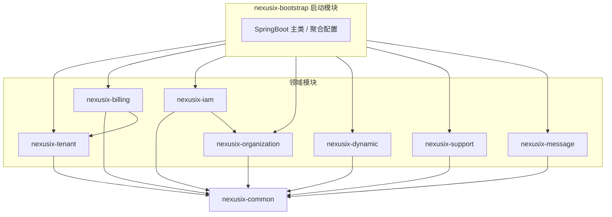

# NexusIX-Platform 技术开发设计文档（TDD）

**文档版本**：1.0  
**适用范围**：NexusIX-Platform 多模块单体（可演进为微服务）  
**依据**：`create_table.sql`、`pom.xml`  
**包根命名空间**：`com.shy.nexusix`

---

## 1. 项目概述与架构图

### 1.1 项目定位

NexusIX-Platform 是基于 **Spring Boot 3** 与 **PostgreSQL** 的企业级多租户 SaaS 底座：在同一进程内通过 **Maven 多模块**按领域拆分，配合 **MyBatis-Plus 租户插件**、**Sa-Token** 会话与权限、**MapStruct** 映射，实现租户隔离、RBAC+策略、配额与计费、动态表单/数据源/打印等能力。

### 1.2 逻辑架构（模块依赖）

采用**单向依赖**：公共能力下沉至 `common`，领域模块仅依赖 `common` 及明确的下游领域（避免循环依赖）。启动模块聚合全部领域并承担全局配置与横切能力。



**依赖说明摘要**：

| 依赖方向 | 理由 |
|----------|------|
| `billing` → `tenant` | 订阅、套餐与租户主数据联动（`sys_tenant.package_id`、订阅表） |
| `iam` → `organization` | `sys_user_tenant_rel.dept_id` 需校验部门归属租户；数据范围与 `sys_dept` 协同 |
| 其余领域 → `common` | 工具类、统一响应、基础元数据、租户上下文等 |

若后续需彻底解耦跨领域调用，可引入 `nexusix-api`（接口 DTO + Facade）或通过事件总线，当前单体推荐直接 Spring Bean 调用。

### 1.3 物理结构（建议）

```
nexusix-platform/                    # 父 POM（已有）
├── nexusix-common/
├── nexusix-tenant/
├── nexusix-billing/
├── nexusix-organization/
├── nexusix-iam/
├── nexusix-dynamic/
├── nexusix-support/
├── nexusix-message/
└── nexusix-bootstrap/
```

---

## 2. 模块划分与职责

### 2.1 总表

| 模块 artifactId | 包名根路径 | 业务域 | 负责的数据库表（有效 DDL） |
|-----------------|------------|--------|---------------------------|
| `nexusix-common` | `com.shy.nexusix.common` | 公共内核 | 无业务表；可含通用 `BaseEntity` 字段约定 |
| `nexusix-tenant` | `com.shy.nexusix.tenant` | 租户核心 | `sys_tenant`, `sys_tenant_subscription` |
| `nexusix-billing` | `com.shy.nexusix.billing` | 计费与配额、订单发票 | `prod_package`, `prod_package_quota`, `sys_tenant_quota_adjustment`, `sys_resource_usage`, `bill_order`, `bill_invoice` |
| `nexusix-organization` | `com.shy.nexusix.organization` | 组织架构 | `sys_dept`, `sys_post`, `sys_user_group`, `sys_user_group_rel`, `sys_role_dept_rel` |
| `nexusix-iam` | `com.shy.nexusix.iam` | 身份与访问控制 | `sys_user`, `sys_user_tenant_rel`, `sys_role`, `sys_permission`, `sys_permission_policy`, `sys_user_role_rel`, `sys_tenant_security`, `sys_user_token` |
| `nexusix-dynamic` | `com.shy.nexusix.dynamic` | 动态配置（低代码） | `sys_form_config`, `sys_datasource_config`, `sys_print_template` |
| `nexusix-support` | `com.shy.nexusix.support` | 系统支撑与审计 | `sys_menu`, `sys_dict`, `sys_dict_item`, `sys_file`, `sys_notice`, `sys_notice_user_rel`, `sys_oper_log`, `sys_login_log`, `sys_data_audit_log` |
| `nexusix-message` | `com.shy.nexusix.message` | 消息中心 | `sys_message_template`, `sys_inbox_message`, `sys_message_schedule` |
| `nexusix-bootstrap` | `com.shy.nexusix` | 启动与全局装配 | 无表；`@MapperScan` 覆盖各模块 Mapper 包 |

**说明**：部分表无 `is_deleted`（如 `sys_resource_usage`、`sys_user_token`、`sys_login_log` 等），在各自 Entity 中不显式继承统一逻辑删除接口，由文档与代码审查约束。

### 2.2 各模块职责简述

- **common**：雪花 ID 生成器封装、`Result<T>`、业务异常体系、租户上下文 `TenantContextHolder`、多租户插件忽略表清单常量、Jackson 对 JSONB/`Map` 的辅助（如需）。
- **tenant**：租户树、`ancestors` 维护、订阅 CRUD、与套餐 ID 的同步策略（应用层）。
- **billing**：套餐与配额模板、配额调整与用量流水、订单与发票；依赖 **tenant** 读取租户/订阅状态。
- **organization**：部门树、岗位、用户组、角色-部门数据范围关联。
- **iam**：全局用户、租户成员、角色权限、策略表、安全策略、Token 持久化与 Sa-Token 对接；依赖 **organization** 做部门校验与数据范围查询。
- **dynamic**：表单 Schema、数据源、打印模板运行时服务与版本管理。
- **support**：菜单、字典、文件元数据、公告与已读、操作/登录/数据审计写入。
- **message**：消息模板、站内信、定时消息任务调度对接。
- **bootstrap**：`spring-boot-starter` 聚合、`application.yml`、跨模块 `MapperScan`、AOP 日志、全局异常处理入口。

---

## 3. 技术栈选型与理由

| 技术 | 版本（对齐 POM） | 选型理由 |
|------|------------------|----------|
| Java | 17 | LTS；与 Spring Boot 3 官方支持一致；记录类、模式匹配等提升可读性 |
| Spring Boot | 3.3.4（parent） | 父工程已锁定；生态成熟，原生观测与配置清晰 |
| PostgreSQL | 17+ | DDL 使用 `JSONB`、与时区/索引特性匹配；企业级多租户推荐 |
| MyBatis-Plus | 3.5.12（`mybatis.version` 管理 `mybatis-plus-spring-boot3-starter`） | 分页、`LambdaQueryWrapper`、租户插件、乐观锁扩展与 Spring Boot 3 官方 starter 配套 |
| Redis | 7+（客户端随 `spring-boot-starter-data-redis`） | Sa-Token 集群会话、限流、缓存字典/权限 |
| Sa-Token | 1.39.0 | 轻量；与 Spring Boot 3 starter、JWT、Redis 整合成熟；多账号体系可映射「用户 + 当前租户」 |
| MapStruct | 1.5.2.Final | 编译期生成映射，DTO/VO 与 Entity 分离时类型安全、性能优于反射 |
| Lombok | 1.18.36（父 POM） | 减少样板代码；与 MapStruct 通过 `lombok-mapstruct-binding` 协同 |

**补充**：当前父 POM 的 `dependencyManagement` 含 **MySQL** 驱动，与本项目 **PostgreSQL** 目标不一致。应在实际子模块或父 `dependencyManagement` 中增加：

```xml
<dependency>
    <groupId>org.postgresql</groupId>
    <artifactId>postgresql</artifactId>
    <scope>runtime</scope>
</dependency>
```

并移除或 `optional` 化未使用的 MySQL 依赖，避免误连。

---

## 4. 核心设计规范

### 4.1 代码分层

```
com.shy.nexusix.{module}
├── controller      # REST；参数校验 @Valid；无业务逻辑
├── service
│   ├── impl        # 事务边界、领域编排
├── mapper          # MyBatis-Plus Mapper 接口
├── entity          # 与表一一对应（或聚合根子实体按规范拆分）
├── dto             # 入参：XxxCreateDTO / XxxUpdateDTO / XxxQueryDTO
├── vo              # 出参：XxxVO / XxxDetailVO
└── convert         # MapStruct：XxxConvert 接口
```

- **禁止**：Controller 直接注入 Mapper（测试与审查例外除外）。  
- **Entity**：仅持久化；对外 API 一律使用 DTO/VO。  
- **JSONB 字段**：Entity 使用 `String` + `JsonTypeHandler`，或 `Map`/`JsonNode` + 自定义 TypeHandler（推荐统一一种）。

### 4.2 Entity 规范

- 使用 `@TableName("sys_tenant")`，主键 `@TableId(type = IdType.ASSIGN_ID)` 或自定义雪花（与 DDL BIGINT 一致）。  
- 逻辑删除：`@TableLogic` 映射 `is_deleted`（Java 字段 `isDeleted`，SMALLINT 0/1）。  
- Lombok：`@Data`；需要 Builder 时使用 `@Builder`（注意与 MP 无参构造兼容，可 `@NoArgsConstructor` + `@AllArgsConstructor`）。

示例：

```java
@Data
@TableName("sys_tenant")
public class SysTenant {

    @TableId(type = IdType.ASSIGN_ID)
    private Long id;

    private String tenantName;
    private Long parentId;
    /** 0-正常 1-删除 */
    @TableLogic
    private Integer isDeleted;
}
```

### 4.3 DTO / VO 与 MapStruct

- **DTO**：请求体、查询条件；使用 Jakarta Validation（`@NotNull`, `@Size`）。  
- **VO**：响应；可含字典翻译后展示字段。  
- **Convert**：`@Mapper(componentModel = "spring")`，显式方法名；Entity ↔ VO、DTO → Entity 分接口或分方法，避免循环引用。

### 4.4 命名约定

| 范畴 | 规则 |
|------|------|
| Java 字段 | 小驼峰，如 `isDeleted`, `tenantId` |
| 数据库列 | 下划线，如 `is_deleted`, `tenant_id` |
| MyBatis-Plus | `map-underscore-to-camel-case: true` |
| API JSON | 小驼峰，与前端统一 |

### 4.5 统一响应与全局异常

- 统一包装：`Result<T>`，含 `code`、`message`、`data`、`timestamp`（可选 `traceId`）。  
- 业务异常：`BizException` + 枚举 `ResultCode`；由 `@RestControllerAdvice` 转换为 HTTP 200 + 业务码，或 4xx/5xx 按规范二选一（团队统一即可）。  
- 校验异常：绑定 `MethodArgumentNotValidException` 返回字段级错误信息。

### 4.6 日志规范（实现思路）

| 类型 | 表 | 实现思路 |
|------|-----|----------|
| 操作日志 | `sys_oper_log` | AOP 环绕 `@OperLog`（自定义注解），解析 `HttpServletRequest`、SpEL 取操作名、异步写库，避免拖慢主链路 |
| 登录日志 | `sys_login_log` | Sa-Token 全局监听器 `SaTokenListener` 的 `doLogin` / `doLogout` / 登录失败回调中写入 |
| 数据审计 | `sys_data_audit_log` | 对敏感表使用 MyBatis 插件或业务层模板方法，对比 `old/new` JSON（注意脱敏与大字段截断） |

---

## 5. 多租户隔离（MyBatis-Plus）

### 5.1 策略

- **租户列**：`tenant_id`（BIGINT）。系统级数据使用 **0**（如 `sys_dict.tenant_id=0`、`sys_message_template.tenant_id=0`）。  
- **当前租户**：登录成功后由 Sa-Token Session 或 ThreadLocal（`TenantContextHolder`）写入 `Long tenantId`。  
- **SQL 改写**：`TenantLineInnerInterceptor` 自动追加 `tenant_id = ?`；**忽略表**需显式配置（见下）。

### 5.2 忽略表示例（需在 common 中集中维护）

- 全局无租户或跨租户：`sys_tenant`、`sys_user`（用户表本身无 `tenant_id`，隔离在关联表完成）。  
- 仅平台管理接口访问的表：按实际路由是否在「平台租户上下文」决定；若平台用户不带业务 `tenant_id`，应使用独立数据源或仅走白名单 SQL，避免被错误拼接条件。

**典型忽略表**：`sys_tenant`、`sys_user`、`sys_permission`（若设计为全局资源表）、`prod_package`（若套餐仅平台维护且无 `tenant_id` 列——当前 `prod_package` 无 `tenant_id`，**整表应加入忽略列表**，由应用层控制仅运营角色可访问）。

### 5.3 插件配置要点（YAML 见第 6 节）

- 注册 `TenantLineInnerInterceptor`，在 `TenantLineHandler` 中实现 `getTenantId()` 从 `TenantContextHolder` 读取。  
- `ignoreTable` / `ignoreInsert`：对无 `tenant_id` 列的表必须忽略，否则 SQL 会非法。

### 5.4 插入时自动填充 `tenant_id`

配合 `MetaObjectHandler`：在 `insert` 时对带 `tenantId` 字段的实体填充当前租户；平台接口显式传 `0` 或走专用 Service。

---

## 6. 权限控制（Sa-Token + 自定义注解）

### 6.1 认证模型

- **登录主体**：建议 Session 中存储 `userId`、`currentTenantId`、可选 `isTenantAdmin`。  
- **Token**：与 `sys_user_token` 对齐时可存 token 指纹或 jti，登出/踢人时双删 Redis + 更新表 `status`。

### 6.2 接口级：角色与权限码

- 使用 `@SaCheckPermission("system:user:add")` 与 DDL 中 `sys_permission.perm_code` 对齐。  
- 或自定义 `@RequiresPermissions("...")` 封装 Sa-Token 校验。

### 6.3 数据范围（Data Scope）

与 `sys_role.data_scope`、`sys_role_dept_rel` 对齐：

1. 登录后缓存当前用户在某租户下的 **角色列表 + data_scope + 自定义部门 ID 列表**。  
2. MyBatis 层提供 `DataScopeInterceptor`（或 Service 层拼条件）：  
   - `1 全部`：仅 `tenant_id` 条件（已由租户插件处理）。  
   - `2 本部门`：追加 `dept_id = currentDeptId` 或 `ancestors` 前缀匹配。  
   - `3 本人`：追加 `create_by = userId` 等业务规则。  
   - `4 自定义`：`dept_id IN (...)`，列表来自 `sys_role_dept_rel`。

**与租户插件顺序**：先租户隔离，再数据范围，避免跨租户泄露。

### 6.4 策略表 `sys_permission_policy`

应用层提供 `PermissionPolicyService#evaluate(userId, tenantId, permissionId)`，在 Sa-Token 基础校验通过后叠加 **允许/拒绝** 与 **priority**；拒绝优先于允许（产品规则需在单元测试固定）。

---

## 7. 关键配置指南

### 7.1 `application.yml` 示例片段

```yaml
spring:
  application:
    name: nexusix-platform
  datasource:
    driver-class-name: org.postgresql.Driver
    url: jdbc:postgresql://${DB_HOST:localhost}:${DB_PORT:5432}/${DB_NAME:nexusix}
    username: ${DB_USER:nexusix}
    password: ${DB_PASSWORD:}
    hikari:
      maximum-pool-size: 20
  data:
    redis:
      host: ${REDIS_HOST:localhost}
      port: ${REDIS_PORT:6379}
      password: ${REDIS_PASSWORD:}
      database: ${REDIS_DB:0}

mybatis-plus:
  configuration:
    map-underscore-to-camel-case: true
    log-impl: org.apache.ibatis.logging.slf4j.Slf4jImpl
  global-config:
    db-config:
      logic-delete-field: isDeleted
      logic-delete-value: 1
      logic-not-delete-value: 0
      id-type: ASSIGN_ID
  mapper-locations: classpath*:/mapper/**/*.xml

# Sa-Token（示例，按环境调整）
sa-token:
  token-name: Authorization
  timeout: 86400
  active-timeout: -1
  is-concurrent: true
  is-share: false
  token-style: uuid
  is-log: false

# 自定义：租户、忽略表（也可使用 @ConfigurationProperties）
nexusix:
  tenant:
    column: tenant_id
    ignore-tables:
      - sys_tenant
      - sys_user
      - prod_package
      - prod_package_quota
```

### 7.2 多租户拦截器实现思路（伪代码）

```java
@Configuration
public class MybatisPlusConfig {

    @Bean
    public MybatisPlusInterceptor mybatisPlusInterceptor(TenantProperties props) {
        MybatisPlusInterceptor interceptor = new MybatisPlusInterceptor();
        interceptor.addInnerInterceptor(new TenantLineInnerInterceptor(new TenantLineHandler() {
            @Override
            public Expression getTenantId() {
                Long id = TenantContextHolder.getTenantId();
                return id == null ? null : new LongValue(id);
            }

            @Override
            public boolean ignoreTable(String tableName) {
                return props.getIgnoreTables().contains(tableName);
            }
        }));
        interceptor.addInnerInterceptor(new PaginationInnerInterceptor(DbType.POSTGRE_SQL));
        return interceptor;
    }
}
```

### 7.3 PostgreSQL 与 JSONB

- 依赖 `postgresql` JDBC；Entity 中 JSONB 字段推荐 `String` + `JacksonTypeHandler`（MP 3.5+）或项目统一 `JsonbTypeHandler`。  
- 分页使用 MP 分页插件 + PostgreSQL `DbType.POSTGRE_SQL`。

### 7.4 Sa-Token + Redis

- 引入 `sa-token-redis` + `commons-pool2`（父 POM 已管理），配置 Redis 连接后 Session 可集群共享。  
- JWT 模式使用 `sa-token-jwt` 时注意与 Redis 会话一致性策略（纯 JWT 无状态 vs 混合）。

---

## 8. 部署与运维简述

### 8.1 Docker 化建议

- **镜像**：基于 `eclipse-temurin:17-jre-alpine` 多阶段构建：Stage1 `mvn -pl nexusix-bootstrap -am package`，Stage2 仅复制 jar + 非 root 用户运行。  
- **编排**：`docker-compose` 包含 `app`、`postgres:17`、`redis:7`，网络内通过服务名访问。  
- **配置**：敏感信息使用环境变量或 Docker secrets，勿写入镜像层。

### 8.2 环境变量示例

| 变量 | 说明 |
|------|------|
| `DB_HOST` / `DB_PORT` / `DB_NAME` / `DB_USER` / `DB_PASSWORD` | PostgreSQL 连接 |
| `REDIS_HOST` / `REDIS_PORT` / `REDIS_PASSWORD` | Redis |
| `SA_TOKEN_JWT_SECRET` | 若启用 JWT 签名密钥 |
| `NEXUSIX_TENANT_IGNORE_TABLES` | 可选，覆盖忽略表列表 |

### 8.3 运维注意

- 日志：JSON 结构化输出便于 ELK/Loki。  
- 健康检查：`spring-boot-starter-actuator`（按需添加）暴露 `health`、`info`。  
- 数据库：无物理外键，**迁移与删除顺序**由应用保证；建议引入 Flyway/Liquibase 管理 `create_table.sql` 演进。

---

## 9. 与父 POM 的后续对齐项（建议）

1. 将 `<modules>` 与子模块 `artifactId` 写入父 `pom.xml`，`dependencyManagement` 中补充 `postgresql`。  
2. 子模块分别声明对 `mybatis-plus-spring-boot3-starter`、`spring-boot-starter-web`、`sa-token-spring-boot3-starter` 等的依赖（版本由父 BOM 导入）。  
3. `nexusix-bootstrap` 的 `spring-boot-maven-plugin` 指定 `mainClass`。

---

## 10. 文档修订记录

| 版本 | 日期 | 说明 |
|------|------|------|
| 1.0 | 2026-04-06 | 首版，对齐当前 DDL 与父 POM |
