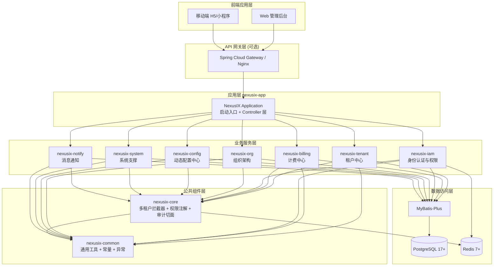
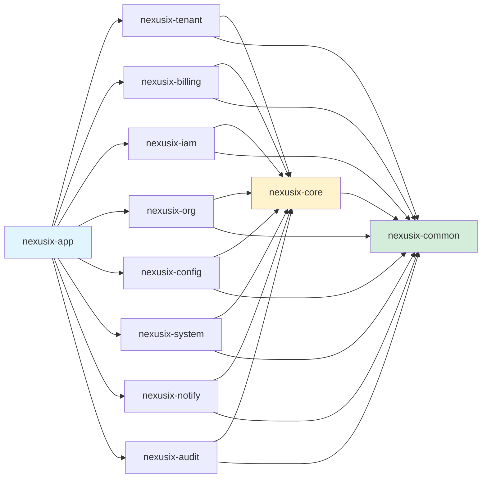

# NexusIX-Platform 技术开发设计文档

## 文档信息

| 项目 | 内容 |
|------|------|
| 项目名称 | NexusIX-Platform |
| 版本号 | V1.0 |
| 文档状态 | 初稿 |
| 最后更新 | 2026-04-06 |
| 技术负责人 | - |

---

## 1. 项目概述

### 1.1 产品背景

NexusIX-Platform 是一个面向企业级用户的**多租户 SaaS 平台底座**，采用 Spring Boot 3 + MyBatis-Plus + PostgreSQL 技术栈构建。平台提供租户管理、计费订阅、权限控制、组织架构、动态配置等核心能力，支持无限层级租户树形结构、细粒度 RBAC+ABAC 混合权限模型、以及"配置即功能"的低代码扩展能力。

### 1.2 技术目标

- **高内聚低耦合**：按业务域划分 Maven 模块，模块间通过接口依赖，避免循环依赖。
- **多租户隔离**：在 ORM 层自动注入 `tenant_id`，实现数据逻辑隔离。
- **可扩展性**：预留微服务演进路径，模块可独立打包部署。
- **开发效率**：统一代码规范、通用组件封装、MapStruct 对象映射、MyBatis-Plus 简化 CRUD。
- **安全性**：Sa-Token 权限认证、JWT Token 管理、操作审计日志、数据变更追踪。

### 1.3 项目架构图



---

## 2. 模块划分与职责

### 2.1 Maven 多模块结构

```
nexusix-platform/                          # 父工程 (pom)
├── nexusix-common/                        # 公共组件模块 (jar)
│   ├── constant/                          # 常量定义
│   ├── exception/                         # 全局异常类
│   ├── result/                            # 统一响应结构
│   ├── enums/                             # 枚举类
│   └── utils/                             # 工具类 (雪花算法、加密等)
│
├── nexusix-core/                          # 核心框架模块 (jar)
│   ├── tenant/                            # 多租户上下文 + 拦截器
│   ├── permission/                        # 权限注解 + AOP 切面
│   ├── audit/                             # 操作日志 + 数据审计切面
│   ├── config/                            # 全局配置类 (MP、Sa-Token、Redis)
│   └── handler/                           # 全局异常处理器
│
├── nexusix-tenant/                        # 租户中心模块 (jar)
│   ├── entity/                            # SysTenant, SysTenantSubscription
│   ├── mapper/                            # 对应 Mapper 接口
│   ├── service/                           # 业务逻辑层
│   ├── controller/                        # REST API 控制器
│   ├── dto/                               # 请求参数 DTO
│   ├── vo/                                # 响应结果 VO
│   └── converter/                         # MapStruct 转换器
│   涉及表: sys_tenant, sys_tenant_subscription
│
├── nexusix-billing/                       # 计费中心模块 (jar)
│   ├── entity/                            # ProdPackage, ProdPackageQuota, BillOrder, BillInvoice
│   ├── mapper/
│   ├── service/
│   ├── controller/
│   ├── dto/
│   ├── vo/
│   └── converter/
│   涉及表: prod_package, prod_package_quota, bill_order, bill_invoice,
│          sys_tenant_quota_adjustment, sys_resource_usage
│
├── nexusix-iam/                           # 身份认证与权限模块 (jar)
│   ├── entity/                            # SysUser, SysRole, SysPermission, SysPermissionPolicy, SysUserTenantRel, SysUserRoleRel, SysUserToken, SysTenantSecurity
│   ├── mapper/
│   ├── service/
│   ├── controller/
│   ├── dto/
│   ├── vo/
│   ├── converter/
│   └── satoken/                           # Sa-Token 自定义配置
│   涉及表: sys_user, sys_role, sys_permission, sys_permission_policy,
│          sys_user_tenant_rel, sys_user_role_rel, sys_user_token, sys_tenant_security
│
├── nexusix-org/                           # 组织架构模块 (jar)
│   ├── entity/                            # SysDept, SysPost, SysUserGroup, SysUserGroupRel, SysRoleDeptRel
│   ├── mapper/
│   ├── service/
│   ├── controller/
│   ├── dto/
│   ├── vo/
│   └── converter/
│   涉及表: sys_dept, sys_post, sys_user_group, sys_user_group_rel, sys_role_dept_rel
│
├── nexusix-config/                        # 动态配置中心模块 (jar)
│   ├── entity/                            # SysFormConfig, SysDatasourceConfig, SysPrintTemplate
│   ├── mapper/
│   ├── service/
│   ├── controller/
│   ├── dto/
│   ├── vo/
│   └── converter/
│   涉及表: sys_form_config, sys_datasource_config, sys_print_template
│
├── nexusix-system/                        # 系统支撑模块 (jar)
│   ├── entity/                            # SysMenu, SysDict, SysDictItem, SysFile, SysNotice, SysNoticeUserRel
│   ├── mapper/
│   ├── service/
│   ├── controller/
│   ├── dto/
│   ├── vo/
│   └── converter/
│   涉及表: sys_menu, sys_dict, sys_dict_item, sys_file, sys_notice, sys_notice_user_rel
│
├── nexusix-notify/                        # 消息通知模块 (jar)
│   ├── entity/                            # SysMessageTemplate, SysInboxMessage, SysMessageSchedule
│   ├── mapper/
│   ├── service/
│   ├── controller/
│   ├── dto/
│   ├── vo/
│   └── converter/
│   涉及表: sys_message_template, sys_inbox_message, sys_message_schedule
│
├── nexusix-audit/                         # 审计日志模块 (jar)
│   ├── entity/                            # SysOperLog, SysLoginLog, SysDataAuditLog
│   ├── mapper/
│   ├── service/
│   ├── controller/
│   ├── dto/
│   ├── vo/
│   └── converter/
│   涉及表: sys_oper_log, sys_login_log, sys_data_audit_log
│
└── nexusix-app/                           # 应用启动模块 (jar/war)
    ├── src/main/java/
    │   └── com/shy/nexusix/
    │       └── NexusIXApplication.java    # Spring Boot 启动类
    ├── src/main/resources/
    │   ├── application.yml                # 主配置文件
    │   ├── application-dev.yml            # 开发环境配置
    │   ├── application-prod.yml           # 生产环境配置
    │   └── logback-spring.xml             # 日志配置
    └── pom.xml                            # 聚合所有业务模块
```

### 2.2 模块依赖关系



**依赖原则**：
- `nexusix-common`：无依赖，被所有模块依赖。
- `nexusix-core`：仅依赖 `common`，提供框架级能力（多租户、权限、审计）。
- 业务模块（tenant/billing/iam/org/config/system/notify/audit）：依赖 `core` 和 `common`，彼此**不直接依赖**，通过 API 调用或事件驱动通信。
- `nexusix-app`：聚合所有业务模块，负责启动和路由分发。

### 2.3 模块职责详述

#### 2.3.1 nexusix-common（公共组件）

| 包路径 | 职责 | 关键类 |
|--------|------|--------|
| `com.shy.nexusix.common.constant` | 系统常量 | `CommonConstants`, `TenantConstants` |
| `com.shy.nexusix.common.enums` | 枚举定义 | `StatusEnum`, `DeletedEnum`, `PermTypeEnum` |
| `com.shy.nexusix.common.exception` | 异常类 | `BusinessException`, `ErrorCode` |
| `com.shy.nexusix.common.result` | 统一响应 | `Result<T>`, `PageResult<T>` |
| `com.shy.nexusix.common.utils` | 工具类 | `SnowflakeIdGenerator`, `PasswordUtils`, `JsonUtils` |

#### 2.3.2 nexusix-core（核心框架）

| 包路径 | 职责 | 关键类/接口 |
|--------|------|-------------|
| `com.shy.nexusix.core.tenant` | 多租户上下文 + 拦截器 | `TenantContext`, `TenantInterceptor`, `TenantProperties` |
| `com.shy.nexusix.core.permission` | 权限注解 + AOP | `@RequirePermission`, `PermissionAspect`, `DataScopeHandler` |
| `com.shy.nexusix.core.audit` | 审计切面 | `@OperLog`, `OperLogAspect`, `DataAuditAspect` |
| `com.shy.nexusix.core.config` | 全局配置 | `MyBatisPlusConfig`, `SaTokenConfig`, `RedisConfig` |
| `com.shy.nexusix.core.handler` | 异常处理 | `GlobalExceptionHandler` |

#### 2.3.3 nexusix-tenant（租户中心）

| 数据库表 | 实体类 | 主要功能 |
|----------|--------|----------|
| `sys_tenant` | `SysTenant` | 租户 CRUD、层级查询、状态管理 |
| `sys_tenant_subscription` | `SysTenantSubscription` | 订阅管理、过期检测 |

#### 2.3.4 nexusix-billing（计费中心）

| 数据库表 | 实体类 | 主要功能 |
|----------|--------|----------|
| `prod_package` | `ProdPackage` | 套餐定义、上架/下架 |
| `prod_package_quota` | `ProdPackageQuota` | 配额模板管理 |
| `bill_order` | `BillOrder` | 订单创建、支付回调 |
| `bill_invoice` | `BillInvoice` | 发票申请、开具 |
| `sys_tenant_quota_adjustment` | `SysTenantQuotaAdjustment` | 配额动态调整 |
| `sys_resource_usage` | `SysResourceUsage` | 资源使用计量 |

#### 2.3.5 nexusix-iam（身份认证与权限）

| 数据库表 | 实体类 | 主要功能 |
|----------|--------|----------|
| `sys_user` | `SysUser` | 用户注册、登录、信息管理 |
| `sys_user_tenant_rel` | `SysUserTenantRel` | 多租户绑定、管理员标识 |
| `sys_role` | `SysRole` | 角色 CRUD、数据范围配置 |
| `sys_user_role_rel` | `SysUserRoleRel` | 用户角色关联 |
| `sys_permission` | `SysPermission` | 权限资源定义 |
| `sys_permission_policy` | `SysPermissionPolicy` | 权限策略配置 |
| `sys_user_token` | `SysUserToken` | Token 管理、强制下线 |
| `sys_tenant_security` | `SysTenantSecurity` | 安全策略配置 |

#### 2.3.6 nexusix-org（组织架构）

| 数据库表 | 实体类 | 主要功能 |
|----------|--------|----------|
| `sys_dept` | `SysDept` | 部门树维护、ancestors 自动计算 |
| `sys_post` | `SysPost` | 岗位管理 |
| `sys_user_group` | `SysUserGroup` | 用户组管理 |
| `sys_user_group_rel` | `SysUserGroupRel` | 用户组成员关联 |
| `sys_role_dept_rel` | `SysRoleDeptRel` | 角色数据权限部门关联 |

#### 2.3.7 nexusix-config（动态配置中心）

| 数据库表 | 实体类 | 主要功能 |
|----------|--------|----------|
| `sys_form_config` | `SysFormConfig` | 动态表单配置、版本管理 |
| `sys_datasource_config` | `SysDatasourceConfig` | 动态数据源配置、缓存管理 |
| `sys_print_template` | `SysPrintTemplate` | 打印模板管理 |

#### 2.3.8 nexusix-system（系统支撑）

| 数据库表 | 实体类 | 主要功能 |
|----------|--------|----------|
| `sys_menu` | `SysMenu` | 菜单管理、权限映射 |
| `sys_dict` / `sys_dict_item` | `SysDict` / `SysDictItem` | 字典管理 |
| `sys_file` | `SysFile` | 文件上传、元数据记录 |
| `sys_notice` / `sys_notice_user_rel` | `SysNotice` / `SysNoticeUserRel` | 通知公告、阅读状态 |

#### 2.3.9 nexusix-notify（消息通知）

| 数据库表 | 实体类 | 主要功能 |
|----------|--------|----------|
| `sys_message_template` | `SysMessageTemplate` | 消息模板管理、变量替换 |
| `sys_inbox_message` | `SysInboxMessage` | 站内信收件箱、已读/归档 |
| `sys_message_schedule` | `SysMessageSchedule` | 定时消息任务、周期执行 |

#### 2.3.10 nexusix-audit（审计日志）

| 数据库表 | 实体类 | 主要功能 |
|----------|--------|----------|
| `sys_oper_log` | `SysOperLog` | 操作日志记录 |
| `sys_login_log` | `SysLoginLog` | 登录日志记录 |
| `sys_data_audit_log` | `SysDataAuditLog` | 数据变更审计 |

---

## 3. 技术栈选型与理由

### 3.1 核心技术栈

| 技术 | 版本 | 选型理由 |
|------|------|----------|
| **Java** | 17 | LTS 版本，性能优化显著，Record、Pattern Matching 等新特性提升开发效率 |
| **Spring Boot** | 3.3.4 | 最新稳定版，原生支持 Java 17，自动配置简化开发，生态丰富 |
| **MyBatis-Plus** | 3.5.12 | 增强版 MyBatis，内置 CRUD、分页、逻辑删除、多租户插件，减少样板代码 |
| **PostgreSQL** | 17+ | 开源最强关系型数据库，JSONB 原生支持、GIN 索引、高性能并发控制 |
| **Redis** | 7+ | 高性能缓存，Sa-Token 会话存储，分布式锁实现 |
| **Sa-Token** | 1.39.0 | 轻量级 Java 权限认证框架，比 Spring Security 更简洁，支持 JWT、Redis 集成 |
| **MapStruct** | 1.5.2.Final | 编译期生成对象映射代码，零反射开销，类型安全，优于 BeanUtils |
| **Lombok** | 1.18.36 | 减少 getter/setter/constructor 样板代码，提升代码可读性 |

### 3.2 为何选择 Sa-Token 而非 Spring Security？

| 对比维度 | Sa-Token | Spring Security |
|----------|----------|-----------------|
| **学习曲线** | 低，API 直观易懂 | 陡峭，配置复杂 |
| **多租户支持** | 原生支持 `StpUtil.login(userId, device)`，轻松实现多端登录 | 需自定义 `AuthenticationManager` |
| **JWT 集成** | 开箱即用，一行配置 | 需额外引入 `spring-security-oauth2-jose` |
| **权限注解** | `@SaCheckPermission("user:add")` 简洁明了 | `@PreAuthorize("hasAuthority('user:add')")` 表达式复杂 |
| **会话管理** | 内置 Redis 集成，支持踢人下线、账号封禁 | 需自行实现 `SessionRegistry` |
| **社区活跃度** | 国内活跃，中文文档完善 | 全球广泛使用，但国内问题排查成本高 |

**结论**：对于中小型 SaaS 平台，Sa-Token 在开发效率、易用性、多租户适配上更具优势。

### 3.3 为何选择 MyBatis-Plus？

- **多租户插件**：内置 `TenantLineInnerInterceptor`，自动在 SQL 中注入 `tenant_id` 条件。
- **逻辑删除**：通过 `@TableLogic` 注解，自动将 `delete` 转为 `update is_deleted=1`。
- **分页插件**：`Page<T>` 对象封装，支持 PostgreSQL `LIMIT/OFFSET`。
- **ActiveRecord 模式**：Entity 继承 `Model<T>`，可直接调用 `insert()`、`selectById()` 等方法。
- **代码生成器**：可根据数据库表自动生成 Entity、Mapper、Service、Controller 骨架代码。

### 3.4 为何选择 MapStruct？

- **性能**：编译期生成映射代码，无反射开销，比 BeanUtils 快 10 倍以上。
- **类型安全**：编译期检查字段匹配，避免运行时错误。
- **灵活**：支持自定义转换逻辑（如 `LocalDateTime` → `String`）、嵌套对象映射、集合映射。

---

## 4. 核心设计规范

### 4.1 代码分层规范

```
Controller 层  →  接收 HTTP 请求，参数校验，调用 Service，返回 Result<T>
    ↓
Service 层     →  业务逻辑编排，事务控制，调用 Mapper 或其他 Service
    ↓
Mapper 层      →  MyBatis-Plus BaseMapper，执行 SQL 操作
    ↓
Entity 层      →  数据库表映射，使用 Lombok + MP 注解
```

#### 4.1.1 Entity 示例

```java
package com.shy.nexusix.tenant.entity;

import com.baomidou.mybatisplus.annotation.*;
import lombok.AllArgsConstructor;
import lombok.Builder;
import lombok.Data;
import lombok.NoArgsConstructor;

import java.io.Serializable;
import java.time.LocalDateTime;

/**
 * 租户信息表
 */
@Data
@Builder
@NoArgsConstructor
@AllArgsConstructor
@TableName("sys_tenant")
public class SysTenant implements Serializable {

    private static final long serialVersionUID = 1L;

    /**
     * 主键 ID (雪花算法)
     */
    @TableId(value = "id", type = IdType.ASSIGN_ID)
    private Long id;

    /**
     * 租户名称
     */
    private String tenantName;

    /**
     * 租户唯一编码
     */
    private String tenantCode;

    /**
     * 父租户 ID (0 为根租户)
     */
    private Long parentId;

    /**
     * 祖级列表 (物化路径，如 0,100,200)
     */
    private String ancestors;

    /**
     * 联系人姓名
     */
    private String contactName;

    /**
     * 联系人电话
     */
    private String contactPhone;

    /**
     * 状态 (1-正常 0-冻结)
     */
    private Integer status;

    /**
     * 服务过期时间
     */
    private LocalDateTime expireTime;

    /**
     * 当前主套餐 ID
     */
    private Long packageId;

    /**
     * 扩展属性 (JSONB，存储行业特定配置)
     */
    private String extAttributes;

    /**
     * 创建人 ID
     */
    private Long createBy;

    /**
     * 更新人 ID
     */
    private Long updateBy;

    /**
     * 创建时间
     */
    @TableField(fill = FieldFill.INSERT)
    private LocalDateTime createTime;

    /**
     * 更新时间
     */
    @TableField(fill = FieldFill.INSERT_UPDATE)
    private LocalDateTime updateTime;

    /**
     * 逻辑删除 (0-正常 1-删除)
     */
    @TableLogic
    private Integer isDeleted;
}
```

#### 4.1.2 DTO 示例

```java
package com.shy.nexusix.tenant.dto;

import jakarta.validation.constraints.NotBlank;
import jakarta.validation.constraints.Size;
import lombok.Data;

import java.io.Serializable;
import java.time.LocalDateTime;

/**
 * 创建租户请求 DTO
 */
@Data
public class CreateTenantDTO implements Serializable {

    private static final long serialVersionUID = 1L;

    @NotBlank(message = "租户名称不能为空")
    @Size(max = 100, message = "租户名称最长 100 字符")
    private String tenantName;

    @NotBlank(message = "租户编码不能为空")
    @Size(max = 50, message = "租户编码最长 50 字符")
    private String tenantCode;

    private Long parentId;

    private String contactName;

    private String contactPhone;

    private Long packageId;

    private LocalDateTime expireTime;

    private String extAttributes;
}
```

#### 4.1.3 VO 示例

```java
package com.shy.nexusix.tenant.vo;

import lombok.Data;

import java.io.Serializable;
import java.time.LocalDateTime;

/**
 * 租户信息响应 VO
 */
@Data
public class TenantVO implements Serializable {

    private static final long serialVersionUID = 1L;

    private Long id;

    private String tenantName;

    private String tenantCode;

    private Long parentId;

    private String ancestors;

    private String contactName;

    private String contactPhone;

    private Integer status;

    private LocalDateTime expireTime;

    private Long packageId;

    private String extAttributes;

    private LocalDateTime createTime;

    private LocalDateTime updateTime;
}
```

#### 4.1.4 MapStruct Converter 示例

```java
package com.shy.nexusix.tenant.converter;

import com.shy.nexusix.tenant.dto.CreateTenantDTO;
import com.shy.nexusix.tenant.entity.SysTenant;
import com.shy.nexusix.tenant.vo.TenantVO;
import org.mapstruct.Mapper;
import org.mapstruct.factory.Mappers;

/**
 * 租户对象转换器
 */
@Mapper(componentModel = "spring")
public interface TenantConverter {

    TenantConverter INSTANCE = Mappers.getMapper(TenantConverter.class);

    /**
     * DTO → Entity
     */
    SysTenant toEntity(CreateTenantDTO dto);

    /**
     * Entity → VO
     */
    TenantVO toVO(SysTenant entity);
}
```

#### 4.1.5 Mapper 示例

```java
package com.shy.nexusix.tenant.mapper;

import com.baomidou.mybatisplus.core.mapper.BaseMapper;
import com.shy.nexusix.tenant.entity.SysTenant;
import org.apache.ibatis.annotations.Mapper;

/**
 * 租户信息 Mapper
 */
@Mapper
public interface SysTenantMapper extends BaseMapper<SysTenant> {
    // 继承 BaseMapper 后，无需编写 XML，即可使用 CRUD 方法
    // 如需自定义 SQL，可在此声明方法并在 XML 中实现
}
```

#### 4.1.6 Service 示例

```java
package com.shy.nexusix.tenant.service;

import com.baomidou.mybatisplus.extension.service.IService;
import com.shy.nexusix.tenant.dto.CreateTenantDTO;
import com.shy.nexusix.tenant.entity.SysTenant;
import com.shy.nexusix.tenant.vo.TenantVO;

import java.util.List;

/**
 * 租户信息服务接口
 */
public interface SysTenantService extends IService<SysTenant> {

    /**
     * 创建租户
     */
    Long createTenant(CreateTenantDTO dto);

    /**
     * 查询租户树形结构
     */
    List<TenantVO> getTenantTree(Long parentId);

    /**
     * 冻结/解冻租户
     */
    void updateTenantStatus(Long tenantId, Integer status);
}
```

#### 4.1.7 ServiceImpl 示例

```java
package com.shy.nexusix.tenant.service.impl;

import cn.dev33.satoken.stp.StpUtil;
import com.baomidou.mybatisplus.core.conditions.query.LambdaQueryWrapper;
import com.baomidou.mybatisplus.extension.service.impl.ServiceImpl;
import com.shy.nexusix.common.exception.BusinessException;
import com.shy.nexusix.common.result.ResultCode;
import com.shy.nexusix.core.tenant.TenantContext;
import com.shy.nexusix.tenant.converter.TenantConverter;
import com.shy.nexusix.tenant.dto.CreateTenantDTO;
import com.shy.nexusix.tenant.entity.SysTenant;
import com.shy.nexusix.tenant.mapper.SysTenantMapper;
import com.shy.nexusix.tenant.service.SysTenantService;
import com.shy.nexusix.tenant.vo.TenantVO;
import lombok.RequiredArgsConstructor;
import lombok.extern.slf4j.Slf4j;
import org.springframework.stereotype.Service;
import org.springframework.transaction.annotation.Transactional;

import java.time.LocalDateTime;
import java.util.List;
import java.util.stream.Collectors;

/**
 * 租户信息服务实现
 */
@Slf4j
@Service
@RequiredArgsConstructor
public class SysTenantServiceImpl extends ServiceImpl<SysTenantMapper, SysTenant> implements SysTenantService {

    private final TenantConverter tenantConverter;

    @Override
    @Transactional(rollbackFor = Exception.class)
    public Long createTenant(CreateTenantDTO dto) {
        // 1. 校验租户编码唯一性
        LambdaQueryWrapper<SysTenant> wrapper = new LambdaQueryWrapper<>();
        wrapper.eq(SysTenant::getTenantCode, dto.getTenantCode());
        if (this.count(wrapper) > 0) {
            throw new BusinessException(ResultCode.TENANT_CODE_EXISTS);
        }

        // 2. 校验父租户存在
        if (dto.getParentId() != null && dto.getParentId() > 0) {
            SysTenant parent = this.getById(dto.getParentId());
            if (parent == null || parent.getIsDeleted() == 1) {
                throw new BusinessException(ResultCode.PARENT_TENANT_NOT_FOUND);
            }
        }

        // 3. 构建 Entity
        SysTenant tenant = tenantConverter.toEntity(dto);
        tenant.setParentId(dto.getParentId() != null ? dto.getParentId() : 0L);
        tenant.setStatus(1);
        tenant.setIsDeleted(0);
        tenant.setCreateBy(StpUtil.getLoginIdAsLong());
        tenant.setUpdateBy(StpUtil.getLoginIdAsLong());

        // 4. 计算 ancestors
        if (tenant.getParentId() > 0) {
            SysTenant parent = this.getById(tenant.getParentId());
            tenant.setAncestors(parent.getAncestors() + "," + parent.getId());
        } else {
            tenant.setAncestors("0");
        }

        // 5. 插入数据库
        this.save(tenant);

        // 6. 若指定套餐，创建订阅记录（调用 billing 模块 API）
        // ...

        log.info("创建租户成功: tenantId={}, tenantCode={}", tenant.getId(), tenant.getTenantCode());
        return tenant.getId();
    }

    @Override
    public List<TenantVO> getTenantTree(Long parentId) {
        LambdaQueryWrapper<SysTenant> wrapper = new LambdaQueryWrapper<>();
        wrapper.eq(SysTenant::getParentId, parentId != null ? parentId : 0L)
               .eq(SysTenant::getIsDeleted, 0)
               .orderByAsc(SysTenant::getCreateTime);

        List<SysTenant> tenants = this.list(wrapper);
        return tenants.stream()
                      .map(tenantConverter::toVO)
                      .collect(Collectors.toList());
    }

    @Override
    @Transactional(rollbackFor = Exception.class)
    public void updateTenantStatus(Long tenantId, Integer status) {
        SysTenant tenant = this.getById(tenantId);
        if (tenant == null || tenant.getIsDeleted() == 1) {
            throw new BusinessException(ResultCode.TENANT_NOT_FOUND);
        }

        tenant.setStatus(status);
        tenant.setUpdateBy(StpUtil.getLoginIdAsLong());
        tenant.setUpdateTime(LocalDateTime.now());
        this.updateById(tenant);

        // 若冻结租户，失效该租户下所有 Token
        if (status == 0) {
            // 调用 iam 模块 API 失效 Token
            // ...
        }

        log.info("更新租户状态: tenantId={}, status={}", tenantId, status);
    }
}
```

#### 4.1.8 Controller 示例

```java
package com.shy.nexusix.tenant.controller;

import com.shy.nexusix.common.result.Result;
import com.shy.nexusix.core.permission.RequirePermission;
import com.shy.nexusix.tenant.dto.CreateTenantDTO;
import com.shy.nexusix.tenant.service.SysTenantService;
import com.shy.nexusix.tenant.vo.TenantVO;
import jakarta.validation.Valid;
import lombok.RequiredArgsConstructor;
import org.springframework.web.bind.annotation.*;

import java.util.List;

/**
 * 租户管理控制器
 */
@RestController
@RequestMapping("/api/v1/tenants")
@RequiredArgsConstructor
public class SysTenantController {

    private final SysTenantService tenantService;

    /**
     * 创建租户
     */
    @PostMapping
    @RequirePermission("system:tenant:add")
    public Result<Long> createTenant(@Valid @RequestBody CreateTenantDTO dto) {
        Long tenantId = tenantService.createTenant(dto);
        return Result.success(tenantId);
    }

    /**
     * 查询租户树
     */
    @GetMapping("/tree")
    @RequirePermission("system:tenant:view")
    public Result<List<TenantVO>> getTenantTree(@RequestParam(required = false) Long parentId) {
        List<TenantVO> tree = tenantService.getTenantTree(parentId);
        return Result.success(tree);
    }

    /**
     * 冻结/解冻租户
     */
    @PutMapping("/{tenantId}/status")
    @RequirePermission("system:tenant:edit")
    public Result<Void> updateTenantStatus(@PathVariable Long tenantId, @RequestParam Integer status) {
        tenantService.updateTenantStatus(tenantId, status);
        return Result.success();
    }
}
```

### 4.2 统一响应结构

```java
package com.shy.nexusix.common.result;

import lombok.AllArgsConstructor;
import lombok.Data;
import lombok.NoArgsConstructor;

import java.io.Serializable;

/**
 * 统一响应结构
 */
@Data
@NoArgsConstructor
@AllArgsConstructor
public class Result<T> implements Serializable {

    private static final long serialVersionUID = 1L;

    /**
     * 响应码
     */
    private Integer code;

    /**
     * 响应消息
     */
    private String message;

    /**
     * 响应数据
     */
    private T data;

    /**
     * 成功响应
     */
    public static <T> Result<T> success() {
        return new Result<>(ResultCode.SUCCESS.getCode(), ResultCode.SUCCESS.getMessage(), null);
    }

    /**
     * 成功响应（带数据）
     */
    public static <T> Result<T> success(T data) {
        return new Result<>(ResultCode.SUCCESS.getCode(), ResultCode.SUCCESS.getMessage(), data);
    }

    /**
     * 失败响应
     */
    public static <T> Result<T> error(Integer code, String message) {
        return new Result<>(code, message, null);
    }

    /**
     * 失败响应（使用枚举）
     */
    public static <T> Result<T> error(ResultCode resultCode) {
        return new Result<>(resultCode.getCode(), resultCode.getMessage(), null);
    }
}
```

```java
package com.shy.nexusix.common.result;

import lombok.AllArgsConstructor;
import lombok.Getter;

/**
 * 响应码枚举
 */
@Getter
@AllArgsConstructor
public enum ResultCode {

    SUCCESS(200, "操作成功"),
    FAIL(500, "操作失败"),
    UNAUTHORIZED(401, "未授权"),
    FORBIDDEN(403, "禁止访问"),
    NOT_FOUND(404, "资源不存在"),

    // 租户相关
    TENANT_CODE_EXISTS(1001, "租户编码已存在"),
    PARENT_TENANT_NOT_FOUND(1002, "父租户不存在"),
    TENANT_NOT_FOUND(1003, "租户不存在"),
    TENANT_FROZEN(1004, "租户已冻结"),
    TENANT_EXPIRED(1005, "租户已过期"),

    // 用户相关
    USER_NOT_FOUND(2001, "用户不存在"),
    PASSWORD_ERROR(2002, "密码错误"),
    USER_DISABLED(2003, "用户已被禁用"),

    // 权限相关
    PERMISSION_DENIED(3001, "权限不足"),

    // 参数校验
    PARAM_ERROR(4001, "参数错误"),

    ;

    private final Integer code;
    private final String message;
}
```

### 4.3 全局异常处理

```java
package com.shy.nexusix.core.handler;

import cn.dev33.satoken.exception.NotLoginException;
import cn.dev33.satoken.exception.NotPermissionException;
import com.shy.nexusix.common.exception.BusinessException;
import com.shy.nexusix.common.result.Result;
import com.shy.nexusix.common.result.ResultCode;
import lombok.extern.slf4j.Slf4j;
import org.springframework.validation.BindException;
import org.springframework.web.bind.MethodArgumentNotValidException;
import org.springframework.web.bind.annotation.ExceptionHandler;
import org.springframework.web.bind.annotation.RestControllerAdvice;

/**
 * 全局异常处理器
 */
@Slf4j
@RestControllerAdvice
public class GlobalExceptionHandler {

    /**
     * 业务异常
     */
    @ExceptionHandler(BusinessException.class)
    public Result<Void> handleBusinessException(BusinessException e) {
        log.warn("业务异常: {}", e.getMessage());
        return Result.error(e.getCode(), e.getMessage());
    }

    /**
     * 参数校验异常
     */
    @ExceptionHandler({MethodArgumentNotValidException.class, BindException.class})
    public Result<Void> handleValidationException(Exception e) {
        String message = e instanceof MethodArgumentNotValidException
                ? ((MethodArgumentNotValidException) e).getBindingResult().getFieldError().getDefaultMessage()
                : ((BindException) e).getBindingResult().getFieldError().getDefaultMessage();
        log.warn("参数校验失败: {}", message);
        return Result.error(ResultCode.PARAM_ERROR.getCode(), message);
    }

    /**
     * Sa-Token 未登录异常
     */
    @ExceptionHandler(NotLoginException.class)
    public Result<Void> handleNotLoginException(NotLoginException e) {
        log.warn("未登录: {}", e.getMessage());
        return Result.error(ResultCode.UNAUTHORIZED);
    }

    /**
     * Sa-Token 权限不足异常
     */
    @ExceptionHandler(NotPermissionException.class)
    public Result<Void> handleNotPermissionException(NotPermissionException e) {
        log.warn("权限不足: {}", e.getMessage());
        return Result.error(ResultCode.FORBIDDEN);
    }

    /**
     * 系统异常
     */
    @ExceptionHandler(Exception.class)
    public Result<Void> handleException(Exception e) {
        log.error("系统异常", e);
        return Result.error(ResultCode.FAIL);
    }
}
```

### 4.4 日志规范

#### 4.4.1 操作日志（通过 AOP 实现）

```java
package com.shy.nexusix.core.audit;

import java.lang.annotation.*;

/**
 * 操作日志注解
 */
@Target(ElementType.METHOD)
@Retention(RetentionPolicy.RUNTIME)
@Documented
public @interface OperLog {

    /**
     * 操作模块
     */
    String module() default "";

    /**
     * 业务类型
     */
    String businessType() default "";

    /**
     * 是否记录请求参数
     */
    boolean recordParams() default true;

    /**
     * 是否记录返回结果
     */
    boolean recordResult() default false;
}
```

```java
package com.shy.nexusix.core.audit;

import cn.dev33.satoken.stp.StpUtil;
import com.fasterxml.jackson.databind.ObjectMapper;
import com.shy.nexusix.audit.entity.SysOperLog;
import com.shy.nexusix.audit.service.SysOperLogService;
import lombok.RequiredArgsConstructor;
import lombok.extern.slf4j.Slf4j;
import org.aspectj.lang.ProceedingJoinPoint;
import org.aspectj.lang.annotation.Around;
import org.aspectj.lang.annotation.Aspect;
import org.aspectj.lang.reflect.MethodSignature;
import org.springframework.stereotype.Component;
import org.springframework.web.context.request.RequestContextHolder;
import org.springframework.web.context.request.ServletRequestAttributes;

import jakarta.servlet.http.HttpServletRequest;
import java.lang.reflect.Method;
import java.time.LocalDateTime;

/**
 * 操作日志切面
 */
@Slf4j
@Aspect
@Component
@RequiredArgsConstructor
public class OperLogAspect {

    private final SysOperLogService operLogService;
    private final ObjectMapper objectMapper;

    @Around("@annotation(com.shy.nexusix.core.audit.OperLog)")
    public Object around(ProceedingJoinPoint joinPoint) throws Throwable {
        long startTime = System.currentTimeMillis();

        // 获取注解信息
        MethodSignature signature = (MethodSignature) joinPoint.getSignature();
        Method method = signature.getMethod();
        OperLog operLog = method.getAnnotation(OperLog.class);

        // 构建日志对象
        SysOperLog logEntity = new SysOperLog();
        logEntity.setModule(operLog.module());
        logEntity.setBusinessType(operLog.businessType());
        logEntity.setMethod(method.getDeclaringClassName() + "." + method.getName());
        logEntity.setRequestMethod(((ServletRequestAttributes) RequestContextHolder.currentRequestAttributes())
                .getRequest().getMethod());
        logEntity.setOperatorId(StpUtil.getLoginIdAsLong());
        // ... 填充其他字段

        try {
            // 执行目标方法
            Object result = joinPoint.proceed();

            // 记录成功日志
            logEntity.setStatus(1);
            if (operLog.recordResult()) {
                logEntity.setJsonResult(objectMapper.writeValueAsString(result));
            }
            return result;
        } catch (Throwable e) {
            // 记录失败日志
            logEntity.setStatus(0);
            logEntity.setErrorMsg(e.getMessage());
            throw e;
        } finally {
            long endTime = System.currentTimeMillis();
            logEntity.setOperTime(LocalDateTime.now());
            // 异步保存日志
            operLogService.saveAsync(logEntity);
        }
    }
}
```

**使用示例**：

```java
@PostMapping
@OperLog(module = "租户管理", businessType = "CREATE")
public Result<Long> createTenant(@Valid @RequestBody CreateTenantDTO dto) {
    Long tenantId = tenantService.createTenant(dto);
    return Result.success(tenantId);
}
```

#### 4.4.2 登录日志

在登录成功后手动记录：

```java
// 登录成功后
SysLoginLog loginLog = new SysLoginLog();
loginLog.setUserId(user.getId());
loginLog.setUsername(user.getUsername());
loginLog.setTenantId(selectedTenantId);
loginLog.setIpAddress(request.getRemoteAddr());
loginLog.setBrowser(request.getHeader("User-Agent"));
loginLog.setStatus(1);
loginLog.setLoginTime(LocalDateTime.now());
loginLogService.save(loginLog);
```

#### 4.4.3 数据变更审计

在更新/删除关键数据时手动记录：

```java
// 更新前获取旧值
SysTenant oldTenant = tenantMapper.selectById(tenantId);

// 执行更新
tenantMapper.updateById(newTenant);

// 记录审计日志
SysDataAuditLog auditLog = new SysDataAuditLog();
auditLog.setTenantId(TenantContext.getTenantId());
auditLog.setTableName("sys_tenant");
auditLog.setRecordId(tenantId);
auditLog.setOperatorId(StpUtil.getLoginIdAsLong());
auditLog.setOperateType(1); // 1-更新
auditLog.setOldValue(objectMapper.writeValueAsString(oldTenant));
auditLog.setNewValue(objectMapper.writeValueAsString(newTenant));
auditLog.setOperateTime(LocalDateTime.now());
dataAuditLogService.save(auditLog);
```

---

## 5. 关键配置指南

### 5.1 application.yml 完整配置

```yaml
server:
  port: 8080
  servlet:
    context-path: /

spring:
  application:
    name: nexusix-platform

  # 数据源配置
  datasource:
    driver-class-name: org.postgresql.Driver
    url: jdbc:postgresql://${DB_HOST:localhost}:${DB_PORT:5432}/${DB_NAME:nexusix}?currentSchema=${DB_SCHEMA:public}&stringtype=unspecified
    username: ${DB_USERNAME:postgres}
    password: ${DB_PASSWORD:postgres}
    hikari:
      minimum-idle: 5
      maximum-pool-size: 20
      connection-timeout: 30000
      idle-timeout: 600000
      max-lifetime: 1800000

  # Redis 配置
  data:
    redis:
      host: ${REDIS_HOST:localhost}
      port: ${REDIS_PORT:6379}
      password: ${REDIS_PASSWORD:}
      database: ${REDIS_DATABASE:0}
      lettuce:
        pool:
          max-active: 8
          max-idle: 8
          min-idle: 0
          max-wait: -1ms

  # Jackson 配置
  jackson:
    time-zone: GMT+8
    date-format: yyyy-MM-dd HH:mm:ss
    serialization:
      write-dates-as-timestamps: false

# MyBatis-Plus 配置
mybatis-plus:
  # Mapper XML 文件位置
  mapper-locations: classpath*:/mapper/**/*.xml
  # 实体类包路径
  type-aliases-package: com.shy.nexusix.**.entity
  configuration:
    # 开启驼峰命名转换
    map-underscore-to-camel-case: true
    # 开启二级缓存
    cache-enabled: true
    # 日志输出
    log-impl: org.apache.ibatis.logging.slf4j.Slf4jImpl
  global-config:
    db-config:
      # 主键类型 (雪花算法)
      id-type: ASSIGN_ID
      # 逻辑删除字段
      logic-delete-field: isDeleted
      logic-delete-value: 1
      logic-not-delete-value: 0
      # 字段策略
      insert-strategy: NOT_NULL
      update-strategy: NOT_NULL

# Sa-Token 配置
sa-token:
  # token 名称 (同时也是 cookie 名称)
  token-name: Authorization
  # token 有效期 (单位: 秒)，默认 30 天
  timeout: 2592000
  # token 临时有效期 (单位: 秒)，默认 -1 表示不限制
  activity-timeout: -1
  # 是否允许同一账号并发登录 (为 true 时允许一起登录, 为 false 时新登录挤掉旧登录)
  is-concurrent: true
  # 在多人登录同一账号时，是否共用一个 token (为 true 时所有登录共用一个 token, 为 false 时每次登录新建一个 token)
  is-share: false
  # token 风格 (默认可取值: uuid, simple-uuid, random-32, random-64, random-128, tik)
  token-style: uuid
  # 是否输出操作日志
  is-log: true
  # jwt 秘钥
  jwt-secret-key: ${JWT_SECRET_KEY:nexusix-platform-secret-key-2026}

# 多租户配置
tenant:
  # 是否启用多租户
  enabled: true
  # 忽略多租户的表 (系统级表)
  ignore-tables:
    - sys_user
    - sys_menu
    - sys_dict
    - sys_dict_item
    - sys_message_template
  # 系统租户 ID
  system-tenant-id: 0

# 日志配置
logging:
  level:
    root: INFO
    com.shy.nexusix: DEBUG
  file:
    name: logs/nexusix-platform.log
  logback:
    rollingpolicy:
      max-file-size: 10MB
      max-history: 30
      total-size-cap: 1GB
```

### 5.2 多租户拦截器配置

```java
package com.shy.nexusix.core.config;

import com.baomidou.mybatisplus.extension.plugins.MybatisPlusInterceptor;
import com.baomidou.mybatisplus.extension.plugins.inner.PaginationInnerInterceptor;
import com.baomidou.mybatisplus.extension.plugins.inner.TenantLineInnerInterceptor;
import net.sf.jsqlparser.expression.Expression;
import net.sf.jsqlparser.expression.LongValue;
import net.sf.jsqlparser.expression.NullValue;
import net.sf.jsqlparser.schema.Column;
import net.sf.jsqlparser.schema.Table;
import org.springframework.beans.factory.annotation.Value;
import org.springframework.context.annotation.Bean;
import org.springframework.context.annotation.Configuration;

import java.util.List;

/**
 * MyBatis-Plus 配置
 */
@Configuration
public class MyBatisPlusConfig {

    @Value("${tenant.system-tenant-id:0}")
    private Long systemTenantId;

    @Value("${tenant.ignore-tables:}")
    private List<String> ignoreTables;

    /**
     * MyBatis-Plus 插件配置
     */
    @Bean
    public MybatisPlusInterceptor mybatisPlusInterceptor() {
        MybatisPlusInterceptor interceptor = new MybatisPlusInterceptor();

        // 1. 多租户插件
        interceptor.addInnerInterceptor(new TenantLineInnerInterceptor(new TenantLineHandler() {
            @Override
            public Expression getTenantId() {
                // 从 ThreadLocal 获取当前租户 ID
                Long tenantId = TenantContext.getTenantId();
                if (tenantId == null) {
                    return new NullValue();
                }
                return new LongValue(tenantId);
            }

            @Override
            public String getTenantIdColumn() {
                return "tenant_id";
            }

            @Override
            public boolean ignoreTable(String tableName) {
                // 系统级表或忽略列表中的表不参与多租户过滤
                if (ignoreTables != null && ignoreTables.contains(tableName)) {
                    return true;
                }
                // 系统租户 (tenant_id=0) 的数据对所有租户可见
                // 这里不忽略，而是在 SQL 中添加 OR tenant_id=0 条件
                return false;
            }
        }));

        // 2. 分页插件
        interceptor.addInnerInterceptor(new PaginationInnerInterceptor());

        return interceptor;
    }
}
```

### 5.3 多租户上下文

```java
package com.shy.nexusix.core.tenant;

/**
 * 多租户上下文
 */
public class TenantContext {

    private static final ThreadLocal<Long> TENANT_ID_HOLDER = new ThreadLocal<>();

    /**
     * 设置当前租户 ID
     */
    public static void setTenantId(Long tenantId) {
        TENANT_ID_HOLDER.set(tenantId);
    }

    /**
     * 获取当前租户 ID
     */
    public static Long getTenantId() {
        return TENANT_ID_HOLDER.get();
    }

    /**
     * 清除当前租户 ID
     */
    public static void clear() {
        TENANT_ID_HOLDER.remove();
    }
}
```

### 5.4 Sa-Token 配置

```java
package com.shy.nexusix.core.config;

import cn.dev33.satoken.jwt.StpLogicJwtForSimple;
import cn.dev33.satoken.stp.StpLogic;
import org.springframework.context.annotation.Bean;
import org.springframework.context.annotation.Configuration;

/**
 * Sa-Token 配置
 */
@Configuration
public class SaTokenConfig {

    /**
     * Sa-Token 整合 JWT
     */
    @Bean
    public StpLogic getStpLogicJwt() {
        return new StpLogicJwtForSimple();
    }
}
```

### 5.5 权限注解实现

```java
package com.shy.nexusix.core.permission;

import java.lang.annotation.*;

/**
 * 权限校验注解
 */
@Target({ElementType.METHOD, ElementType.TYPE})
@Retention(RetentionPolicy.RUNTIME)
@Documented
public @interface RequirePermission {

    /**
     * 权限标识 (如 system:tenant:add)
     */
    String value();
}
```

```java
package com.shy.nexusix.core.permission;

import cn.dev33.satoken.stp.StpUtil;
import lombok.extern.slf4j.Slf4j;
import org.aspectj.lang.ProceedingJoinPoint;
import org.aspectj.lang.annotation.Around;
import org.aspectj.lang.annotation.Aspect;
import org.springframework.core.annotation.Order;
import org.springframework.stereotype.Component;

/**
 * 权限校验切面
 */
@Slf4j
@Aspect
@Component
@Order(1)
public class PermissionAspect {

    @Around("@annotation(requirePermission)")
    public Object around(ProceedingJoinPoint joinPoint, RequirePermission requirePermission) throws Throwable {
        String permCode = requirePermission.value();

        // 使用 Sa-Token 校验权限
        StpUtil.checkPermission(permCode);

        return joinPoint.proceed();
    }
}
```

**使用示例**：

```java
@PostMapping
@RequirePermission("system:tenant:add")
public Result<Long> createTenant(@Valid @RequestBody CreateTenantDTO dto) {
    // ...
}
```

### 5.6 数据范围拦截器

```java
package com.shy.nexusix.core.permission;

import com.baomidou.mybatisplus.core.toolkit.PluginUtils;
import com.baomidou.mybatisplus.extension.plugins.inner.InnerInterceptor;
import lombok.extern.slf4j.Slf4j;
import net.sf.jsqlparser.JSQLParserException;
import net.sf.jsqlparser.expression.Expression;
import net.sf.jsqlparser.parser.CCJSqlParserUtil;
import net.sf.jsqlparser.statement.select.PlainSelect;
import net.sf.jsqlparser.statement.select.Select;
import org.apache.ibatis.executor.Executor;
import org.apache.ibatis.mapping.BoundSql;
import org.apache.ibatis.mapping.MappedStatement;
import org.apache.ibatis.session.ResultHandler;
import org.apache.ibatis.session.RowBounds;

import java.sql.SQLException;
import java.util.Map;

/**
 * 数据范围拦截器
 */
@Slf4j
public class DataScopeInterceptor implements InnerInterceptor {

    @Override
    public void beforeQuery(Executor executor, MappedStatement ms, Object parameter, RowBounds rowBounds, ResultHandler resultHandler, BoundSql boundSql) throws SQLException {
        // 获取当前用户的数据范围
        DataScope dataScope = DataScopeContext.getDataScope();
        if (dataScope == null || dataScope.getType() == 1) {
            // 全部数据权限，无需过滤
            return;
        }

        // 解析原始 SQL
        String originalSql = boundSql.getSql();
        try {
            Select select = (Select) CCJSqlParserUtil.parse(originalSql);
            PlainSelect plainSelect = (PlainSelect) select.getSelectBody();

            // 构建数据范围过滤条件
            Expression dataScopeExpression = buildDataScopeExpression(dataScope);

            // 将过滤条件添加到 WHERE 子句
            if (plainSelect.getWhere() != null) {
                plainSelect.setWhere(new net.sf.jsqlparser.expression.operators.conditional.AndExpression(
                        plainSelect.getWhere(), dataScopeExpression));
            } else {
                plainSelect.setWhere(dataScopeExpression);
            }

            // 替换 SQL
            PluginUtils.MPBoundSql mpBoundSql = PluginUtils.mpBoundSql(boundSql);
            mpBoundSql.sql(select.toString());
        } catch (JSQLParserException e) {
            log.error("数据范围 SQL 解析失败", e);
        }
    }

    private Expression buildDataScopeExpression(DataScope dataScope) {
        // 根据数据范围类型构建 SQL 表达式
        switch (dataScope.getType()) {
            case 2: // 本部门
                return CCJSqlParserUtil.parseCondExpression("dept_id IN (" + dataScope.getDeptIds() + ")");
            case 3: // 本人
                return CCJSqlParserUtil.parseCondExpression("create_by = " + dataScope.getUserId());
            case 4: // 自定义部门
                return CCJSqlParserUtil.parseCondExpression("dept_id IN (" + dataScope.getDeptIds() + ")");
            default:
                return CCJSqlParserUtil.parseCondExpression("1=1");
        }
    }
}
```

---

## 6. 部署与运维简述

### 6.1 Docker 化建议

#### Dockerfile

```dockerfile
# 构建阶段
FROM maven:3.9-eclipse-temurin-17 AS builder
WORKDIR /app
COPY pom.xml .
COPY nexusix-common/pom.xml nexusix-common/
COPY nexusix-core/pom.xml nexusix-core/
COPY nexusix-tenant/pom.xml nexusix-tenant/
COPY nexusix-billing/pom.xml nexusix-billing/
COPY nexusix-iam/pom.xml nexusix-iam/
COPY nexusix-org/pom.xml nexusix-org/
COPY nexusix-config/pom.xml nexusix-config/
COPY nexusix-system/pom.xml nexusix-system/
COPY nexusix-notify/pom.xml nexusix-notify/
COPY nexusix-audit/pom.xml nexusix-audit/
COPY nexusix-app/pom.xml nexusix-app/
RUN mvn dependency:go-offline -B

COPY . .
RUN mvn clean package -DskipTests -B

# 运行阶段
FROM eclipse-temurin:17-jre-alpine
WORKDIR /app
COPY --from=builder /app/nexusix-app/target/*.jar app.jar

EXPOSE 8080

ENV JAVA_OPTS="-Xms512m -Xmx1024m -XX:+UseG1GC"
ENV DB_HOST=localhost
ENV DB_PORT=5432
ENV DB_NAME=nexusix
ENV DB_USERNAME=postgres
ENV DB_PASSWORD=postgres
ENV REDIS_HOST=localhost
ENV REDIS_PORT=6379
ENV JWT_SECRET_KEY=nexusix-platform-secret-key-2026

ENTRYPOINT ["sh", "-c", "java $JAVA_OPTS -jar app.jar"]
```

#### docker-compose.yml

```yaml
version: '3.8'

services:
  postgres:
    image: postgres:17-alpine
    container_name: nexusix-postgres
    environment:
      POSTGRES_DB: nexusix
      POSTGRES_USER: postgres
      POSTGRES_PASSWORD: postgres
    ports:
      - "5432:5432"
    volumes:
      - postgres-data:/var/lib/postgresql/data
      - ./init.sql:/docker-entrypoint-initdb.d/init.sql
    healthcheck:
      test: ["CMD-SHELL", "pg_isready -U postgres"]
      interval: 10s
      timeout: 5s
      retries: 5

  redis:
    image: redis:7-alpine
    container_name: nexusix-redis
    ports:
      - "6379:6379"
    volumes:
      - redis-data:/data
    command: redis-server --appendonly yes
    healthcheck:
      test: ["CMD", "redis-cli", "ping"]
      interval: 10s
      timeout: 5s
      retries: 5

  nexusix-app:
    build: .
    container_name: nexusix-app
    environment:
      DB_HOST: postgres
      DB_PORT: 5432
      DB_NAME: nexusix
      DB_USERNAME: postgres
      DB_PASSWORD: postgres
      REDIS_HOST: redis
      REDIS_PORT: 6379
      JWT_SECRET_KEY: ${JWT_SECRET_KEY}
    ports:
      - "8080:8080"
    depends_on:
      postgres:
        condition: service_healthy
      redis:
        condition: service_healthy
    restart: unless-stopped

volumes:
  postgres-data:
  redis-data:
```

### 6.2 环境变量配置

| 变量名 | 说明 | 默认值 |
|--------|------|--------|
| `DB_HOST` | PostgreSQL 主机地址 | localhost |
| `DB_PORT` | PostgreSQL 端口 | 5432 |
| `DB_NAME` | 数据库名称 | nexusix |
| `DB_USERNAME` | 数据库用户名 | postgres |
| `DB_PASSWORD` | 数据库密码 | postgres |
| `REDIS_HOST` | Redis 主机地址 | localhost |
| `REDIS_PORT` | Redis 端口 | 6379 |
| `REDIS_PASSWORD` | Redis 密码 | (空) |
| `JWT_SECRET_KEY` | JWT 签名密钥 | nexusix-platform-secret-key-2026 |

### 6.3 健康检查

```java
package com.shy.nexusix.core.config;

import org.springframework.boot.actuate.health.Health;
import org.springframework.boot.actuate.health.HealthIndicator;
import org.springframework.stereotype.Component;

/**
 * 自定义健康检查
 */
@Component
public class CustomHealthIndicator implements HealthIndicator {

    @Override
    public Health health() {
        // 检查数据库连接
        // 检查 Redis 连接
        // 检查关键服务状态
        return Health.up()
                     .withDetail("database", "up")
                     .withDetail("redis", "up")
                     .build();
    }
}
```

访问 `http://localhost:8080/actuator/health` 查看健康状态。

---

## 7. 附录

### 7.1 开发流程规范

1. **分支管理**：
   - `main`：生产环境分支，受保护，只能通过 PR 合并。
   - `develop`：开发环境分支，日常开发合并到此分支。
   - `feature/{module}-{description}`：功能分支，开发完成后合并到 `develop`。
   - `hotfix/{description}`：紧急修复分支，直接从 `main` 拉取，修复后合并回 `main` 和 `develop`。

2. **提交规范**：
   ```
   feat: 新功能
   fix: 修复 Bug
   docs: 文档更新
   style: 代码格式调整
   refactor: 重构
   test: 测试相关
   chore: 构建/工具链相关
   ```

3. **代码审查**：
   - 所有 PR 必须经过至少 1 人 Review。
   - 重点关注：业务逻辑正确性、安全性、性能、代码规范。

### 7.2 常见问题

#### Q1: 如何在 Service 层切换租户？

```java
// 在执行跨租户操作前，手动切换租户上下文
try {
    TenantContext.setTenantId(targetTenantId);
    // 执行跨租户查询或操作
    SysTenant tenant = tenantMapper.selectById(tenantId);
} finally {
    TenantContext.clear();
}
```

#### Q2: 如何处理系统级数据（tenant_id=0）？

在 MyBatis-Plus 多租户拦截器中，通过 `ignoreTable()` 方法排除系统级表，或在 SQL 中手动添加 `OR tenant_id=0` 条件。

#### Q3: MapStruct 编译报错找不到实现类？

确保 `pom.xml` 中正确配置了 `mapstruct-processor` 和 `lombok-mapstruct-binding`，并执行 `mvn clean compile` 重新生成映射类。

### 7.3 参考文档

- [Spring Boot 官方文档](https://docs.spring.io/spring-boot/docs/3.3.4/reference/html/)
- [MyBatis-Plus 官方文档](https://baomidou.com/)
- [Sa-Token 官方文档](https://sa-token.cc/)
- [MapStruct 官方文档](https://mapstruct.org/documentation/stable/reference/html/)
- [PostgreSQL 17 官方文档](https://www.postgresql.org/docs/17/)
